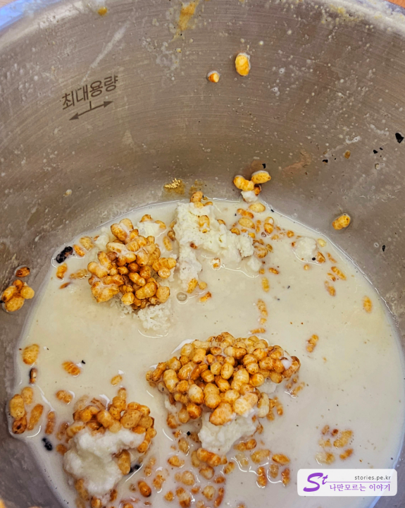

철원의 대표적인 관광지인 한탄강 주상절리 길이 있습니다.

> [[철원 가볼 만한 곳] 철원 한탄강 주상절리 길 잘 다녀오는 방법 (비용, 팁) 바로가기](https://blog.stories.pe.kr/581)

## 대표 메뉴와 가격(가성비)

주상절리길의 드르니 매표소 근처에 철원을 대표할 만한 카페가 있습니다. 지역 특색에 맞는 철원의 시그니처인 오대쌀을 모티브로 빙수를 개발했는데 정말 맛이 좋았습니다.

1층짜리 건물로 MUIMU라고 카페 이름이 쓰여있네요. 단순하고 모던한 건물로 옆쪽 쌍둥이 건물은 액세서리를 판매하는 곳입니다.

겉에서 보는 것과 비슷하게 실내 인테리어도 하얀색으로 심플하게 되어 있습니다. 입구 앞에는 카운터가 있고 오른쪽과 왼쪽에 넉넉하게 테이블이 놓여 있습니다.

여유롭게 앉아서 음료를 마시기에 좋은 것 같습니다. 작은 동네임에도 불구하고 손님들이 많이 있었습니다.

냅킨에도 muimu라고 되어 있네요.

## 먹어본 음식

무이무의 시그니처 메뉴인 철원오대쌀빙수 입니다. 가격은 20,500원이며 일반인 기준으로 2~3명 정도가 먹기에 좋은 양입니다.

빙수 용기도 압력솥 모양이라 생각보다 깊어서 양이 많은 편입니다. 나무 수저까지 있어서 얼핏 보면 갓 지은 따끈따끈한 솥밥의 모양입니다.

빙수 위에 달달한 소스가 올려져 있고 3개의 토핑을 제공해 줍니다.

토핑 중 하나는 오대쌀을 볶은 것이고 하나는 콩가루에 인절미, 그리고 나머지는 팥 소스입니다.

볶은 오대쌀이 한몫합니다. 씹을수록 고소하고 적당히 바싹해서 특색이 있습니다.

맛이 없을 수 없는 콩가루와 인절미 조합입니다.

팥인데 시중에서 판매하는 팥 같지는 않았습니다. 이걸 카페에서 만들기도 힘들 텐데.. 어떻게 만들었는지 모르겠네요. 너무 달지 않고 적당해서 좋았습니다.

특이한 게.. 빙수를 어느 정도 먹고 나면 솥 바닥에 누룽지처럼 오대쌀에 붙어 있습니다. 수저로 긁어먹는 재미가 있습니다. ^^

빙수가 녹으면서 오대쌀과 섞이면서 우유에 시리얼을 말아 먹는 것 같은 느낌이 들었습니다. 아니 그것보다 더 건강하면서 맛있는 느낌??

버터바를 한번 시켜봤습니다.

버터바는 상당히 부드러우면서도 단단한 식감입니다. 단맛이 강해서 빙수보다는 아메리카노랑 잘 어울릴 것 같았습니다.

차림표 한 장 첨부해 봅니다.

## 맛 평가 (지극히 주관적임)

철원오대쌀빙수는 정말 한 번쯤은 먹어 볼 만큼 맛있었습니다.

<b>주관적인 맛 점수 : </b> ★★★★☆

## 청결도

생긴지 얼마 되지 않아서 외관도 실내도 매우 깨끗해 보였습니다.

<b>청결도 : </b> ★★★★☆

## 친절도

주인장인지 알바인지 모르겠으나 상당히 친절했습니다.

<b>친절도 : </b> ★★★★☆

## 식당과 주차 정보

- 주소 : 강원특별자치도 철원군 갈말읍 명성으로 139번 안길 3 1층 (우)24037
- 연락처 : 010-9620-3944
- 인스타 : https://www.instagram.com/muimu_cafe
- 영업시간 : 매일 10:00 ~ 20:00
  - 라스트오더 : 19:30
- 휴무일 : 연중무휴
- 주차 : 카페 앞에 2~3대 정도 주차할 수 있어요 그 외는 알아서 주차해야 해요

<iframe src='https://www.google.com/maps/embed?pb=!1m18!1m12!1m3!1d329.82057116944725!2d127.3042350468583!3d38.14484885001861!2m3!1f0!2f0!3f0!3m2!1i1024!2i768!4f13.1!3m3!1m2!1s0x3562cb484237385d%3A0x8d5009852aae5111!2z7Lm07Y6YIOustOydtOustA!5e0!3m2!1sko!2skr!4v1694185413740!5m2!1sko!2skr' class='embed-responsive-item' allowfullscreen></iframe>

## 인근 여행지

- 철원 주상절리길 드루니 매표소
