추석 연휴 때 갑자기 떡볶이가 너무 땡겨서, 친구들과 함께 신당동 떡볶이 골목으로 갔어요.

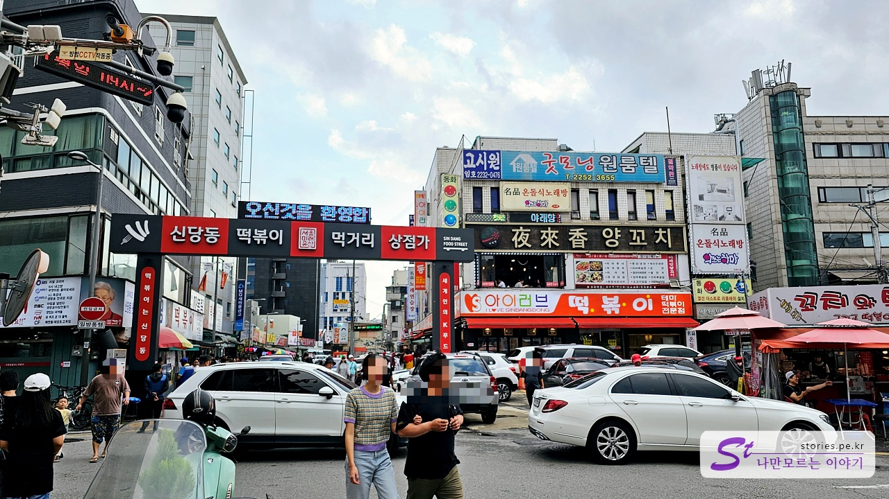

가벼운 마음으로 나왔는데, 도착하니까 믿을 수 없을 정도로 사람들이 많아서 긴 대기를 해야 했어요. 정말 이렇게 긴 줄을 본 적이 없었어요.

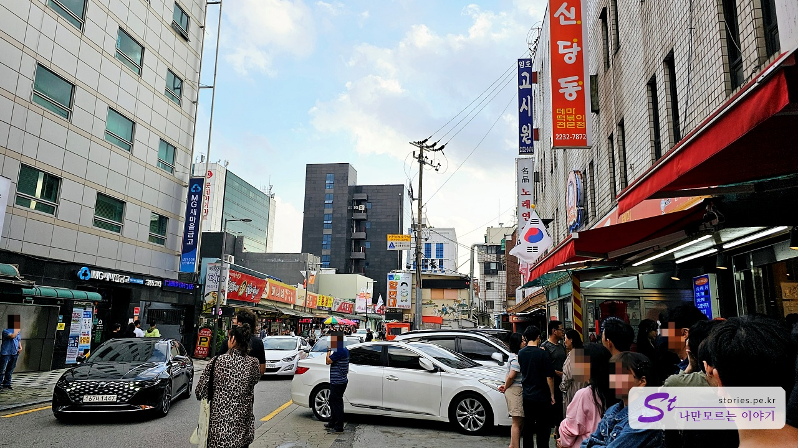

떡볶이 골목에는 여러 식당이 있는데, 제일 북적거리는 건 '**마복림 떡볶이**'와 '**아이러브 신당동** 떡볶이'이에요. 현지인들은 입맛에 따라 다른 식당을 가겠지만, 외지인들은 주로 이 두 곳으로 몰려오는 것 같더라고요.

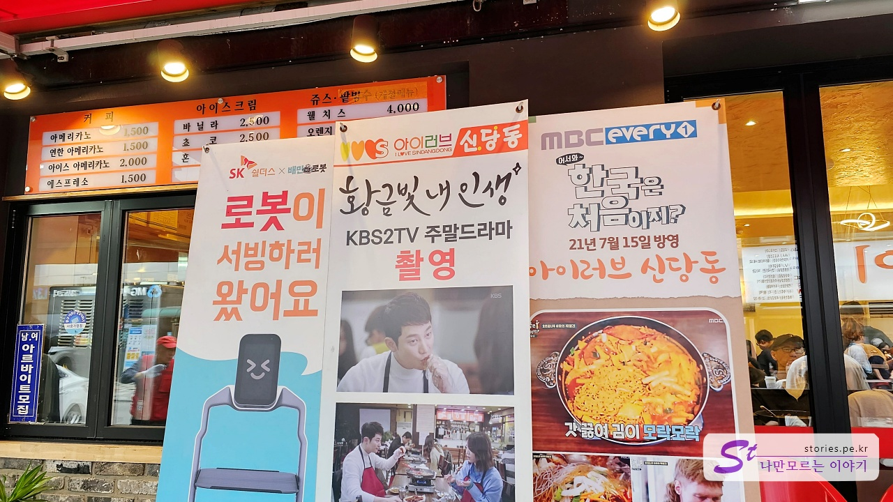

우리는 '**아이러브 신당동 떡볶이**'에 들어가서 시켰어요. 이 식당은 '**황금빛 내 인생**'과 '**한국은 처음이지**' 같은 다양한 방송에 나온 적이 있어서 유명한 곳이에요.

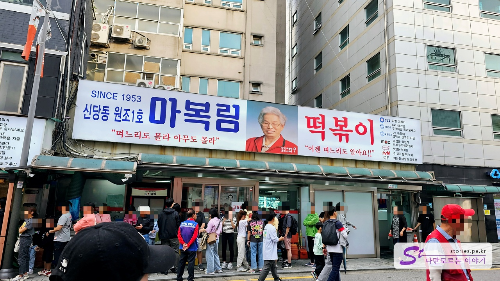

위치는 **마복림 떡볶이집** 바로 맞은편에 있어서 찾기 어렵지 않아요. 주차장은 좀 붐비긴 하지만 주차요원들이 발렛 서비스를 제공해 주니까 차를 가져오는 데 어느 정도 편리함을 느낄 수 있어요.

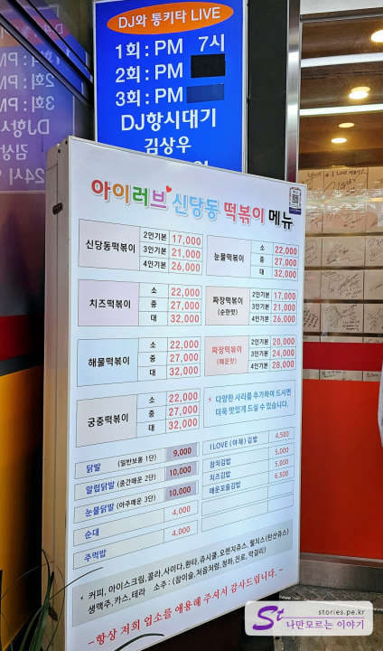

저희는 대략 20분 정도 대기한 뒤에 들어갈 수 있었어요. 입구에는 가격표가 걸려있어서 대기하면서 가격을 미리 확인할 수 있었어요.

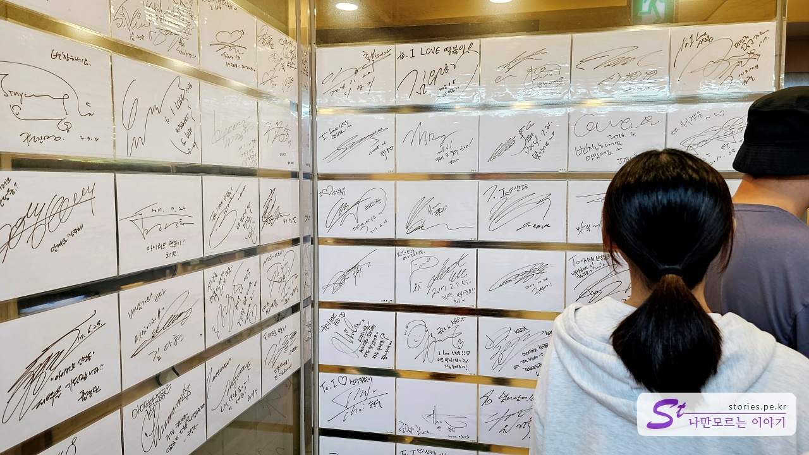

또한, 유명한 사람들도 자주 방문하는 것 같더라고요. 사인이 많이 걸려있어서 누가 왔었는지 알 수 있었어요.

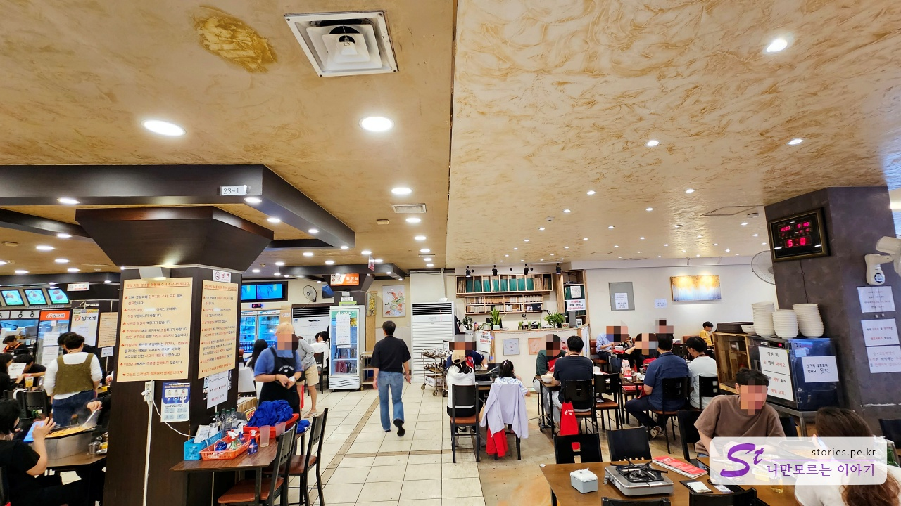
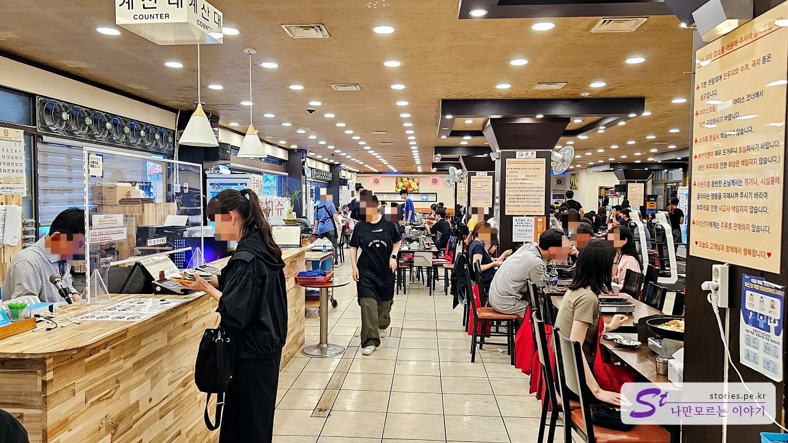

마침내 안으로 들어가서 식사를 할 수 있었어요. 식당 내부는 좌우로 넓게 펼쳐져 있고 자리도 많아서 손님들의 회전율이 빨랐어요. 직원들이 자리 안내를 해주었고, 우리는 오른쪽 자리에 앉았어요.

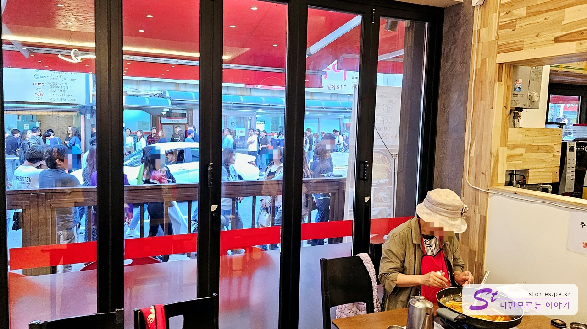

안에서 밖을 보니 여전히 많은 사람들이 대기 중이었어요.

## 대표 메뉴와 가격(가성비)

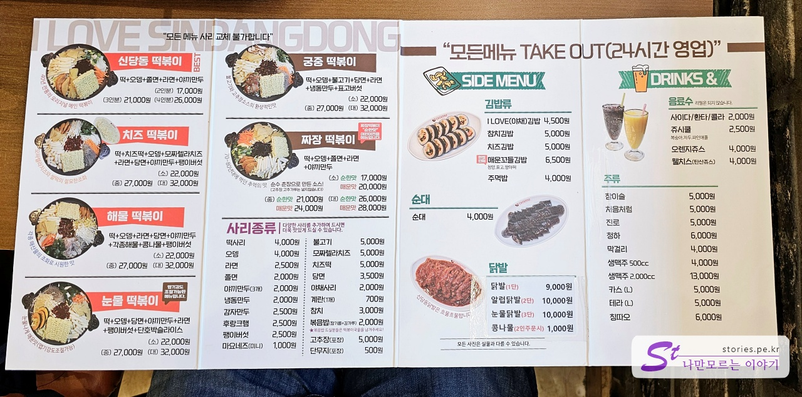
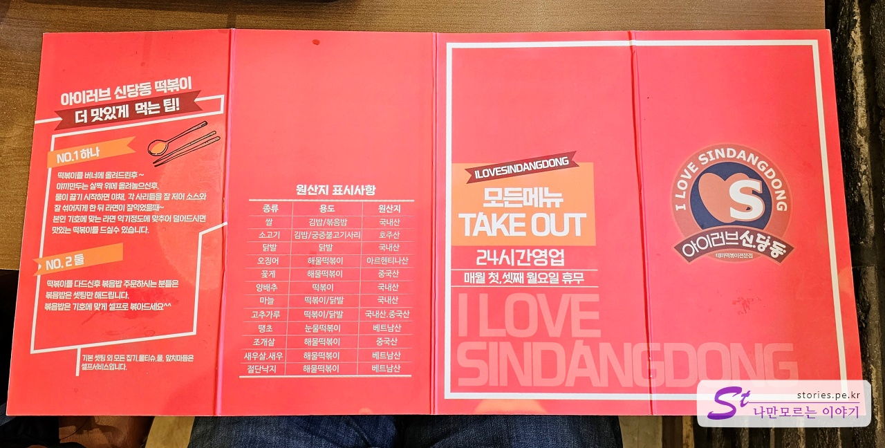

자리에 앉으면 차림표를 확인하고 주문을 먼저 합니다.

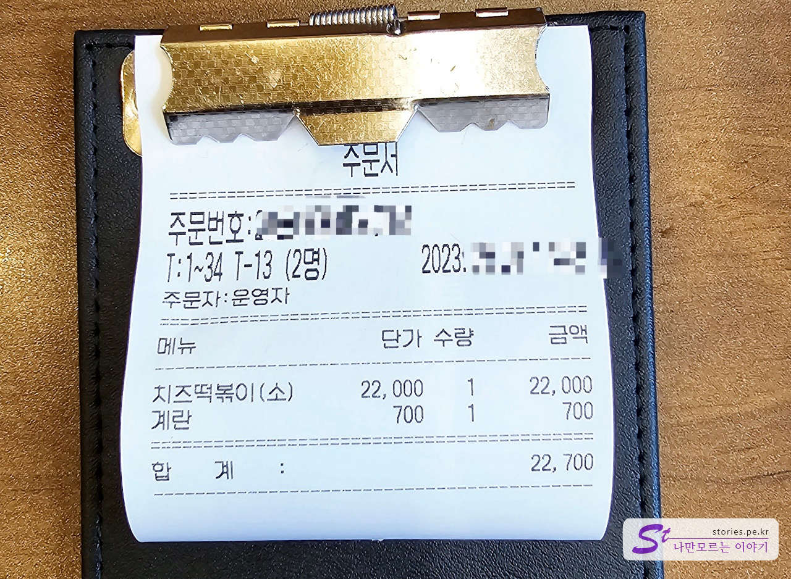

보통은 기본인 **신당동 떡볶이**를 시킬 것 같지만, 저희는 **치즈 떡볶이**에 계란 하나 추가해서 주문했어요.

## 먹어본 음식

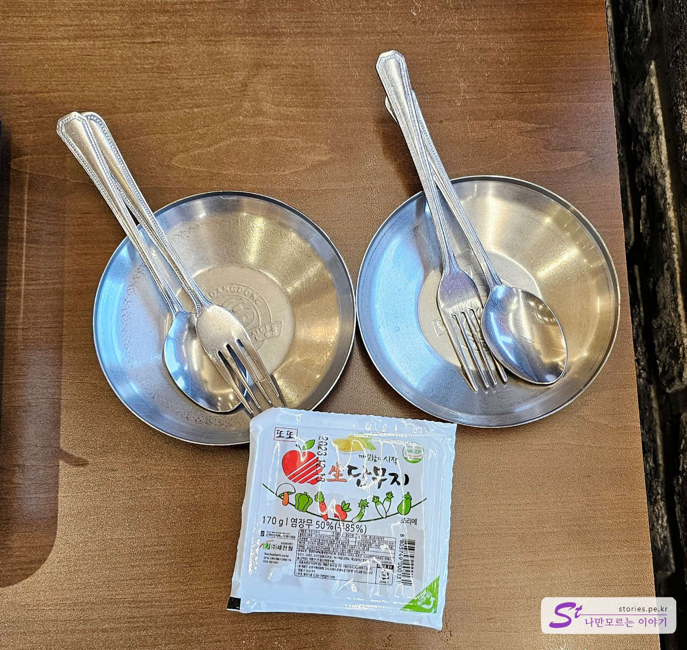

주문하면 스댕접시에 포크와 수저, 단무지가 먼저 나와요. 포크 대신에 젓가락을 사용할 수도 있어요. 단무지는 처음에 하나 주고, 더 먹고 싶으면 주방 쪽에서 무료로 가져다 먹을 수 있어요.

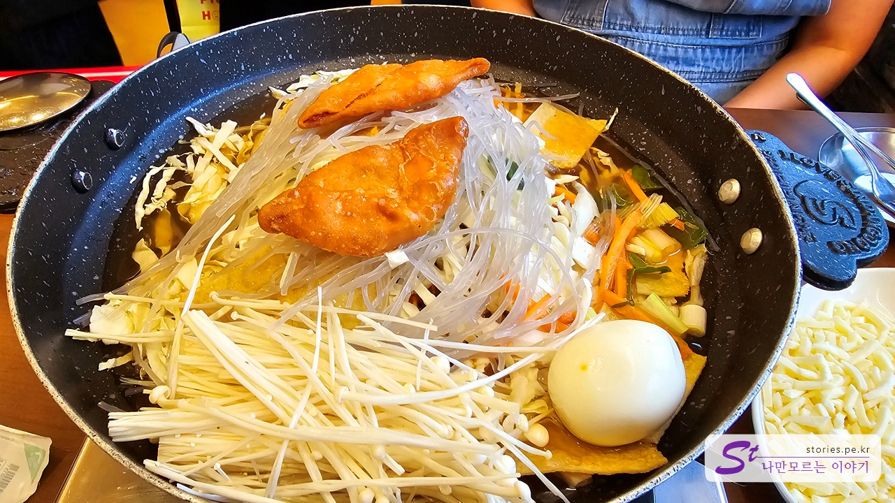

치즈떡볶이에는 **치즈떡**, **모짜렐라 치즈**, **라면과 당면**, 그리고 **팽이버섯**이 추가로 나와요. 가격은 소 사이즈로 **22,000원**이라, 기본 신당동떡볶이보다 5,000원이 더 비싸요.

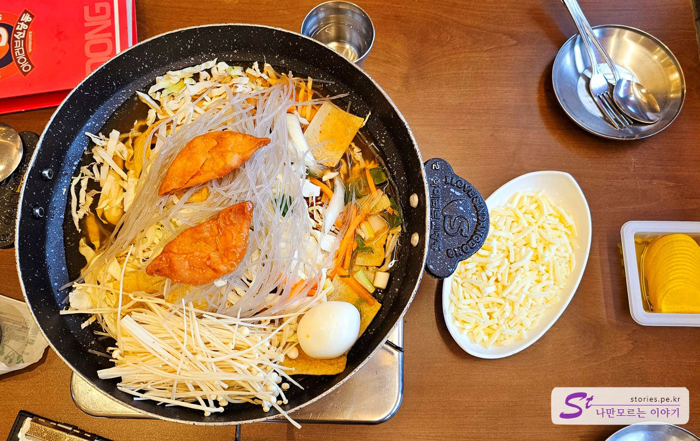

전체적인 구성은 이렇게 돼 있어요.

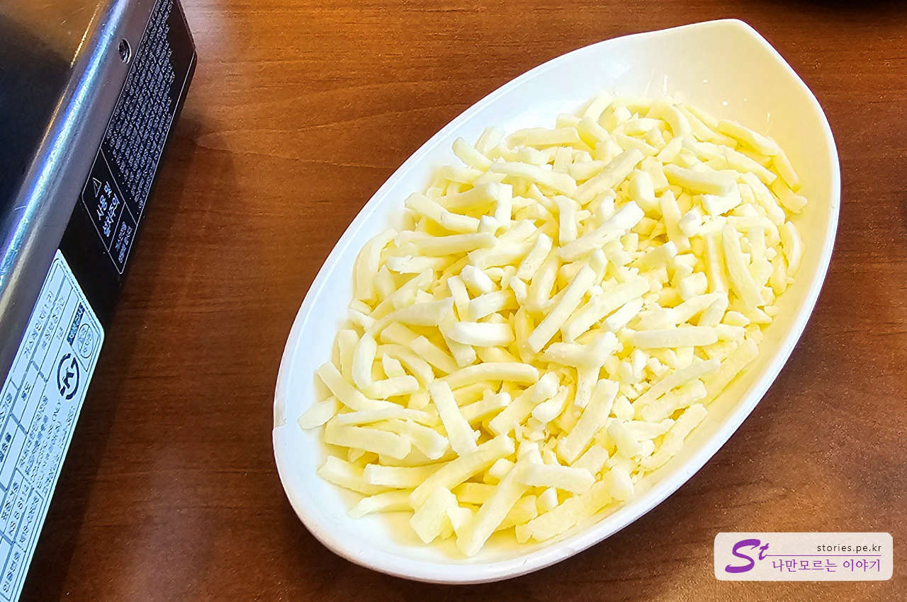

모짜렐라 치즈는 떡볶이가 다 끓은 후에 불을 끄고 부어서 녹여 먹는 게 좋아요.

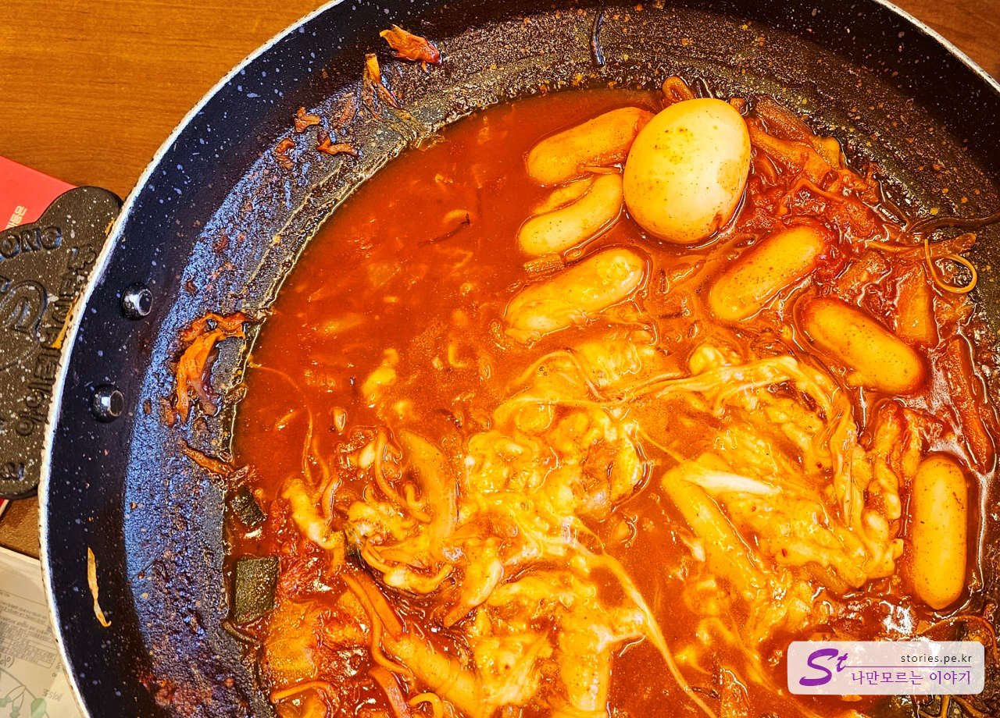

중간에 맛있게 끓었을 때 사진을 찍었어야 했는데, 먹는 데 열중해서 깜빡 잊고 찍지 못했네요. 거의 다 먹어갈 때쯤에 갑자기 생각나서 찍었어요.

## 맛 평가 (지극히 주관적임)

<b>주관적인 맛 점수 : </b> ★★★★☆

저에게는 이 음식은 예전부터 먹어왔던 그 특별한 맛을 떠올리게 하는 맛입니다. 아주 맛있다고 말하기보다는 향수를 자극하는 맛이에요.

## 식당 운영 시스템

<b>운영 시스템 : </b> ★★★★☆

식당의 운영은 매우 효율적으로 이뤄져 있어요. 주차요원도 충분해서 주차 걱정이 없었고, 입장해서 주문하는 과정도 매우 원활하게 진행되었습니다.

## 청결도

<b>청결도 : </b> ★★★☆☆

청결도는 매우 깨끗한 편은 아니었지만, 불쾌하지 않을 정도로 괜찮았어요. 평범한 수준의 청결도라고 할 수 있겠어요.

## 친절도

<b>친절도 : </b> ★★★☆☆

직원들은 아르바이트생 같았고, 그다지 특별한 친절함을 느끼지 못했어요. 그래도 불편하진 않았고, 나쁘지는 않았습니다.

## 식당과 주차 정보

- 주소 : 서울 중구 퇴계로 76길 50
- 연락처 : 02-2232-7872
- 영업시간 : 24시간 영업
- 휴무일 : 1,3번째 월요일 휴무
- 주차 : 약 10대 정도 주차할 수 있는 주차장이 있으며 주차요원 2~4명이 발렛을 해줌

<iframe src='https://www.google.com/maps/embed?pb=!1m18!1m12!1m3!1d470.13146999745743!2d127.01461857306552!3d37.56319265869975!2m3!1f0!2f0!3f0!3m2!1i1024!2i768!4f13.1!3m3!1m2!1s0x357ca33e3e95d4d9%3A0xbd5216d121f573b3!2z7JWE7J2065-s67iM7Iug64u564-Z!5e0!3m2!1sko!2skr!4v1696170749873!5m2!1sko!2skr' class='embed-responsive-item' allowfullscreen></iframe>

## 기타 사항

아래의 주의사항을 한 번쯤 보시는 것도 좋을 것 같네요.

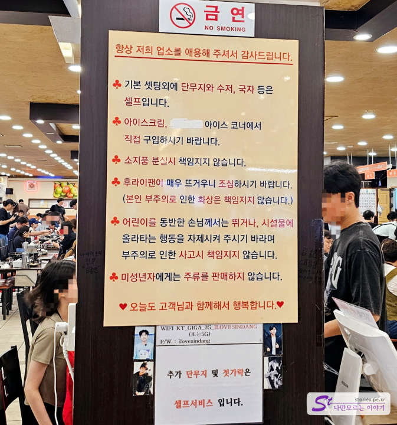
