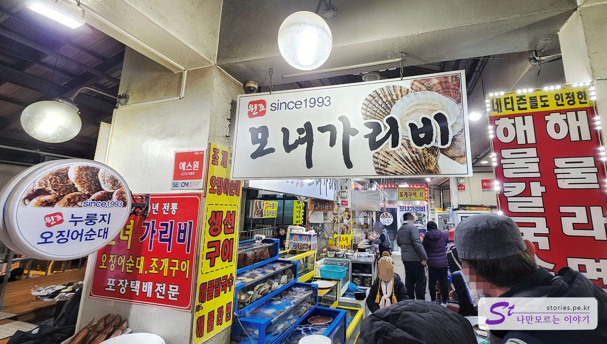
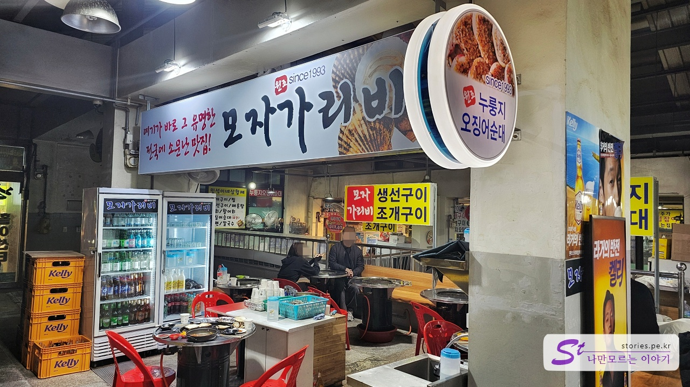
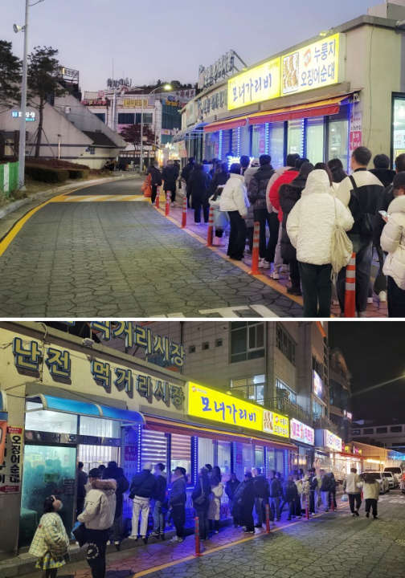
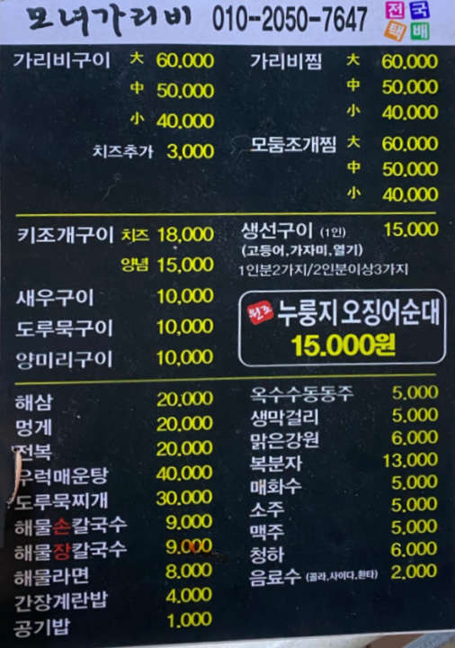
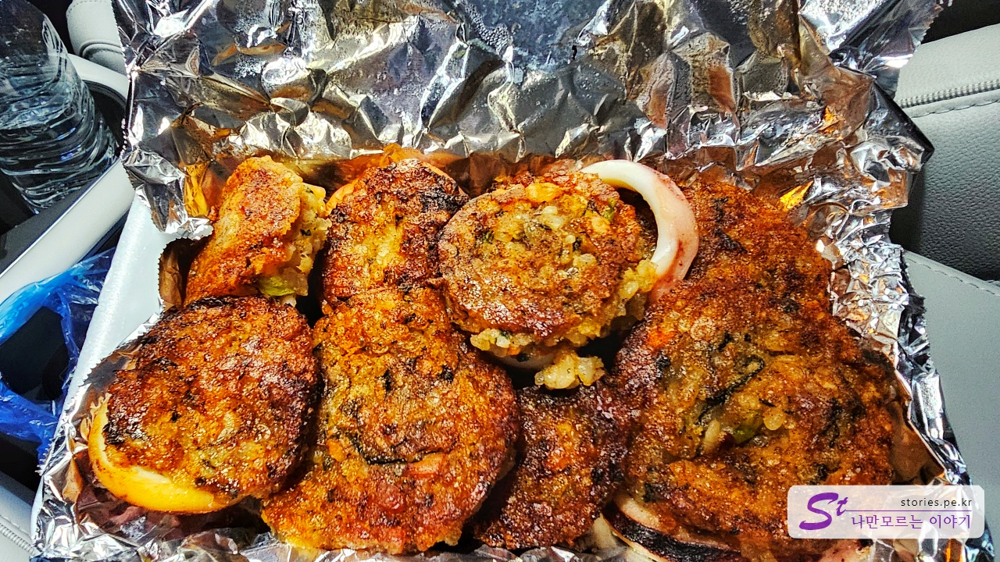
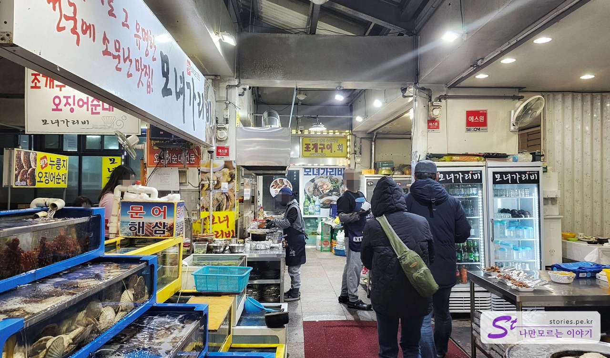

이번에 강원도 쪽으로 여행을 다녀오면서 요즘 TVN에서 방영 중인 콩콩팥팥(콩 심은 데 콩 나고 팥 심은 데 팥 난다)에서 나온 누룽지 오징어순대로 알려진 모녀가리비 집을 다녀왔습니다.

**콩콩팥팥** 6회에서 이광수, 김우빈, 도경수, 김기방이 속초 대포항에서 누룽지 오징어순대와 라면과 장칼국수를 먹으면서 대중에게 알려진 곳입니다.  
우리가 누룽지 오징어순대를 먹으면서 개고생한 썰을 풀어볼까 합니다.

식당은 입구를 기준으로 오른쪽이 **모녀가리비**이고..

왼쪽이 **모자가리비** 입니다. 식당은 나눠져있으나 장사가 잘 돼서 그런지 인근의 4개 정도의 매장을 합쳐서 운영을 하고 있었습니다.

상호의 중심은 엄마이신 것 같고 한쪽은 딸이, 한쪽은 아들이 운영하는 것 같으나 현재는 모녀가리비에서 음식을 만들고 모자가리비에 테이블을 놓고 운영을 하고 있는 것 같았습니다.(뇌피셜)

모녀가리비 또는 모자가리비 2개의 상호를 가지고 있으나 그냥 통칭 **모녀가리비**로 하겠습니다.
모녀가리비는 12시에서 저녁 8시까지 운영을 하며 3시 30분에서 5시 30분까지 브레이크 타임으로 운영하고 있습니다.

우리는 브레이크 타임인 오후 5시 30분쯤에 도착을 했고 그전부터 사람들이 웨이팅을 하고 있었습니다. 이 사람들이 몇 시부터 줄을 서고 있었던 것인지는 잘 모르겠습니다. 평일인데도 대략 30~50팀 정도가 대기하고 있었습니다.

## 대표 메뉴와 가격(가성비)

식당은 가리비 구이가 메인이고 누룽지 오징어순대 외에도 각종 생선구이와 장칼국수, 해물라면, 간장 계란밥을 팔고 있습니다. 다만 이번 콩콩팥팥 방송을 통해서 **누룽지 오징어순대**가 떡상을 하면서 손님의 대부분은 누룽지 오징어순대를 주문하고 있습니다.

누룽지 오징어순대가 썰어서 대략 10조각 정도 되는데 15,000원입니다. 맛은 있지만 싼 가격은 아닌 것 같아요.

## 먹어본 음식

2시간이 넘는 웨이팅 끝에 누룽지 오징어순대 2상자를 구매해서 먹어봤습니다. ㅠㅠ
판매는 웨이팅 하는 인원당 1상자만 구매할 수 있습니다. 그렇게만 해도 웨이팅이 2시간입니다. 오징어순대가 나오는 시간이 너무 오래 걸립니다.

## 맛 평가 (지극히 주관적임)

일단 맛은 좋습니다. 인정!! 그러나 2시간씩 웨이팅 해서 사 먹을 정도는 아닙니다.  
차라리 바로 옆쪽에 튀김을 파는 상점들이 많이 있는데 그곳에서 판매하는 누룽지 오징어순대를 사 먹는 것이 올바른 판단일 수 있습니다. (참고로 튀김집의 누룽지 오징어순대를 먹어보지는 못했어요)

<b>주관적인 맛 점수 : </b> ★★★★☆

## 식당 운영 시스템

일단 식당 운영은 최악입니다.
평일임에도 불구하고 웨이팅이 2시간입니다. 번호표가 있어서 대기하다가 와서 구매하는 것도 아니고 2시간 이상 추위에 벌벌 떨면서 줄을 서면서 기다려야 합니다. 사진상 웨이팅 인원이 몇 명 안 되는 것처럼 보이지만 오징어순대가 나오는 속도가 너무너무 느립니다. 대략 인당 5분~10분 정도가 소요되는 것 같습니다.

식당의 입장을 이해하지 못하는 것은 아닙니다. 방송의 갑작스러운 등장과 예상치 못한 손님의 급증에 대비하지 못했을 것으로 생각됩니다. 그러나 이런 식으로 계속해서 응대한다면, 방송을 통해 얻게 된 기회가 행운보다 불운으로 나올 수도 있다는 생각이 듭니다. 저만해도 욕을 하는 글을 쓰고 있으니까요.  
근처에 있는 **만석닭강정**처럼 고객의 요구에 성실히 응대하면 큰 성공을 거둘 수 있을 것으로 생각되지만, 그렇지 않을 경우 방문하는 모든 분들로부터 욕만 먹고 끝날 수도 있을 것입니다.

<b>운영 시스템 : </b> ★☆☆☆☆

## 청결도

청결하지 않습니다. 시장통에 있는 식당이니 그럴 수 있습니다.

<b>청결도 : </b> ★★☆☆☆

## 친절도

워낙 웨이팅이 길다 보니 친절은 생각하기 어렵습니다. 2시간 웨이팅 하다 보면 짜증이 밀려듭니다.

<b>친절도 : </b> ★★☆☆☆

## 식당과 주차 정보

- 주소 : 강원 속초시 대포항희망길 53
- 연락처 : 033-636-0092
- 영업시간 : 12:00 - 20:00
  - 브레이크 타임 : 15:30 - 17:30
- 휴무일 : 매주 수요
- 주차 : 대포항 인근 유료주차장 이용

<iframe src='https://www.google.com/maps/embed?pb=!1m18!1m12!1m3!1d3136.574634322949!2d128.60317517635775!3d38.17332418910145!2m3!1f0!2f0!3f0!3m2!1i1024!2i768!4f13.1!3m3!1m2!1s0x5fd8a4b3e2ee4ec5%3A0xf1f552c1e6a5ef2e!2z66qo64WA6rCA66as67mE!5e0!3m2!1sko!2skr!4v1700578611322!5m2!1sko!2skr' class='embed-responsive-item' allowfullscreen></iframe>

 
## 기타 사항

주문 방법은 포장 고객과 식사 고객으로 나누어집니다. 대부분의 손님들이 누룽지 오징어순대를 먹습니다. 그러나 식사 고객은 꼭 가리비 구이나 찜을 먹어야 합니다. 그런 다음 테이블에서 가리비를 먹으며 오징어순대를 주문할 수 있습니다. 또는 포장해서 가져갈 수도 있습니다. 다른 사람들은 포장 고객이며 긴 줄에서 기다려야 합니다. 약 40 ~ 50명이 앞에 서 있으면 2시간 정도를 기다려야 할 각오를 해야 합니다.

테이블에서 가리비를 먹는 사람들은 줄을 기다릴 필요가 없습니다. 대신 테이블에서 앉아 있으면서 오징어순대를 먹는 데도 상당한 시간이 걸리지만, 포장 고객보다 빨리 획득을 하는것 처럼 보였습니다.

**자금력이 충분하다면 차라리 테이블에서 가리비를 먹으면서 오징어순대를 주문해서 먹든 포장해가든 하는것을 추천 드립니다.**

## 인근 여행지

대포항
