개인적으로 두부로 만든 음식을 무척 좋아합니다. 그중에서도 두부구이를 빼놓을 수 없는데요.

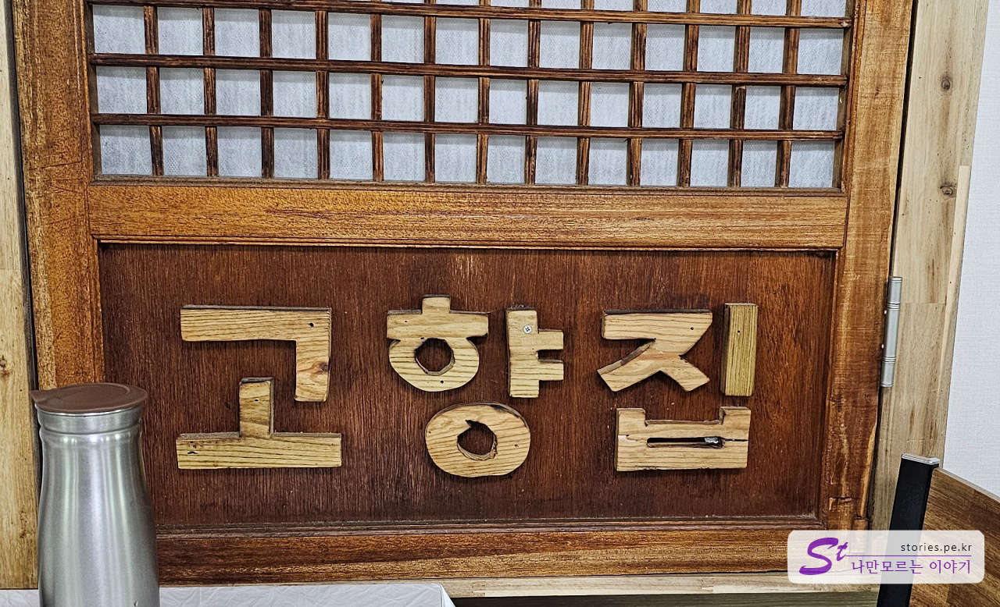

마침 이번에 **TVN** **콩콩팥팥**에서 두부요리집인 인제 **고향집**을 극찬한 방송이 방영되어서 방문하게 되었습니다.
서울양양 고속도로의 **내린천 휴게소**에서 가까운 곳에 있기 때문에 접근성도 좋았습니다.

## 대표 메뉴와 가격(가성비)

대표 메뉴는 두부전골, 콩비지 백반, 두부구이 등입니다. 가격은 인당 9,000원~10,000원대에 형성되어 있고 강릉 초당순두부 마을의 음식 가격과 비교한다면 약간 저렴한 가격대를 형성하고 있습니다.

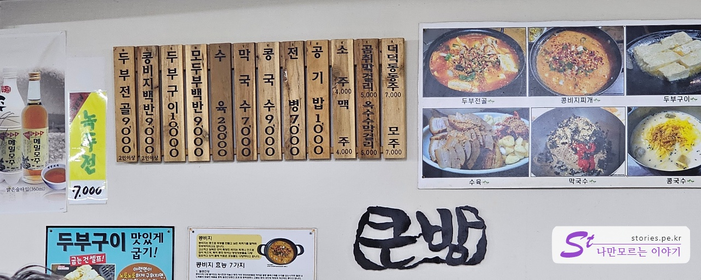

## 먹어본 음식

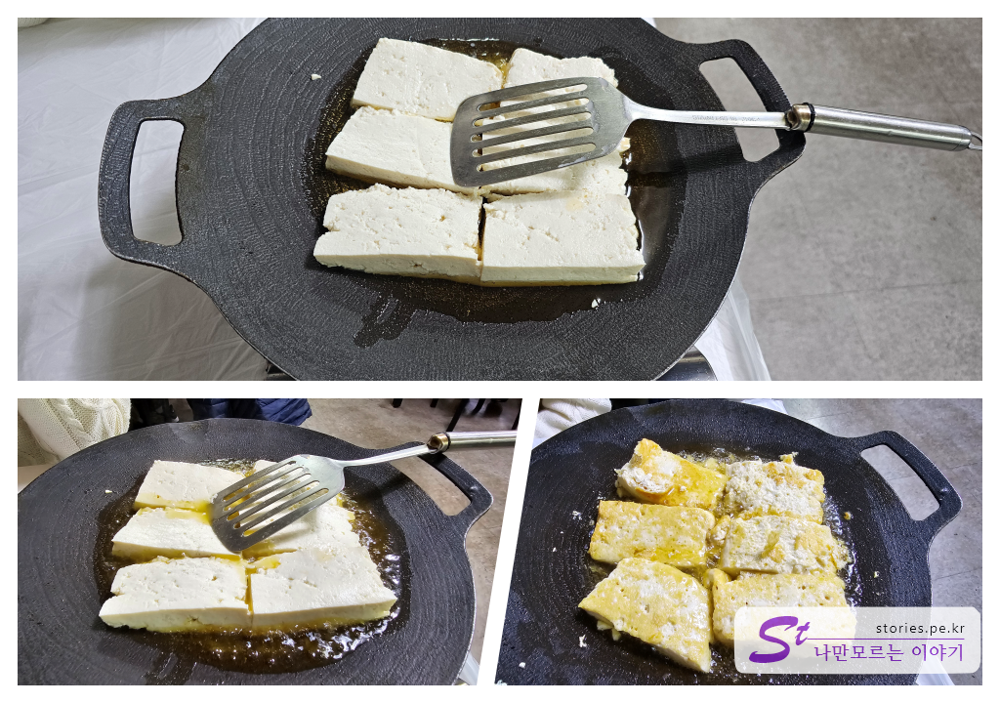
저희가 먹어본 음식은 당연 두부구이입니다. 10,000원이며 6조각이 나옵니다. 테이블에서 들기름에 직접 구워서 먹는 방식입니다. 상당히 부드럽고 고소해서 매우 만족스러운 음식 맛이었습니다. 강추합니다.

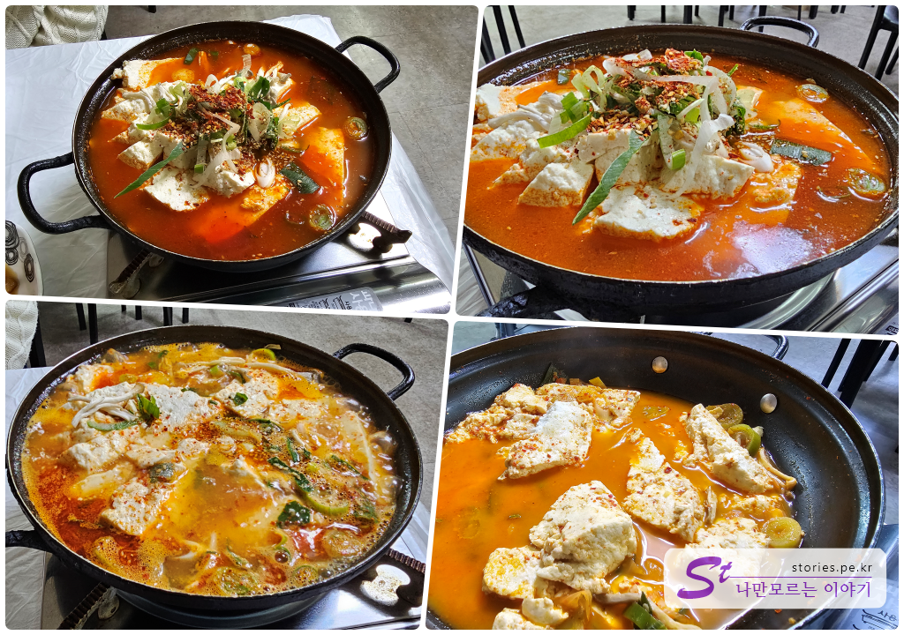
두 번째 주문한 음식은 두부전골입니다. 원래는 콩콩팥팥에서 콩비지 백반을 추천해서 그걸 먹어보려고 했으나 재료가 모두 소진되어서 부득이 두부전골을 주문했습니다. 2인 이상부터 주문이 가능하고 인당 9,000원입니다.
두부가 좋아서 그런지 적당한 맵기로 배부른데도 불구하고 맛있게 모두 먹었습니다. 이것도 강추합니다.

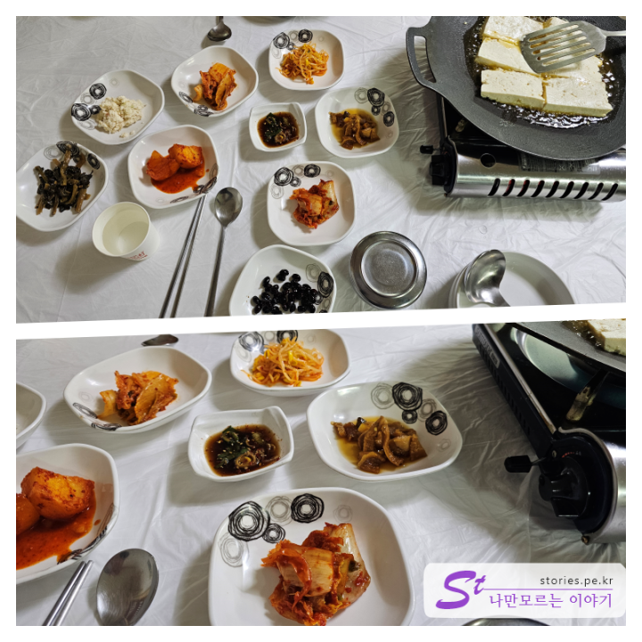
주문을 하면 밑반찬이 나오는데 처음에는 서빙을 해주고 그 이후에는 셀프 코너에서 직접 가져다 먹으면 됩니다. 밑반찬도 모두 기본 이상의 맛을 하고 있습니다. 특이한 게 깍두기인 줄 알고 외면했던 반찬이 감자조림으로 밝혀지면서 3번 이상 가져다 먹는 기현상이 있었습니다.

## 맛 평가 (지극히 주관적임)

전체적으로 맛은 모두 좋았습니다.

<b>주관적인 맛 점수 : </b> ★★★★☆

## 식당 운영 시스템

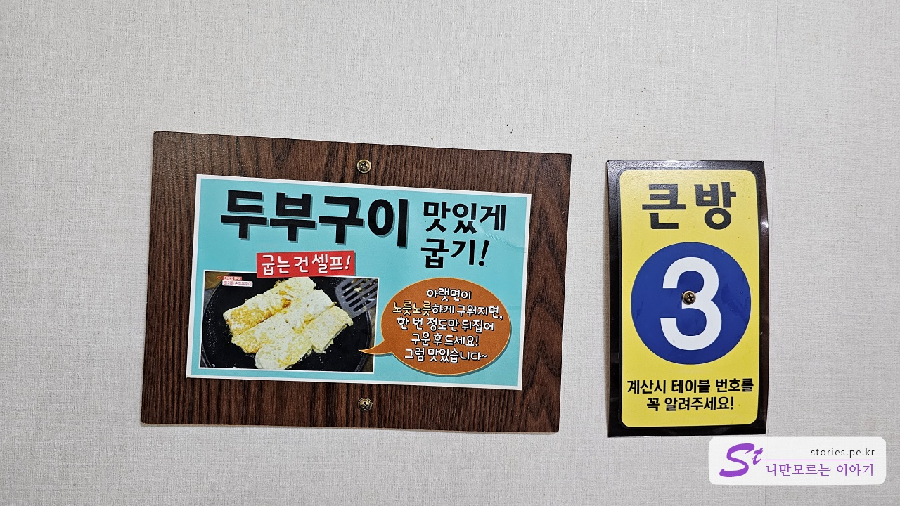
두부를 맛있게 굽는 방법이 나와 있습니다. 한 번 정도만 뒤집어서 구워 먹으라고 되어있는데, 알면서도 여러 번 뒤적뒤적하다가 먹었습니다. 그래도 맛은 좋네요. 한 번만 뒤집으라고 하는 이유는 아무래도 뒤집다가 두부가 깨져버리기 때문이 아닌가 합니다.

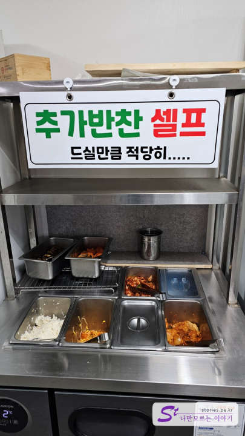
두 번째 추가 반찬은 셀프로 가져다가 먹으면 됩니다.

<b>운영 시스템 : </b> ★★★☆☆

## 청결도

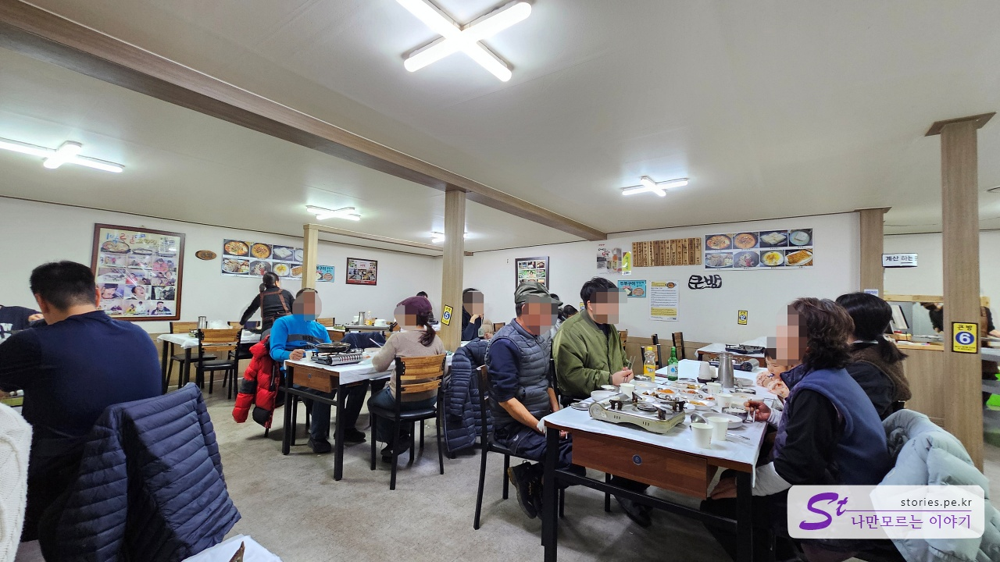
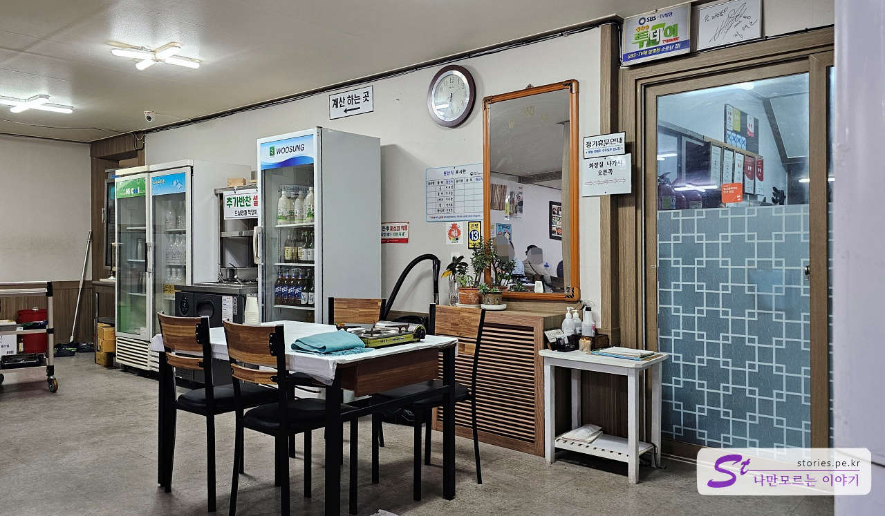
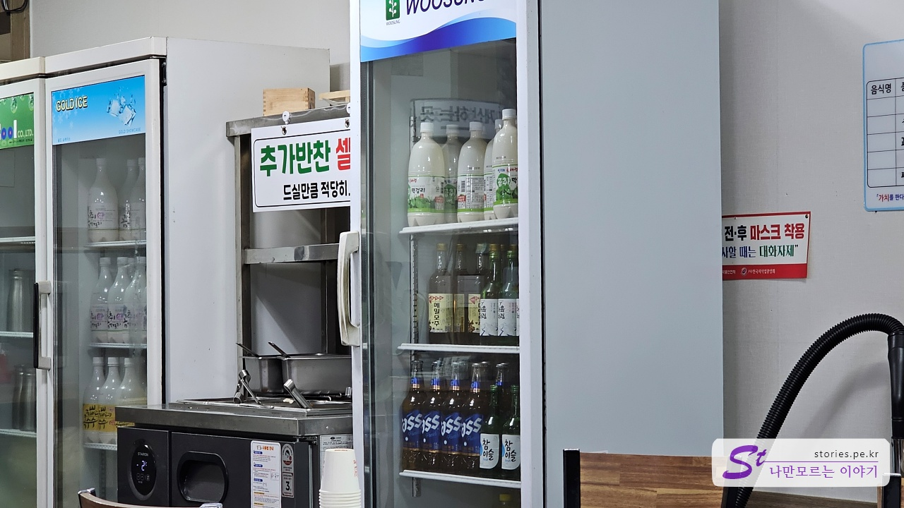

주방까지는 보지 못했지만 식당 내부는 매우 청결은 아니지만 일반적인 정도의 청결함을 유지하고 있는 것 같습니다.

<b>청결도 : </b> ★★★☆☆

## 친절도

특별히 친절하거나 불친절하거나 하는 것을 느껴보지 못했습니다. 젊은 직원도 여러 명 있어서 주문하고 먹는데 별로 나쁘지는 않았습니다.

<b>친절도 : </b> ★★★☆☆

## 식당과 주차 정보

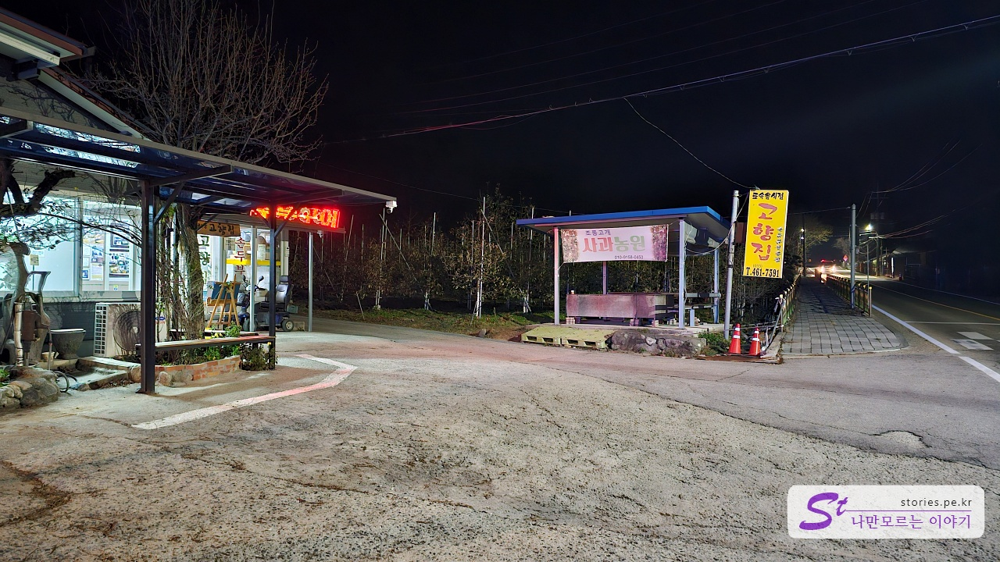

- 주소 : 강원 인제군 기린면 조침령로 115 고향집
- 연락처 : 033-461-7391
- 영업시간 : 09:00 - 20:00
- 휴무일 : 매달 3번째 수요일 정기 휴무
- 주차 : 10 ~ 14대 정도 주차를 할 수 있는 공간을 가지고 있습니다. 저는 사람이 없을 때 방문해서 괜찮았는데 휴일이나 주말 등에는 만차가 될 수도 있을 것 같습니다.

<iframe src='https://www.google.com/maps/embed?pb=!1m18!1m12!1m3!1d3146.346288882113!2d128.32637117634977!3d37.94569960229491!2m3!1f0!2f0!3f0!3m2!1i1024!2i768!4f13.1!3m3!1m2!1s0x356212c67023fd8b%3A0xed69faa717121ca2!2z6rOg7Zal7KeR!5e0!3m2!1sko!2skr!4v1700749951528!5m2!1sko!2skr' class='embed-responsive-item' allowfullscreen></iframe>

## 기타 사항

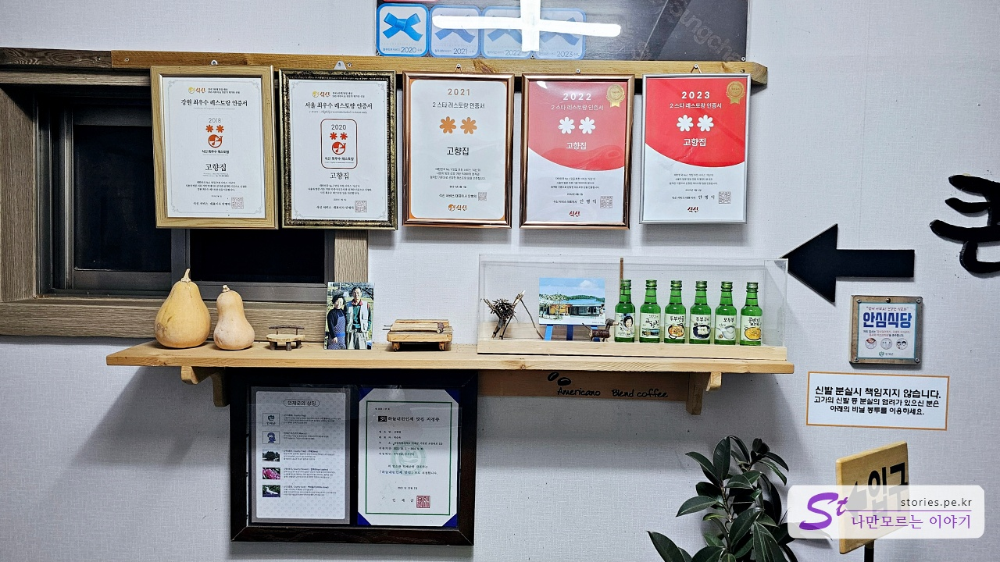
여기저기에서 많은 상을 받았나 봅니다.

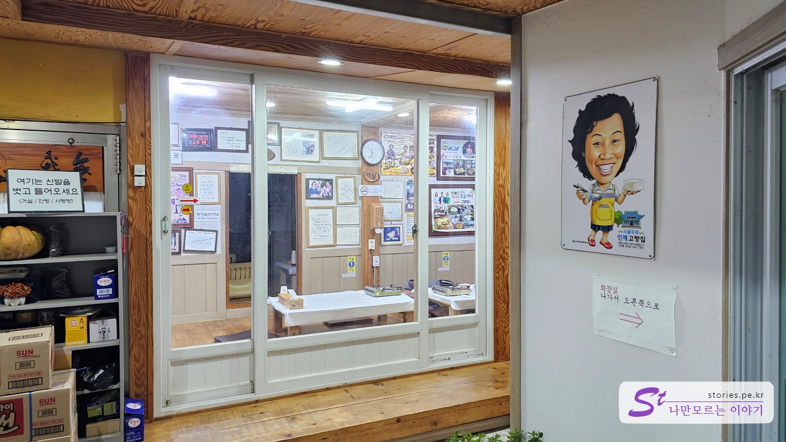
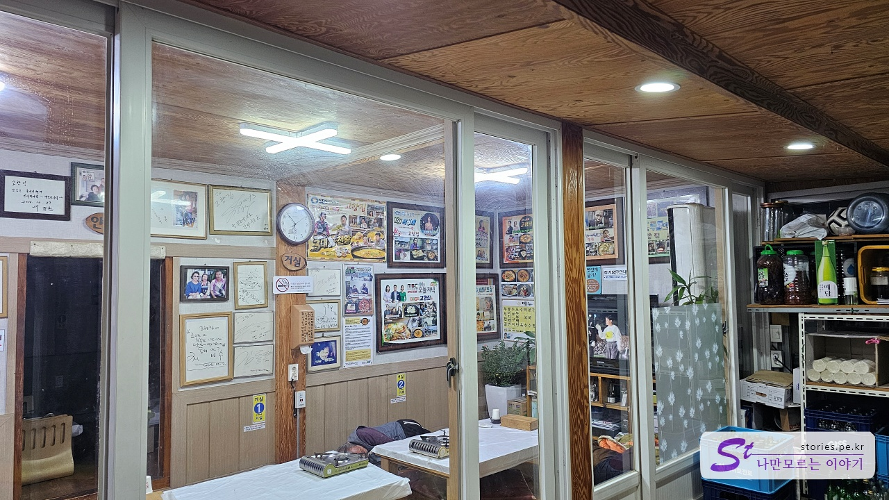
큰 방뿐만 아니라 거실도 테이블을 이용할 수 있습니다. 사람이 많으면 이 공간도 식당으로 운영되는 것 같습니다.

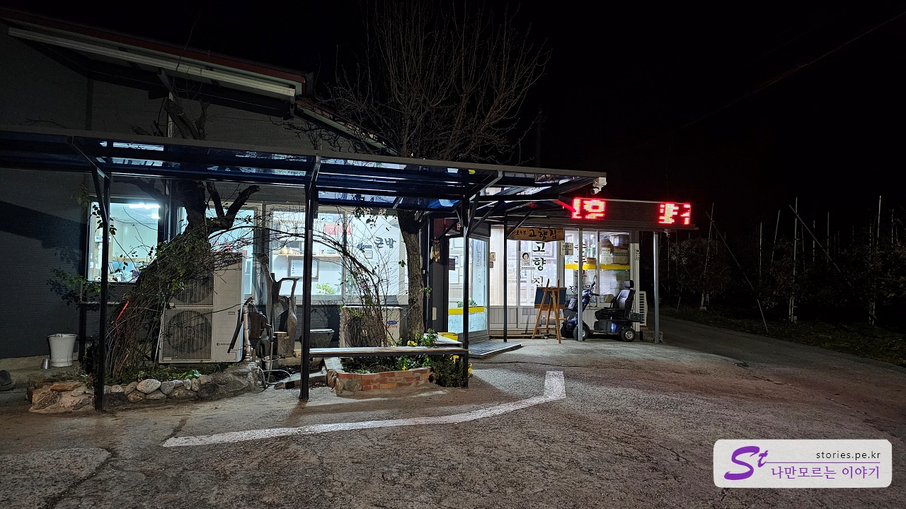
6시쯤에 도착해서 식사를 하고 나니 벌써 어두워졌네요.
