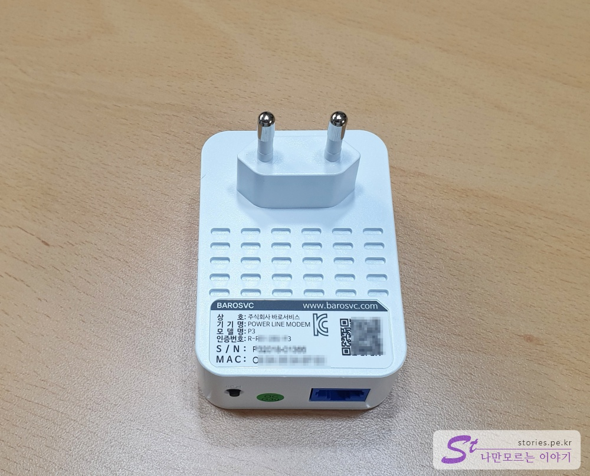

집에서 IPTV를 시청 중이라 IPTV에서 `.m3u`파일을 발췌해서 TV뿐만 아니라 컴퓨터에서도 실시간 방송을 보고 있습니다.  
그런데 이번에 쪽방에서도 실시간 방송을 보게 해달라는 집사람의 요청이 있어서 집에 굴러다니는 **미박스**(MIBOX)를 활용하여 설치를 하게 되었습니다.  

> 제가 가지고 있는 미박스는 글로벌 버전은 아니고 테레비가 포함되어 있는 한국버전입니다.   

창고에 잠자고 있던 24인치 모니터를 브라켓을 이용하여 벽에 붙이고 미박스를 달고 배선정리를 꼼꼼하게 완료했습니다. 
그리고 모니터와 미박스를 켜고 **무선으로 접속**한 다음 **실시간 방송**을 틀었더니....  

안나옵니다. 멈췄어요. 아~~~ 갑자기 멘붕~   

VOD는 나오나 **실시간 방송**은 나오지 않습니다.   
원인을 찾다가 찾다가 미박스를 유선으로 연결을 하니 그떄서야 실시간 방송이 나오기 시작했습니다.  
"아~ 무선으로는 실시간방송이 나오지 않게 막아놨구나." 라고 생각하고 테스트를 하기 위해 컴퓨터 방에 있는 유선랜을 뺴고 무선으로 접속한 다음 **팟플레이어**를 틀어서 보니 웬걸~ 아주 잘 나옵니다.   

한국버전 미박스에서 정책상 실시간 방송은 무선 연결을 막아놓은 것인지 아니면 무선 신호가 안정적이지 않아서 나오지 않았던 것인지는 정확히 확인은 못했으나 **결론은 유선으로 연결을 해야 한다는 것**이였습니다.  
그런데, 안타갑게도 쪽방에는 벽에 랜포트가 없던 것이였습니다. 공유기에서 부터 랜선을 쭉~ 둘러쳐서 쪽방까지 가지고 오기에는 너무 지저분해 보여서 현실적인 대안이 되지 않았습니다. 

그래서 선택한 방법이 **전력선 모뎀**!!!!!

하지만 국내에서는 많이 사용하지도 않고 생소했으며 블로그 글도 많지 않았습니다. 과연 잘 될까? 문제는 없을까? 고민 고민 끝에 일단 저질러 보기로 했습니다.  

##### 전력선 모뎀이란??
> 전력선 모뎀은 모든 집에 설치되어 있는 110v ~220v의 콘센트(전력선)를 마치 랜선처럼 이용하는 기술입니다.  
> 해당 기술이 나온지는 꽤 오래됬으나 국내에서는 많이 활용이 되지 않았고 제품도 많지 않은 상황입니다.  
> 또한 전력선 모뎀을 사용하기 위헤서는 최소 2개 이상의 모뎀이 필요하고 개당 가격이 일반적으로 5~6만원선이라 2개면 일단 10~12만원 이상으로 시작해야한다는 단점이 있습니다.  
> 전기 사용량에 따라, 집 전기 배선의 구성에 따라, 속도가 현저히 차이가 나고 속도에 대한 개런티가 되지 않는 단점도 있습니다.  
> 만약 같은 집이라도 서로 다른 배전반으로 구성되어 있다면 통신이 되지 않는 단점도 있습니다.  
> 이렇게 많은 단점에도 불구하고 랜선이 깔려있지 않은 집에서도 콘센트(전력선)를 사용해 유선랜 처럼 깔끔하게 사용할 수 있다는 장점이 있습니다. 

### 전력선 모뎀 구입기  
국외에서는 그래도 다양한 종류의 **전력선 모뎀**들이 있으나 국내에서는 1~2가지 정도의 모뎀 밖에는 없습니다.   
네이버를 통해 검색을 하면 가장 상위에 나오는 전력선 모뎀이 **BAROSVC**사의 **AV1000**과 **Unicorn**사의 **PL200V** 이 주를 이룹니다.   
  
**Unicorn**사는 회사명이, **BAROSVC**사는 제품스팩이 마음에 들어 고민하다가 결국 **BAROSVC**사의 **AV1000**제품을 구매하게 되었습니다.  

### BAROSVC AV1000 언팩  
BAROSVC AV1000를 구입할까 고민하시는 분들을 위해 언팩을 해 볼까 합니다.  

   
앞면입니다. BAROSVC 라고 적혀있고 **1000Mbps**라고 적혀있네요. 다른 네트워크 제품도 마찮가지겠지만 실제로는 이정도 속도는 나오지 않겠지요. 그래도 **200Mbps**라고 적혀있는 제품보다는 나을것 같아 선택했습니다.   

  
HomePubAV2와 IEEE1901표준을 따른다고 써 있습니다. 절전모드 기능도 있구요. 기기간 암호화도 지원한다고 써있습니다. 
최대 거리는 300M라고 되어 있는데 100M 이내로 사용해야되지 않을까 합니다. 옥내에서는 충분하리라 생각됩니다   

  
Ultra HD 스트리밍을 지원하고 파워절약기능이 있습니다.  
회사 이름이 **바로서비스** 이네요. 첨에 **BAROSVC**를 어떻게 읽어야 하나 사소한 고민을 잠시 했었는데...  

  
구성품은 전력선모뎀 1개, 이더넷케이블 1개(약 1M정도 되는 것 같습니다.), 사용설명서 1개가 있네요.  
win7~10, Mac지원이라고 써있는데 아무 의미 없는 것을 왜 적어놨을까요.  
 
   
실제 구성품 입니다.   

  
실제 제품의 형태 입니다. 심플하게 생겼습니다. 하단의 QC옆에 있는 버튼이 2개이상의 제품끼리 연결하는  페어링 버튼입니다.   

  
가려놓긴 했는데 제품의 시리얼넘버와 MAC주소가 적혀 있습니다.  

  
마지막으로 설명서의 한쪽면입니다.  

### 전력선모뎀 BAROSVC AV1000 실제 사용기  
결론적으로 전력선모뎀 BAROSVC AV1000 사용은 **매우 만족**한 편입니다. 

속도를 직접 체크해 보지는 않았지만 육감으로 느껴지는 체감 속도는 매우 빠른 것 같습니다.  

출력용으로 사용할 모뎀의 하나는 쪽방 쪽의 콘센트(전력선)에 설치할 것이라 위치 이동이 불가하지만 
입력용으로 사용한 콘센트(전력선)은 위치를 변경할 수 가 있어서, 처음에는 거실의 콘센트에 연결해서 봤더니 화면의 딜레이가 너무 심했습니다. 전력선 배선이 꼬여있나 봅니다.   
부엌 쪽의 콘센트(전력선)을 이용해서 연결을 해 봤더니 어느정도 볼만한 수준이였습니다. 하지만 미관 상 보기 좋지 안아서 최종적으로 아파트 현관 입구에 있는 **통신 단자함**에서 랜선을 하나 뺴서 거기에 있는 콘센트(전력선)에 연결을 했더니 상당히 빠른속도가 나왔습니다.  
이렇게 같은 아파트 내에 있더라도 전력선이 어떻게 구성되어 있느냐에 따라서도 속도가 현저히 차이가 났습니다.  
그래도 **실시간 방송용**이 아닌 일반 인터넷 서핑용으로 사용할 떄는 크게 문제가 되지는 않을 것 같습니다.  

어찌되었든 비용이 좀 들어가긴 했지만 유선랜이 없는 곳에 유선으로 선 정리를 깔끔하게 할 수 있어서 전반적으로 만족한 결과 얻었습니다.   

