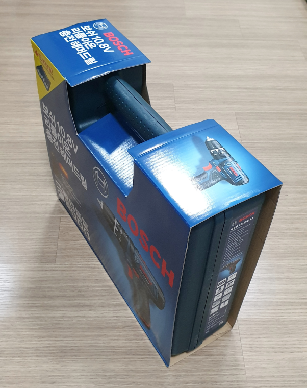
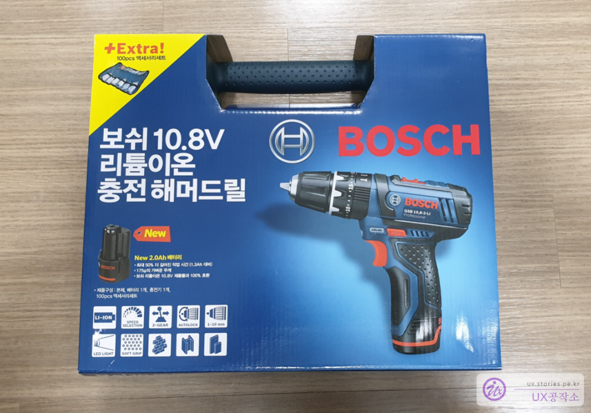

 

남자들의 로망이자 집에 하나씩은 가지고 있어야 할 잇템~~ 해머 드릴을 하나 구매했습니다.  
공구의 명가인 보쉬(BOSCH)에서 출시한 **GSB-10.8-2-LI** 이고 언팩를 하도록 하겠습니다. 
구매는 인터넷 사이트에서 12만원 정도에 구매를 했습니다. 보통 가격대가 11만원~15만원대를 형성하고 있습니다. 

# 인터넷으로 구매할 때 주의해야할 4가지   
인터넷으로 구매할 때 주의해야 할 점 4가지를 정리해 봤습니다.    

### GSB1080은 GSB10.8과 다릅니다  
   
무작정 가격만 싸다고 검색 후 구매를 하시면 않됩니다.  
**GSB10.8**로 **네이놈**을 검색 하면 **GSB1080이 10만원 대**의 가격에 은글슬쩍 묻어서 나오는데, 모양은 비슷해도 다른 모델입니다. GSB1080가 구형모델이고 **GSB10.8가 좀더 최신 모델**이라고 보시면 됩니다. 아무 생각없이 가격이 싸다고 제품명을 확인하지 않고 사시면 구형모델을 살 수도 있으니 주의하셔야 합니다. 물론 구형모델이라고 나쁜것은 아니니 가격이 더 중요한 구매 포인트라면 이 점을 인지하시고 구매를 하시면 됩니다.  

### 베어툴이라고 써있는 것은 배터리와 충전기가 없습니다.   
  

또한 검색을 해보면 **베터리가 없는**, **베어툴**이라고 되어 있는것이 있습니다. 가격대도 저렴합니다. 
베어툴은 베터리와 충전기, 박스가 없는 **오로지 본체만 판매하는 제품**입니다. 기존에 10.8V 보쉬 드릴이 있는 사람은 배터리와 충전기가 호환이 되므로 본체만 구입하라는 제품입니다.  
이것도 잘 인지하고 구매를 해야 합니다.  

### 처음 구매하는 제품이라면 완전체를 구매하세요 
   
처음 구매하시는 분이라면 위의 이미지 처럼 구성품이 모두 포함되어 있는 제품을 추천합니다.  

### GSR10.8-2 LI 과 GSB10.8-2 LI은 다릅니다.  
제품명이 거의 동일한것 처럼 보이지만 다릅니다. 딱 스펠링 하나 다른데요. 
먼저 제품명의 의미를 보면 **GSR**과 **GSB**는 품명이고 **10.8**은 전압입니다.(배터리구매 시 중요합니다.) **2**는 2번째 버전이라는 뜻이고 **LI**는 리튬이온배터리를 사용한다는 의미입니다.   

여기에서 **GSB는 해머드릴 기능이 있는 제품**이고 **GSR은 해머드릴 기능이 없이 그냥 회전만 있는 제품**입니다.  
해머드릴이 있다는 것은 콘크리트 드릴작업이 가능하다는 뜻입니다. 콘크리트를 뚫을 때는 해머로 치면서 드릴날이 회전해야 뚫리기 때문입니다. 물론 가정용이라 아주 단단한 콘크리트는 뚫지 못하니 감안하셔야 합니다. 

# 외관  

  
구매를 하면 딱 저 상자 하나가 옵니다. 저안에 모든것이 다 담겨있습니다.  

  
제품명을 볼 수 있습니다. Extra로 100pcs피스가 포함되어 있다는 표시가 있네요   

  
100PCS짜리 피스 세트가 사은품으로 들어있습니다. 보쉬 회사 차원에서 보내주는 서비스 제품입니다.  
드라이버 세트와 목제용 드릴, 철재용 드릴, 콘크리트용 드릴 피스가 포함되어 있어 가정에서 사용하기에 딱 좋은 서비스 제품이라고 생각됩니다.  

  
박스의 옆모습입니다. 

  
또 다른 옆모습입니다.  

  
종이포장지를 벗긴 앞모습입니다. 항상 **BOSCH**라고 크게 글자가 써져있는 곳이 위쪽입니다. 이렇게 눕혀놓고 뚜껑을 열어야 쏟아지지 않고 열 수 있습니다. 반대로 열면 공구와 부품들이 다 쏟아져 버렵니다.  

  
일반적인 주의사항이 있네요. 더 필요한 정보는 전화를 하라고 하는데.... 국내는 아닌듯합니다.  

  
박스에 붙어 있는 상세 설명입니다.  

# 박스 안의 구성품  
이제 박스안의 내용을 보겠습니다.  

  
딱 집에서 필요한 정도의 제품들로 구성되어 있습니다. 한통에 다 들어가기 떄문에 깔끔하고 편리합니다. 메뉴얼 2개, 100PCS피스, 드릴본체, 충전기로 구성되어 있습니다. 

  
100pcs로 구성되어 있는 피스들입니다. 이번에 써비스로 포함되어 있는것 같습니다. 가정용으로 사용할 것이면 굳이 다른 피스들을 구매할 필요는 없을 듯합니다.  
드라이버 홀더가 하나있고 비트가 10개가 있습니다. 목재용 드릴이 4개, 콘크리트 드릴이 4개, 철재용 드릴이 4개 포함되어 있습니다.  
그리고 플러그세트 42개와 스크류세트 35개가 들어 있습니다.  
그리고 기본으로 들어있는 앞뒤가 +, -로 자웅동체되어 있는 드라이버 피스가 있습니다.  

  
뒤면은 찍찍이와 밸트를 걸 수 있는 띠가 있습니다.  

  
둘둘말아서 보관했을때의 모습입니다.  

  
충전기 입니다. 생각보다 사이즈가 큽니다.  
초록색이 깜박이면 충전 중이고 완충이 되었을 때는 초록색 불이 계속 켜져있습니다.  
보쉬 10.8v 배터리는 모두 이 충전기로 충전이 가능합니다.  

  
오~ 멋진 권총의 모습을 하고 있는 드릴입니다. 이걸 손에 잡고 있으면 뭐든지 다 할 수 있을 것 같습니다. 여기에 해머 드릴 기능까지 있다니..

뒷면입니다. 1번 표시는 회전방향을 반대로 바꾸는 버튼입니다.   

  
1번 표시는 속도를 증가시키는 스위치 입니다. 1은 저속, 2는 고속으로 2가지 모드가 있습니다.  

  
1번은 드라이버로 사용할때 선택하는 모드이고  
2번은 드릴을 사용할때 선택하는 모드입니다.  
3번은 콘크리트에 구멍을 뚫을 때 사용하는 해머드릴을 선택하는 모드입니다.  
4번은 회전 강도를 선택하는 모드입니다. 1~20단계가 있는데 1단계는 약한 강도에도 **따따다~~** 소리가 나면서 더이상 회전의 힘이 들어가지 않습니다. 20단계는 강한 강도의 회전 힘이 들어가서 강하게 조여 줍니다.  
이 기능의 용도는 약하게 조여야 하는 나사를 드라이버로 강하게 조일 경우 나사가 **빠가**가 나거나 제품이 파손이 되는것을 미연에 방지할 수 있게 해 주는 기능이라 보시면 됩니다.  

  
배터리를 분리한 모습입니다. 이 배터리는 소모품으로 나중에 필요하면 재구매하여 사용하시면 됩니다.  

   
크기를 가늠할 수 있게 손으로 잡아봤습니다. 딱 권총크기입니다. 무게도 묵직하구요. 이정도 크기의 제품인데 힘이 엄청 좋습니다. 웬만한 가정용 드릴로 손색이 없습니다.   

  
충전하는 모습입니다. 충전은 배터리를 빼서 충전기에 꽂아서 충전을 합니다. 배터리를 빼지않고 통째로 충전하도록 되어 있으면 더 편리했을것 같은데, 구조상 그렇게는 어려운가 봅니다.   

  
   
참고할 수 있는 설명서를 같이 포함합니다. 

마지막으로 반품이나 교환 수리에 관련된 안내사항이 있어 올려봤습니다. 

# 총평  
가정에는 꼭 하나씩은 가지고 있어야할 도구입니다. 드릴의 힘에 비해 무게와 크기도 작아서 여성이 사용하기에도 어렵지 않게 사용 가능합니다. 
가정에서 나사를 풀거나 조이거나 구멍을 뚫을 일이 있을때 너무 편리합니다.  

