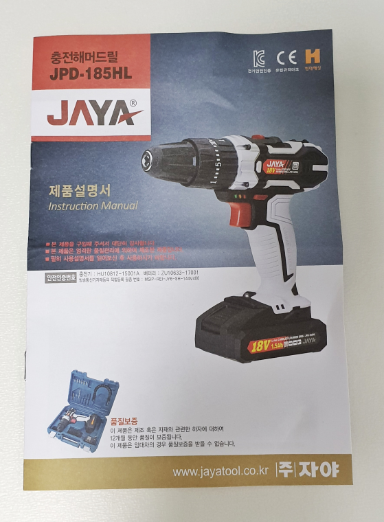
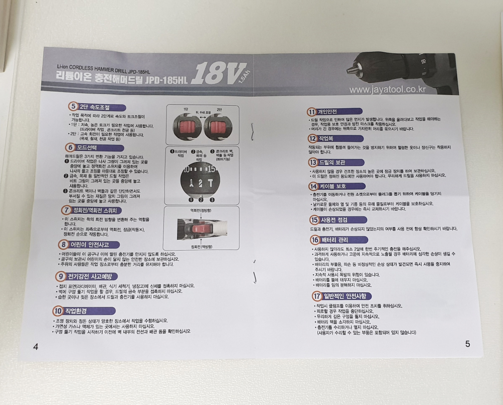

얼마전에 [집에서 쓸만한 가정용 해머드릴 GSB-10.8-2-Li 언박싱](https://stories.pe.kr/338)을 포스팅 했었는데요.  

> [집에 하나씩은 있어야 할 가정용 보쉬 충전 해머 드릴(GSB-10.8-2-LI) 언박싱](https://stories.pe.kr/338)  

이번에 어떻게 **JAYA 충전해머드릴**(JPD-185HL)을 선물받게 되어 이것도 언박싱을 해 보려고 합니다.    
보쉬 **GSB-10.8-2-Li**는 10V용 드릴이라면 **JPD-185HL**는 그것보다 더 힘이 센 **18V 무선 드릴**입니다.   
그럼에도 불구하고 가격은 보쉬보다 2~3배 저렵합니다. 가성비 끝판왕이라고 보면 됩니다. 
인터넷으로 검색을 해 보니 대략 5만원대의 가격을 형성하고 있습니다. 
  

# 외관  

  
박스 전면입니다. 제품명과 모델명이 있네요. 전체적인 형태를 확인할 수 있습니다. 
18V라고 써있습니다.

  
간단한 기능설명과 제품명입니다. 별다를 건 없네요.

  
무선 해머 드릴이라고 영어로 써있고 다양한 특징들이 아이콘으로 나열되어 있습니다. 

  
이제 박스를 뜯어 봤습니다. 실제로는 지금 보는 이 파란색 박스로 드릴을 들고다니겠지요.  
보쉬와 마찬가지로 JAYA라고 크게 써있는 면을 보고 케이스를 열어야 쏟아지지 않습니다. 

  
잠금장치는 크롬같은 철로 되어 있습니다. 보쉬를 먼저 보고나서 그런지 아무리 애를 써도 케이스가 허접해 보이는 것은 어쩔 수 없습니다. 뭐... 가격이 저렴하닌까요. 

# 박스 안의 구성품   
  
드디어 케이스를 열어봤습니다. 딱 필요한 것만 있습니다. 원가를 절감하기 위해 본체 외에는 최소화 시킨것 같습니다.  
드릴과 충전기, 드릴 비트가 있습니다. 보쉬는 드릴비트는 기본에는 없었고 별도로 서비스 차원으로 챙겨 주었었습니다.   

  
박스 상단면에 드릴 비트가 있습니다. 결국에는 드릴 세트를 구매해야 겠지만 일단은 이것으로 간단한 작업은 가능하리라 봅니다.  
가장 위에는 십자, 일자 나사가 있습니다. 두번째 줄에 있는 드릴 연장비트나 우측에 있는 휘는 드릴 연장비트와 결합하여 사용하면 됩니다.  
드릴은 콘크리트 드릴과 나무 드릴이 있네요.. 보쉬는 철재용 드릴도 있었는데 여기는 없습니다.   

  
18V 해머드릴과 충전기가 있습니다.10V보다 18V가 더 크고 힘이 쎄다고 보면됩니다.   
충전기는 베터리를 본체에서 분리한 후에 충전할 수 있게 되어 있습니다. 
드릴과 연결된 상태에서는 충전이 불가능 하네요.  

   
크기를 가늠해 보기 위해 잡아봤습니다. 
보쉬 **GSB-10.8-2-Li**보다는 조금 크지만 그래도 부담없는 크기 입니다. 무게도 약간 묵직한 느낌이라 그립감이 좋습니다.  
18V짜리라 그런지 배터리도 조금 큽니다.  

  
보쉬와 마찬가지로 드릴 힘의 한계치를 설정할 수 있는 스위치와 나사를 사용할 것인지 드릴을 사용할 것인지 해머드릴을 사용할 것인지를 설정할 수 있습니다.    
콘크리트에 구멍을 뚫을 때는 반드시 해머드릴을 써야 뚤립니다.  
그 아래쪽의 빨간색 버튼은 보쉬와 마찬가지로 1번은 저속, 2번은 고속 모드입니다.    
특이하게 뒤쪽에 수평을 잡아주는 수평계가 달려있습니다. 굳이 필요할까 한 기능이지만 없는것 보다는 좋네요.  

  
전면 쪽을 봤을때 기능 설명입니다.  
정회전, 역회전 전환 버튼이 손가락 스위치 바로 위에 있습니다. 동작은 보쉬와 동일하게 작동합니다.  
보쉬의 후레쉬가 드릴 날 부분에 있다면 이것은 손잡이 아래에 있습니다. 아무래도 이게 제조 단가가 적게 들어서 그러지 않았을까 합니다. 

  
충전 방식도 보쉬에 비하면 조금 허접합니다. 보쉬는 충전장치에 충전지를 거치만 하면 충전이 되는데, 이것은 아답타 잭을 연결해야 합니다.  
보쉬도 충전을 하기 위해서는 베터리를 본체에서 분리해야 하는데 이 제품도 배터리를 분리해서 충전을 해야 합니다.  

# 설명서  
  
설명서입니다. 컬러풀 합니다.  

  
목차와 본체의 설명입니다.  

  
기기의 사용법이 있습니다. 드릴을 처음 사용한다면 한번쯤은 읽고 숙지해야 할 부분입니다.  

   
사용시 주의해야 할 사항이 있습니다. 

# 총평  

당연하겠지만 완성도에서는 보쉬보다는 못합니다. 하지만 가성비로 비교를 한다면 보쉬보다 훌륭한 제품이라고 할 수 있습니다.    
기능은 거의 보쉬제품과 동일하나 마감 부분에서 약간 아쉬운 부분이 있습니다. 

공구에 그다지 관심은 없으나 집에는 하나쯤 있어야 할 것 같은 분들에게 **JAYA 충전해머드릴**은 더할 나위 없는 선택이라 할 수 있습니다.  
