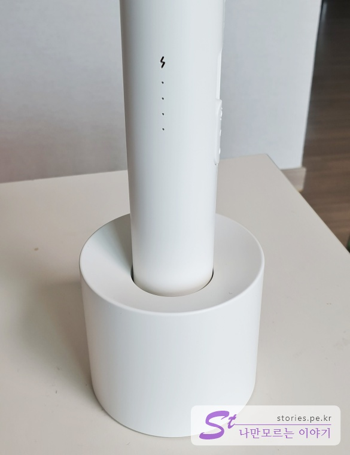

우연찮게 회사 야유회에 참석했다가 경품으로 받은 전기 파리채 & 모기채를 리뷰하도록 하겠습니다. 경품 받고 과연!! 얼마짜리인가 몰래~ 인터넷을 찾아봤는데... 생각보다 저렴해서 실망했습니다. 
그래도 외관과 기능, 마감을 봤을때는 가성비가 매우 우수하다며 위안을 삼기로 했습니다.   

## 제품 리뷰  

  
박스는 샤오미를 연상시키는 듯한 느낌의 순백의 포장입니다. 크기는 가로 X 세로가 대략 21Cm X 50Cm 정도되지만 사진만 보면 마치 갤럭시 노트9을 경품으로 받은 느낌입니다.   

  
뒷면을 봤을 때 "아~ 파리채구나~~" 라는 것을 바로 알수 있게 디자인을 했습니다. 
아래에는 여러가지 제원이 표시되어 있습니다.  

  
대부분의 조작부는 제품의 옆면에 있습니다. 
1. 스마트폰 5핀 케이블
1. 3단 스위치
1. 표시등 (표시등은 충전할때 전원을 켰을때 켜짐) 

  
뒷면에는 커다란 버튼 스위치가 있습니다. 전원을 켠 상태에서 이 버튼을 눌러야지만 전기가 통해서 벌레를 잡을 수 있습니다.  

  
스위치 조작 방법입니다. 스위치는 총 3단으로 구성되어 있습니다. OFF, 스위치 켜기, 스위치 켠 상태에서 LED켜기 입니다. 
위의 이미지는 꺼져 있는 상태로 전원 표시등이 모두 꺼져 있습니다.  

  
전원을 2단으로 켠 상태입니다. 이떄는 그냥 전원만 켠 상태입니다. 전원을 켜고 뒷쪽의 큰 버튼을 눌러야 모기를 잡을 수 있습니다.  
1. 전원스위치를 한칸만 위로 올림
1. 전원표시 LED켜짐(베터리의 충전상태도 표시됨)

  
스위치 3단을 켜면 파리채 부분의 LED조명이 켜집니다. 어두운 상태에서 표적을 찾기 수월하게 되어 있습니다. 
1. 전원스위치를 두칸 위로 올림
1. 전원표시 LED가 켜지고 상단의 LED조명도 켜짐

  
스위치가 켜진 상태에서 손잡이 뒷쪽에 있는 버튼을 누르면 번개 불빛이 켜집니다. 다시 버튼을 놓으면 꺼지게 됩니다.  이 상태에서 벌레를 잡을 수 있습니다. 
1. 전원스위치를 켠상태에서 뒷쪽에 있는 버튼을 누릅니다. 
1. 번개표시가 뜨면 정말 작동한다는 뜻입니다. 이제 벌래를 잡으러 가십시요.

  
순간 고전압이 발생해서 모기나 파리를 죽이도록 되어 있으며 사람이 닿게 되면 죽지는 않지만 따끔하게 아픕니다. 조심해야지요. 친구에게도 사용하면 안됩니다. 

  
거치대도 줍니다. 거치대에 충전기능은 없습니다. 그냥 단순히 거치만 가능한 부품입니다.  

  
거치대를 꼿은 모습입니다. 모습은 샤오미 부럽지 않습니다.  

  
전체 모습이 나오는 풀샷입니다. 이렇게 생겼네요.  

## 구매처 및 가격  
구매를 한게 아니라 구매처는 모르겠지만 네이버에 검색을 하면 많이 나옵니다.  
> 네이버에서 [전자모기채 CODE9으로 검색 ](https://search.shopping.naver.com/search/all.nhn?query=%EC%A0%84%EC%9E%90%EB%AA%A8%EA%B8%B0%EC%B1%84+code9&frm=NVSCPRO)

가격은 **15,900원**으로 단일가격입니다.  
가격이 저럼해도 1년동안 A/S가 가능하니 고장나면 버리지 마시고 AS를 받으세요. 단 택배비는 고려해 봐야할 요소가 되겠네요.

가격대비 성능(가성비) 끝판왕이라 할 수 있습니다.  

