몇달을 고민하다 드디어 넥밴드 스피커인 **톤플러스 스튜디오 HBS-W120**을 구매했습니다. 
저는 이 제품을 구매하기 위해 사전조사를 많이 해서 장단점은 어느정도 알고 구매했기 때문에 후회는 없지만 무턱대고 이 제품을 구매한다면 후회할 소지가 다분하므로 꼭 사전조사가 필요한 제품입니다. 

제품에 대한 특장점과 구매를 하고 2주정도 사용한 사용기를 작성해 보려고 합니다. 

# 제품 소개  
제품을 받아보면 상당히 고급진 박스에 담겨서 옵니다.  

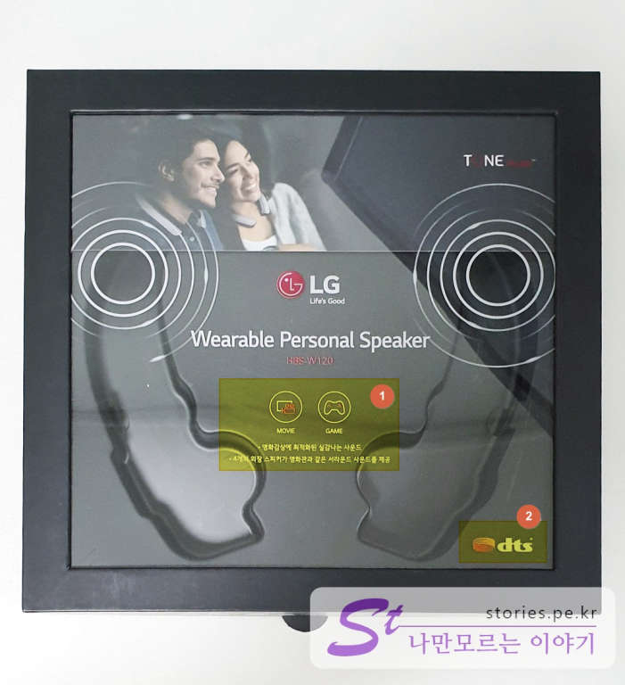  
사진을 찍고나니 아쉽게도 제품을 빼놓고 찍었네요. ㅎㅎ  
상자 전면에 **Wearable Personal Speaker** 라는 글과 모델 명인 **HBS-W120**이라고 써저 있습니다. 
박스 양 옆에는 외장 스피커에서 나오는 소리를 표현하기 위해 동그랑 원을 그려놨구요.

1. 영화, 게임에 주로 사용됩니다라는 표시가 있습니다. 저에게 딱 맞는 컨셉이죠. **톤플러스 스튜디오**라는 제품명에도 **스튜디오** 라는 힌트가 있네요.
1. **dts코덱**이 포함되어 있습니다. 원래 dts는 돌비보다 상위에 해당하는 영화감상용 코덱으로 상용코덱이라 싸구려 제품에는 없는 경우가 있습니다.

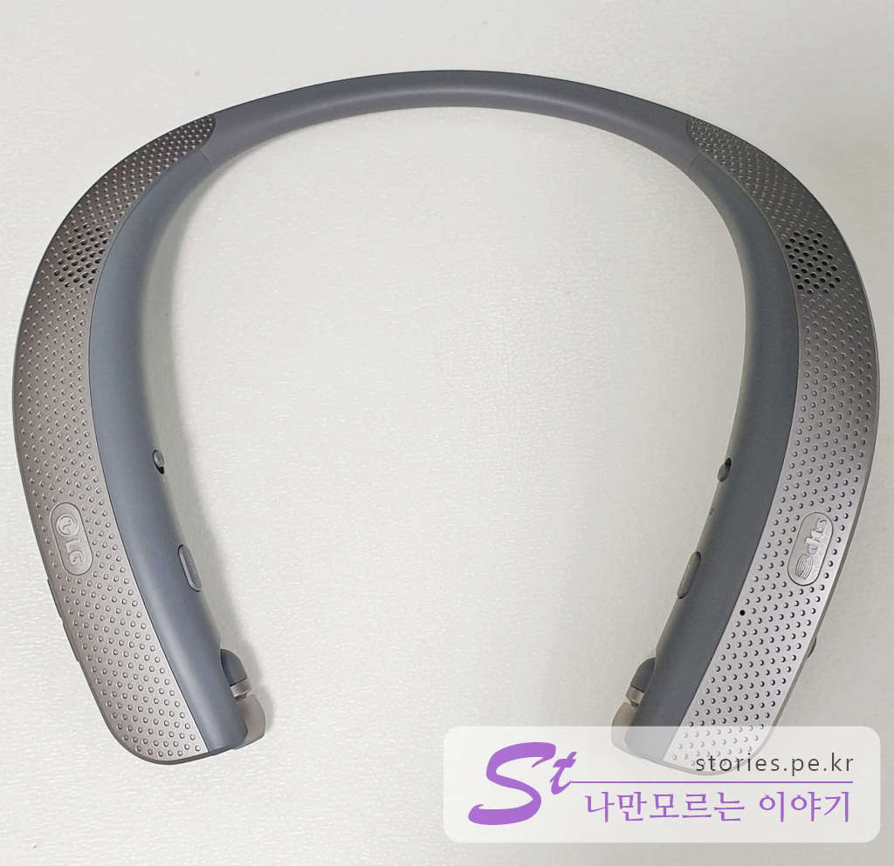  
제품의 형태입니다. 목부분은 얇고 아래 부분은 상대적으로 커다래서 어느정도 균형이 맞습니다. 하지만 일반적인 LG톤플러스에 비해 약간 크고 무겁게 생겼습니다.  
외장 스피커는 위쪽의 양 옆으로 하나씩 달려있고 뒤집었을 때 아래쪽에 양 옆으로 하나씩 달려있습니다.  

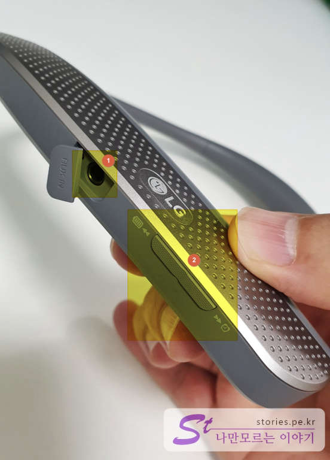  
목에 걸었을 때를 기준으로 오른쪽의 바깥쪽 콘트롤 버튼들입니다.  
1. AUX IN단자 입니다. 블루투스가 있어서 많이 사용되지는 안을 듯 하지만 외부의 음원을 aux케이블을 통해 입력받을 수 있습니다. 예를 들어 블루투스 기능이 없는 옛날 mp3플레이어의 이어폰 단자에 케이블을 연결하면 이것으로 들을 수 있게 됩니다. 
1. 이전/다음 버튼입니다. 블루투스로 연결된 스마트폰의 뮤직플레이어를 조종해서 이전 곡 또는 다음 곡의 이동이 가능합니다. 

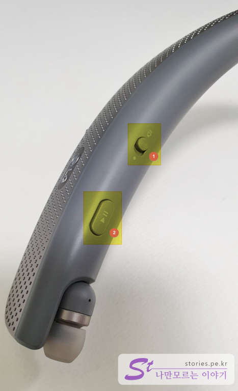  
목에 걸었을 때를 기준으로 오른쪽 안쪽의 콘트롤 버튼들입니다.  
1. 이어폰과 스피커의 전환 스위치 입니다. 외장스피커 사용이 주 용도 이지만 이어폰도 가능합니다.  
1. 재생/일시정지/정지 버튼 입니다. 바깥쪽에 있는 이전/다음곡 버튼처럼 연결된 플레이어를 조절합니다. 

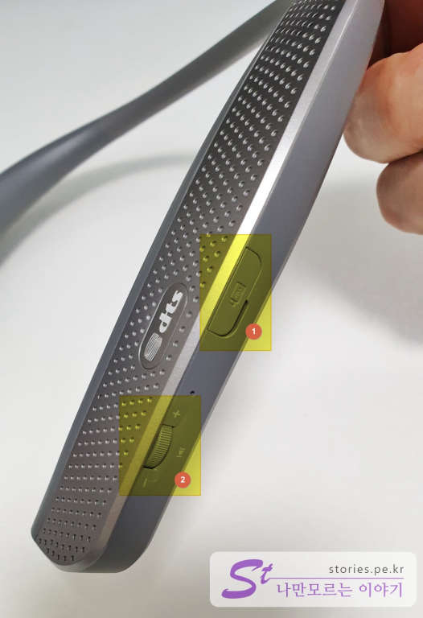  
목에 걸었을 때를 기준으로 왼쪽 바깥쪽 콘트롤 버튼들입니다.   
1. 5핀 충전단자 입니다. 일반 스마트폰을 충전하는 것과 동일합니다. 
1. 볼륨버튼입니다. 위로 올리면 소리가 커지고 아래로 내리면 소리가 작아집니다.  휠버튼을 2초간 누르면 베이스 강화, 기본, 고음강화의 모드 전환이 됩니다.  

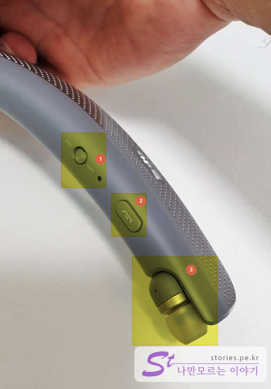  
목에 걸었을 때를 기준으로 왼쪽 안쪽의 콘트롤 버튼입니다.  
1. 전원스위치 입니다. 아래쪽에 있는 작은 구멍은 상태표시등입니다. 
1. 통화/버튼입니다. 전화를 받거나 끊을 수 있습니다. 
1. 외장스피커 사용이 주 용도이나 이어폰으로도 사용할 수 있습니다. 잡아당기면 귀에 낑길 수 있게 연결된 줄과 같이 나와서 귀에 낑길 수 있습니다.  

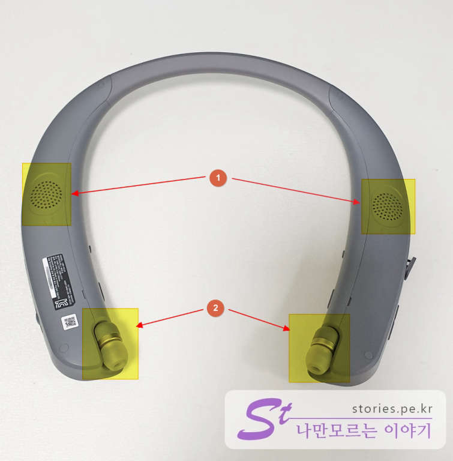  
강아지 배 뒤집듯이 뒤집은 모습입니다.  
1. 배쪽에도 외장 스피커가 2개 달려 있습니다. 베이스 소리와 진동을 느끼게 해 줍니다. 
1. 이어폰도 2개가 달려 있습니다. 
영화나 게임을 할때는 스테레오로 들리지만 전화통화를 할 때는 오른쪽 스피커만 작동을 합니다. 고장이 아니니 걱정하지 마세요. 

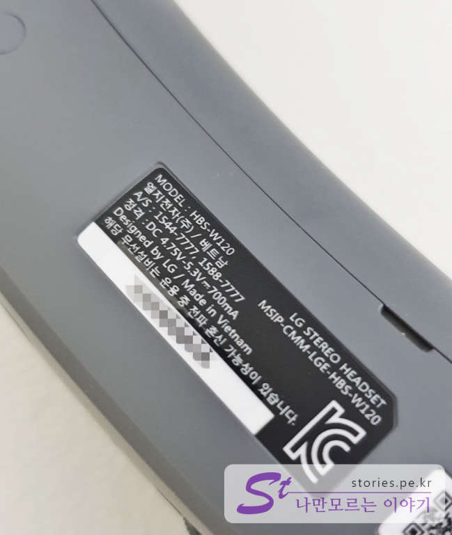  
한쪽에는 제원이 있습니다. 모델명도 있고 제조한 나라도 있습니다. 제것은 베트남에서 제조를 했네요. 
인터넷에 보면 가끔 병행제품이 있습니다. 외국에서 구매했거나 직구를 한 제품인데요. 구매 가격은 저렴한데 국내에서는 A/S가 되지 않는다는 점은 꼭 알고 계셔야 합니다 

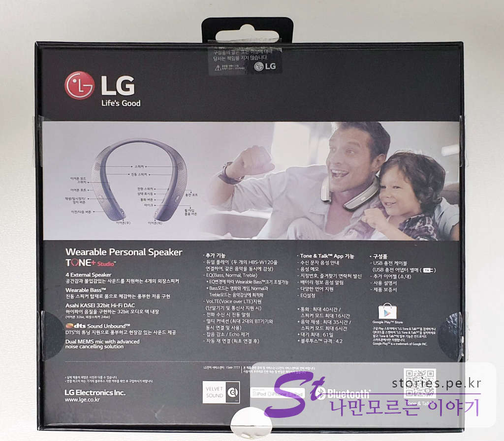  
제품박스의 뒷면을 보시면 제품의 특징을 볼 수 있습니다. 

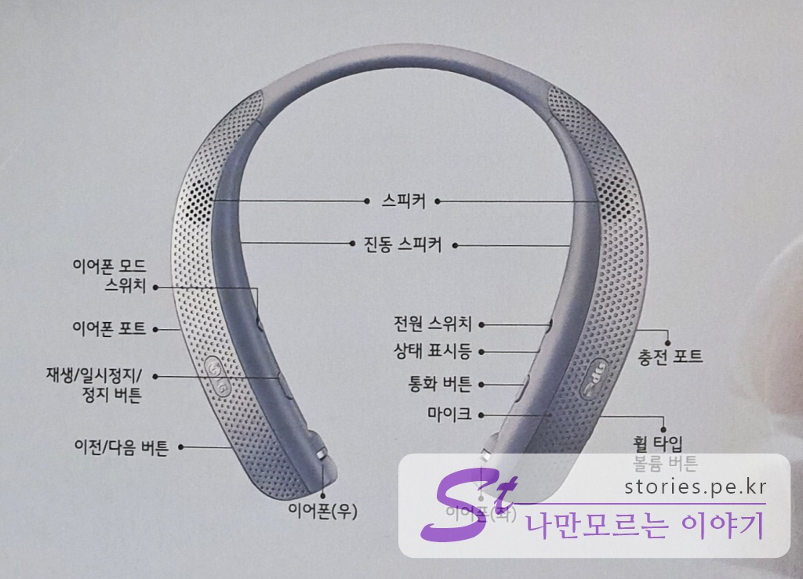  
사용설명서를 봐도 되지만 박스에 나와 있는 간단한 버튼설명이 요긴할 때가 있습니다.  

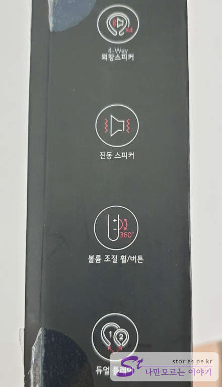  
HBS-W120의 가장 큰 특징 4가지를 한눈에 알 수 있게 표시를 해 놨습니다.  
1. **4개의 외장 스피**커 : 스테레오 기능을 합니다. 
1. **진동스피커** : 아래에 있는 2개의 스피커가 중저음이 나올떄 진동을 줍니다. 실감납니다.  
1. **볼륨조절 휠/버튼** : 볼륨조절이 휠 형태로 되어있어 버튼형보다 훨씬 직관적입니다. 
1. **듀얼플레이** : 블루투스를 동시에 2개를 연결할 수 있습니다. 그래서 블르투스를 전활할 필요없이 2대를 동시에 연결해서 사용할 수 있습니다. 

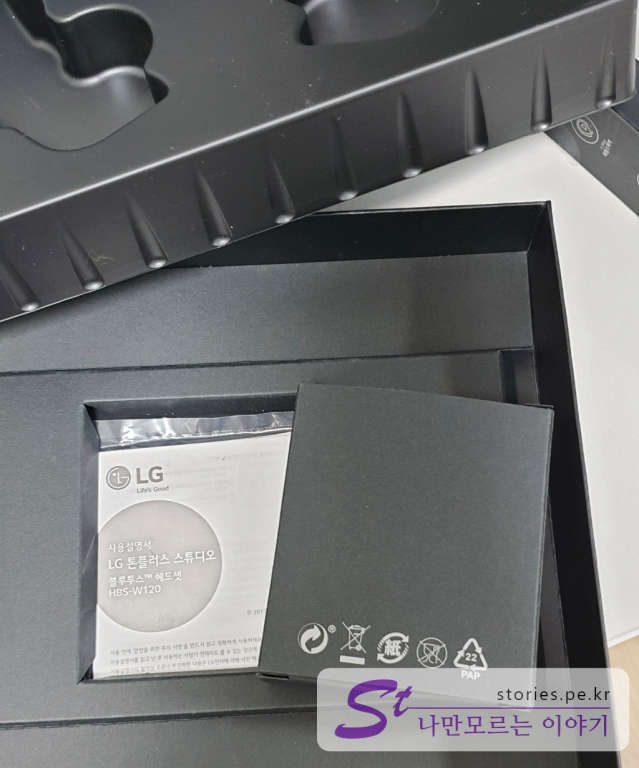  
제품을 빼고 아래 박스를 열어보면 하나의 작은 박스와 설명서가 있습니다.  

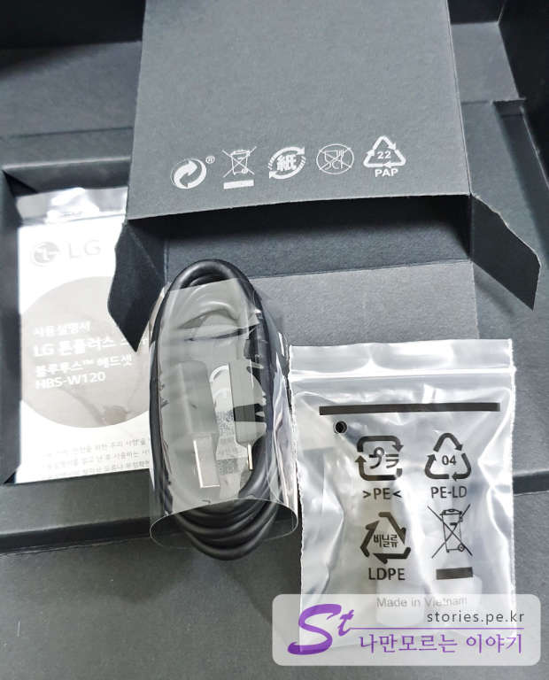  
작은 박스안에는 충전케이블과 여분의 이어팁이 4개 들어 있습니다.  

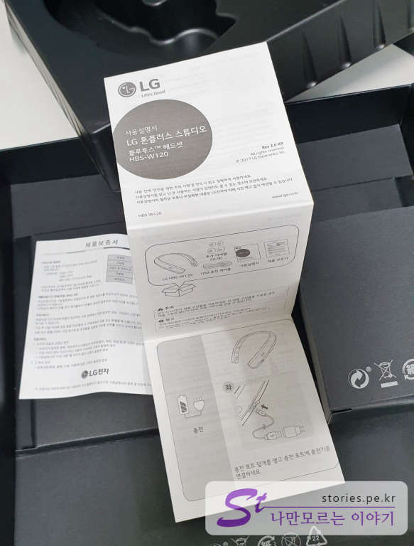  
또한 한장짜리 설명서도 같이 동봉이 되어 있습니다. 

# 제품의 장단점  
2주동안 사용해본 제가 느끼는 제품의 장단점을 정리해 보겠습니다. 

## 장점  
### 배터리 용량이 크다.  
아무래도 제품자체가 크다보니 동급제품의 톤플러스에 비해 배터리 용량이 큰 편입니다.  
3.7V 445mAh의 리튬 폴리머 배터리가 2개가 내장되어 있어서 완전히 충전하는 데 약 2시간 반정도 소요되고
대기시간은 최대 60일, 이어폰 모드는 최대 40시간 통화, 35시간 음악 재생이 가능하다고 합니다 
스피커 모드에서는 최대 16시간 통화, 6시간 음악 재생이 가능하다고 합니다. 

### 외장 스피커로 극장같은 사운드를 들을 수 있다.  
dts코덱을 사용해서 그런지 사운드는 너무 좋습니다. 일반 스피커로는 듣지 못했던 세세한 음향까지 모두 표현해 주고 있다는 것을 실제로 느낄 수 있을 정도입니다. 

### 이어폰을 귀에 낄 필요가 없어 귀가 아프지 않다.  
이어폰을 오래 낀 경우 귀에 자국이 생기면서 귀가 아픈경험이 있었을 것입니다. 이 제품은 외장 스피커로 들을 경우 이어폰을 낄 필요가 없으니 그런 고통에서 벗어날 수 있습니다. 

### 영화나 게임할때 정말 좋다.  
특히 영화나 게임의 음향을 들을 때 좋습니다. 세세한 소리까지 들립니다. 모니터에 달려있는 스피커로 들으면서 게임을 할때는 총소리가 남의 일처럼 느껴졌었는데, 톤플러스 스튜디오를 끼고 게임을 할때는 여기 저기에서 정신없이 총소리가나서 좀 당황했습니다. 과장되게 표현하면 이러다 총맞어 죽는건 아닌지.. 하는... 

## 단점  
### 제품이 크고 무겁다.  
외장스피커 때문인지 제품의 크기가 다소 크고 무겁습니다. 외부에 매고 나갈 때는 무게는 그렇게 부담스럽지 않은데 크기가 좀 커서 창피합니다.   

### 외장스피커의 소리는 다소 적응이 필요하다.  
외장스피커로 소리를 즐기려면 조금 적응의 시간이 필요합니다. 처음 들었을때는 약간의 이질감이 있습니다.  
완전 몰입형 사운드가 아니라 주변소리도 같이 들리면서 영화나 게임의 소리도 같이 들립니다. 그리고 모니터를 보면서 들으면 어느정도 괜찮은데 모니터와 몸이 다른 방향이나 다른곳을 보고 있을때는 사운드의 방향이 달라져서 조금 이질감이 느껴집니다. 어느정도 적응의 시간이 필요합니다.  

### 운동중에 사용하기 어렵다.  
운동중에 사용하기에는 조금 애매한 크기와 형태입니다. 조금이라도 뛰게 되면 한쪽으로 흘러내려 떨어집니다. 신경쓰여서 운동에 집중이 되지 않습니다.  

### 외장스피커로 나만 듣는게 아니다.   
외장스피커로 들을 경우 이어폰처럼 나만 듣게 되어 있지는 않습니다. 지향성 스피커라면 좋았을 텐데, 무지향성이라 남들도 다 듣습니다. 물론 남들한테는 상대적으로 작게 들리겠지요. 하지만 들립니다.   

### 가격이 비싸다
가격이 비싼편입니다. 19년도 7월 현재 네이버 최저 가격이 **18만원**정도 이닌까요. 다른 톤플러스의 고가 제품과 비슷한 가격대 입니다. 

# 구매처 및 가격  

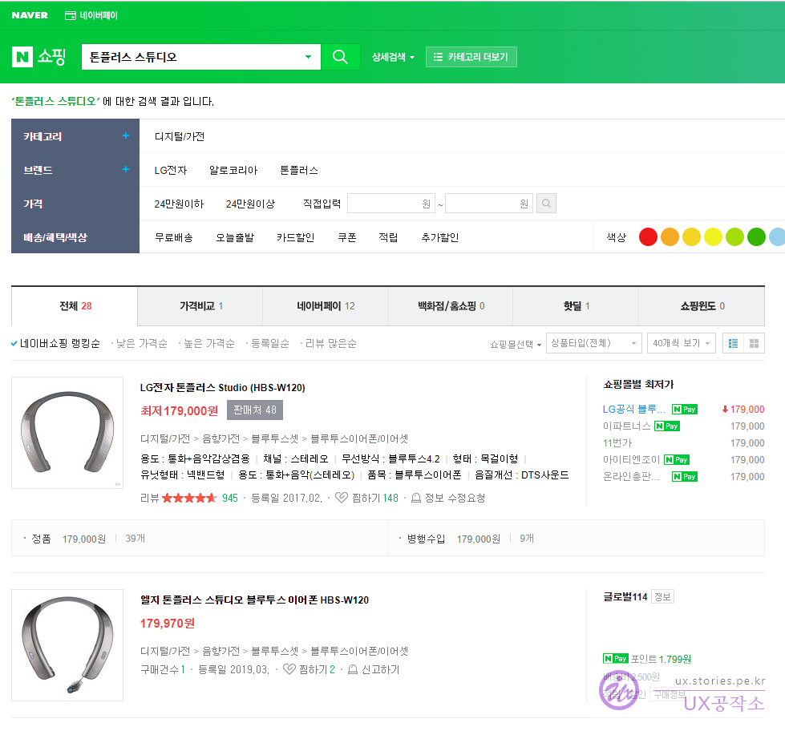  
구매처는 네이버에서 검색을 하면 많은 판매점이 나옵니다. 대략 가격은 **179,000원**에서 200,000원에 형성이 되어 있습니다. 

# 총평  

외장스피커로 쇼파나 의자에 앉아서 영화나 게임을 하겠다는 목적으로 구입할 경우를 제외하고는 구매를 한번쯤 생각해 봐야 할 제품입니다.   

가끔 중고나라에 8만원~12만원 정도의 가격대로 중고매물이 올라옵니다. 총알이 딸린다면 중고나라에서 적당한 중고제품을 구매하는 것도 좋은 방법인것 같습니다. 
다만 사기 당하지 않게 조심 또 조심해서 구매하세요. 꼭 직거래를 하시거나 안전결제를 이용하는것을 추천합니다.  
그리고 중고나라에 같은제품이긴 한데 병행수입품, 해외구매, 직구 물품이 싸게(6만원~8만원) 올라 오는 경우가 있습니다. 국내에서는 A/S가 되지 않으니 저렴하더라도 꼭 인지하고 구매하셔야 합니다.   
