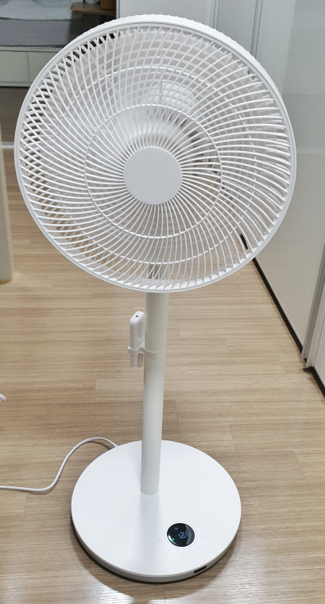
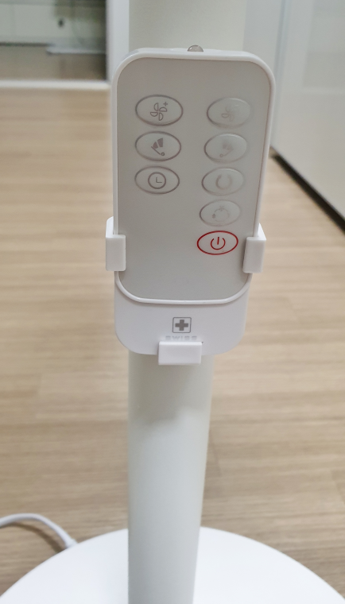

**스위스밀리터리**라고 하면 맥가이버가 항상 들고다니던 스위스군인용 다용도 칼, 일명 맥가이버 칼로 유명세를 떨치기 시작해서 현재는 시계, 라이터, 볼펜, 공구 등.. 다양한 제품을 출시하여 전세계에 판매를 하고 있는 다국적 기업으로 성장을 했습니다.   

  

근래에는 공구를 생산하여 판매하더니 급기야 선풍기까지 만들어 판매를 하고 있습니다. 다국적 기업인 만큼 완성도면에서 어느정도 완성도를 갖추고 있다고 볼 수 있습니다. 

우리나라는 [이노뷰](http://www.swissmilitarytools.co.kr/home/contents/main/index.php)에서 다양한 스위스밀리터리 제품을 수입/판매를 하고 있습니다. 

이노뷰는 [홈페이지](http://www.swissmilitarytools.co.kr/home/contents/main/index.php)와 [이노아울렛](https://smartstore.naver.com/innotools/profile)을 운영하고 있는데, 이노아울렛은 네이버쇼핑몰을 통해 운영을 하고 있습니다. 나중에 A/S를 받으려면 여기에서 받으면 됩니다. 

  
이번에 저는 무선선풍기인 제로펜 INF-1200R을 제 돈 주고 구매를 했습니다.  
INF-1200은 2018년도 모델입니다. 2019년에는 SMF-F1200로 시작되더 군요. 출시연도외에는 사양의 차이는 찾지 못했습니다. 뭐가 다른거지...

  
1년 묵어서 그런지 박스는 약간의 세월의 흔적이 묻어 있습니다. 

  
소비전력은 30W, 모터는 현재 가장 진보된 모터라고 하는 BLDC(브러시리스 직류)모터를 사용한다고 합니다.  
사용시간은 대략 3시간~ 16시간까지 사용할 수 있고 완충시간은 4시~4시 30분정도 걸립니다. 

  
조립 전의 모습은 찍지를 못했어요.. 조립이 어렵지는 않습니다.  

  
보통 무선선풍기의 경우 조작 버튼이 모터쪽에 붙어 있는 경우가 많은데 이 제품은 일반 선풍기 처럼 바닥에 붙어 있습니다. 그래서 장점은 발가락으로 컨트롤이 가능하다는 것..
6개의 버튼을 이용하여 조정을 할 수 있습니다. 

  
또하나의 장점은 리모컨을 제공해 준다는 것입니다. 무선이라 편리한데 리모컨까지 있어서 더 편리성을 더했습니다. 리모컨은 본체 기둥에 보관할 수 있습니다. 약간 애매한 위치이긴 합니다.  

  
본체의 뒷면 모터쪽에 떡~ 하니 스위스밀리터리라고 써있습니다  

  
코드는 아래와같이 220V를 바로 연결할 수 있게 되어 있습니다. 어떤 DC모터 제품은 외부에서 아탑타로 전압을 낮추고 직류로 변환해서 입력하는 경우가 있는데 그것보다는 이렇게 교류전원을 바로 입력해서 선풍기 내부에서 변압을 시키는 것이 더 효율적이고 심플하다고 할 수 있습니다.  

## 무선선풍기 구입시 주의할 점  
무선선풍기 구입시 알게된 몇가지 주의할 점을 말씀드리겠습니다.  

- 샤오미 무선선풍기는 리모컨이 없고 스마트폰으로 리모컨 역화를 대체합니다 (분실확율은 낮지만 사용이 의외로 불편하다고 합니다) 
- 일부 무선선풍기의 경우 배터리를 별도로 구매해야 하는 제품이 있습니다. 대략 10만원 안팎의 제품인 경우는 배터리를 별도로 구매해야 하는지 설명을 잘 읽어보셔야 합니다.  
- BLDC모터 인지 일반 DC모터인지도 확인해야 합니다. 

