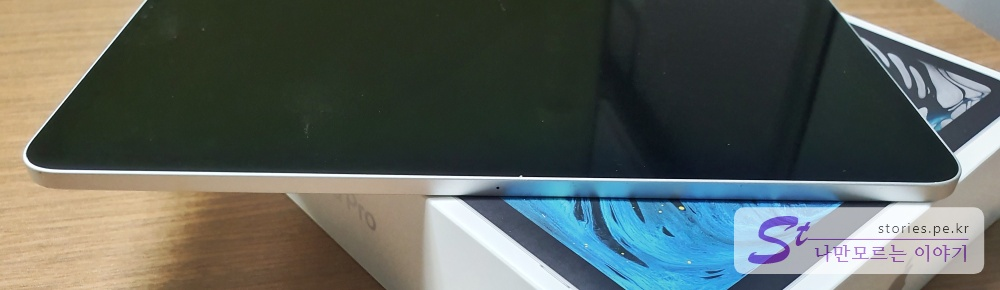

좀 늦은 감이 있지만 아이패드 프로 3세대 언박싱입니다. 512GB WiFI버전 입니다.  

 
전작보다 두께가 얇아지면서 자연스럽게 카툭튀가 되어버렸지만 그래도 무게가 줄어들었으니 이해합니다. 다만 아이패드 프로가 기본적으로 무게가 있기 때문에 묵직한 느낌은 어쩔 수 없네요. 

## 언박싱  

   
비닐도 뜯지 않은 태초 그대로의 모습입니다.   
뜯고 싶지 않지만 전자제품은 대부분 후속작이 계속해서 나오기 때문에 가능한 최대한 빨리 사용하는 것이 이득이라 뜯어봅니다. 
옆에 보이는 비닐 손잡이를 잡아 당기면 벗겨 집니다.  

   
뒷면에는 간단한 사양을 보여 줍니다. 512GB에 WIFI 버전이라고 나와 있네요. 

   
뚜껑을 열면 반투명비닐에 싸여있지만 자신의 존재감을 뿜뿜 뿜어내고 있는 아이패드 프로를 볼 수 있습니다. 

   
아이패드를 들어내면 안쪽에 몇가지 부속품이 들어 있습니다.  

  
충전기와 양쪽 C-Type 케이블이 한개 들어 있습니다. 박스와 어울리는 말끔한 흰색으로 되어 있습니다.  

    
충전기는 C-Type을 끼울 수 있는 제품이 들어 있습니다. 케이블도 양쪽이 C-Type로 되어 있습니다. 
이제 C-Type이 대세가 될 모양입니다. 근래 나오는 갤럭시10 스마트폰도 모두 C-Type로 되어서 나오더군요.  

    
맥북을 살때도 들어 있던 사과모양 스티커가 들어 있습니다. 

  
이제 제품을 살펴보도록 하겠습니다.  
가로 모드에서 좌측이 되겠네요. 스테레오 스피커가 달려 있고 전원버튼이 달려 있습니다. 

   
반대 편에 있는 모습입니다. 스테레오 스피커와 C-Type 충전단자가 붙어있습니다.   

  
제품 상단 오른쪽에 보면 볼륨버튼이 달려 있습니다.  

  
제품 하단에는 아무것도 없네요. 조그만 구멍이 하나 달려있는데 아무래도 마이크가 아닐까 합니다. 

   
이제 뒷면을 보도록 하겠습니다. 
하단에는 독에 세웠을때 독과 연결되는 단자가 3개 붙어 있고 상단에는 카메라와 플래시가 달려있습니다. 

    
아이패드 프로의 두께가 얇아지면서 카메라가 튀어나와 있습니다. 크게 문제는 없겠지만 심리적으로 매우 불안한 느낌을 지울 수 없습니다. 엎어놨을 때 기스가 나지 않을까... 
그래서 케이스를 사야겠다는 생각이 듭니다. 

   
이제 전원을 넣어 봅니다. 몇가지 언어로 안녕하세요를 보여주면서 설치를 시작합니다. 
인사한마디 했는데 설레네요. ㅎ

## 애플펜슬   
아이패드의 완소 아이템, 애플펜슬입니다. 아이패드의 가치를 2배로 올려주는 아이템입니다. 
다만 가격이 너무 비싸게 책정이 되어 있어서 애플에 좀 얄미운 생각이 들지만 필요하니 구매했습니다.  (나쁜 애플...)

   
이것도 옆에 비닐을 쉽게 벗길 수 있는 비닐 손잡이가 달려 있습니다.  

  
박스 뒤면에도 스팩에 대한 설명이 달려있습니다. 

   
옆면에는 Pencil이라고 아주 구미가 당기는 폰트로 써져 있습니다. 꼭 사야 할것 같은...

   
뚜껑을 열어보면 멋진 펜슬과 설명서 박스가 들어 있습니다. 
빡스는 일찌감치 버리고 ...

  
펜슬을 들어 봅니다. 
적당한 무게감에 있어보이는 모양이 나의 가치를 한단계 높여주는 기분입니다.  
총알이 허락한다면 꼭 사서 써봐야 하는 아이템입니다. 

  
펜슬을 아이패드에 붙혀봅니다. 
4개의 면 중 한개의 면에만 붙습니다. 펜슬의 방향은 중요하지 않습니다. 아무방향이나 잘 붙습니다. 
붙기는 딱~하고 단단히 붙기는 하지만 실수로 손으로 치기라도 하면 펜슬은 저 멀리 날라갈 수 있기 때문에 꼭 펜슬을 보호할 수 있는 케이스를 구매하든지 따로 들고 다니던지 하는 것이 안전합니다.  
잘못하면 16만원짜리가 한순간에 날라갈 수 있습니다.  
