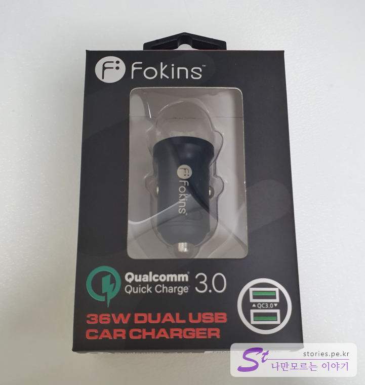
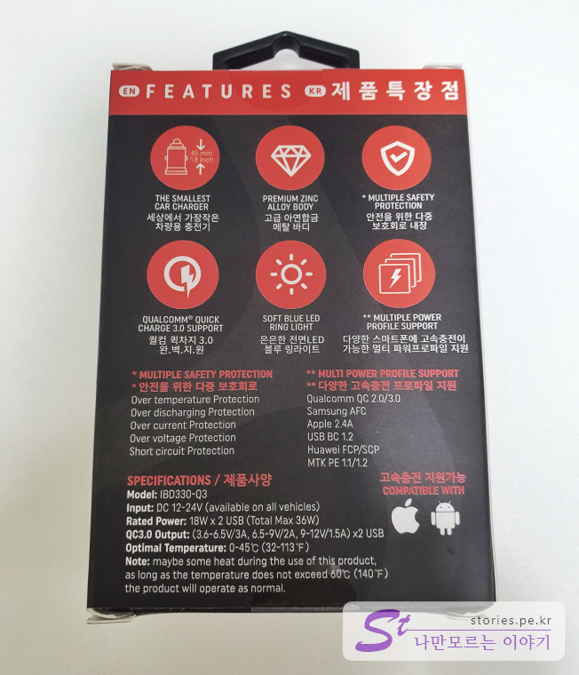
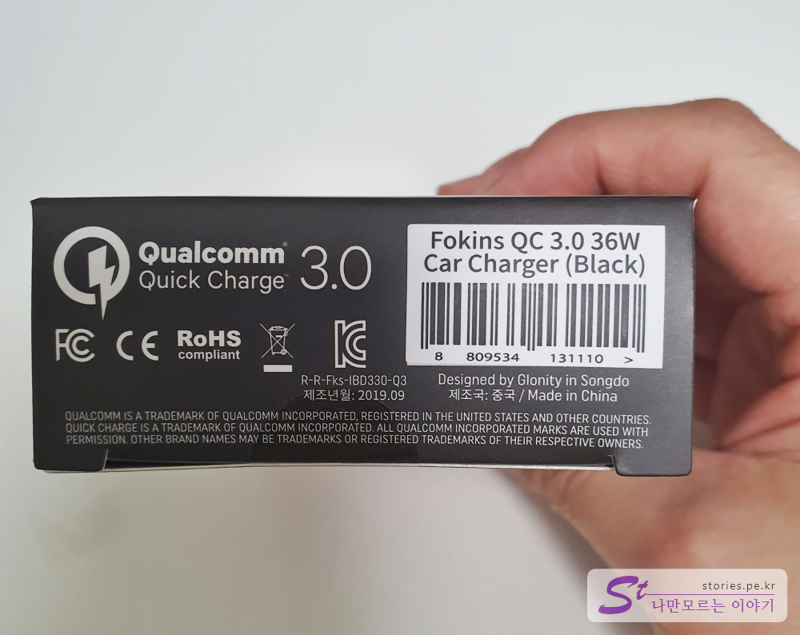
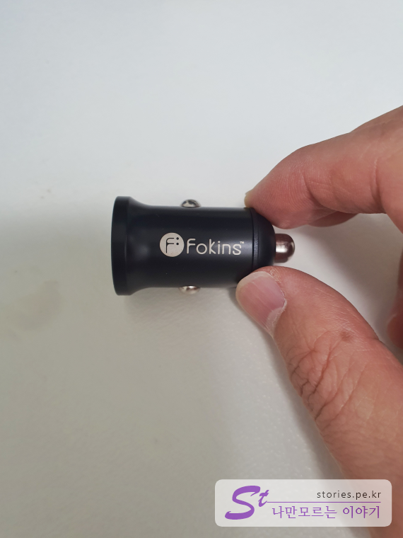
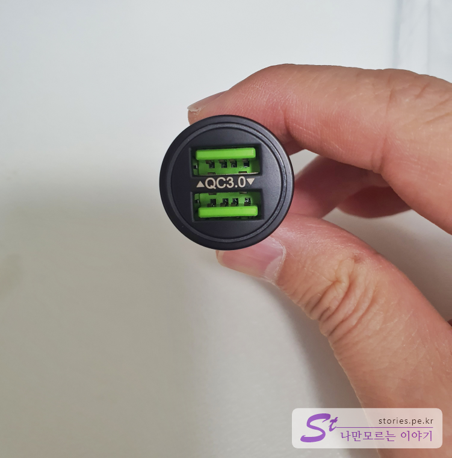
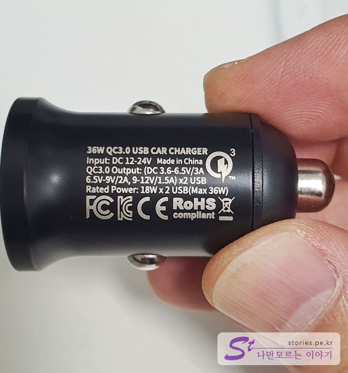

차량용 충전기를 구입하면서 빠르게 충전할 수 있는 **Car Charger**를 찾다가  **Fokins QC3**를 구입하게 되었습니다. 처음에는 가격이 너무 저렴해서 크게 기대를 하지 않았었는데 제품을 받아보니 너무 완성도가 좋았습니다. 

## 언박싱  

  
박싱의 앞면입니다. Fokins라고 쓰여 있고 Qualcomm 3.0을 지원한다고 써 있습니다. 보통은 2구짜리이면 한쪽은 QC3.0의 퀵차져이고 한쪽은 보통의 차져인데 이제품은 크기가 작으면서도 양쪽이 모두 퀵차져로 구성되어 있습니다. 

   
뒷면에는 6가지의 중요한 특징이 써져있습니다. 
1. 가장 작은 크기의 차량용 충전기
2. 고급 아연 합금 메탈 바디
3. 안전을 위한 다중 보호회로 내장
4. 퀄컴 퀵차지 3.0 지원
5. 전면 LED 블루라이트
6. 멀티 파워프로파일 지원

애플과 안드로이드 모두 고속 충전을 지원한다고 써있네요.

  
Qualcomm 3.0이라고 써있고 36W를 지원한다고 써 있습니다. 여기서 36W는 16W + 16W = 36W를 말합니다. 

  
실제로 보니 정말 작았습니다. 비교를 위해 손으로 잡아봤는데 크기도 작고 완성도도 좋았습니다. 

  
양쪽 모두 QC3.0을 지원한다고 써있습니다. 

  
아주 조그맣게 제원이 적혀있어서 확대 촬영하였습니다. 

> [같이 사용하기 좋은 무선충전 거치대 아이리버 ICR-A200 바로가기](https://blog.stories.pe.kr/394)

## 내가 생각하는 장점  
대단한 수준의 가성비를 자랑합니다. 품질도 좋은데 가격은 약 5,000~6,000원 수준입니다. 
몸체가 사구려 플라스틱이 아니라 메탈바디로 되어 있어서 단단하고 발열에도 좋습니다. 
사이즈가 상당히 작아서 시거잭에 끼우면 별로 티도 나지 않습니다. 잘빠지지도 않고 적절히 꽉 잡고 있어서 튼튼합니다.

## 내가 생각하는 단점  
크게 단점은 없어 보입니다. 

## 가격 및 구매처  
제가 구매한 가격은 **5,800원**입니다. 
구매는 네이버 [포킨스 스마트스토어](https://smartstore.naver.com/fokins/products/4765596308)에서 구매했습니다. 

아주 추천합니다. ★★★★★
