크게 맘먹고 예판으로 온전히 **179,300원**의 가격을 지불하고 구매를 했습니다. 따끈따끈합니다. 
이번에 새로 출시된 색인 **블루**입니다. 생각보다 많이 고급스럽습니다.   
예판을 하면 6가지의 케이스 중에 한가지를 선물로 주는 행사가 있었는데, 2월 13일로 종료가 되서 없어졌습니다. 
하지만 선물이 없는 대신에 현재 인터넷에서 2만원정도 할인된 가격에 판매를 하고 있으니 지금 인터넷에서 구매해도 나쁘지 않은 선택입니다.  
만약 좀더 기다릴 여유가 있다면 1~2개월 뒤에 구매를 하는것도 나쁘지 않을것 같습니다. 아마 그때 쯤엔 미개봉 신품이 중고마트 쪽에 많이 풀릴 수도 있기 때문입니다. 갤럭시 S20을 구매하면 99000원에 구매할 수 있는 혜택이 있어서 그 분들이 중고로 내 놓을 수도 있습니다. 

## 언박싱  
어째튼 언박싱을 해보겠습니다.  

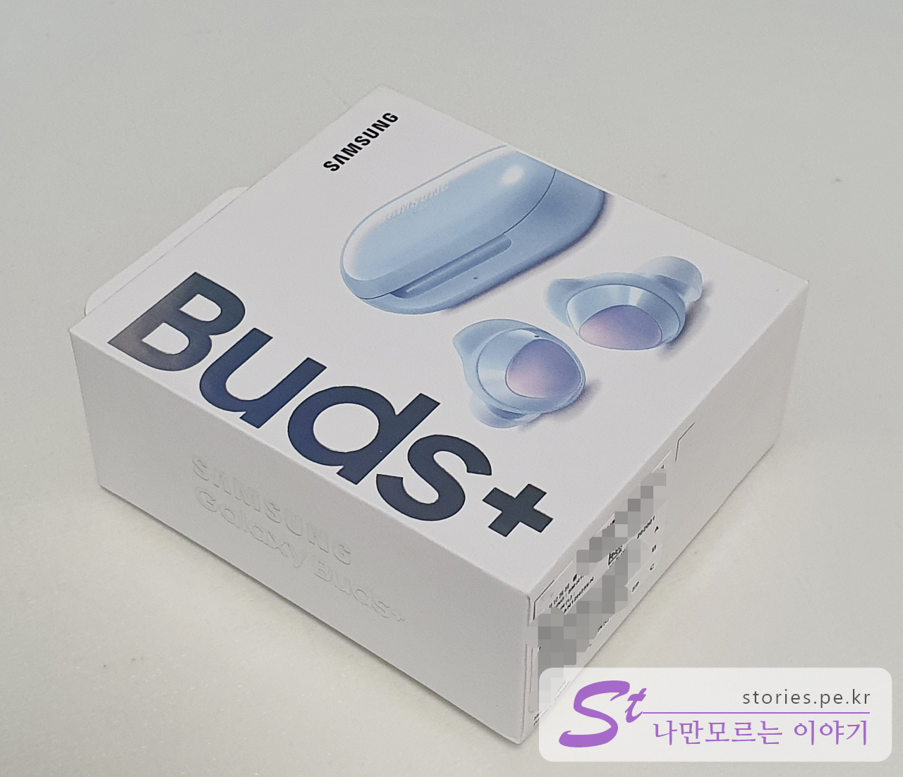  
사진상으로는 커 보이지만 생각보다 작은 사이즈의 박싱입니다.  

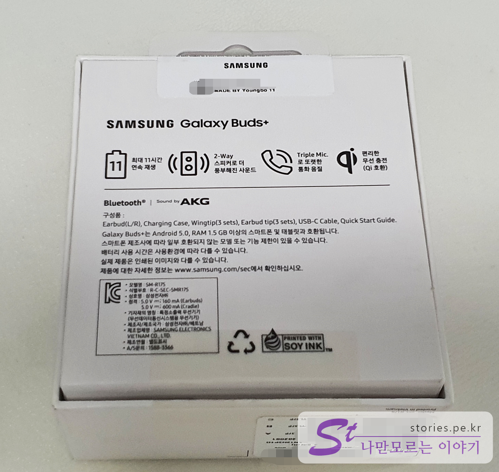   
박스 뒷면에는 **버즈+**의 가장 핵심적인 기능 4가지를 나열했습니다.  
전작에 비해 **2배이상 길어진 재생시간**, **2 Way 스피커로 풍성해진 사운드**, **3개의 마이크로 통화품질 향상**, 그리고 **무선 충전**입니다. 

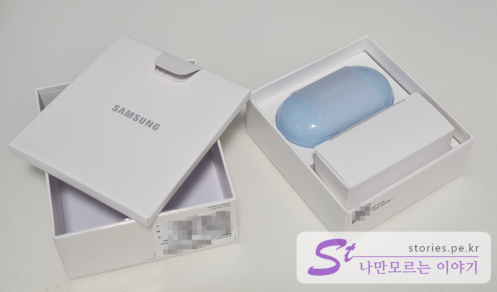  
본체와 악세서리, 설명서가 들어 있습니다.   

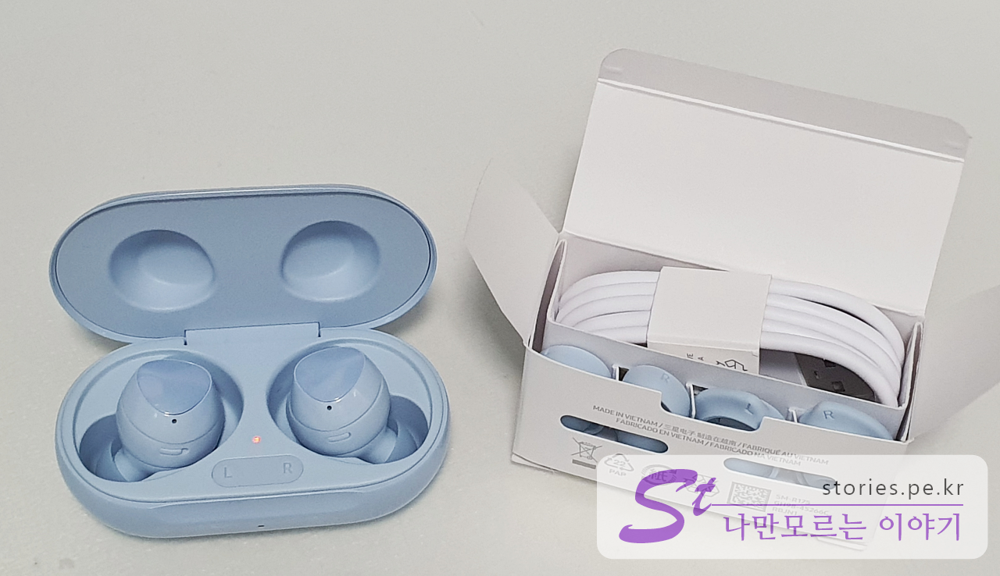   
본체는 케이스와 이어버드 2개 Type-C USB 케이블, 이어팁 3세트, 윙팁 3세트로 구성되어 있습니다. 

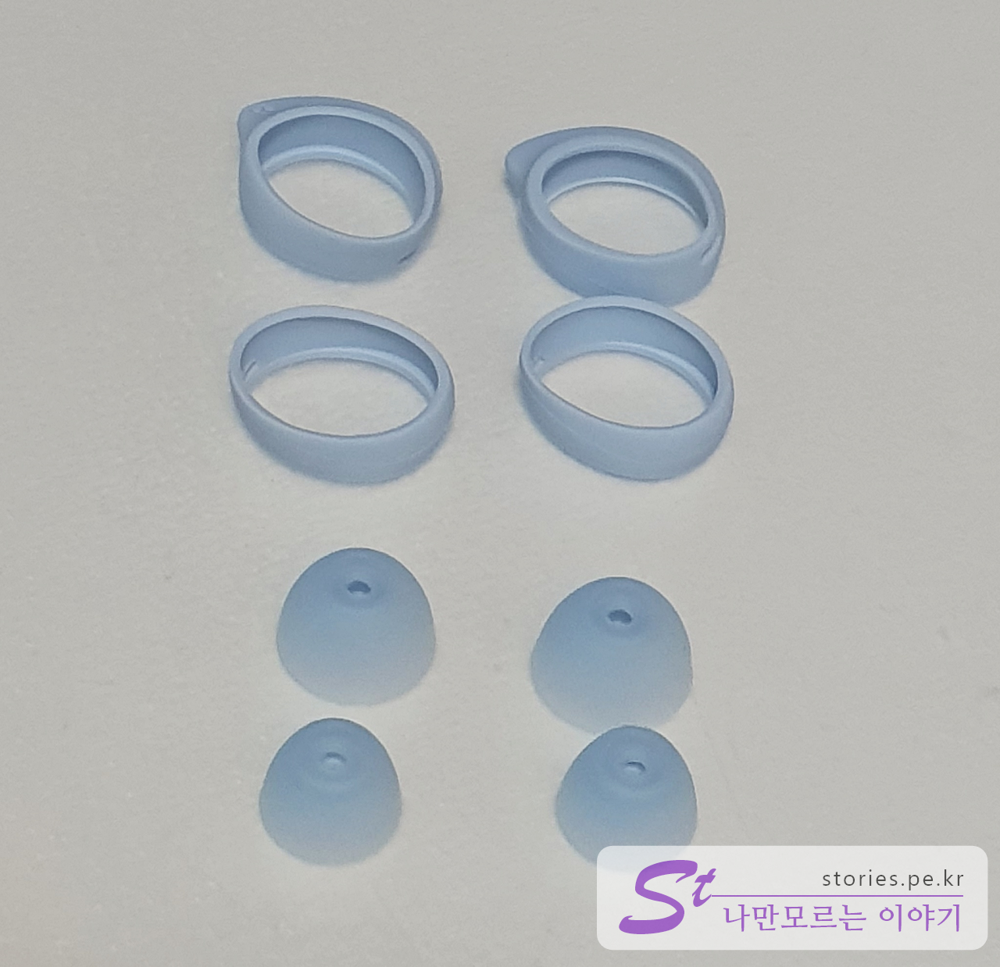    
이어팁과 윙팁은 중형의 1세트는 이어버드에 장착이 되어 있고 나머지 2세트는 악세사리 케이스에 들어있습니다.  

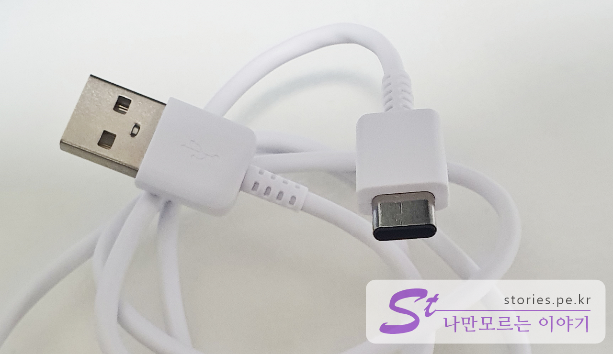  
케이블은 요즘 대세인 Type-C 케이블입니다. 케이블로 충전할 뿐아니라 무선으로도 충전이 가능합니다.   

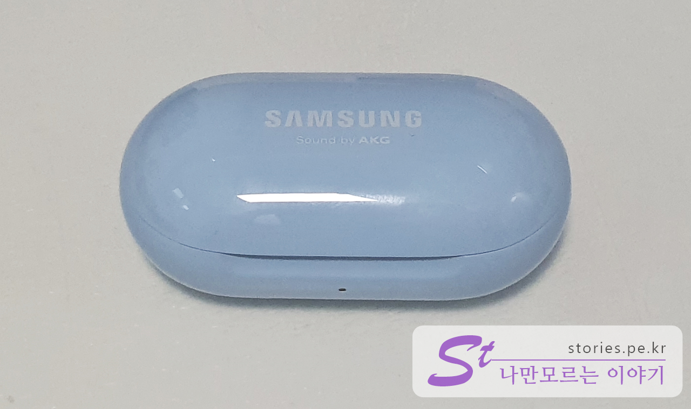  
케이스는 유광으로 블루라고 하는데 파스텔 하늘색이 더 맞는 표현인것 같습니다.  
**삼성**, **Sound by AKG**가 써져있고 크기는 생각보다 작아서 휴대하기가 좋습니다.  

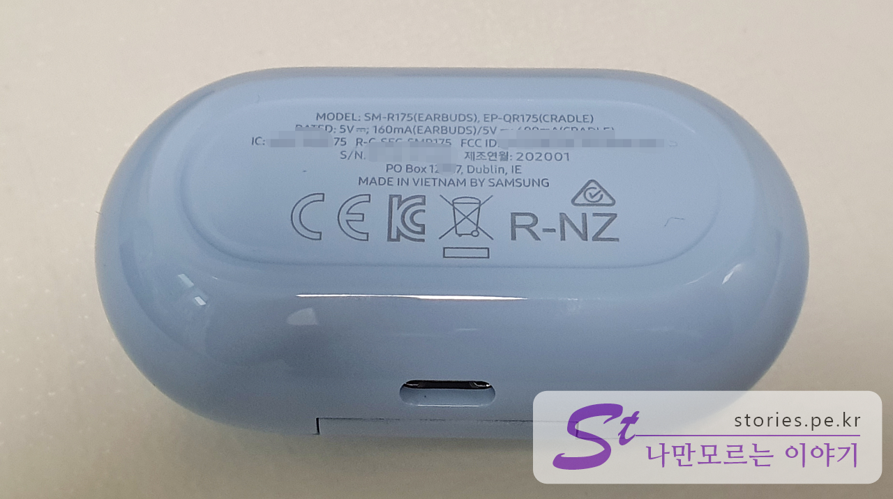   
케이스 하단에는 제원이 써져있습니다. 베트남에서 만들어 졌네요. ^^ 요즘 OEM생산이 중국에서 베트남쪽으로 많이 넘어가는 것 같습니다. 

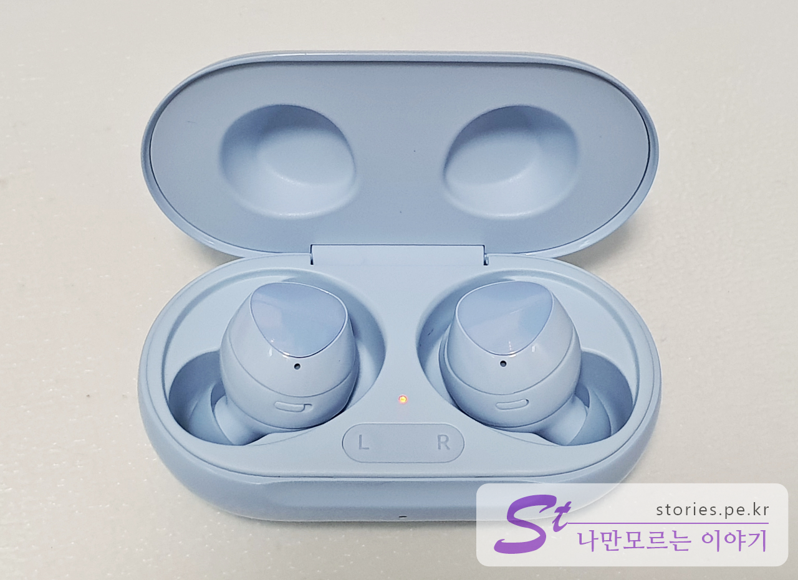   
케이스를 열면 오른쪽, 왼쪽 이어버드가 2개 들어있습니다. 케이스는 무선충전이 가능하고 자석이 내장되어 있어 뚜껑을 연체로 뒤집어도 이어버드가 떨어지지 않고 케이스에 붙어 있습니다.  

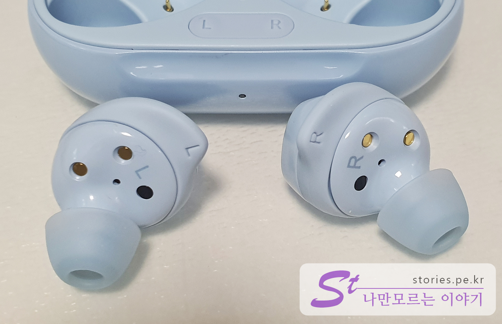   
왼쪽 귀에는 L, 오른쪽 귀에는 R을 끼우시면 됩니다. 반대로 끼우면 잘 안들어 가요   
충전단자 2개와 귀쪽 마이크, 착용감지센서가 보입니다. 

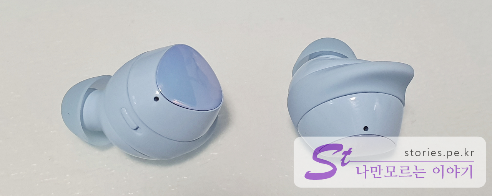  
바깥쪽에도 마이크가 하나 있고 넓은 면적의 터치센서가 있습니다.  

## 페어링과 Wearable 연결  
저는 스마트폰으로 갤럭시 S10을 사용하고 있습니다. 블루투스가 켜져있는 상태에서 **갤럭시 버즈+의 케이스**를 열면 자동으로 페어링을 시도합니다. 갤럭시 계열의 스마트폰은 Wear App이 자동으로 연결을 시도합니다.  

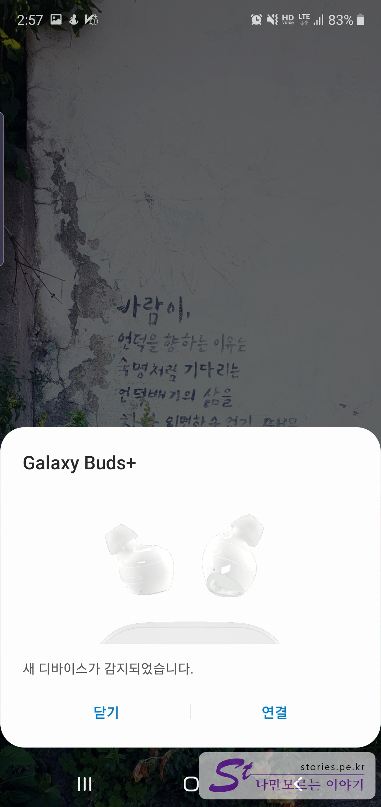  
케이스를 열면 새 디바이스 감지를 합니다. 여기에서 `연결`을 선택합니다.  

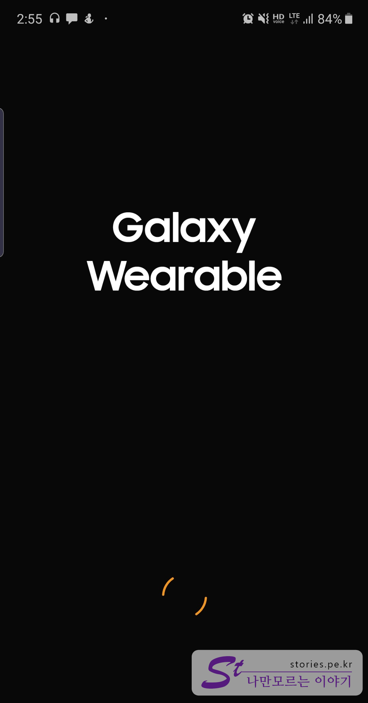   
Galaxy Wearable이 실행 됩니다.  

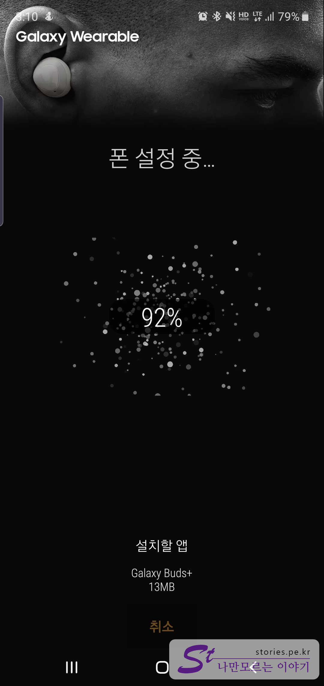  
자동으로 폰과 갤럭시 버즈+를 세팅해 줍니다.  

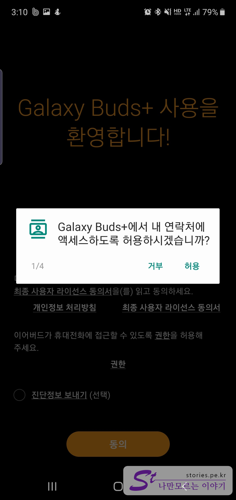   
4개의 액세스를 허용해 주어야 합니다. 가능하면 허용해 주는게 편리하겠지요?

   
Wearable이 연결되면 자동으로 이어버드의 소프트웨어 버전을 감지하여 업데이트가 필요하면 자동으로 업데이트를 해줍니다.  

## 내가 생각하는 장점  
휴대가 용이하고 갤럭시를 사용하고 있는 사용자에게는 가장 최선의 선택이 아닐까 합니다. 
외부의 소리도 증폭하여 들려주어서 굳이 이어버드를 끄거나 뺼 필요가 없습니다.  
재생시간이 11시간이라 출근, 퇴근 시간에 굳이 충전없이 사용이 가능합니다. 또한 케이스에 이어버드를 넣으면 자동으로 충전을 해주기 때문에 배터리가 모자랄 걱정은 할 필요가 없습니다.  
이전에 사용하던 이어버드는 통화를 하기 위해서 귀에서 빼고 블루투스 기능을 끄고 통화를 해야 했지만 갤럭시 버즈+은 그냥 귀에 착용을 하고 통화를 해도 문제가 없습니다. 

## 내가 생각하는 단점  
가장 큰 단점이라면 노이즈캔슬링이 되지 않는다는 점입니다.  
또한 17만원대면 아이팟보다는 저럼하긴 하지만 서민이나 학생들에게는 아직 비싼편이긴 합니다. 
이어버드가 케이스에서 잘 빠지지 않습니다. 케이스에 내장된 자석이 잡고 있고 이어버드에 손가락이 걸릴만한 건덕지가 없어서 몇번 헛손실을 해야 뺄 수 있습니다. 

## 가격 및 구매처   
저는 삼성전자의 공식판매점에서 예약판매를 통해 구매를 했습니다. 
- 구매처 : [삼성전자 공식판매점](https://www.samsung.com/sec/eventList/galaxy_buds_plus/)
- 가격 : 179,300원 

예약구매 시 사은품을 주는 매리트가 없어진 시점에서 굳이 여기서 구매할 필요는 없을것 같습니다. 

네이버에서 갤럭시 버즈+검색을 하면 다양한 판매점이 나옵니다.  

- 판매처 : [네이버 쇼핑 판매점](https://search.shopping.naver.com/detail/detail.nhn?nv_mid=21943128374&cat_id=50002334&frm=NVSCMOD&query=%EA%B0%A4%EB%9F%AD%EC%8B%9C+%EB%B2%84%EC%A6%88+%ED%94%8C%EB%9F%AC%EC%8A%A4&NaPm=ct%3Dk6nc9oh4%7Cci%3Dbec64cb996daf59ec092b752f6eb2c887c89e60f%7Ctr%3Dslsl%7Csn%3D95694%7Chk%3Dd13ccc7974cff3a6c7d6eec6745fb9c575cef1db)
- 가격 : 가격은 계속 변하겠지만 현재 최저가는 **156,350원** 입니다. 

사용해 보면서 장단점을 계속해서 포스팅해보겠습니다. 

## 설명서  
사용설명서 입니다.  

  

  

  

  
