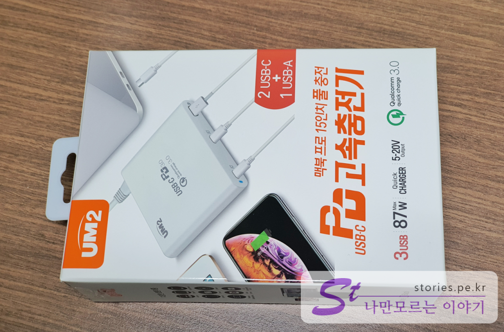

저는 맥북을 사용합니다. 그러나 불행히도 얼마 전에 **전원 어댑터**를 분실하고 말았습니다. ㅠㅠ
그래서 부랴부랴 맥북 전원 어댑터 정품을 알아봤습니다. 그러나 가격이 무려 8만원을 넘어 서더군요. 한순간의 실수로 최소 8만원을 날려버린것이지요. 망할 놈의 애플은 쓰레기도 가격이 후덜덜하니... 
그래서 아쉽지만 대안을 찾아 봤습니다.` Macbook Pro 15인치`인 경우 전력량은 `87W`이 되어야 한다는 조건이 있습니다. 그래서 최소한 `80W`이상의 대체 제품이어야 한다는 것이지요 그래서 찾게 된 것이 **UM2 QC90W** 입니다.   

## UM2 QC90W 언박싱   

    
박스는 단단하게 잘 포장되어 있습니다. 떡~~ 하니 **맥북프로15인치 풀 충전**이라고 써있는 것이 구매를 결정하게된 가장 큰 이유입니다.   

   
제품의 간략적인 설명과 주의사항이 나와 있습니다. **퀄컴 3.0**과 **PD 3.0** 규격을 지원한다는 설명이 써있네요. 

   
제품명과 87W USB-C. QC3.0챠저라고 써있습니다. 

   
랩탑, 태블릿, 스마트폰, 아이폰, 카메라, 게임기 등 사용 가능한 다양한 디바이스가 나열되어 있습니다.  

   
구성품은 본체, 전원케이블, 스탠드, 설명서가 다 입니다. 상당히 단촐합니다.  

  
제품명이 써있고 USB `Type-c` 단자가 2개 `일반 USB` 단자가 1개로 총 3개입니다. 왼쪽에는 충전상태를 나타내는 led램프가 있습니다.  

   
뒷쪽은 전원 단자와 제원들이 나와 있습니다. 

   
스텐드를 이용하여 전원장치를 세워봤습니다. 발열을 효율적으로 할 수 있다고 하네요. 

   
전원을 설치한 모습입니다. 정품은 아니지만 낯설지 않아 보입니다.  

## 충전 성능   
충전 성능을 확인해 봤습니다. 이런저런거 뺴고 충전속도로 확인 해 봤습니다.  

   
충전은 4%에서 시작 했고 오전 10:03분에 시작을 했습니다. 

  
완료는 99%로 11시52분에 완료되었습니다. 대략 2시간정도면 완충이 되는것 같습니다. 상당히 빠르네요. 

## 내가 생각하는 장점  
장점은 저렴한 가격에 적절한 성능이라고 할 수 있습니다. 정품은 USB단자가 1개지만 **UM2 QC90W**는 **3개의 단자** 를 가지고 있습니다.  
정품 어댐터보다 무개가 적게 나갑니다.  

## 내가 생각하는 단점   
정품이 아니라는 심리적인 아쉬움이 단점인것 같습니다. 

## 가격 및 구매처   
가격은 각종 할인쿠폰을 사용하여 **42,900원**에 구매를 했습니다.  
구매는 네이버쇼핑의 [I'MON](https://smartstore.naver.com/imonshop/products/4744090270?NaPm=ct%3Dk6p6gjow%7Cci%3Dcheckout%7Ctr%3Dppc%7Ctrx%3D%7Chk%3D460a35ef161066aeac302f661d8787c445c672df)에서 구매했습니다. 

## 설명서  

  

  

  

