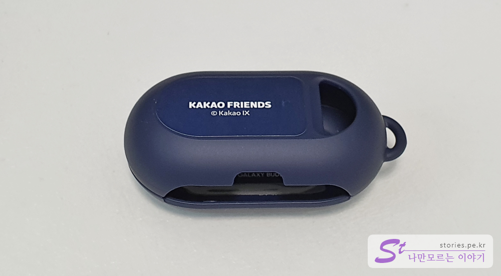
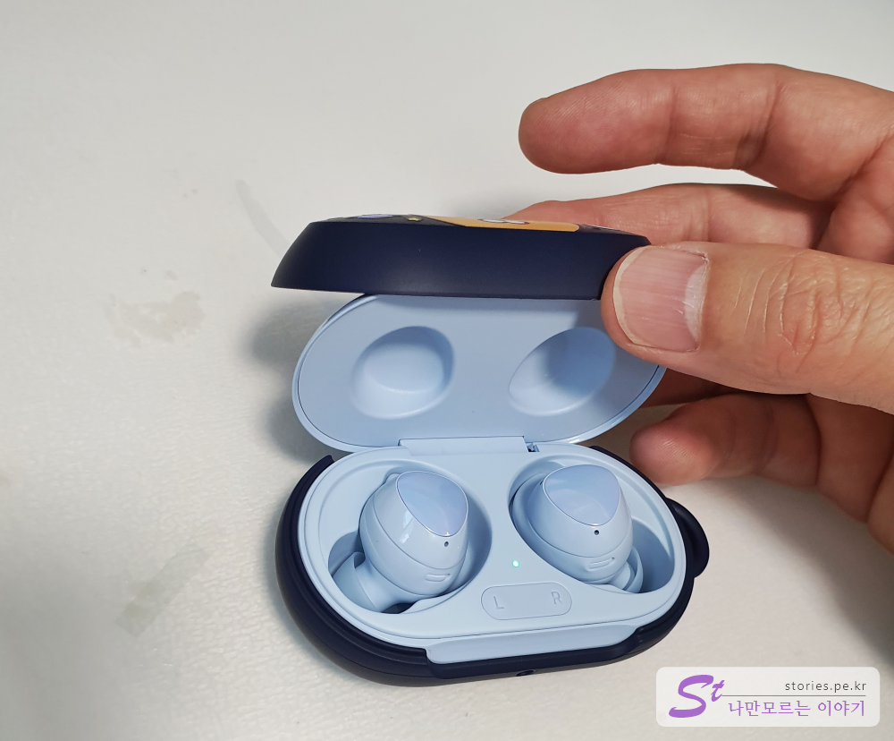
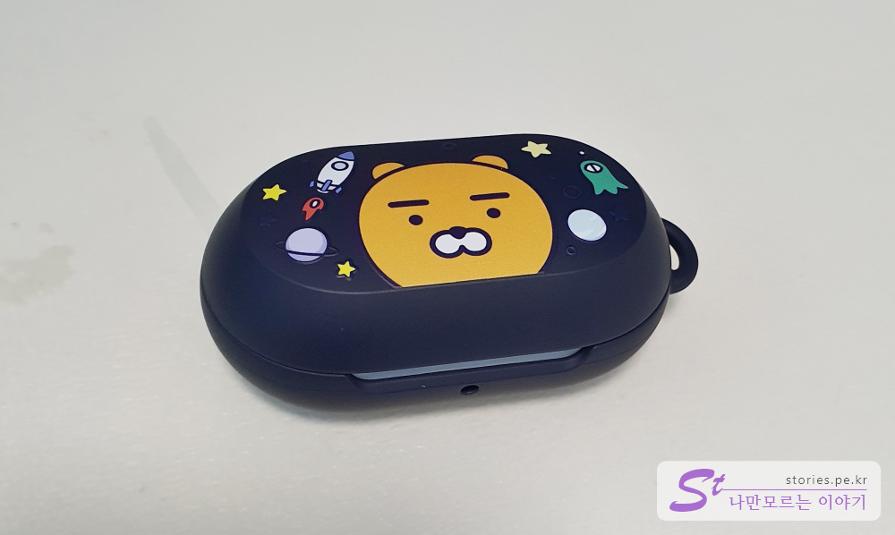
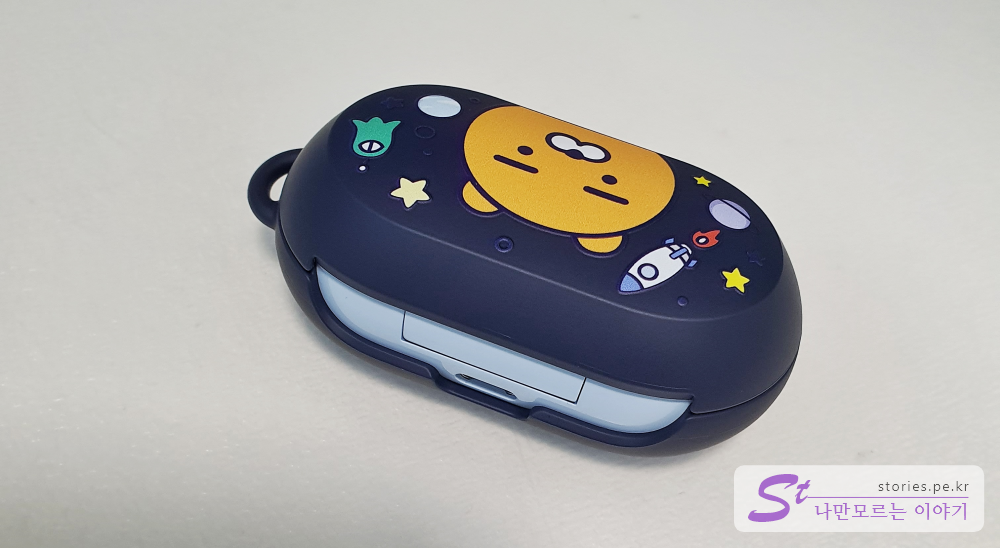

얼마 전에 갤럭시 버즈 플러스를 구매하면서 받은 사은품이 드디어 오늘 도착했습니다.  
정품 카카오프렌즈 버즈 스마트케이스 입니다.   

    
삼성에서 줬으니 정품이겠죠?? 
언박싱을 해보겠습니다.  

## 언박싱   

  
정품인가봐요. 저기 3d 홀로그램 위조 방지 스티커가 붙어있네요 ^^ 
모델명은 `GSBK-RY01`입니다. 네이버에 검색해도 않나오네요 쩝~~
재질은 PC재질입니다.  

  
구성품은 단촐합니다. 본체 케이스와 사용설명서만 있습니다.  

  
Kakao IX에서 판매를 하네요. 뭔회사일까요?   
홈페이지에는 아래와 같은 회사라고 써있기는 한데 당췌 뭐한다는 회사인지 감을 못잡겠네요.   

> KAKAO IX는 캐릭터, 외식, 도서 등의 콘텐츠를 기반으로 라이프 스타일을 제안하고,
일상의 영역에서 다른 생각과 관점으로 혁신적인 경험을 만들어내는 회사입니다.

   

케이스는 본체와 뚜껑으로 구성되어 있습니다. 본체에는 구멍이 하나 뚤려있는데 이 구멍은 손가락으로 갤럭시 버즈와 케이스를 쉽게 분리할 수 있도록 하는 장치입니다.   

   

**갤럭시 버즈+**를 **케이스**에 넣어 봤습니다. 딱~ 잘 물립니다. 생각보다 단단하게 체결이 됩니다. 이쁘네요.   

   
뚜껑입니다. 뚜껑에는 **For Galaxy Buds**라고 써있네요. **Buds+**이 아니고 **Buds**라고..   
그리고 2군데의 양면 테이프가 붙어 있습니다. 뚜껑은 이 양면 테이프로 고정을 합니다.   

   
뚜껑은  그림과 같이 앞쪽을 먼저 맞추고 눌러서 양면테이프로 고정되게 하면 딱 맞게 붙습니다.  

   
딱 맞게 들어갔습니다. 붙히고나니 묵직하고 뿌듯하네요 ^^

   
뒷쪽에는 이렇게 되어 있네요. USB단자는 덮히지 않네요. 

## 숨어있는 선물  
버즈 케이스의 숨어있는 선물이 하나 있습니다.  
바로 테마입니다. 케이스와 스마트폰을 NFC로 둘이 등을 붙혀 놓으면 
바로 `Samsung Galaxy Friends`가 실행이 됩니다. 

    
업데이트를 먼저 하네요. 참고로 제 스마트폰은 **갤럭시 S10**입니다.  

  
KAKAO Friends의 **SPACE ADVENTURE** 테마인가 봅니다.   

   
개인정보사용에 동의 하라는 화면이 나옵니다. 설치하려면 동의 해야 겠지요..

   
테마가 설치 진행됩니다. 뭐.. 다운로드 되는것이겠지요.. 

  
이렇게 테마가 반영이 되었습니다. 이쁘네요.

## 내가 생각하는 장점  
케이스의 장점은 PC제질이라 오리지널 뚜껑이 기스가 나지 않게 잘 보호해 줍니다. 
정품이라 마감이 좋고.. 이뻐요.
제가 좋아하는 카카오프렌즈 캐릭터를 가지고 있습니다.   
카카오프렌즈 테마를 무료로 줍니다.  

## 내가 생각하는 단점   
거의 갤럭시 버즈의 케이스가 그렇듯 뚜껑을 양면테이프로 붙히네요.. 이건 어쩔수 없는건가요? 이러면 케이스를 수시로 바꾸기가 어려울텐데요.  
케이스를 장착하면 크기가 커집니다. 묵직한게 장점일 수도 있지만 단점이 되기도 하겠네요. 

