드디어 저도 문명의 혜택을 받게 되었습니다. 저렴한 가격으로 차량용 고속무선충전거치대를 구입하게 되었습니다. 3만원대의 가격에 이정도 브랜드에 성능을 갖춘 제품은 흔치 않을 것 같습니다.  

## 언박싱  

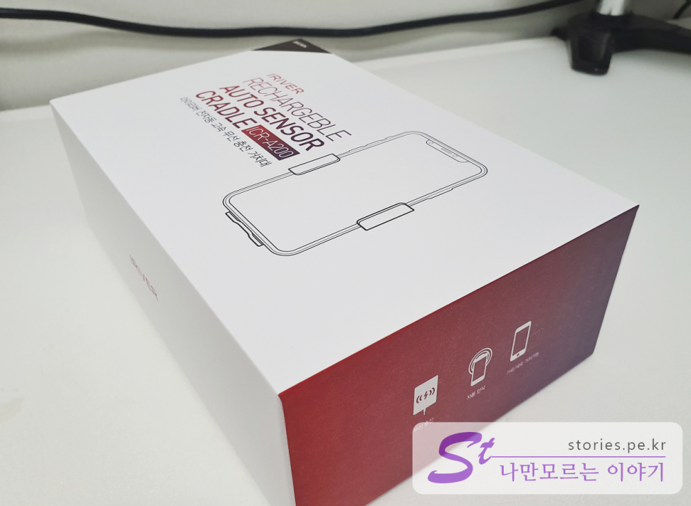   
포장은 정갈하면서도 깔끔합니다. 아이리버라는 브렌드가 제품에 믿음을 더해 주는 것 같습니다. 아이리버는 삼성전자의 벤처기업으로 출발해서 한 때 MP3로 시대를 풍미했다가 하락세로 접어들면서 지금은 SK텔레콤에 인수되어 2019년에 `드림어스컴퍼니`로 사명을 변경하여 운영되어지고 있습니다. 그래도 아이리버라는 브랜드가 유명한지라 버리지 않고 사용하고 있는것 같습니다.   

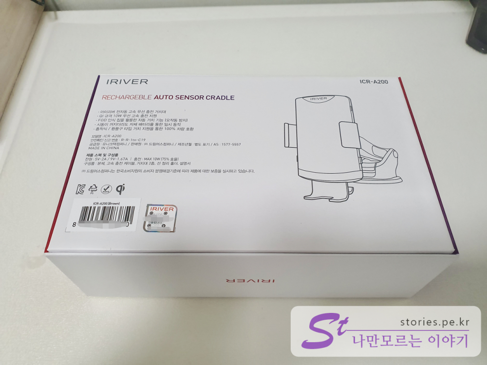    
제품의 뒷면은 제품의 특징적인 기능이 나열되어 있습니다. 

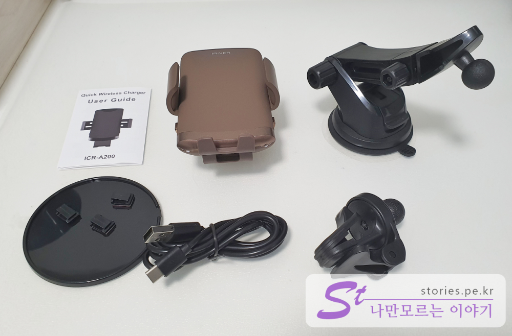   
제품의 구성품은 **본체**, **데쉬보드 거치대**, **송풍구 거치대**, **USB케이블**, **흡착판**, **선정리 태그**, **설명서**로 되어 있습니다.  

### 송풍구 거치대  
 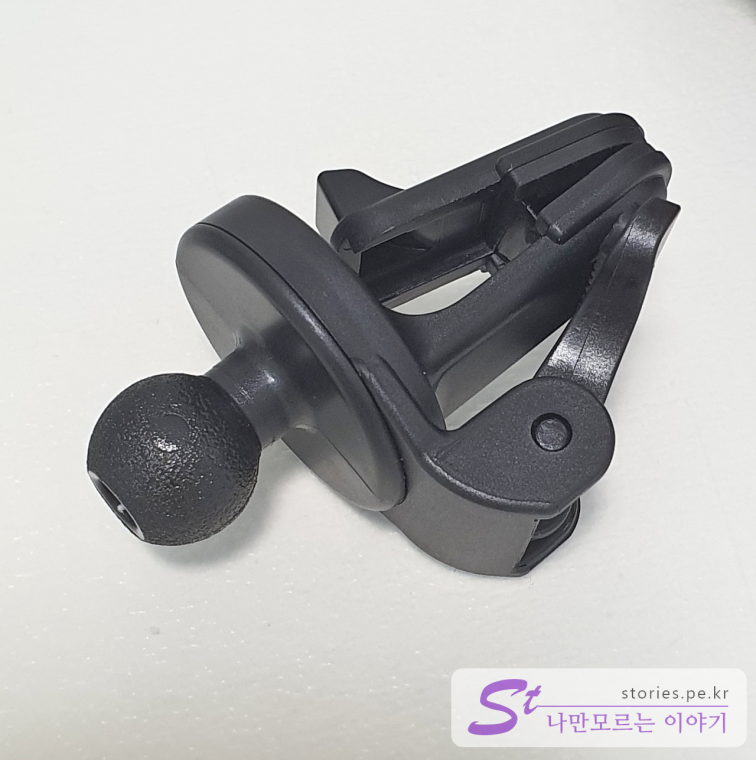   
 송풍구 거치대입니다. 상당히 단단한 형태로 되어 있습니다. 물리는 것도 세게 물립니다.  

### 데쉬보드 거치대  
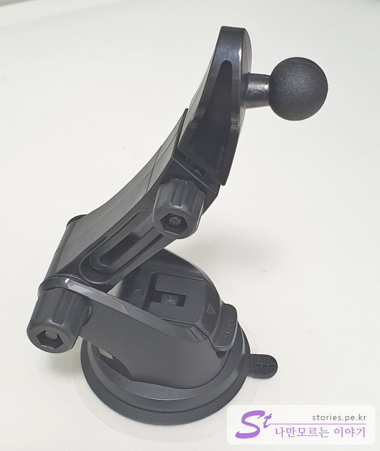   
데쉬보드 거치대입니다. 데쉬보드 거치대도 상당히 단단히 구성되어있습니다. 저는 이것을 사용하지 않았지만 딱 봐도 마감이 훌륭합니다. 탁상용 거치대로 사용해도 좋을 것 같습니다.   

### USB케이블  
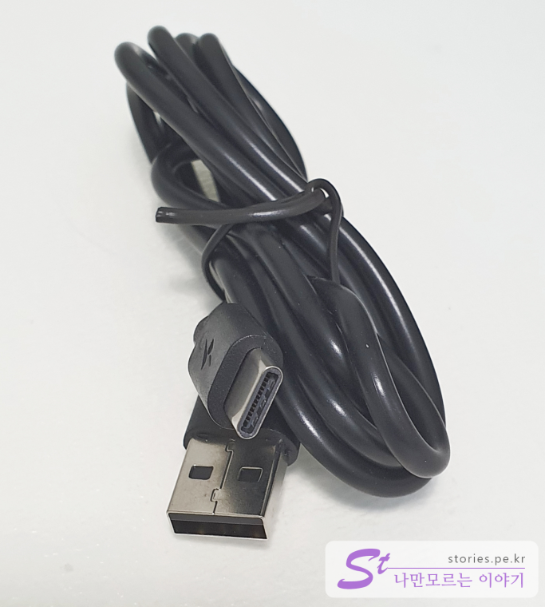   
고속충전이 지원되는 C-Type USB케이블을 하나 넣어 줍니다. 길이는 정확히 재보지는 않았지만 대략 1M는 되지 않을까 합니다.   

### 흡착판과 선정리 태그 
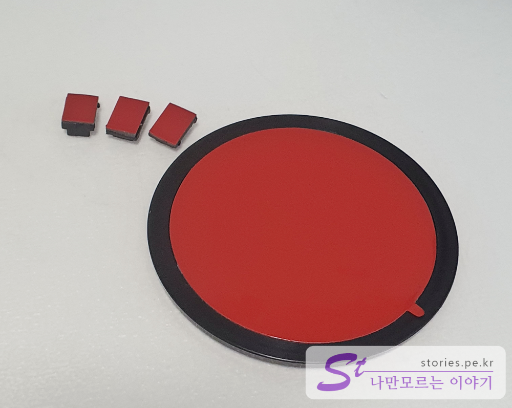  
설명서에는 이 부품이 뭔지에 대해서 설명되어 있지 않습니다. 다만 느낌적인 느낌으로 딱!! 봤을 때 데쉬보드에 사용되는 부품인것 같습니다.  양면 테이프로 흡착판을 데쉬보드에 붙히고 데쉬보드 거치대를 여기에 붙혀서 고정시키는것 같습니다. 
선정리 태그는 USB케이블을 본체와 충전기로 연결하고 선을 정리할 때 사용하는 부품입니다.  

### 본체  앞면  
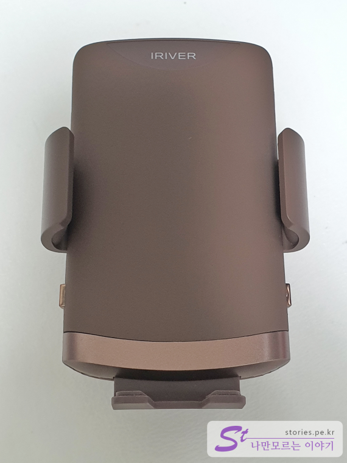  
본체의 앞면입니다. 검정색과 브라운색이 있는데 저는 브라운을 선택했습니다. 역시 마감은 좋군요. 아이리버가 이름값은 합니다.   

### 본체 왼쪽 옆면  
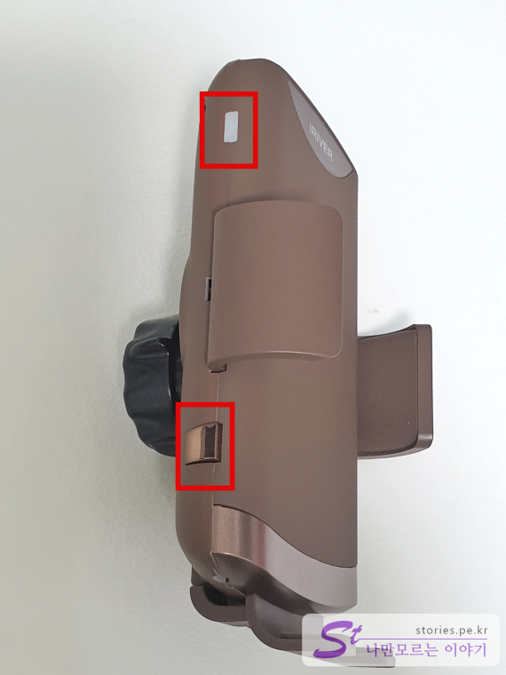   
본체의 왼쪽 옆면입니다. 상단에 있는 것은 LED 표시등 입니다.   

- 흰색 : 대기상태   
- 블루 : 정상 충전중  
- 레드 : 비정상 충전 표시  

하단에 있는 것은 스마트폰 잠금 해제 버튼입니다. 이 버튼을 누르면 물려있던 스마트폰을 놓게 됩니다.  

### 본체 오른쪽 옆면   
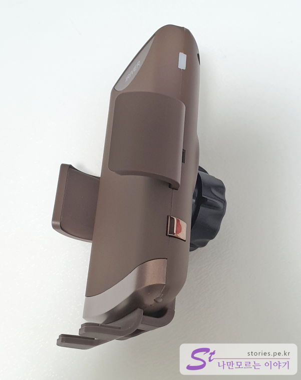  
오른쪽의 형태와 기능은 왼쪽과 똑같습니다.   

### 본체 아래 면  
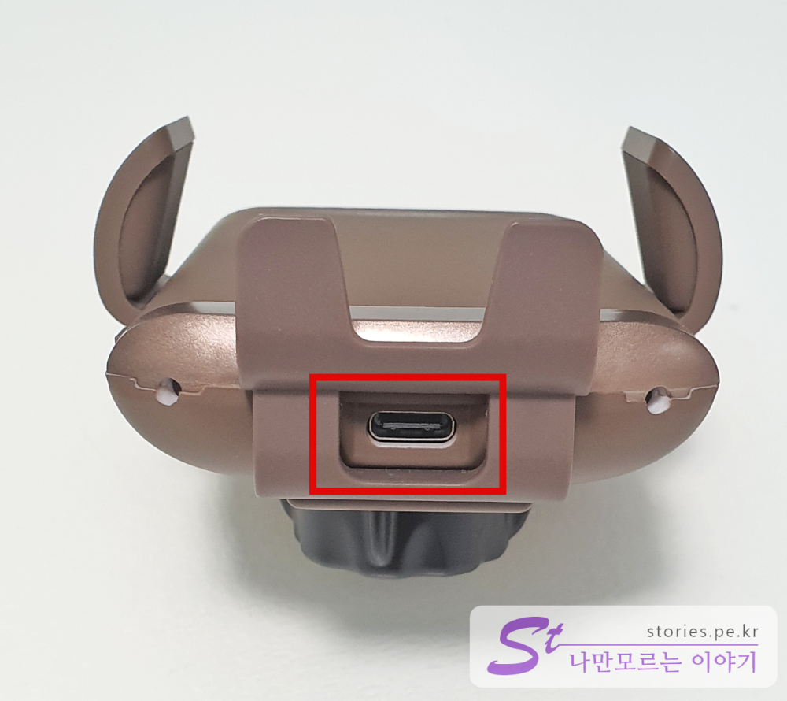  
본체 아래 면은 USB를 꽃는 단자가 있습니다. 충전단자를 여기에 연결해야 충전과 작동이 됩니다.     

### 본체 뒷면   
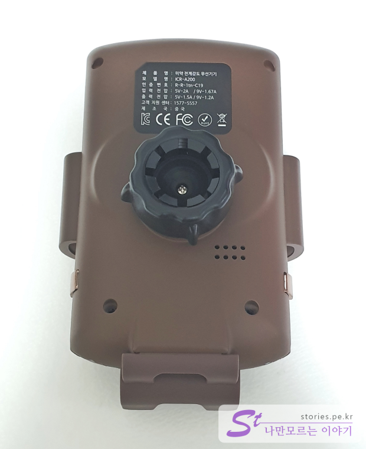   
본체 뒤면에는 거치대와 연결할 수 있는 연결장치가 있습니다.  

### 본체와 거치대와 연결   
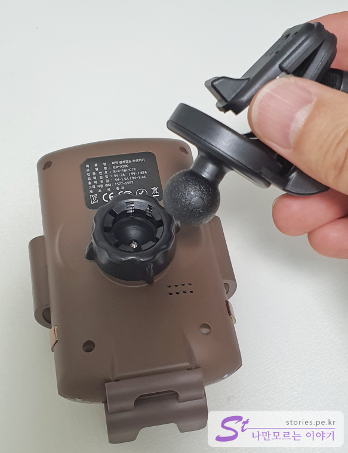  
본체와 거치대는 이렇게 연결을 합니다. 연결할 때 구멍난 병뚜껑처럼 생긴 나사를 돌려서 잠궈 조이는 식으로 되어 있습니다. 하지만 풀 때 놓치지 않게 조심해야 합니다. 저는 풀다가 놓쳐서 차 안으로 떨어져 잃어버렸습니다. 그래서 다시 신청해서 받아 설치 했습니다.   

### 차량에 장착한 모습   
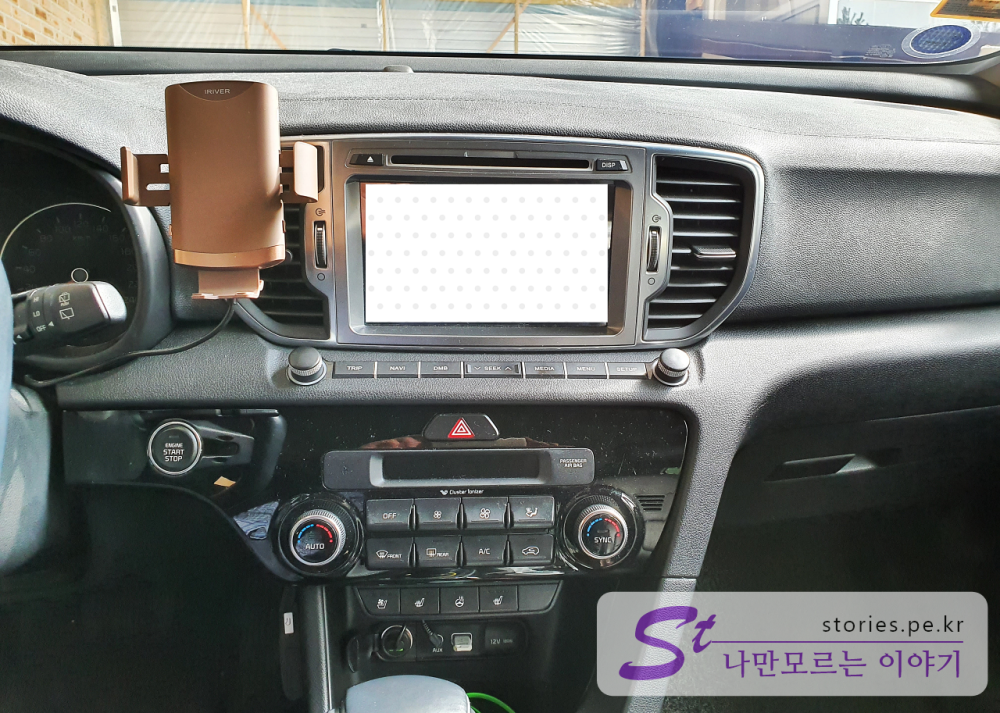    
차량에 장착을 하면 이런 형태가 됩니다. 송풍구에 제법 단단히 고정이 됩니다.   

### 송풍구에 장착한 모습   
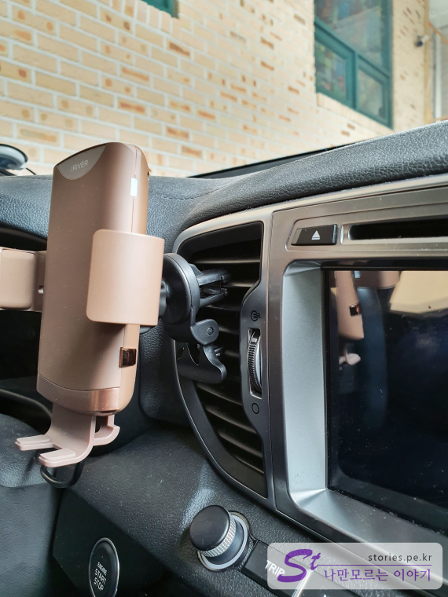   
송풍구에는 이렇게 물립니다. 살짝 물리는 것 같지만 하중이 밑으로 내려지기때문에 충분히 안정적입니다.  

### 송풍구에 물린 모습  
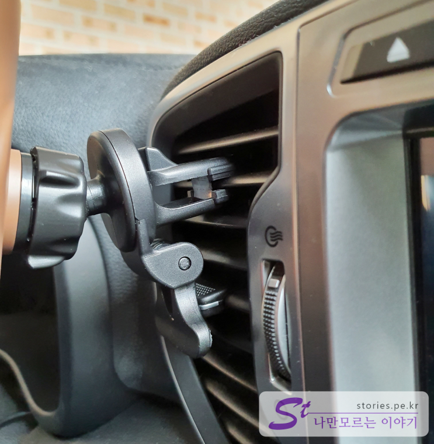   
좀 더 자세히 확대해 봤습니다. 아래 받침이 받쳐주고 있습니다.  

### USB전원선 뺀 위치  
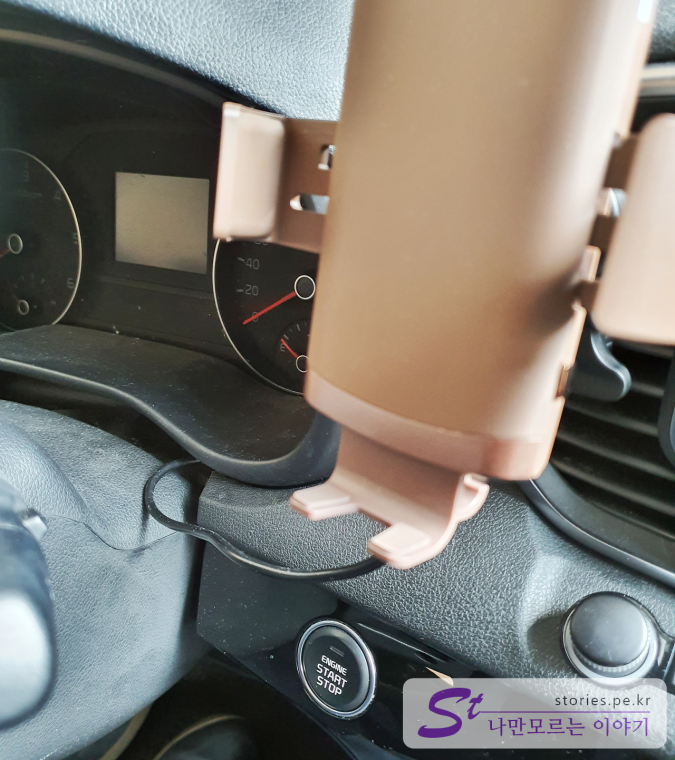   
저는 차량의 데쉬보드를 분리해서 배선을 차 안쪽으로 넣었습니다. 이 과정에서 잠금 나사를 잃어버렸었네요. ㅠㅠ;  

### USB전원선 뺀 위치   
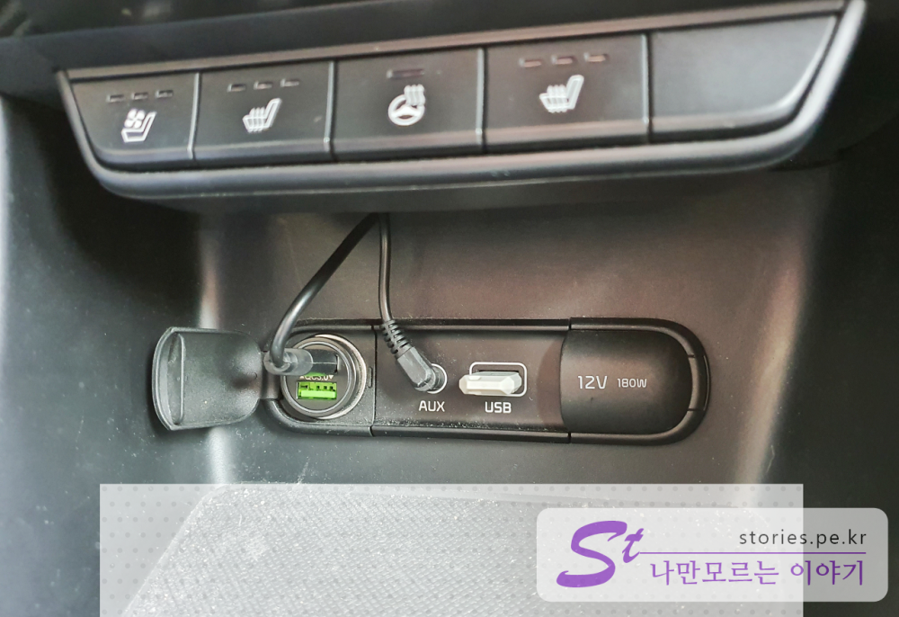   
차량 안쪽으로 뺀 USB전원선은 데쉬보드 하단의 이쪽 위치로 뺄 수 있습니다. 차는 더럽지만 ^^; 배선은 깔끔히 빠졌지요 ^^;  

> [같이 사용하기 좋은 또하나의 가성비 짱!! 차량용 충전기 Fokins QC3 바로가기](https://stories.pe.kr/374)

## 내가 생각하는 장점  
장점은 일단 아이리버라는 브랜드 입니다. 유명 메이커는 기본적으로 이름값은 하는것 같아요.
역시나 마감도 깔끔하고 고급스럽습니다. 고속충전도 됩니다. 
내장 베터리가 있어서 전원이 꺼져도 어느정도 작동이 됩니다. 전원이 꺼져도 자동으로 크래들이 벌여지지 않아 실수로 떨어질 일이 없습니다.  

## 내가 생각하는 단점  
메뉴얼이 아주 명확하게 표현되어 있지 않은것 같아요 흡착판에 대한 설명도 없고...
그 외에는 아직 단점을 못찾았네요.

## 가격 및 구매처   
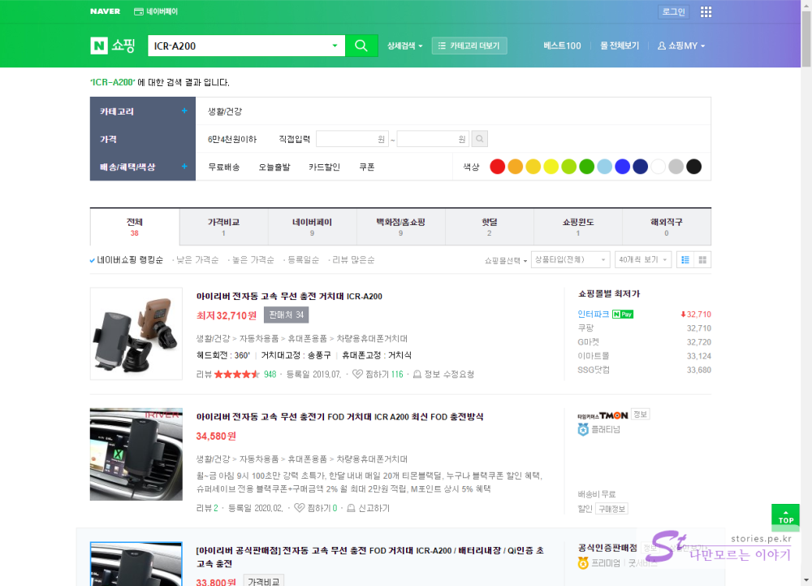  
현재 네이버 쇼핑가로 `32,000원` 하네요.  

## 설명서   
혹시 참고될까 싶어 메뉴얼 올려봅니다. 

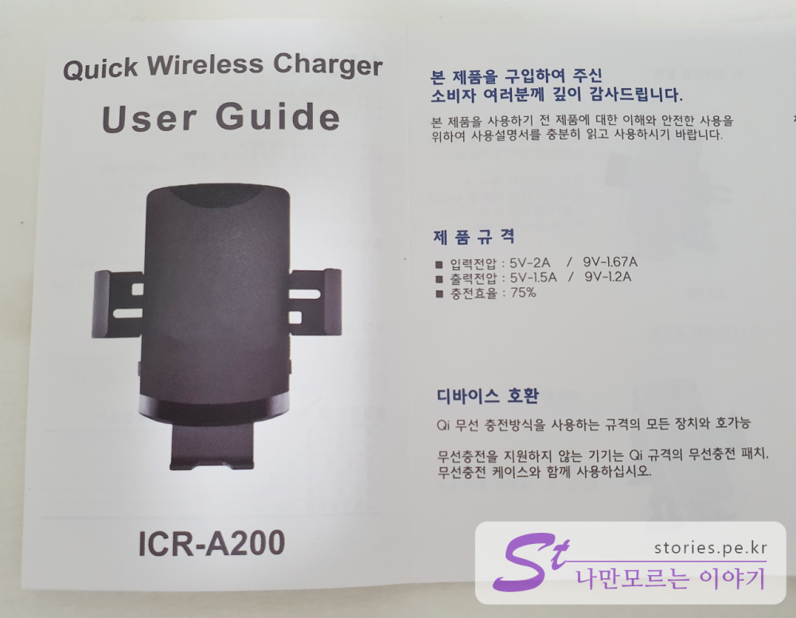  

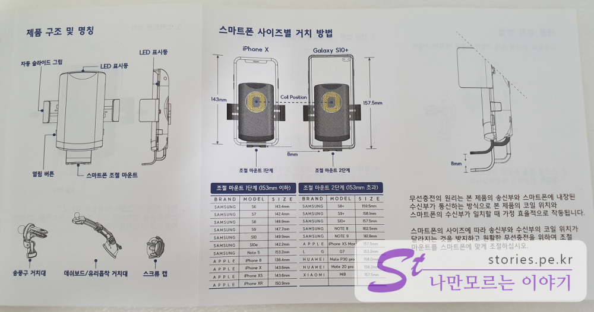  

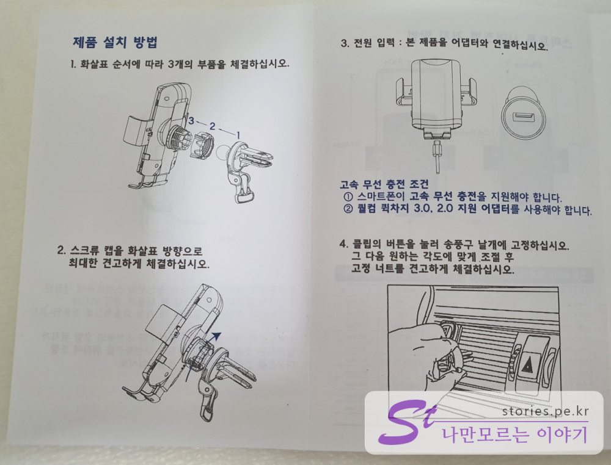  

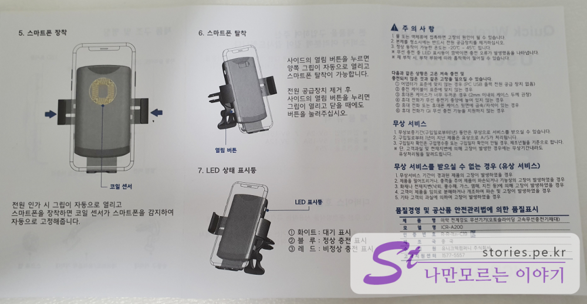  

