원래 제 노트북의 SSD는 128GB였습니다. 처음 구입할때 이정도면 충분할거라 생각했지만 많이 모자란 용량이였습니다. 그래서 500GB짜리 SSD를 찾기 시작했습니다. 물론 처음에는 삼성제품을 구입하려고 알아봤으나 가격이 상당히 비싸서 다른 대안 제품을 찾아보다가 웨스턴디지털(Western Digital)에서 생산한 NVMe SSD M.2 2280 500GB **SN550**를 찾게 되어 구입을 했습니다.   

## 언박싱  

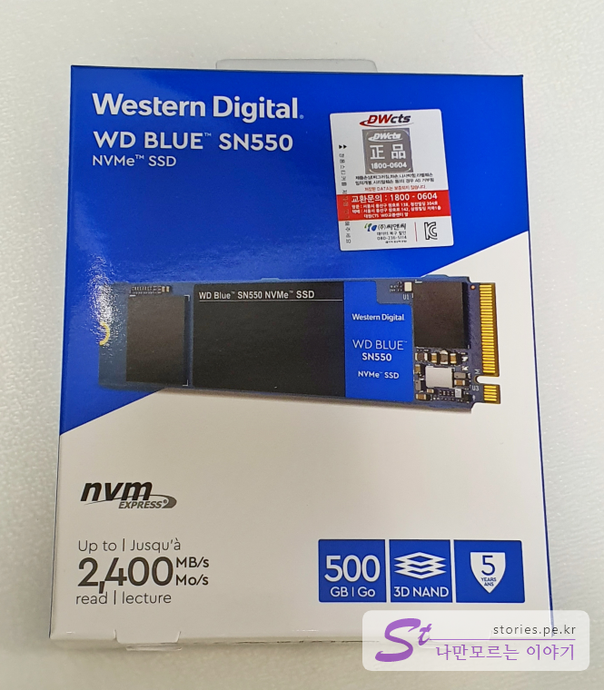  
박스는 WD 색상인 블루의 패키지로 싸여 있고 DWcts에서 정식 수입 해오는 정품제품입니다. 

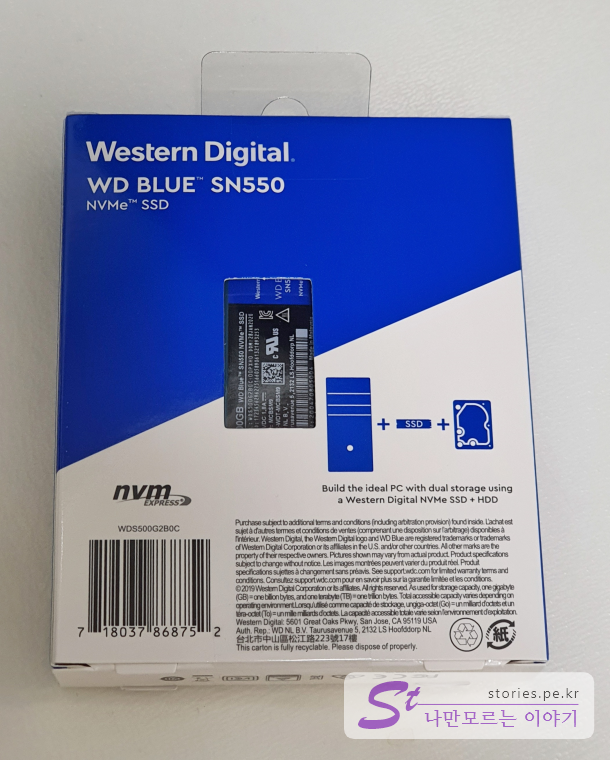  
뒷면에 살짝 제품을 보여주고 있네요.  

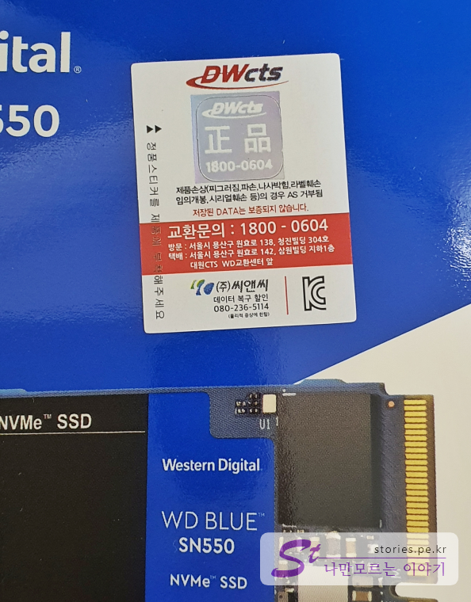  
3D 홀로그램 정품 씰입니다. DWcts에서 수입해서 판매를 하고 있는것 같습니다. 해당 제품에 이상이 생기면 DWcts(1800-0604)로 연락해서 처리하면 됩니다. 이 회사가 5년동안 망하지 않고 버텨준다면 좋겠네요. 
이 제품의 보증기간은 5년입니다. 제가 2020년 3월에 구입했으니 2025년까지는 보증이 되겠네요 ^^

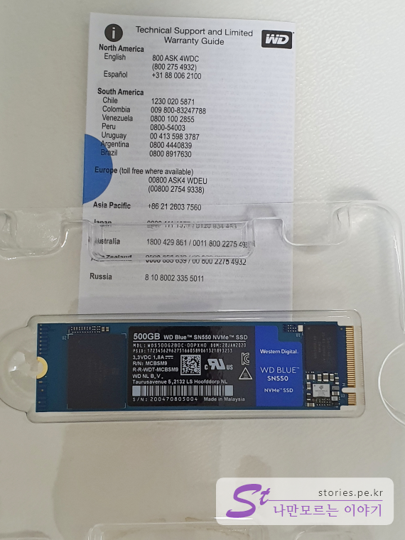  
구성품은 단촐합니다. 본체와 메뉴얼만 있습니다. 

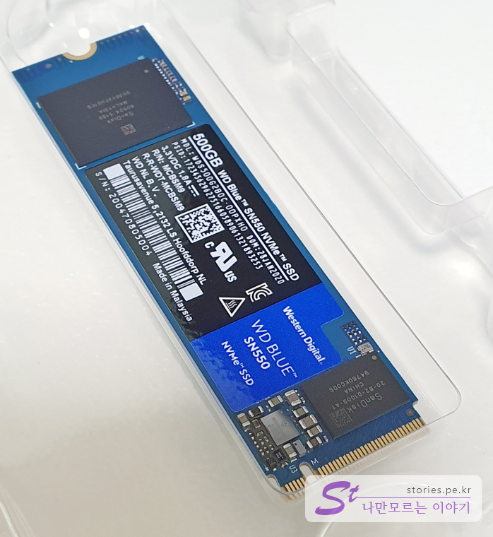   
제품본체입니다. 모든 설명이 여기에 써져있습니다. 꼭 박스에 있는 정품 씰 스티커를 떼어서 이 본체에 붙혀놓는것이 좋습니다. 저는 붙히기 전에 사진을 찍어서 붙어있지않네요.  

## 노트북에 설치하기(LENOVO Legion Y520)  

설치순서는 아래와 같습니다. 

1. Microsoft의 Windows10 설치 USB를 만듦
2. 노트북에 SSD 제품 설치
3. Windows10 설치
4. SSD 설치 확인

### Microsoft의 Windows10 설치 USB를 만듦  

> [Windows10 설치파일 다운로드 바로가기](https://www.microsoft.com/ko-kr/software-download/windows10)  

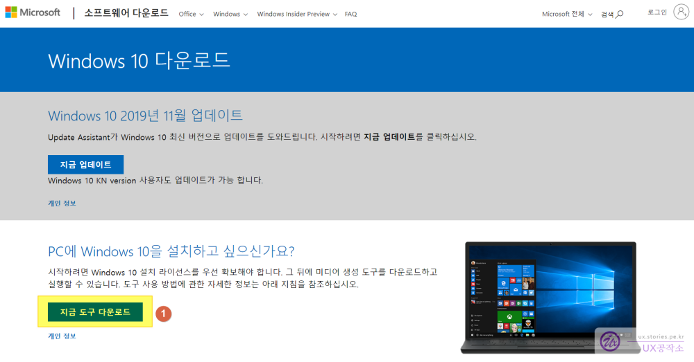    
아래쪽에 있는 `지금 도구 다운로드` 버튼을 클릭합니다. 그러면 설치 USB를 제작할 수 있는 프로그램이 다운로드 됩니다. 

설치 USB만드는 방법은 아래의 포스팅을 참고하세요.

> [Windows 10 설치 USB를 만드는 방법 바로가기](https://ux.stories.pe.kr/179)  

### 노트북에 SSD 설치  

제 노트북은 **LENOVO Legion Y520**입니다. 

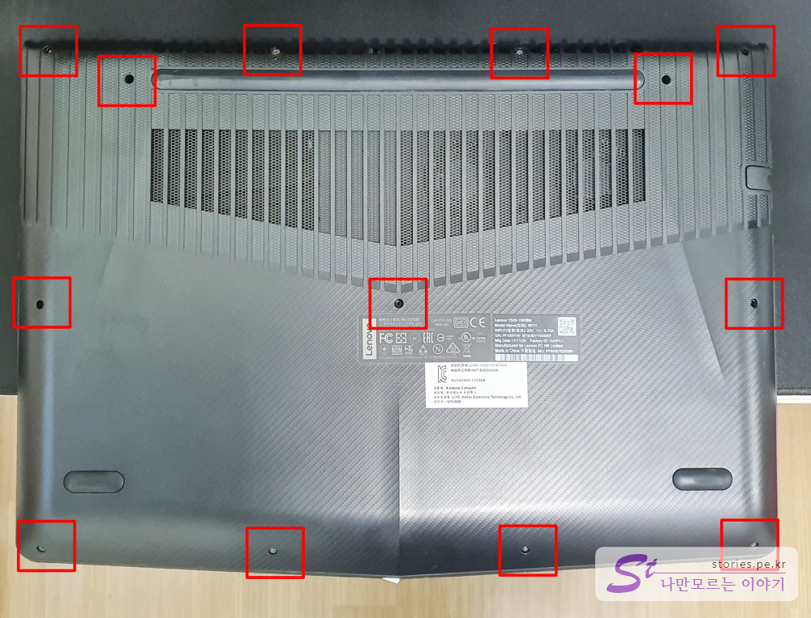   
이 노트북은 유난히 나사가 많습니다. 13개의 나사를 풀러야 합니다.  

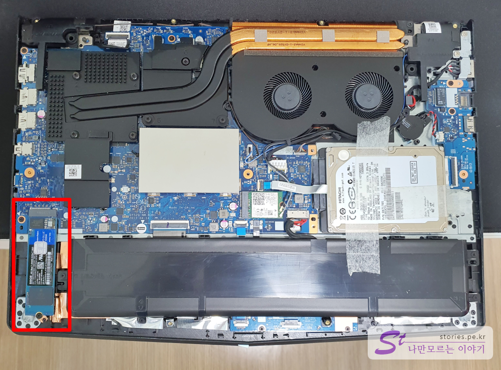   
노트북을 분리하면 왼쪽 아래부분에 SSD설치 위치가 있습니다. 
설치는 어렵지 않습니다. 단자의 위치와 방향을 맞추어서 제품을 조심스럽게 쑥~ 끼우면 자연스럽게 들어갑니다. 그후 반대쪽 나사를 조이면 됩니다. 

### Windows10 설치     
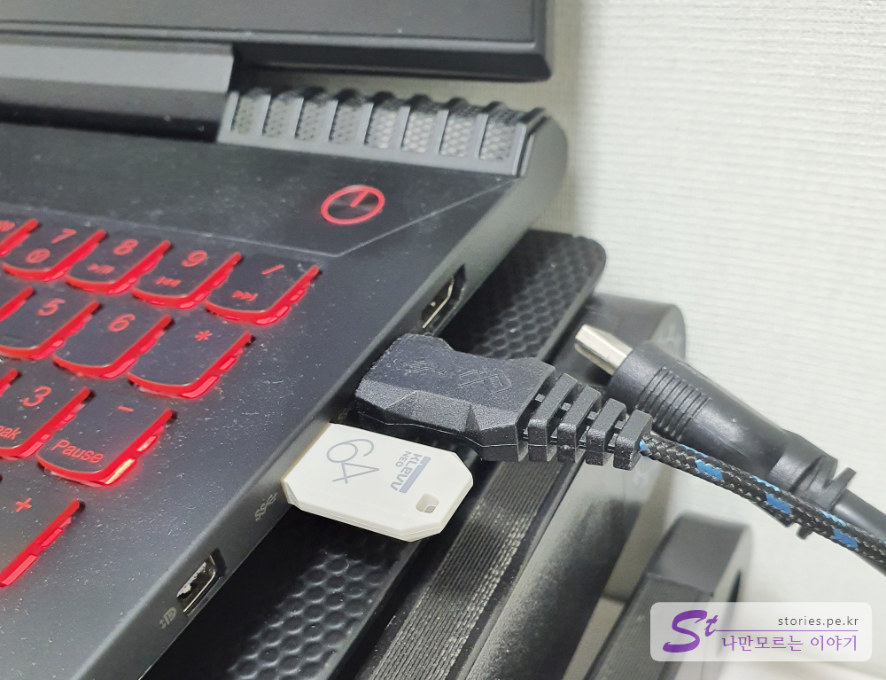    
미리 만들어 놓은 Microsoft의 Windows10 설치 USB를 단자에 끼우고 재부팅을 해 줍니다.  

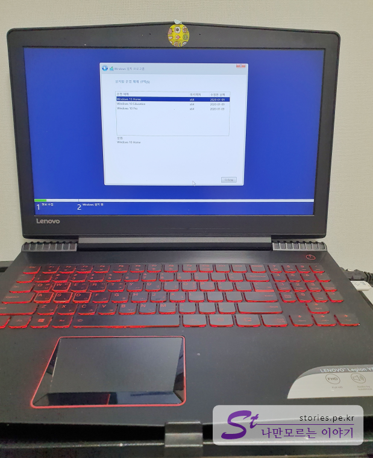   
그러면 설치화면이 나오고 설치를 진행합니다.  

### 설치 확인  

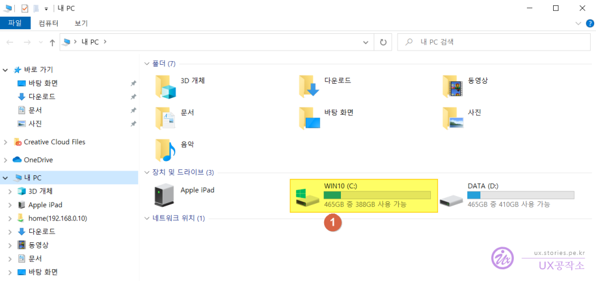  
이제 정상적으로설치가 되었는지 확인합니다. 
탐색기에서 **내PC**를 선택하면 보이는 드라이브의 전체 용량을 확인해 보면 128GB에서 **465GB**로 늘어난 것을 볼 수 있습니다. 
500GB를 샀는데 465GB면 내 35GB는 어디간거야? 라고 할 수 있지만 원래 그런거라 생각하는 것이 편합니다. 시스템에서 여러가지 용도로 강제 파티션을 분리하여 사용한다고 보시면 됩니다. 

## 내가 생각하는 장점  
최대 강점은 WD라는 유명 브랜드로 삼성제품보다 상대적으로 저렴하다는 점입니다. 가성비가 좋다는 것이겠지요. 
워런티가 5년이라는 다소 긴 기간이라 안심하고 사용할 수 있습니다. 

## 내가 생각하는 단점  
아무래도 수입제품이다 보니 수입처가 폐업을 할 경우 보증을 어디서 받아야 하나 라는 작은 걱정이 있습니다. 

## 가격 및 구매처  
저는  [네이버쇼핑](https://search.shopping.naver.com/detail/detail.nhn?nv_mid=21533701550&cat_id=50001617&frm=NVSHATC&query=SN550&pkey=20051916&section=price&NaPm=ct%3Dk7flfwnc%7Cci%3D524b8be3f8709c8ec99a17d069971adae82d9f0c%7Ctr%3Dslsl%7Csn%3D95694%7Chk%3D8e71e7143d3ac9b6231216d0b33e5a02d7e2c73a) 에서 구매했습니다.  

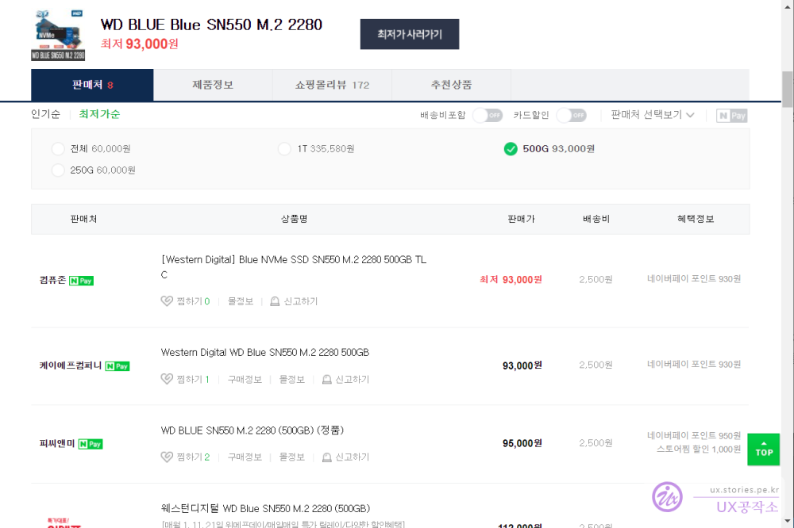  

1주일도 안지났는데 가격이 계속 올라가고 있네요. 저는 배송비 포함 9만원에 구매를 했는데 지금 보니 대략 1~2만원정도 상승을 한것 같습니다. 

역시 반도체는 가격이 고정되어 있지 않은것 같네요.

