남자들이 보통 공구에 욕심이 많지요. 저도 그런편입니다. 이번에 노트북의 SSD를 교체하기 위해 **샤오미 미지아 정밀 드라이버**를 구매했습니다. 그쪽 계통에서는 이 드라이버가 고급제품에 속하기 때문에 가격이 비싸더라도 일반 드라이버보다 보단 이 제품을 선택하게 되었습니다.   

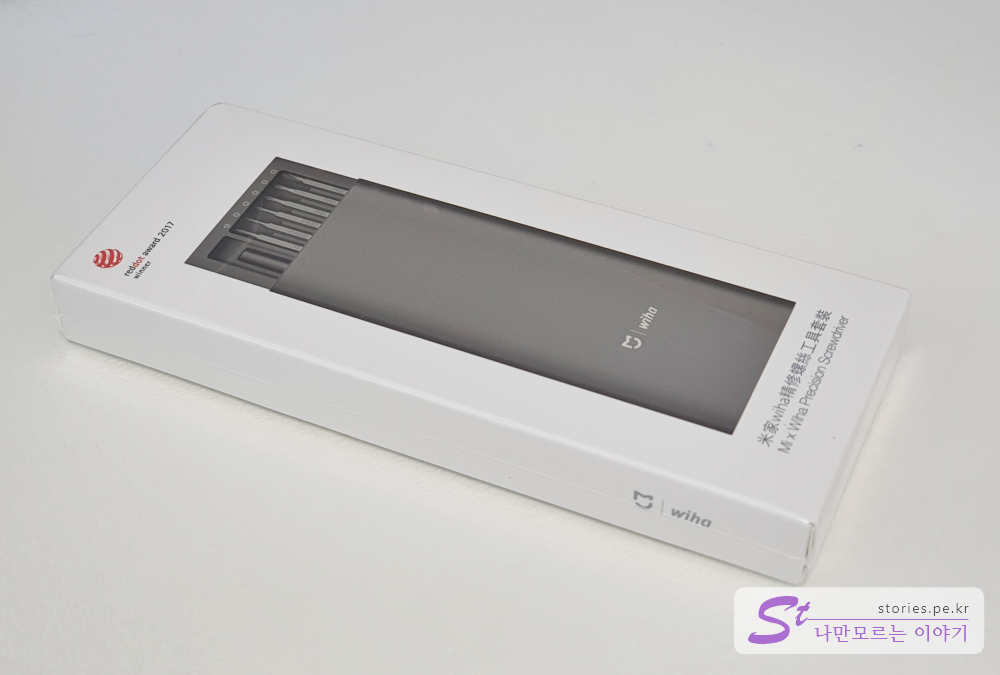   

## 언박싱  
이제 한번 뜯어보겠습니다.  

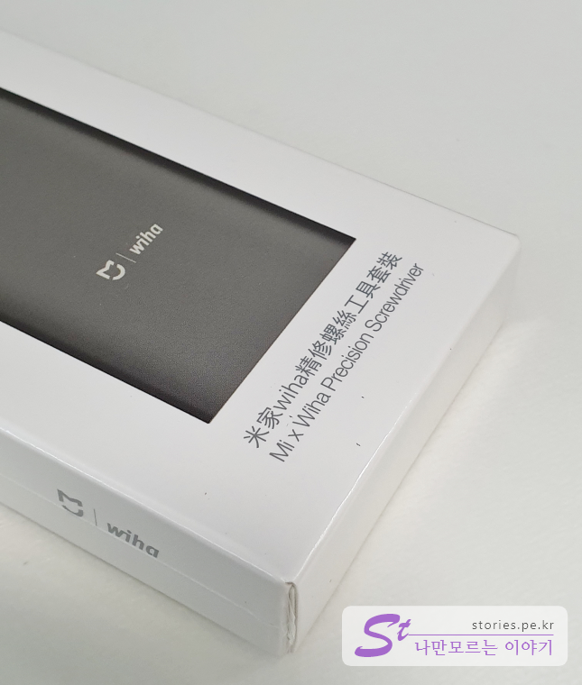   
샤오미에서 **Wiha**라는 회사와 합작으로 제작한 드라이버입니다. Wiha는 독일회사로 오래 전부터 드라이버같은 도구를 생산하던 유명 업체라고 합니다. 다시말해 품질은 기본 이상은 한다는 것이겠지요. 

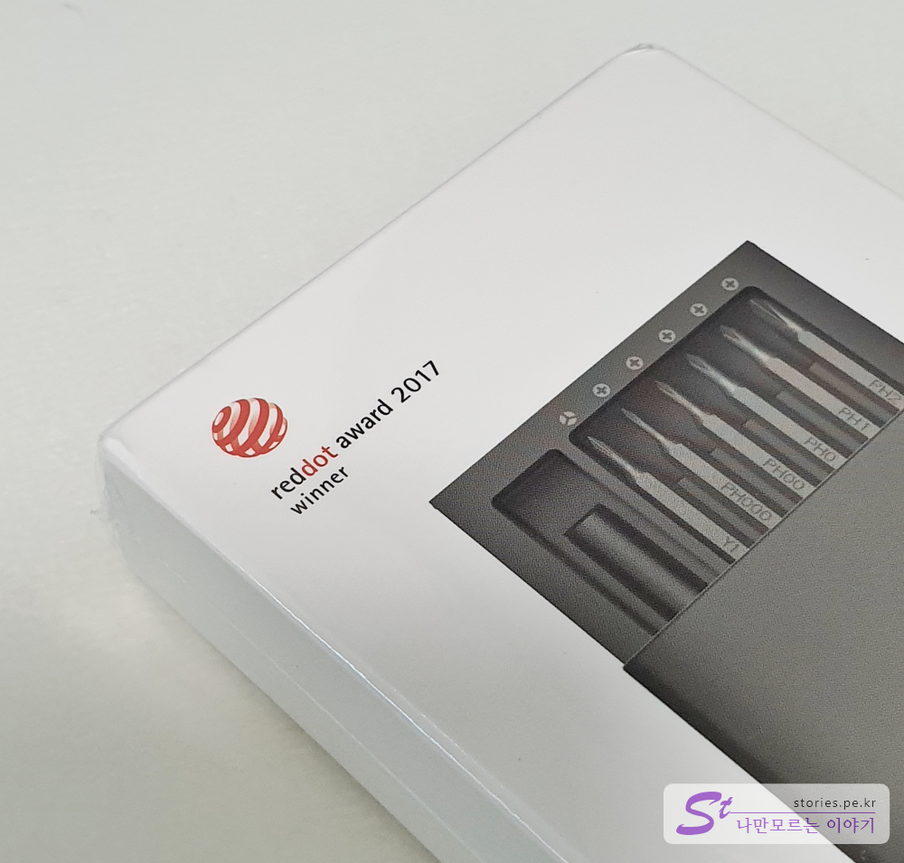   
2017년에 **레드닷 어워드를 수상**한 경력이 있네요. 레드닷은 디자인 부분에서 상당히 공신력있는 상입니다. 그만큼 디자인과 편의성이 입증되었다고 보시면 됩니다.   

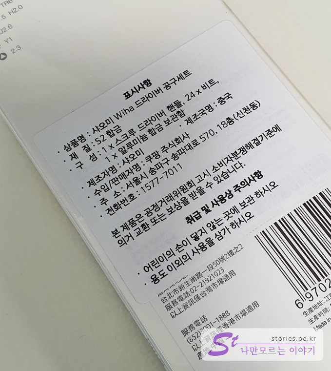   
중국산이라 코로나19 때문에 배송이 늦어질 줄 알았는데, 쿠팡에서 수입을 해 놨던 물건이 있었나 봅니다. 주문하고 하루만에 바로 배송 받았습니다.   
정식 명칭이 **샤오미 Wiha 드라이버 공구세트** 네요.

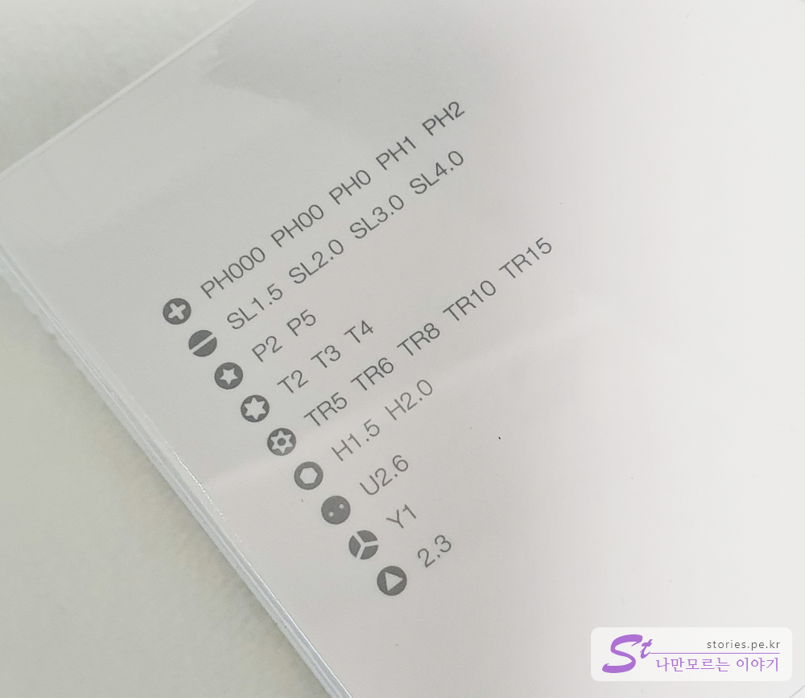    
24개의 피스 종류를 나열했습니다. 일자, 십자만 있는 것이 아니네요.  

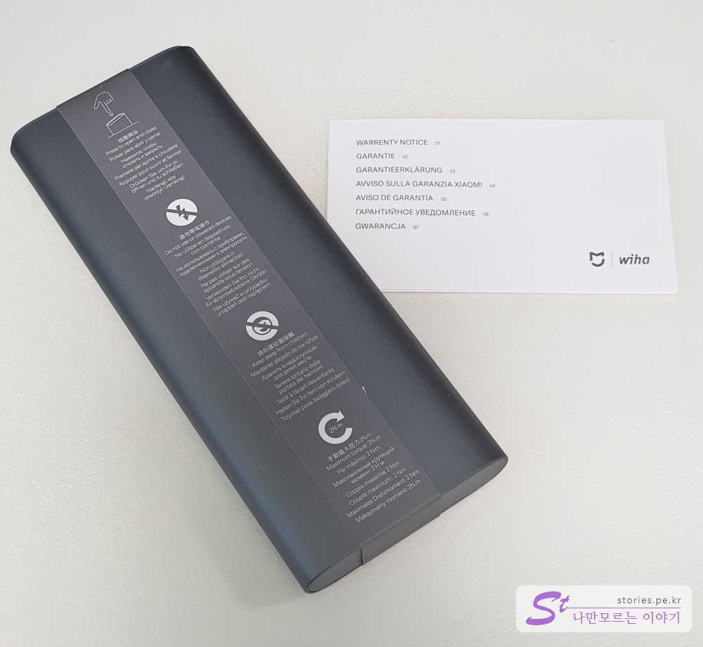   
구성품은 메뉴얼하나 본체하나입니다. 메뉴얼은 외국어로만 되어 있어서 뭔소리가 써있는지 모르겠습니다. 뭐.. 굳이 메뉴얼은 필요없습니다.   

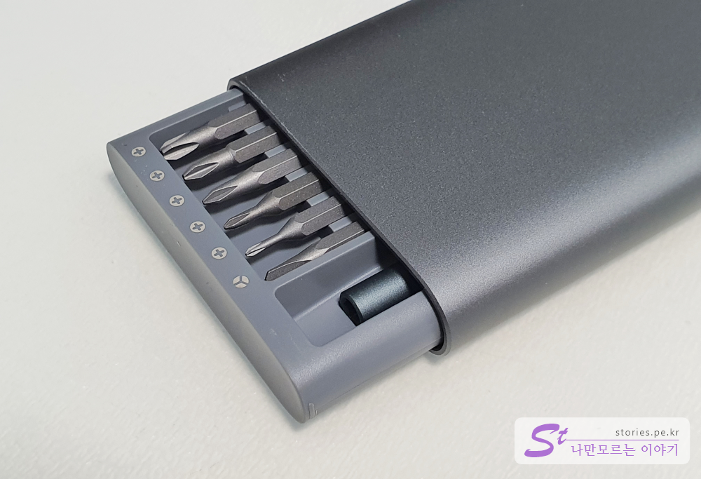   
열기도 굉장히 고급스럽게 열립니다. 한번 누르면 열 수 있게 쑥 튀어나오고 다시한번 누르면 잠기게 되어 있습니다.  

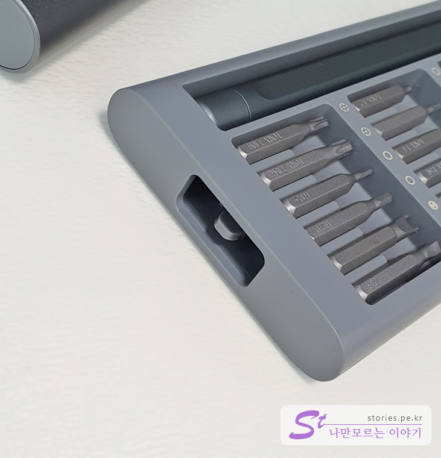  
누르면 잠기게 되는 장치가 붙어 있습니다.  

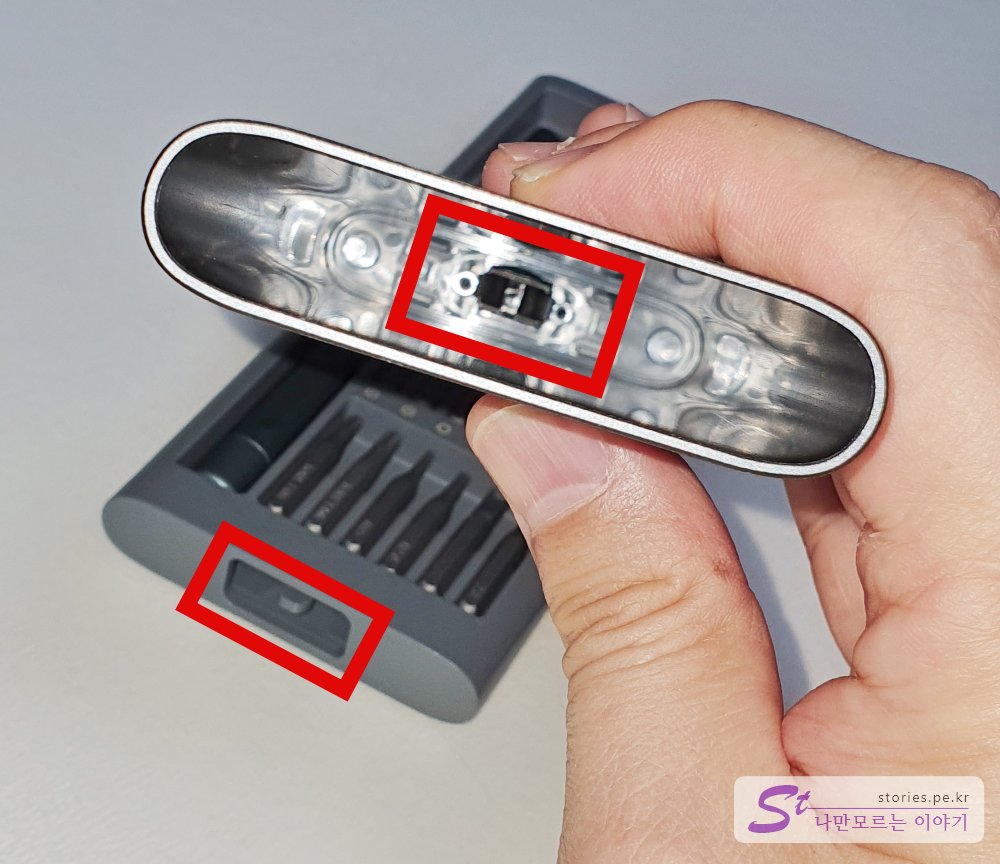  
본체의 잠금장치가 뚜껑 안쪽에 있는 잠금장치와 물리면서 잠기게 됩니다. 

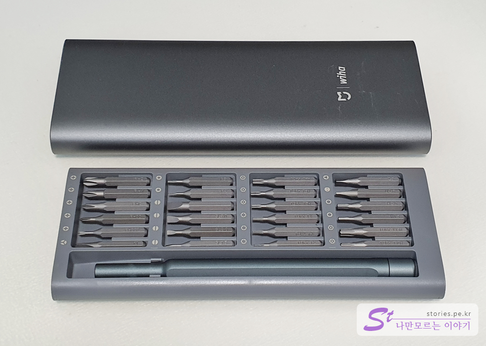    
이렇게 생겼습니다. 상당히 고급스러워보입니다. 실제로 알류미늄으로 구성되어 있어서 고급스럽습니다.  

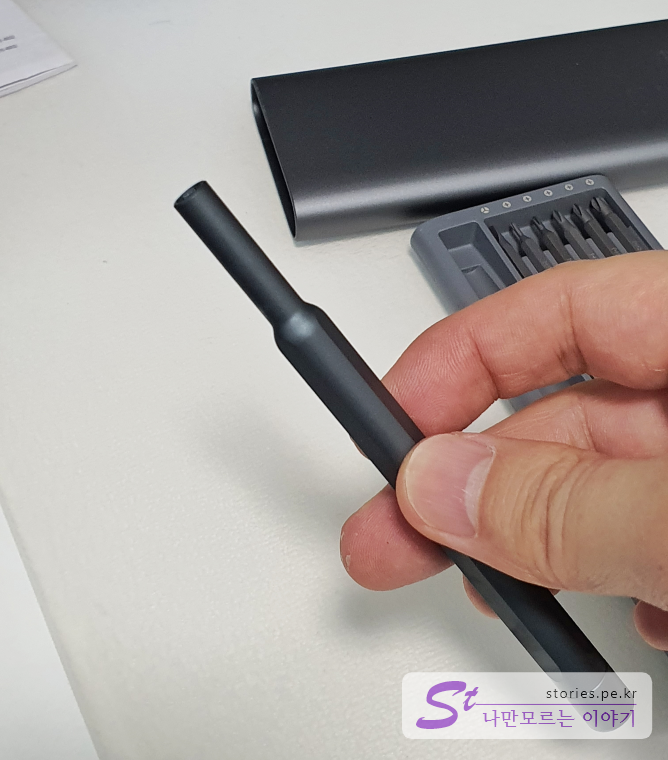   
드라이버 손잡이를 빼 봤습니다. 여기 앞쪽에 드라이버 피스를 교체해 가며 장착하여 사용하면 됩니다.   

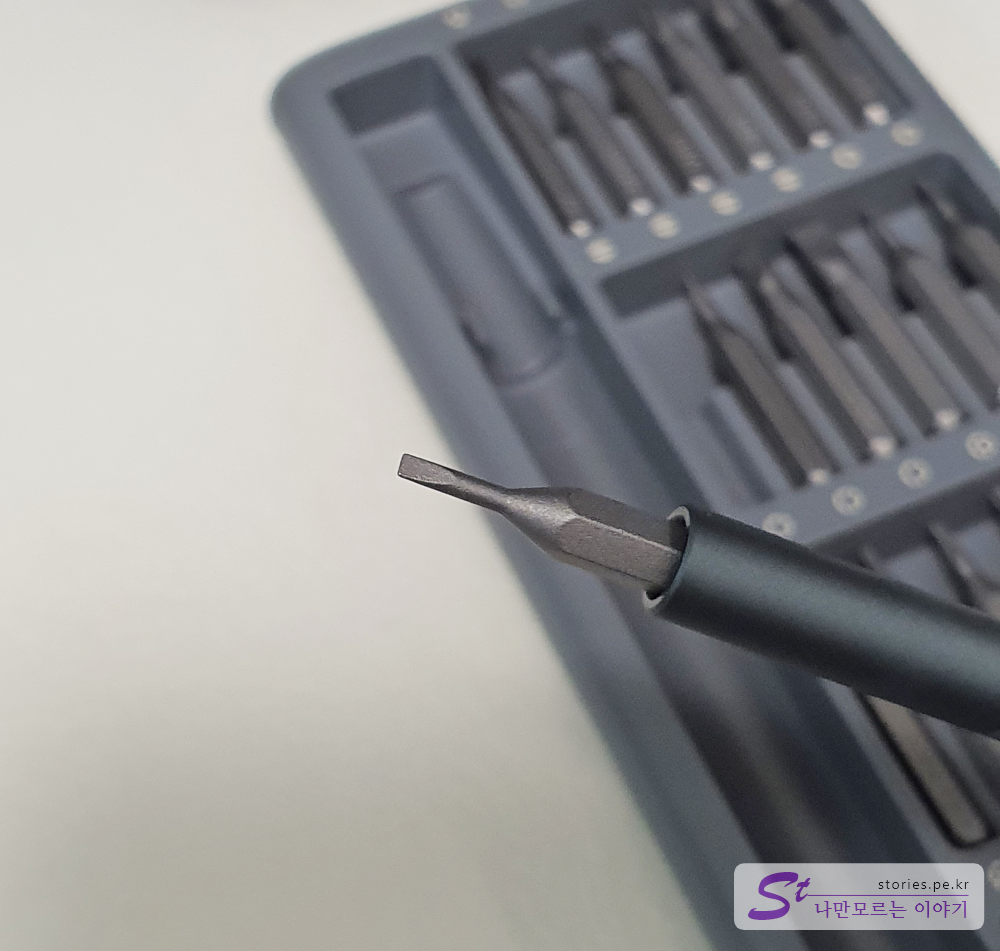   
드라이버 피스가 장착된 모습입니다. 드라이버 손잡이도 자력이 있어서 피스를 넣으면 쏙~ 하고 들어가서 붙어버립니다.   

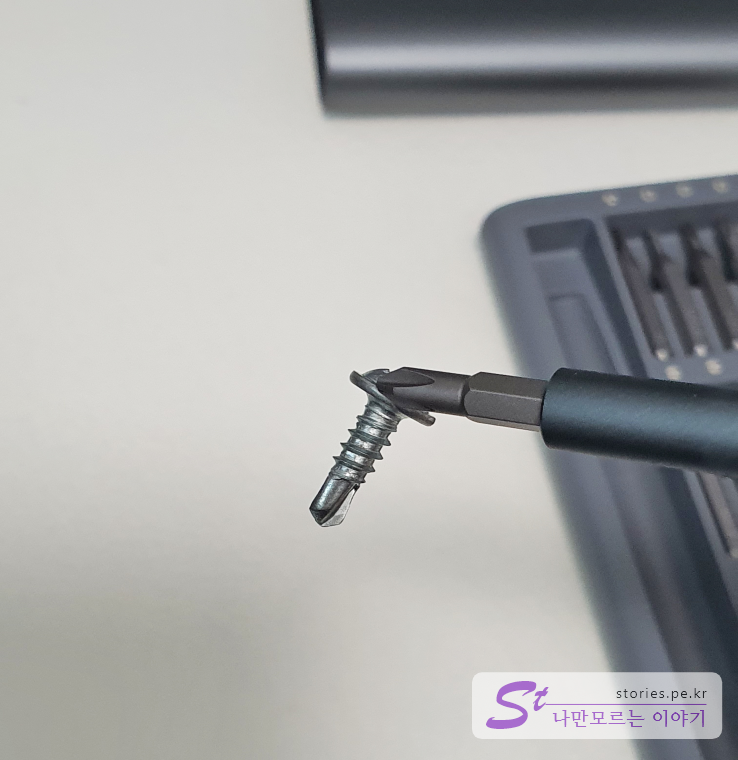  
드라이버에 자력이 있어서 나사가 붙습니다. 분실될 일이 줄어 들게 됩니다.  

## 내가 생각하는 장점  
마감이 상당히 좋습니다. 그냥 들고만 있어도 기분이 좋아지는 느낌입니다. 중국산인데도 독일회사가 손을 대서 그런지 명품 느낌이 납니다.  
자력이 있어서 피스가 본체에서 잘 빠지지도 않습니다. 디자인이 매우 우수합니다. 

## 내가 생각하는 단점  
같은 용도의 다른 드라이버에 비해 가격이 높은 편입니다. 드라이버 손잡이가 너무 딱!! 붙어 있어서 잘 뺴지지 않습니다. 

## 가격 및 구매처  
구매는 쿠팡에서 했습니다. 쿠팡에서 직접 수입을 해서 그런지 배송도 빠르고 좋았습니다. 

가격은 **18,600원**에 구매했습니다. 

[샤오미 Wiha 드라이버 공구세트 바로가기](https://www.coupang.com/vp/products/88501069?itemId=276934117&vendorItemId=3672162035&pickType=COU_PICK&q=%EC%83%A4%EC%98%A4%EB%AF%B8+%EC%A0%95%EB%B0%80%EB%93%9C%EB%9D%BC%EC%9D%B4%EB%B2%84&itemsCount=36&searchId=51339b11ff0c451c8a54bebf5999f4c4&rank=0&isAddedCart=)

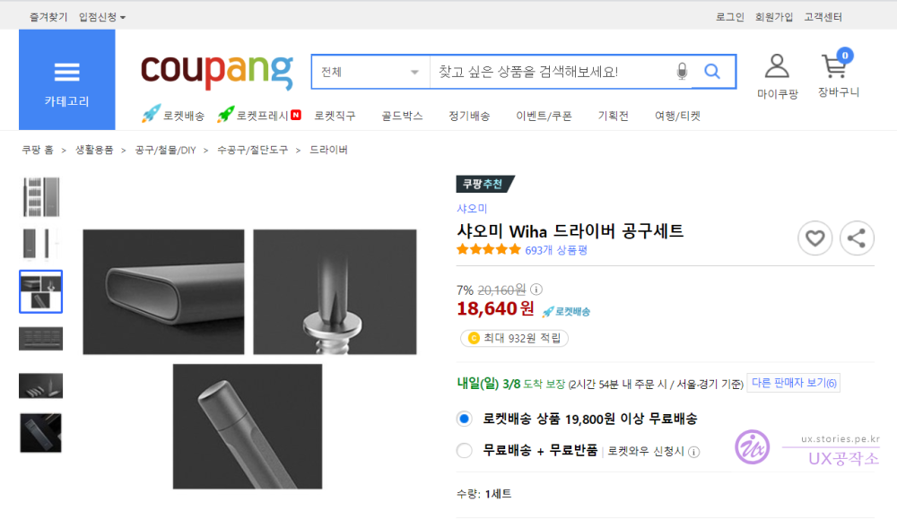  

