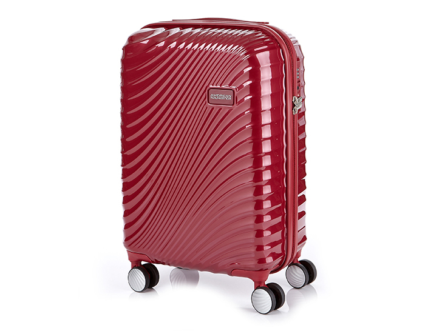
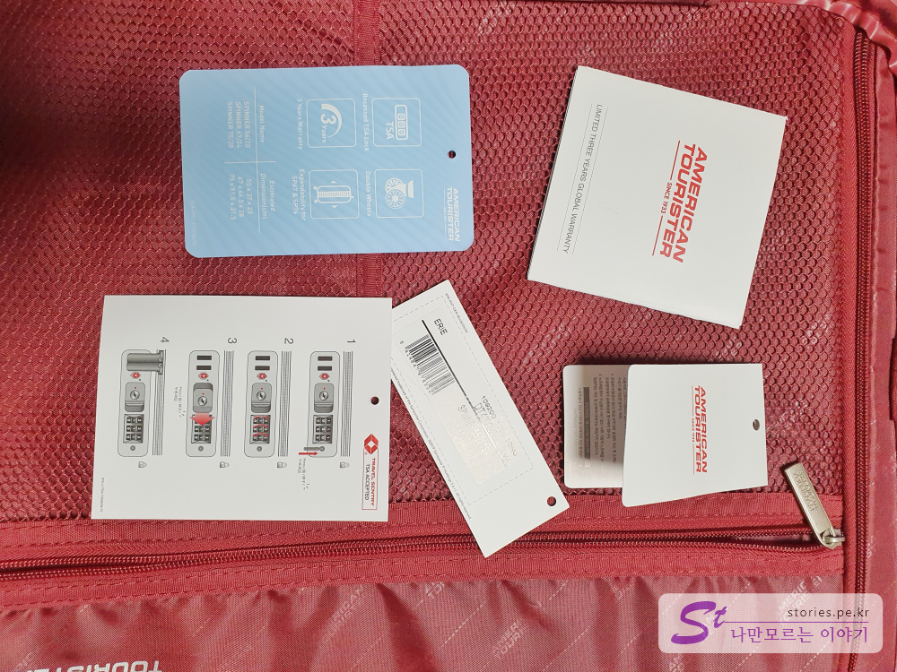
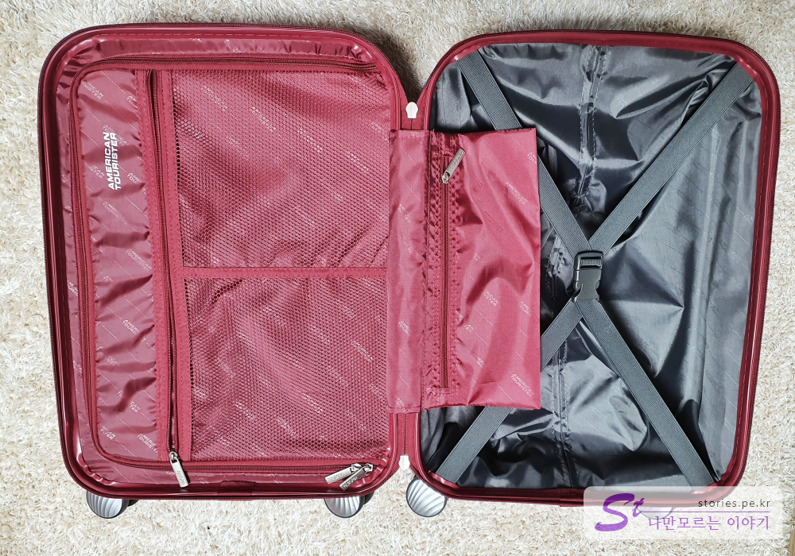
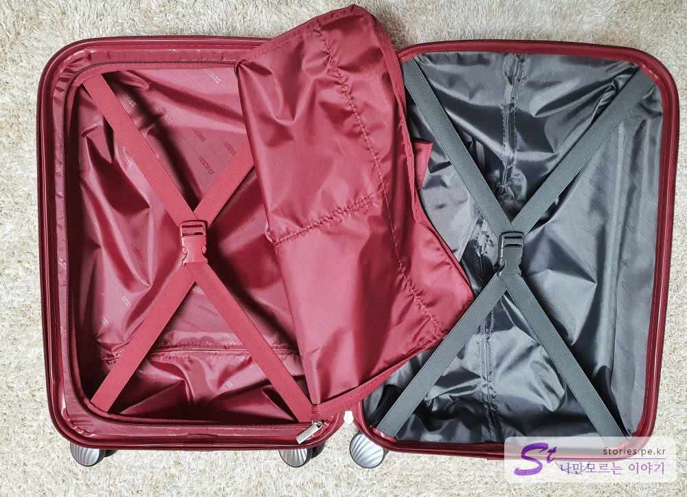
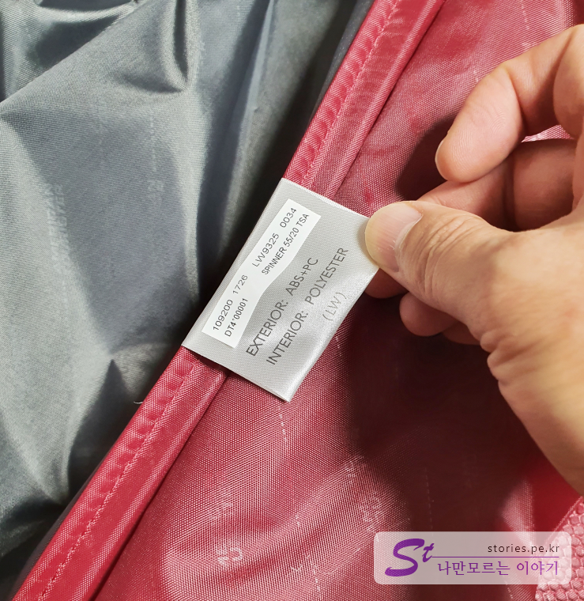
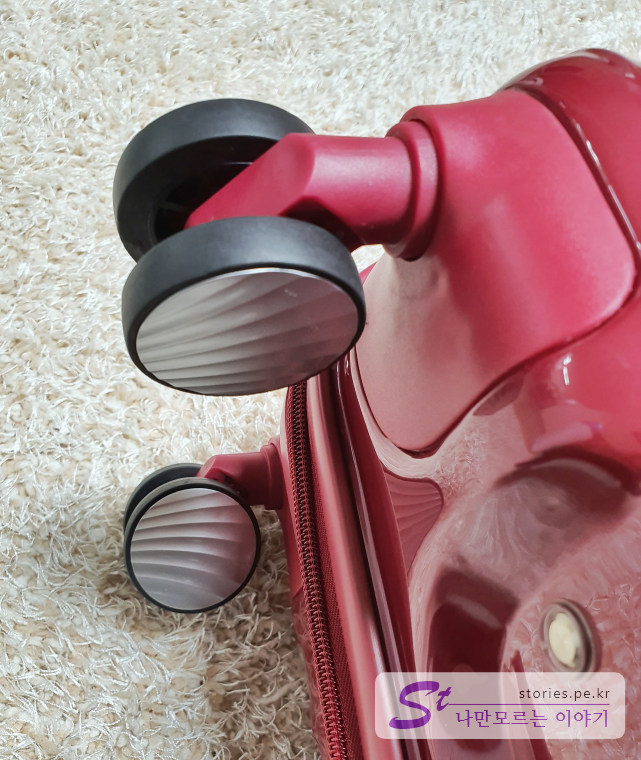
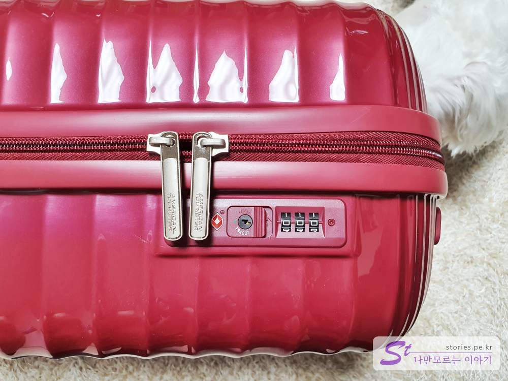
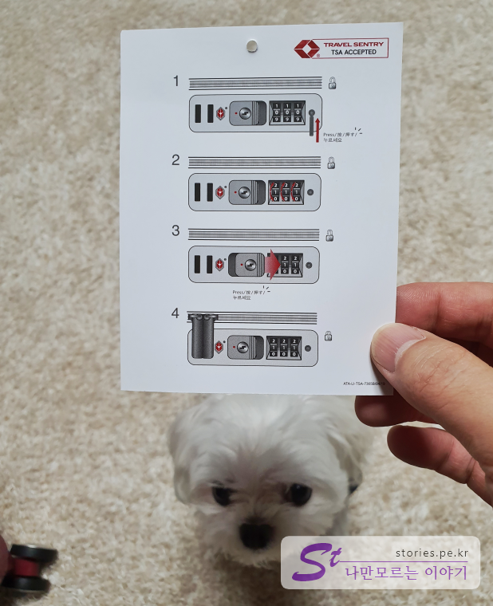
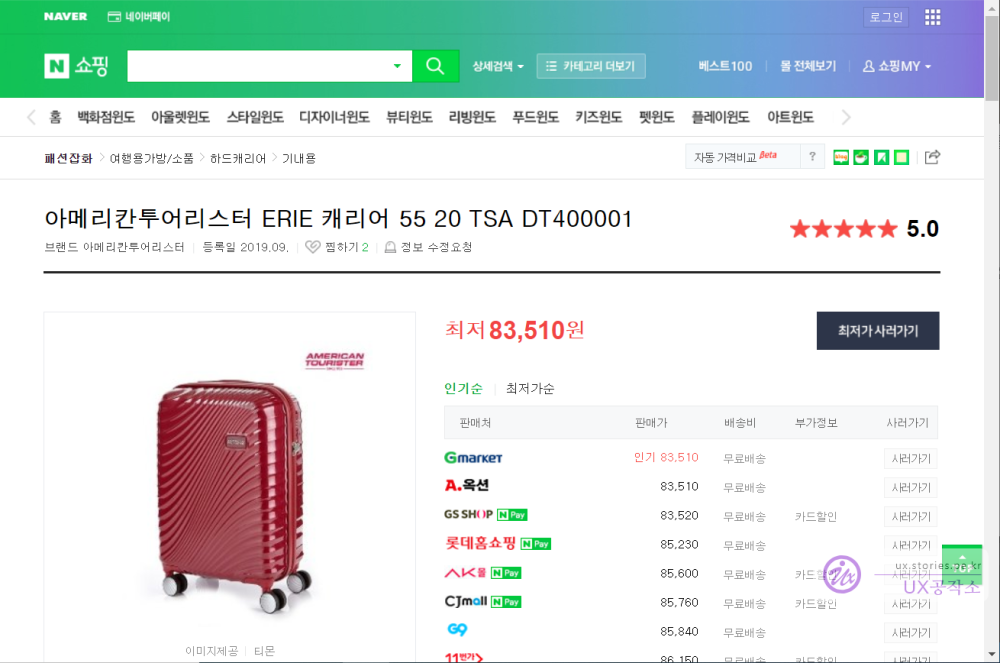

구입한지가 좀 지나긴 했지만 제가 구매했던 기내용 케리어를 소개하려고 합니다. 

   

**아메리칸투어리스터**가 샘소나이트의 자회사이므로 어느정도 품질은 보증받은 상태입니다. 약간 어두운 Red색상이라 강렬하지만 그렇게 많이 튀지 않는 색상을 가지고 있습니다. 

일반적인 항공기의 기내용 사이즈이므로 저가항공기를 탈때 많이 유용한 편입니다. 저희도 저가항공을 이용하기 위해서 2명이서 기내용으로 2개 준비해서 다녀왔습니다. 

   
구성품은 본체와 여러가지 태그들과 설명서만 있습니다.   

  
케이스를 열어보면 알찬 공간분리를 볼 수 있습니다. 바닥 쪽으로 의류를 넣고 잠글 수 있는 벨트가 있고 뚜껑 쪽에는 분리막에 메쉬형태의 수납공간이 있고 중간에 주머니가 하나 달려있습니다.  

   
분리막의 지퍼를 열어보면 뚜껑 쪽의 공간도 존재하고 밸트 또한 존재해서 단단히 붙잡아 줄 수 있게 되어 있습니다. 

   
외부의 소재는 ABS와 PC소재를 같이 사용하고 있습니다. 내부는 폴리에스터로 되어 있습니다. 
물론 PC(Poly Carbonate)소재가 좋긴하지만 기내용 캐리어의 경우는 가성비 면에서 ABS + PC도 나쁘지 않은 선택이라 생각합니다. 화물용 케리어인 경우 공항의 직원의 던짐에 의해 깨질 수 있으므로 가능한 PC소재를 구매하는 것이 맞지만 기내용 케리어인 경우는 주로 본인이 들고 다니기 때문에 그렇게 파손될 일이 별로 없기 때문입니다.  

> - **ABS** : 일반적인 플라스틱의 소재로 상처는 잘 나지 않지만 잘 깨지는 속성이며 가격이 저렴함
> - **ABS+PC** : 일반적인 플라스틱에 PC소재를 더해서 ABS보다는 좋고 PC보다는 좋지않은 중간정도의 소재로 가성비가 우수함.  
> - **PC** : 폴리카보네이트(Poly Carbonate)소재로 상처는 쉽게 날 수 있지만 강도가 매우 뛰어나서 거의 깨지지 않는 속성을 가지고 있음. 고급 케리어에는 대부분 PC소재를 사용하며 가격이 비싼편임. 
> - **알루미늄** : 케리어가 알루미늄으로 되어 있는 하드케이스로 가볍고 단단한 특징을 가지고 있어서 내용물을 가장 잘 보호할 수 있습니다. 다만 충격에 의해 찌그러질 경우 복원이 힘든 단점이 있음. 가격이 후덜덜함.

   
튼튼하고 부드러운 우레탄 휠로 되어 있습니다. 고급형에는 미치지 못하지만 충분히 단단함을 가지고 있었습니다. 

  
2단으로 늘어나는 손잡이도 알루미늄으로 되어있어 가볍고 튼튼한 형태입니다. 

   
TSA잠금장치가 케리어에 내장되어 있어 파손이나 분실될 일이 없습니다.  

> **TSA잠금장치란?** 
> TSA는 미국교통안전청(Transportation Security Administration)의 약자로 공항의 짐을 검사할때 의심스러운 물건이 있을 경우 케리어를 파손해서 꺼내볼 수 있는 권한이 있습니다. 그러나 TSA잠금장치가 있는경우 캐리어를 파손하지 않고 TSA 공용열쇠로 자물쇠를 열어서 확인하게 됩니다. 미국에 적용되어 있지만 모든 공항에서 거의 공통적으로 사용되어 집니다. 

   
혹시나 해서 TSA잠금장치의 비밀번를 세팅하는 설명서를 올려 봅니다.  

## 내가 생각하는 장점   
기내용 케리어로 가성비가 좋습니다. Red색상으로 눈에띄지만 튀지는 않습니다. 
**아메리칸투어리스터**라는 브랜드 네이밍.. 기본은 한다는 소리지요.

## 내가 생각하는 단점   
돈이 많다면 PC소재의 제품을 살텐데.. 

## 가격 및 구매처  
현재 가격은 대략 **85,000원**정도로 형성되어 있습니다. 

[네이버쇼핑 바로가기](https://search.shopping.naver.com/detail/lite.nhn?nv_mid=20958231831&cat_id=50003978&frm=NVSCPRO&query=DT400001&NaPm=ct%3Dk7ioi2ag%7Cci%3D98e4571991c2473737d9bae4e4cfdb71bd063545%7Ctr%3Dslsl%7Csn%3D95694%7Chk%3D6ff775a9efd28bb778ab1fddac8d9dc64497c91d)

  

