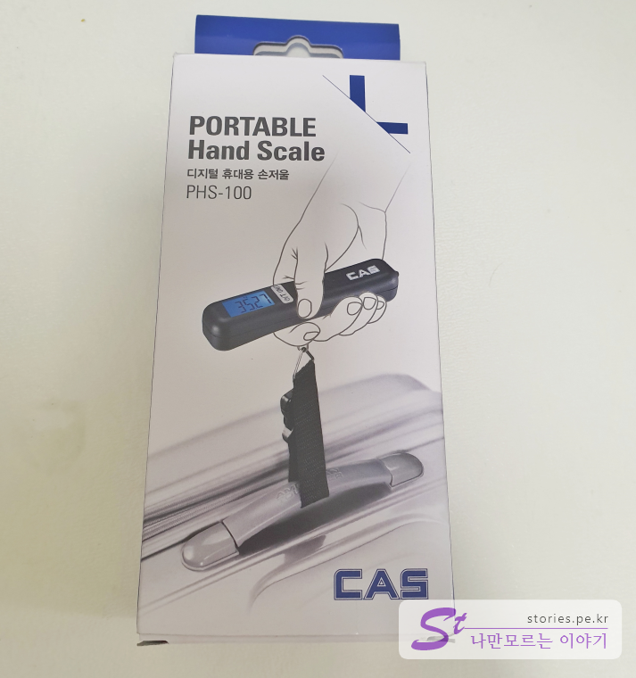
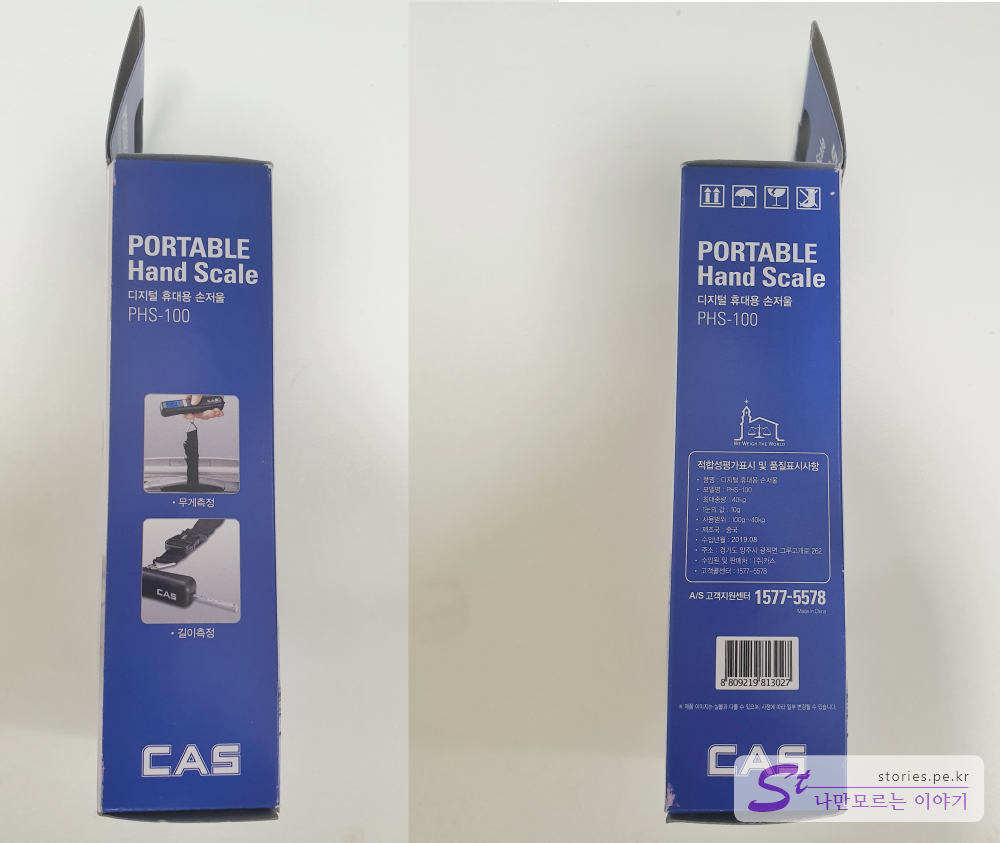
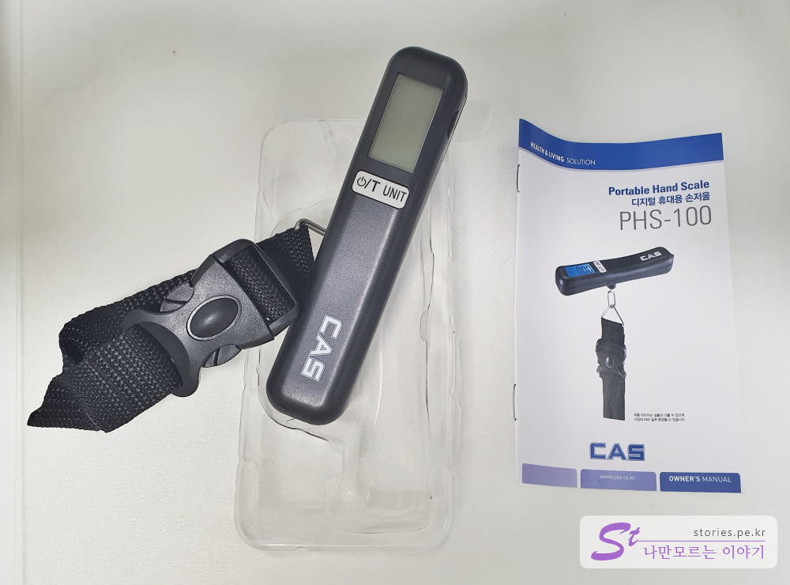
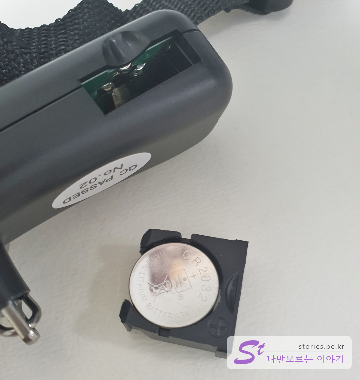
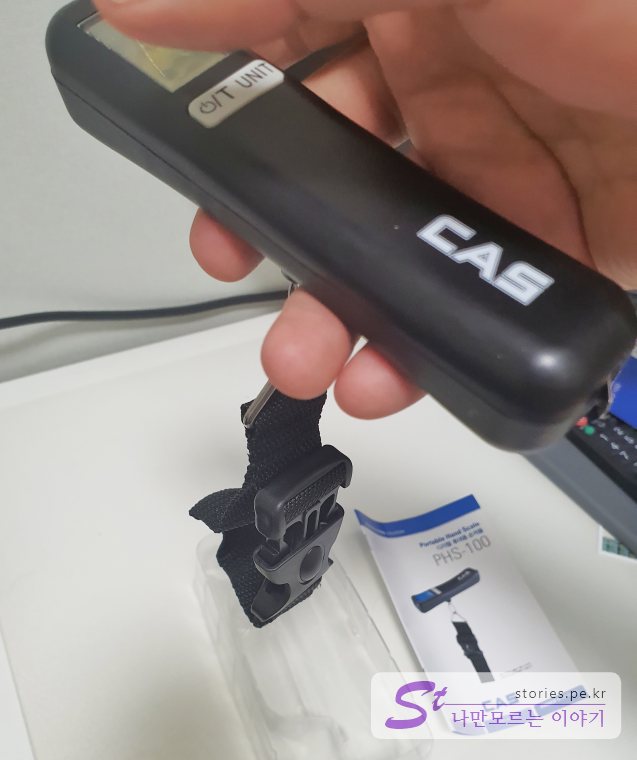
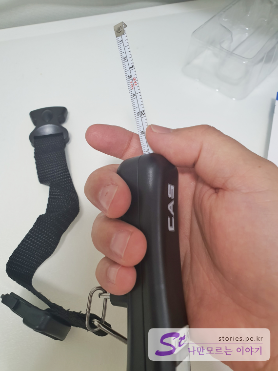
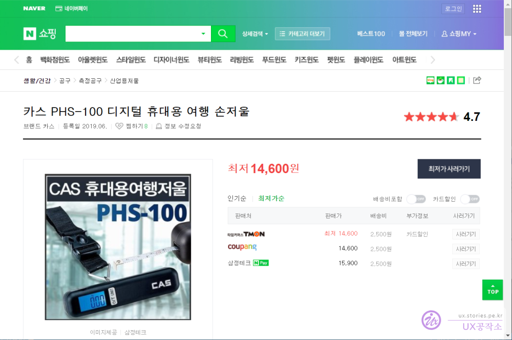
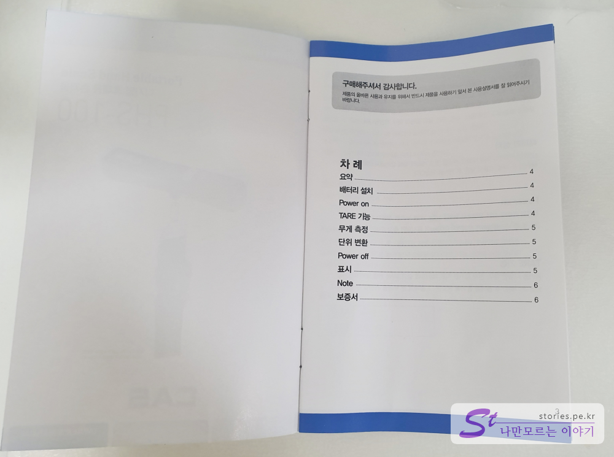
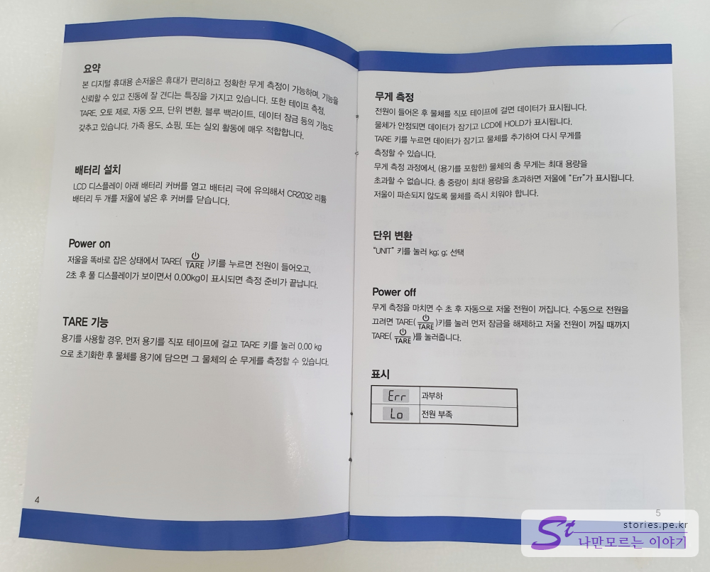
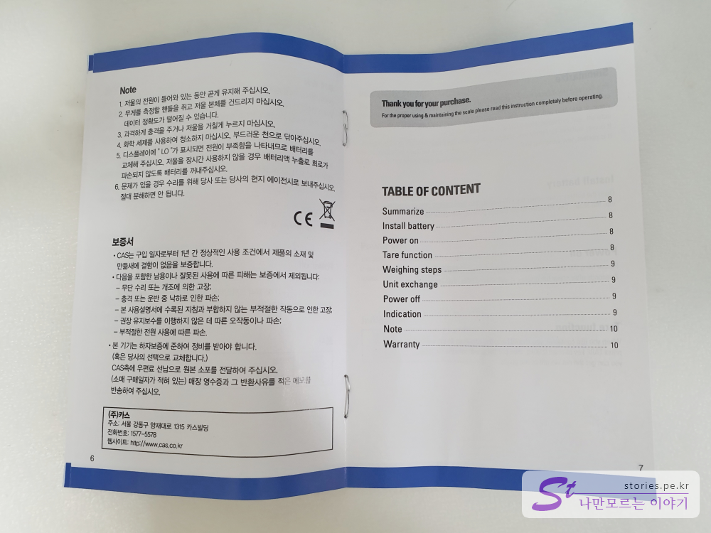

김영숙

해외여행을 갈 때 항공기를 타기위해 꼭 체크를 해야 하는 것이 짐의 무게와 크기입니다. 더욱이 저가항공을 이용하는 경우는 비용을 절감하기 위해서라도 기내용 수화물만 들고 타는 경우가 많은데 이때 짐의 무게는 상당히 중요합니다. 보통 저가항공인 경우 기내에 들고 탈 수 있는 짐의 무게는 항공사에 따라 다르지만 보통 `7KG~10KG`정도이고 `가로 X 세로 X 높이의 합이 115cm` 됩니다.  

출발할 때도 필요하지만 여행지에서 돌아올 때도 보통 선물을 사 올 텐데.. 그러면 무게가 달라지고 그때도 무게를 측정해봐야 하는 상황이 발생합니다. 그때 필요한 것이 휴대용 손저울이라고 할 수 있습니다.  

   
제가 구매한 제품은 **CAS PHS-100**입니다. CAS는 국내 계측기의 전문기업으로 그쪽 계통으로는 믿을 만한 기업입니다.  

> CAS는 1997년 창립한 이래 의료용 전자저울 및 산업용 계측기, 스트레인 앰프 및 증폭기, 계량 자동화 설비 등의 전문 MAKER로서 다양한 계측장비 및 전자저울을 개발하였으며 한국 내 유일한 의료용 전자저울 전문 기업이며 세계적인 기업과 어깨를 나란히 하고자 지속적인 투자를 하고 있습니다.  
> *- [CAS 홈페이지 참조](http://www.caskorea.co.kr/caskorea/index.html) -*

## 언박싱  

  

   
구성품은 본체, 메뉴얼로 구성되어 있습니다. 

   
건전지는 **CR2032** 2개가 들어갑니다. 

  
스트랩을 케리어에 걸고 손으로 들어올리면 간단하게 무게가 측정 됩니다. 무게는 **최대 40Kg**까지 측정이 가능합니다. 

  
무게뿐만 아니라 길이도 잴 수 있게 **줄자**도 달려있습니다. 줄자는 **최대 80cm**까지 측정이 가능합니다.  

## 내가 생각하는 장점  
일단 휴대용이라 가벼고 가지고 다니기 좋습니다. 또한 계측장비로 유명한 CAS라는 브랜드네임입니다. 비교적 정확한 측정이 가능합니다. 
줄자가 포함되어 있어서 케리어의 크기도 확인해 볼 수 있습니다. 
가성비가 좋습니다.  

## 내가 생각하는 단점  
아직까지 없습니다.

## 가격 및 구매처  

현재 네이버쇼핑 기준 최저 **14,600원**에 팔리고 있습니다. 

> [네이버쇼핑 바로가기](https://search.shopping.naver.com/detail/detail.nhn?nv_mid=19949944838&cat_id=50003427&frm=NVSHATC&query=phs-100&NaPm=ct%3Dk7k078yo%7Cci%3Dd51326654c481cdaf6ee0393cec33b37fa91c178%7Ctr%3Dslsl%7Csn%3D95694%7Chk%3D247b8157143ac244d687e41fd445c588c260568e)

  

## 메뉴얼  
  
  

