저희집은 아파트입니다. 각 방은 `Cat 5E`케이블로 깔려있어서 기가인터넷이 지원되지만 인터넷 통합 단자는 Neo-PortFree NIS-HM1624FS으로 **100Mbps**용 입니다. 당연히 SKB나 KT인터넷 같은 ISP업체에서 기가인터넷을 신청한다하더라도 각 방으로 나가는 네트워크는 100Mbps로 속도가 떨어진다는 것입니다. 그래서 이번에 기가인터넷을 지원하는 스위칭허브를 구매하게 되었습니다. 

## 언박싱  

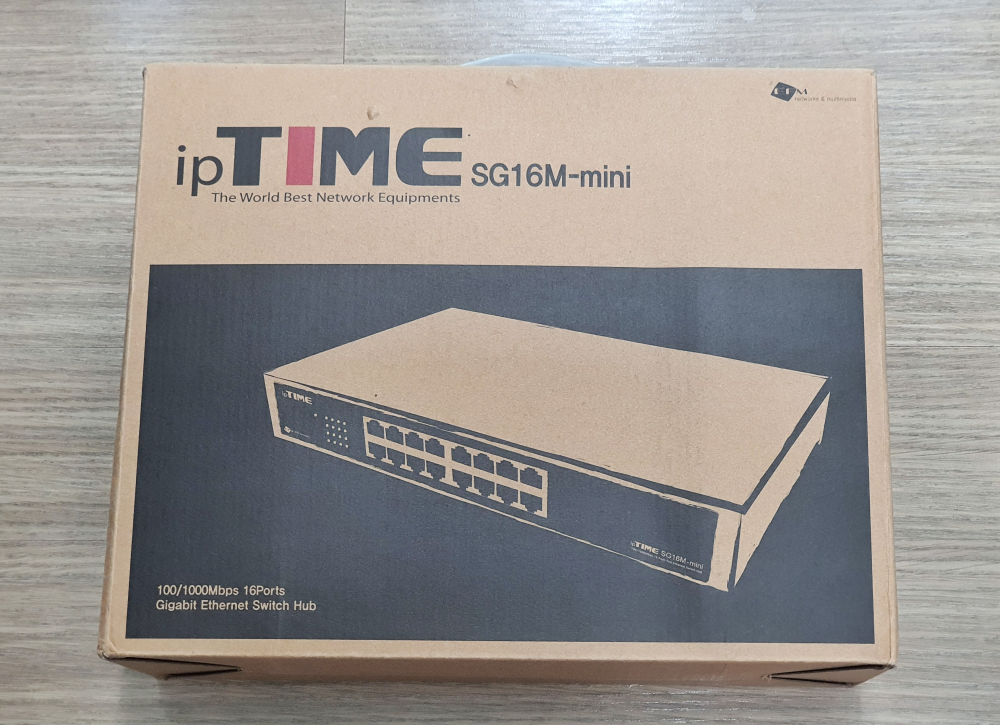   
출시일이 2017년이긴 하지만 ipTIME에서는 아직 현역에서 쓸만한 제품입니다. 
제품 명칭은 SG16M-mini로 16단자를 가지고 있는 이더넷 스위치 허브입니다.  

> **네트워크 스위치란?**
> 네트워크 스위치(network switch)는 처리 가능한 패킷의 숫자가 큰 것으로, 네트워크 단위 들을 연결하는 통신 장비로서 소규모 통신을 위한 허브보다 전송 속도가 개선된 것이다. 간단히 스위치라고 부르는 경우가 많으며, 브리징 허브, MAC 브리지(bridging hub, MAC bridge)[1], 스위칭 허브(switching hub), 포트 스위칭 허브(port switching hub)라고도 한다. 
> -- 위키백과 참조 --

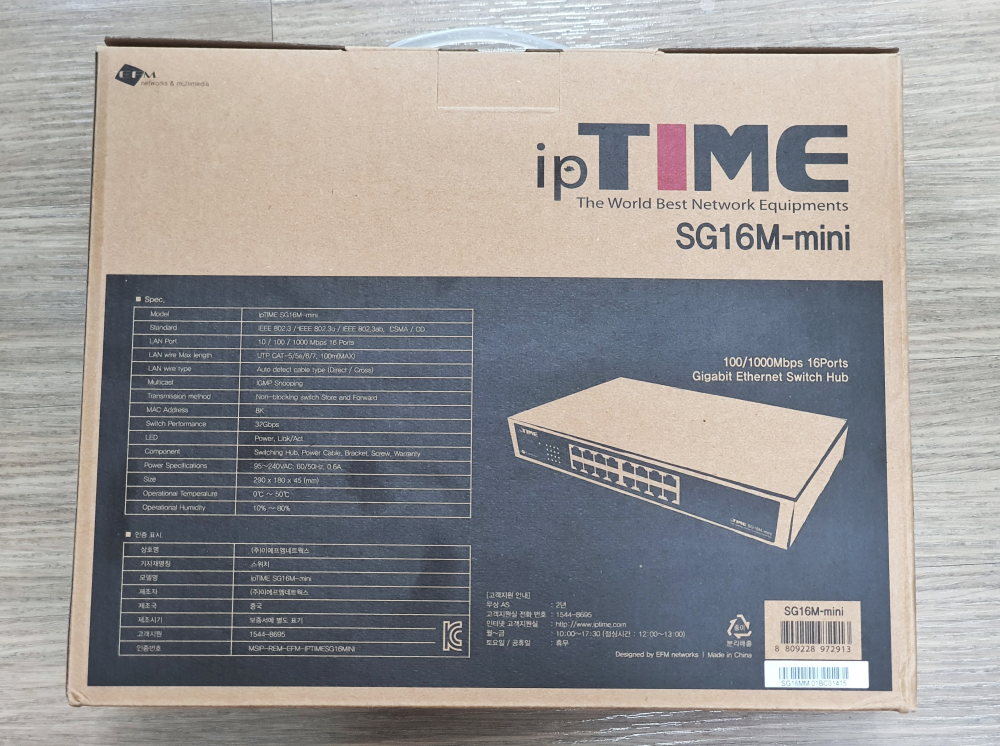   
제품의 제원이 나와 았습니다. 

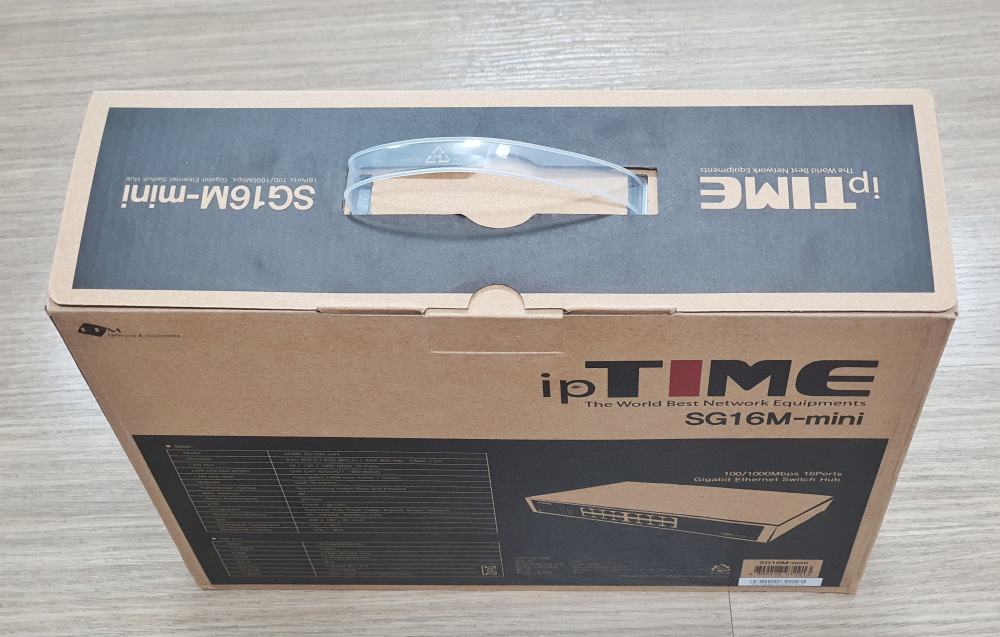  
윗면은 손잡이가 달려있어서 들고 이동하는데 편하게 되어 있습니다. 

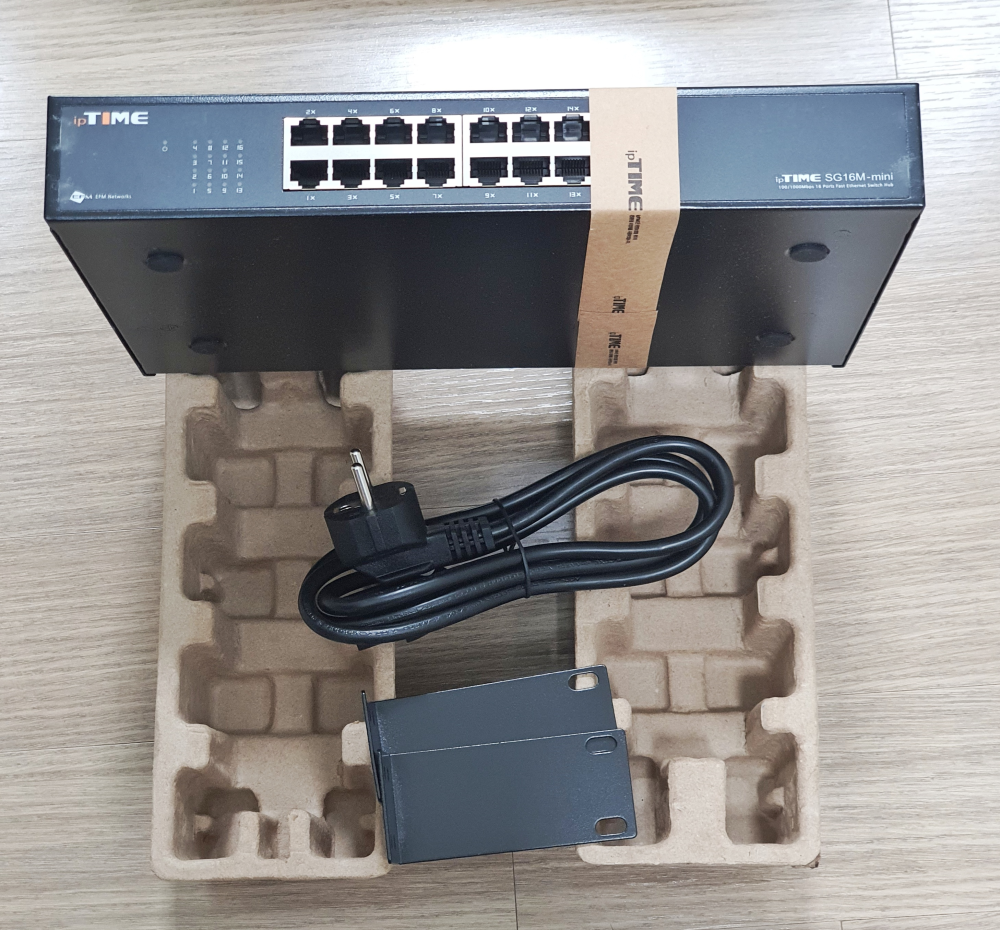   
구성품은 단촐합니다. 본체와 전원선, 브라켓이 전부입니다.  
본체는 새상품이라고 다소 곳이 리본을 하나 매고 있습니다. 

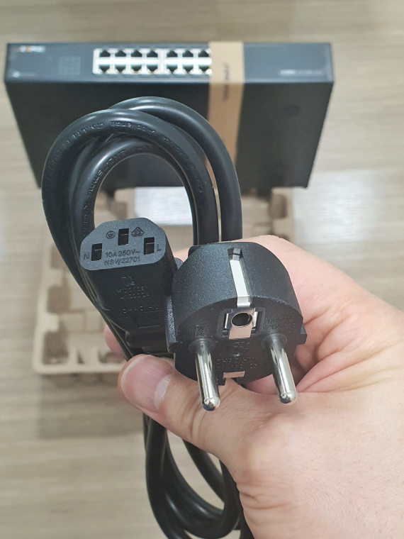   
케이블은 220V 돼지코이고 반대는 3단자 소겟입니다.  

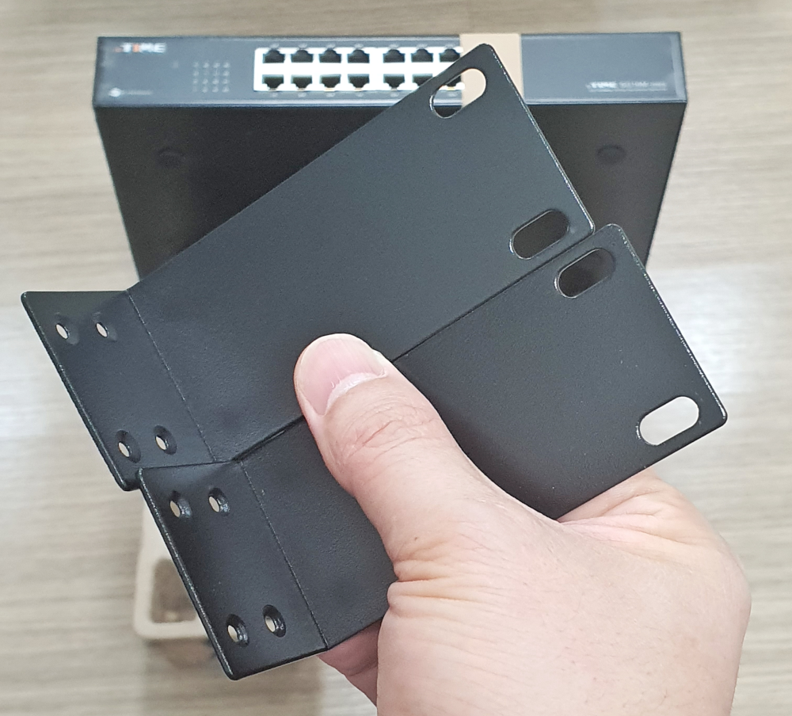  
아이피타임 **SG16M-mini** 라는 이름에서도 알수 있듯이 기본 랙에 들어가는 것보다 크기가 작습니다. 혹시 렉에 장착해서 사용하려면 표준 사이즈에 맞게 브라켓을 본체의 양옆으로 장착해서 사용할 수 있습니다. 

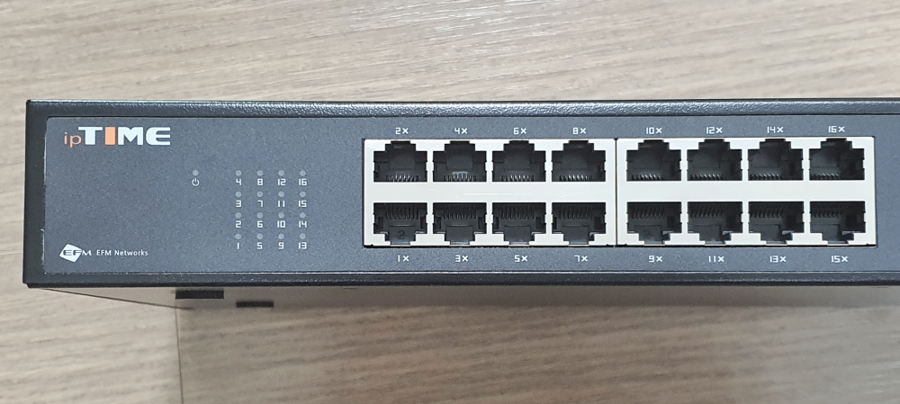   
단자는 8개씩 2개가 있어서 총 16개의 단자를 가지고 있습니다. 웬만한 아파트라면 그냥 10단자짜리면 딱 맞지 않을까 하지만.. 저는 그래도 혹시나해서 16단자를 구매했습니다.

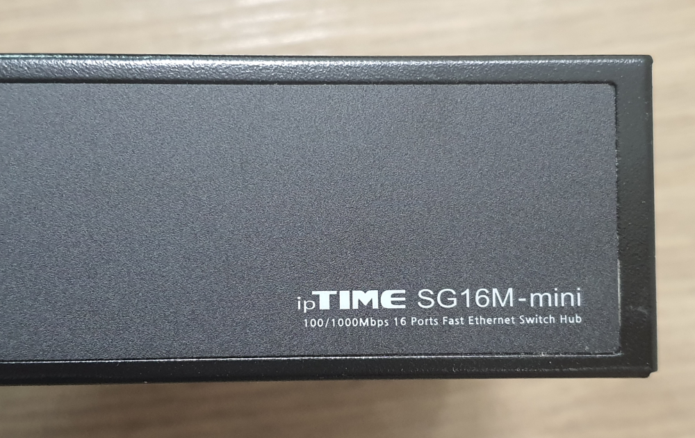  
전면 오른쪽에는 제품명이 써있습니다.  **ipTIME SG16M-mini** **100/1000Mbps 16 Ports Fast Ethernet Switch hub** 라고 되어 있습니다. 

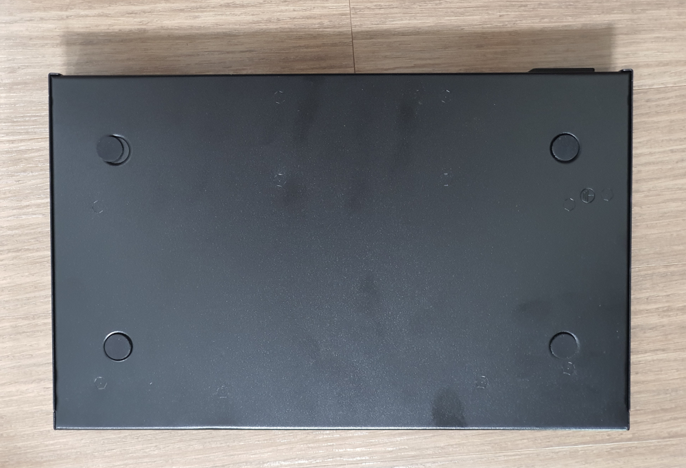  
바닥은 미끄럼 방지고무가 붙어 있어서 테이블위에 올려놓기에 좋게 되어 있습니다. 아쉽게도 고무가하나 밀렸네요..ㅎㅎ  

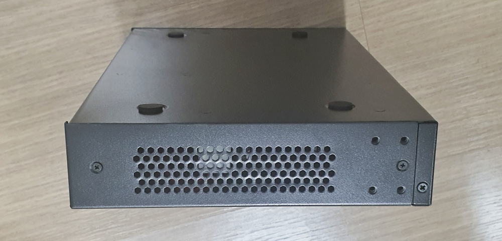   
방열 펜은 없지만 열기가 나올 수 있는 통풍구가 양 옆에 있습니다.   

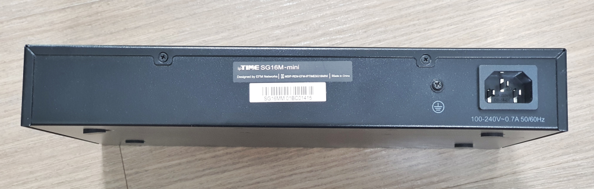   
뒷면은 전원을 연결하는 단자가 있습니다. 전원은 110V~220V까지 사용할 수 있습니다.  

## 사용방법  
사용방법은 매우 간단합니다. 일단 전원은 넣어야 겠죠? 항시 켜놔야 하는 제품이라 스위치도 없습니다. 전원케이블을 연결하면 바로 작동이 됩니다.  
16개의 단자 중 아무 곳이나 라우터 또는 공유기에서 나오는 케이블을 연결하고 나머지 단자에 각 제품으로 가는 인터넷 선을 연결하면 됩니다. 스위치가 알아서 자동으로 분배를 해 줍니다. IPTV의 단자도 아무곳이나 연결하면 자동으로 IGMP를 인식해서 배분해 줍니다.  

> **IPTV**를 사용하는 곳이라면 반드시 **멀티미디어 브로드캐스트를 위한 IGMP 스누핑**을 지원하는 제품을 구입해야 합니다. 

점보프레임은 따로 설정할 필요없이 9KByte를 자동으로 인식합니다.  

## 실제 적용한 구성   

[스위칭 허브로 느려터진 인터넷 속도를 기가인터넷으로 바꾸는 방법(feat. SG16M-mini) 바로가기](https://blog.stories.pe.kr/435)   

## 내가 생각하는 장점  
가성비가 우수합니다. 우리나라 대표 공유기 업체인 아이피타임에서 제조해서 최소한 우리나라 인터넷TV 실정에 맞는 제품을 만들지 않았을까 하는 안심이 듭니다.  
렉에 장착하는 표준크기보다 작아서 아파트 인터넷 단자함에 넣기에 좋습니다. 

## 내가 생각하는 단점  
국내에서는 시장점유율 1위이긴하지만 국제적으로는 약간 네임벨류가 떨어져서 마음의 아쉬움이 약~간~ 있긴합니다. 

## 가격 및 구매처  
네이버 쇼핑에서 구매를 했고 모든 판매점이 동일하게 **99,000원**으로 책정이 되서 판매를 하고 있습니다. 

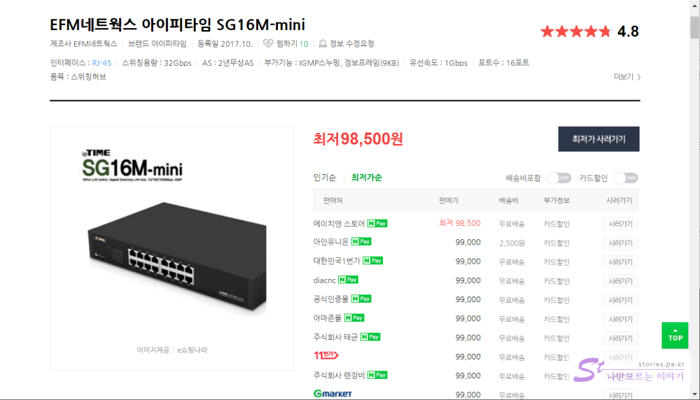  
그새 500원 낮게 판매하는 곳이 나왔네요.  

