언제부턴가 세면대의 물이 너무 천천히 내려가서 세면대가 항상 때로 더러워지는 현상이 발생하고 있네요 ㅠㅠ. 

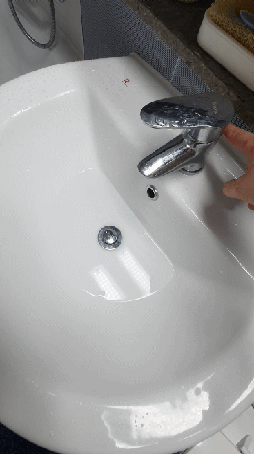  

머리카락이나 이물질들이 막혀서 그런 것은 알고 있는데 이놈들을 어떻게 뚤어야 할지 감이 잡히지 않았습니다.  
그러다 모든 것을 알려준다는 인터넷 폭풍검색으로 세면대 배수관 크리너가 있다는 정보를 입수!! 긴급하게 질러봤습니다. 

## 언박싱  

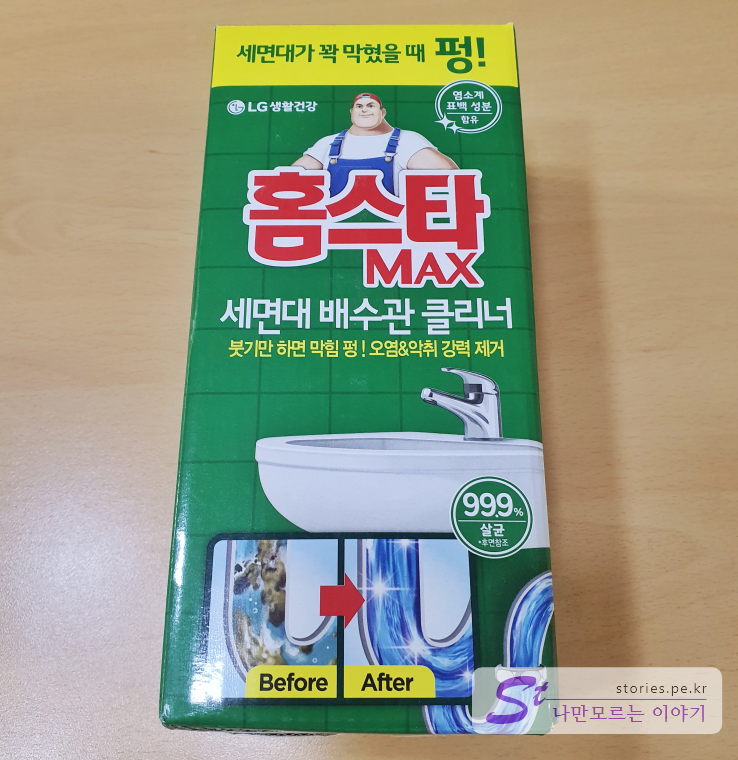  

제품 포장부터 그린그린한게 친환경적으로 나의 문제를 시원하게 해결해 줄 것 만 같습니다.  

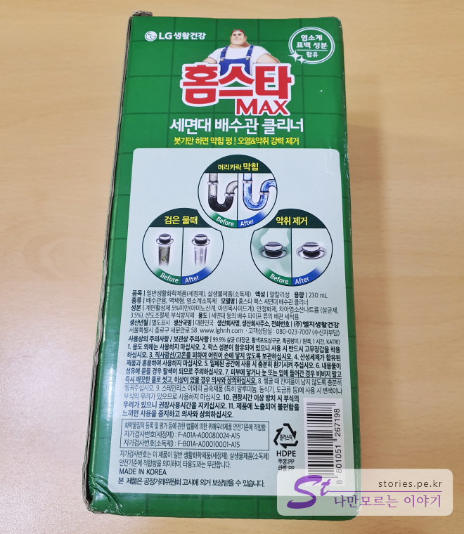   
뒷면에는 뭔소린지 모를 안내사항이 뺴곡히 적혀있으나 그냥 그림만 본다능~

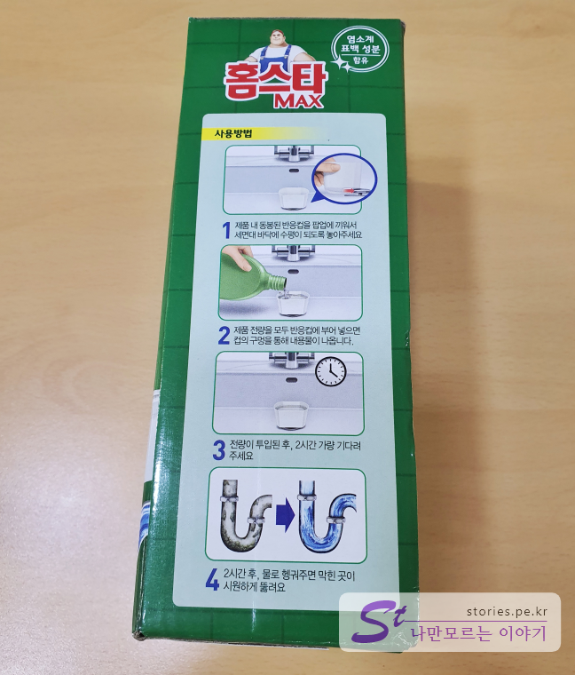   
옆면에는 친절한 사용설명이 그림으로 나와 있습니다. 사용방법이 별로 어렵지 않을 것 같네요..

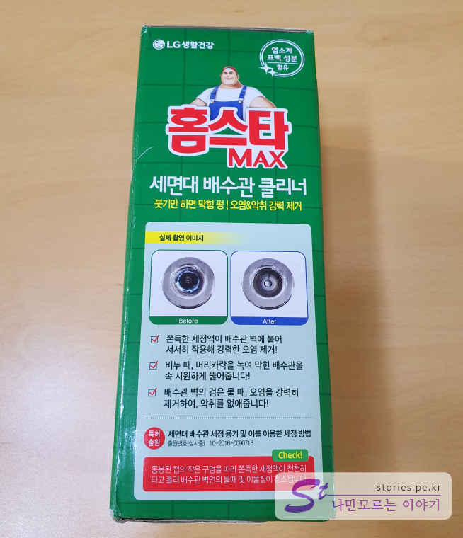   
반대 쪽 옆면입니다.  

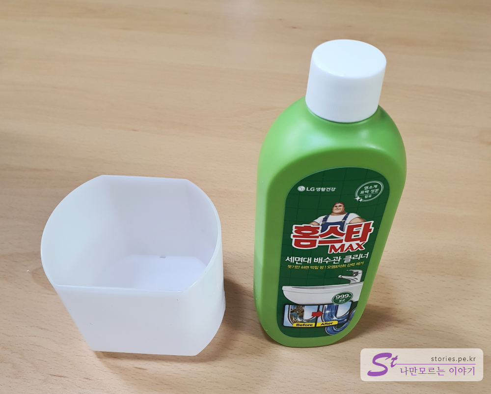  
구성품은 구멍뚤린 컵과 액체 형태의 용기 제품으로 되어 있네요.  

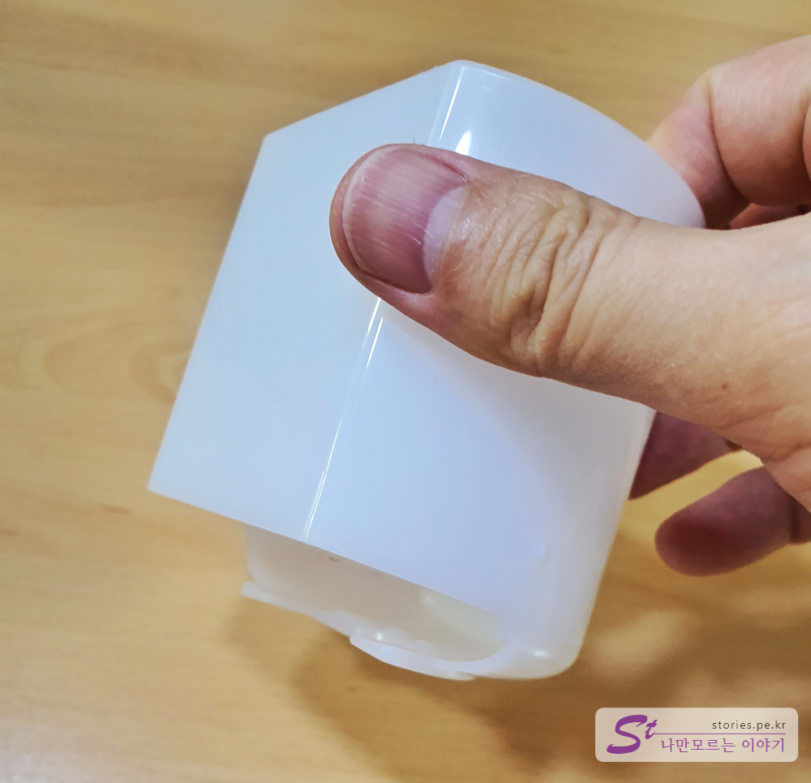  
컵은 세면대라는 악조건에서도 굳건히 서있을 수 있도록 배수관 마개를 꼭 붙잡을 수 있게 걸쇠형태로 되어 있습니다. 
컵의 용량은 딱 제품 1통 들어갈 수 있을 정도의 크기입니다. 

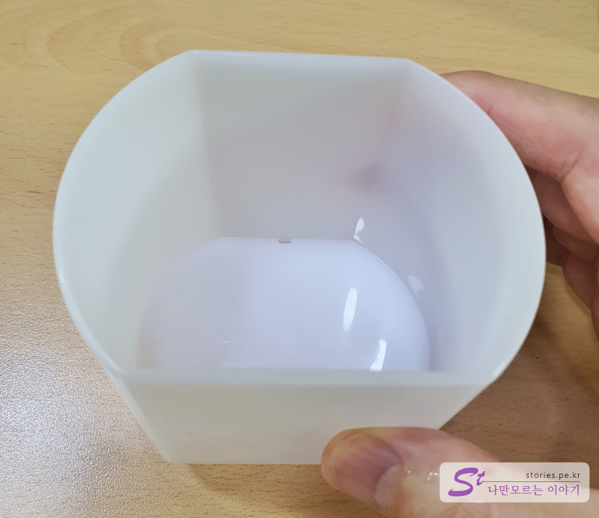  
컵의 내부에는 미세한 구멍이 있는데 이구멍으로 약 2시간 동안 제품을 조금씩 흘려 보내는 역활을 합니다. 

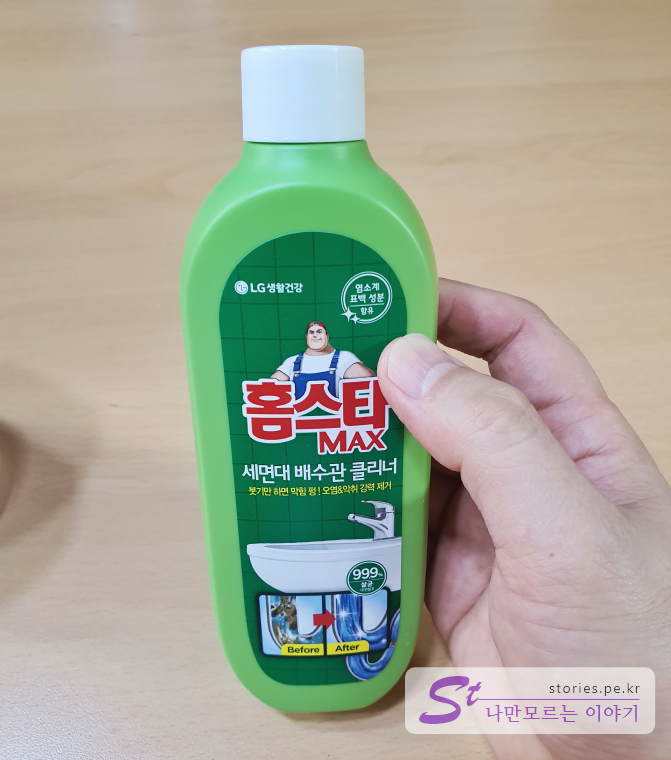  
제품입니다. 생각보다 크지는 않네요. 이정도로 잘 뚫릴까요?

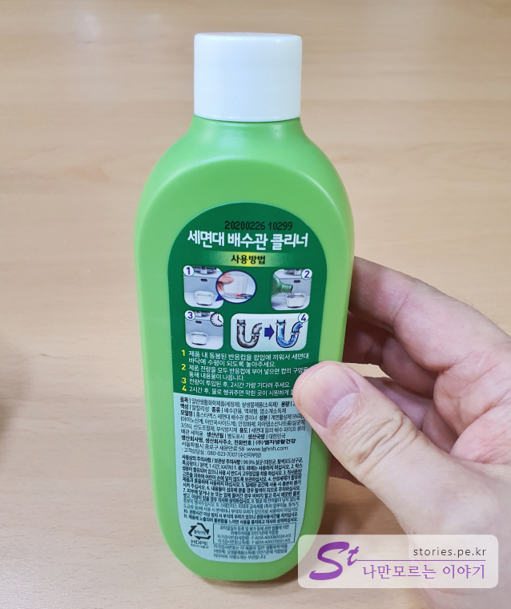  
뒷면에는 개미 눈꼽만한 글씨로 열심히 설명이 써 놨지만 역시 여기서도 그림만 본다능~~

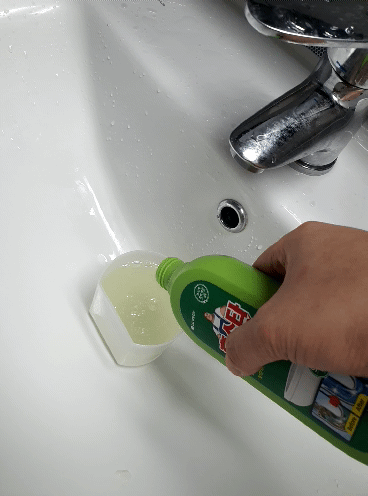   
세면대에 컵을 걸어 놓고 한통을 다 붓습니다. 그리고 약 2시간 정도 기다리면 천천히 용액이 내려가면서 단백질(머리카락)을 녹여 버립니다.  

실제로 확인해 본 결과 아주 속시원이 뻥~~ 뚤리는지는 모르겠지만 어째튼 물빠지는 속도가 빨라진 것을 보니 어느 정도는 돈값은 하는 것 같습니다.  

## 내가 생각하는 장점  
저렴한 가격에 손쉽게 막힌 세면대 배수관을 뚫을 수 있습니다. 
사용하는 방법도 어렵지 않습니다.  

## 내가 생각하는 단점  
아주 속시원이 뻥!! 뚫리지는 않네요. 참을성이 필요합니다.  

## 가격 및 구매처  
구매는 네이버쇼핑에서 가장 저렴한 것으로 구매했습니다.  
가격은 4950원 배송비 2500원 포함해서 7450원에 구매했습니다. 

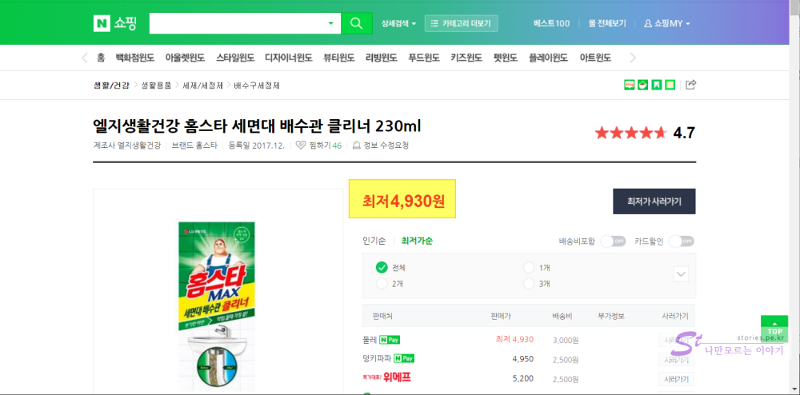  
