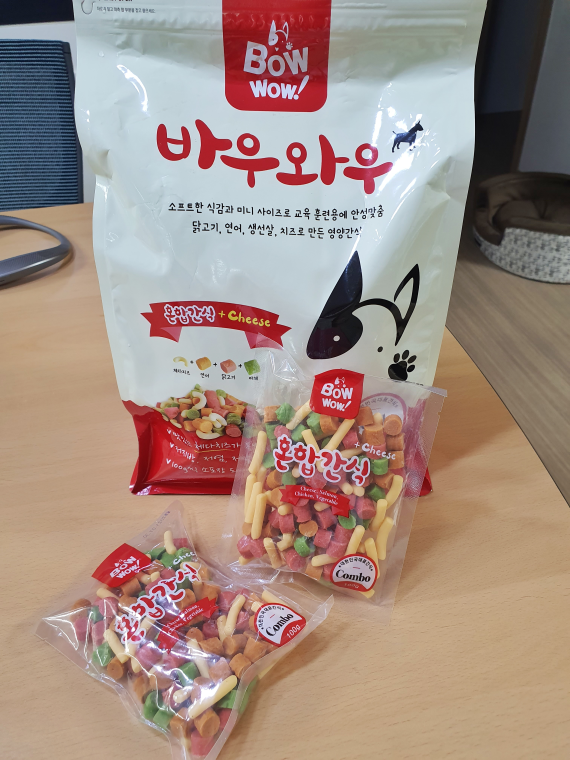
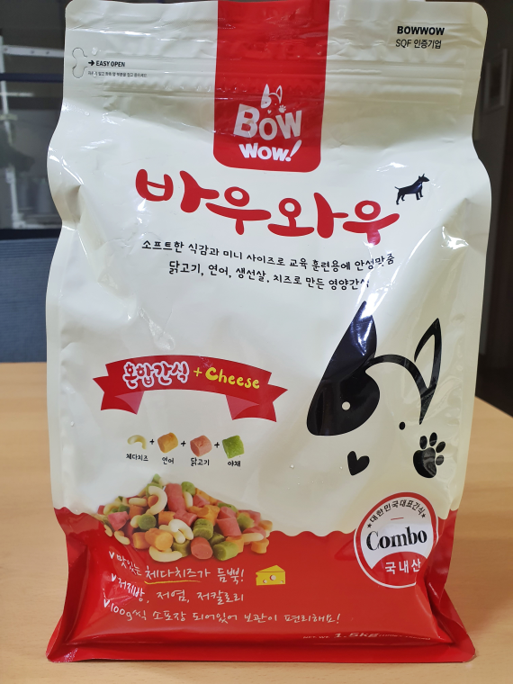
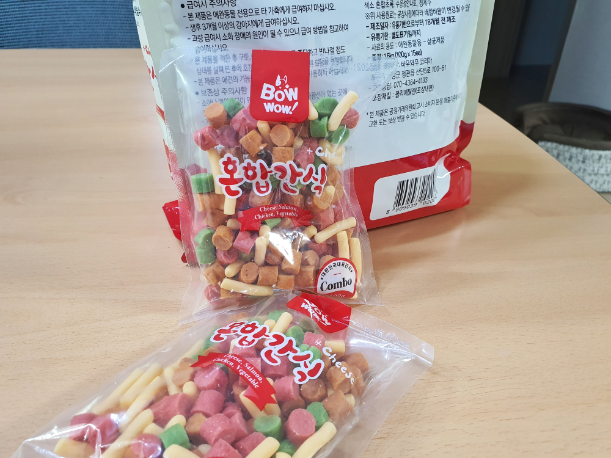
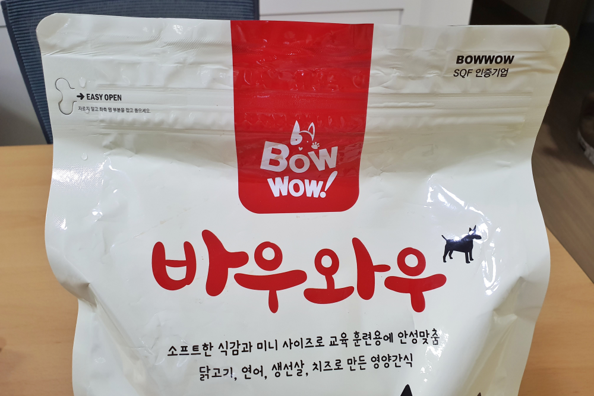
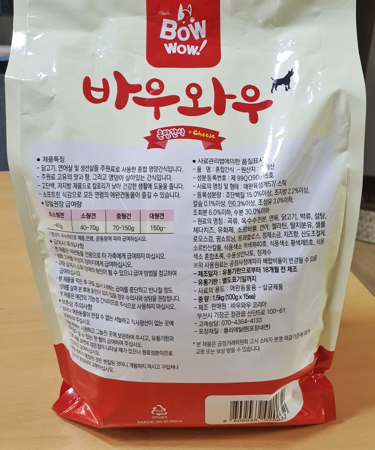
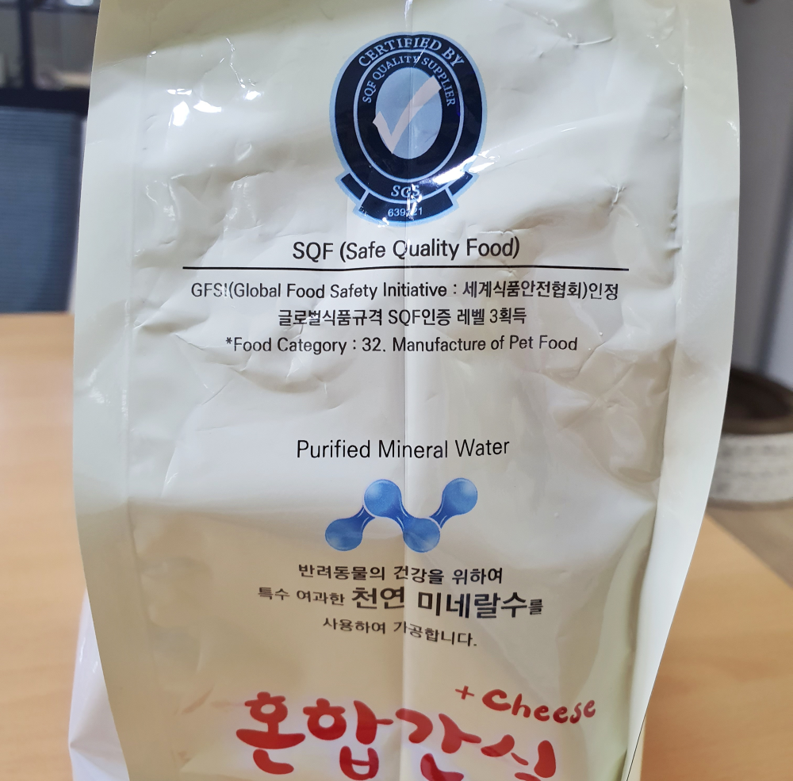
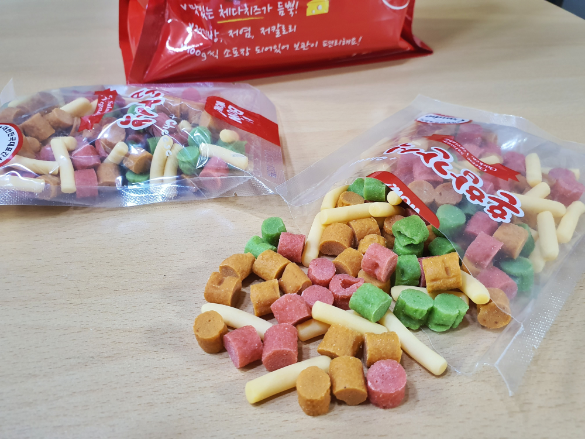

재택근무를 하면서 우리 또리와 많이 친해졌습니다. 또리는 입맛 까다롭기로 유명한 3Kg 조금 넘는 5년차 말티즈 입니다. 바우와우 혼합 간식을 몇 개월 전부터 먹었다지만 이렇게 좋아하는지는 처음 알았습니다. 

  

## 언박싱   

  
바우와우(Bow wow)는 국내산 제품으로 **체다치즈**, **연어**, **닭고기**, **야채**를 조합해서 만들어 졌습니다.  

  
기본 사이즈가 1.5Kg이라 내부는 소포장으로 되어 있습니다.  소포장 하나로 4~5번 정도 나누어서 먹을 수 있습니다.  

  
겉봉투는 띁어도 다시 잠글 수 있는 지퍼로 되어 있어 있습니다.  

   
뒷면은 제품의 특징들이 써 있습니다. 일일 권장 급여량도 써 있네요. 

   
글로벌 식품규격인 **SQF인증 레벨 3**을 획득한 제품이라고 합니다. **SQF**는 **Global Food Initiative**(세계식품안전협회)의 약자 입니다. 

물도 아무 물이나 사용한것이 아니고 **천연 미네랄수**를 사용했다고 합니다. 

  
여러가지 다양한 맛을 가지고 있는 간식입니다. 

## 내가 생각하는 장점   
무엇보다 SQF인증을 받았다는 점입니다. 그리고 강아지가 너무 좋아하네요. 소포장이 되어 있어 들고 다니기도 좋고 오래 보관할 수 있어서 좋은것 같습니다. 이것만 들고 있으면 순식간에 집안 서열 1위로 등극할 수 있습니다. 

## 내가 생각하는 단점  
단점은 굳이 찾기 힘들지만.. 그래도 16,000원이라는 가격이지 않을까 하네요.

## 가격 및 구매처  
구입은 **코스트코**산 **1.5Kg**짜리 **16,000원** 주고 구매했습니다. 
