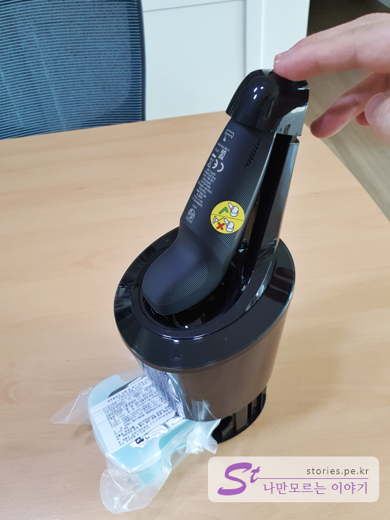

이전에 쓰고 있던 전기면도기가 세월의 풍파를 이기지 못하고 할아버지 소리를 내고 있던 차에 생일을 핑계 삼아 젊고 싱싱한 놈으로 선물 받았습니다. 

   
현재 구매한 시점에서 가장 최신, 최고의 라인업인 **Series 9000** 중에 하나인 **S9131**입니다. 

필립스 면도기의 라이업은 `S3000`, `S5000`, `S6000`, `S7000`, `S9000`으로 구성되어 있으며 현재 S9000시리즈과 최상위 라인업입니다. 
S9000 시리즈는 면도기 본체가 본체의 중요 부분인 면도날은 모두 동일하고,  밧데리 잔량 표시를 숫자로 하는지, 눈금으로 하는지, 본체의 재질이 어떤지 등에 따라 2~3종류로 나누어져 있습니다. 본체 구분은 S9`X`00 에서 `X` 숫자에 의해 구분이 됩니다. 높을수록 기능이 많고 가격이 비싸집니다. 최고모델인 `S98XX` 프리스티지 모델은 40만원이상 호가합니다. `S91XX`모델은 가성비 모델로 기능은 많지 않지만 면도날은 동일하기 때문에 20만원대의 저렴한 가격에 구매할 수 있습니다. 
나머지는 구성품에 의해 모델명 뒷자리의 숫자인 S9X`13`로 구분되어 있습니다.. 

## 언박싱  
  
여러가지 정보가 영어로 적혀있네요..  
습식, 건식으로 사용이 가능하고 한번 충전으로 50분을 사용할 수 있다고 써있네요. 
완충은 1시간이면 가능하고 배터리 잔량표시는 LED 3단계 눈금으로 표시된다고 합니다. 

  
8방향의 면도 헤드를 보유하고 있고 회전을 하면서 자동으로 날이 갈아지는 V-Track Precision Blade System이 있다고 하네요.

  
S9131의 구성품인 콧털깍기날, 구렛나루 자르는 트리머, 세척과 동시에 충전이되는 거치대, 본체로 구성되어 있습니다. 

  
바닥에도 의미있는 내용이 좀 있네요. 수입신고 내용도 있고  **2년 워런티**라고 써 있네요. 

  
**S9131**의 구성품을 깔아봤습니다. 굳이 볼 필요없는 다국어 메뉴얼이 4개 있고 충전/세척거치대, 세척액 새것 1개, 휴대용 케이스, 220V어뎁터, 트리머, 콧털날, 본체로 구성되어 있습니다. 

  
본체는 S9000시리즈에서 가장 기본이며 저렴한 모델입니다. 3중날은 S9000시리즈면 모두 동일합니다. 다만 전원버튼, LED표시등, 재질 등이 다릅니다.  

  
손에 쥐기 편안하여 그립감이 좋습니다.  
충전을 하면서 사용하지 말라는 경고 스티커가 붙어 있습니다. 애써 별도로 붙힌 것을 보면 그렇게 사용하면 안될것 같네요..

  
날을 분리해 봤습니다. 날을 빼고 여기에 트리머나 콧털날을 끼워서 사용할 수 있습니다. 

  
콧털날을 체결해 봤습니다. 이제 콧속에 있는 콧털들이 겁 좀 먹을 것 같습니다. 

  
구렛나루 트리머를 체결했습니다. 체결하고 나니 우주전사 머리 같이 생겼네요. 구렛나루정도의 털을 깍는 용도이니 다른 곳에 사용하지 마세요.

한국이라 220V 돼지코 어뎁터가 들어있으나 제품은 110V~220V의 프리볼트이니 외쿡에서도 충전이 가능 합니다.  

  
하드케이스 입니다. 집에서는 사용할 일이 없으나 여행 갈 때는 요긴하게 필요한 장비입니다. 

  
본체를 거치대에 거치해 봤습니다. 아래로는 알콜로 구성되어 있는 세척액 카트리지를 넣습니다. 
면도기를 거치하고 세척버튼을 누르면 면도기를 세척해 줍니다.  

  
충전을 할때는 위의 뚜껑을 눌러줘야 충전 단자가 체결이 됩니다. 

  
뒷면에는 전원 어뎁터를 연결하는 단자가 있습니다.  

  
카트리지 세척액은 소모품입니다. 어느 정도 사용한 후 버리고 인터넷 같은 곳에서 추가로 구매할 수 있습니다. 

## 내가 생각하는 장점  
옛날 버전과 비교해 보면 정말 면도가 잘 됩니다. 
한번 구매하면 5년이상은 사용해야 하므로 이정도면 적당한 가성비라 생각됩니다. 
S9131은 S9000시리즈 중에 하위 모델이긴 하지만 면도날은 동일하므로 가성비를 중요시 하는 분들게 추천합니다. 
거치대가 생각보다 편리합니다. 세척보다는 충전용도로 많이 사용하게 되네요. 

## 내가 생각하는 단점  
카트리기 세척액이 소모품이다 보니 매번 구매하기가 아깝습니다. 
가성비라고 해도 기본 가격이 높으네요

## 가격 및 구매처  
구매는 네이버쇼핑을 이용했고 대략 가격은 21~25만원선 입니다.  

  
