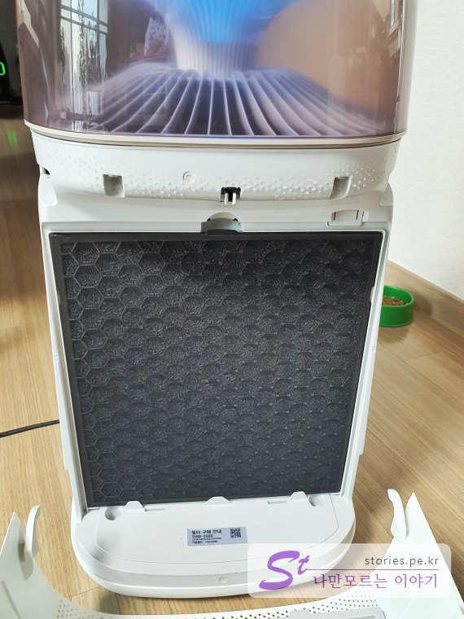

미세먼지로 안타를 치고 코로나19로 홈런을 친 공기 청정기...
우리집 공청이도 이제 슬슬 필터를 갈아야 할 때가 왔습니다. 필터 교환은 사용환경에 따라 다르지만 생각하기 귀찮다면 그냥 1년에 한번 정도 교환한다고 생각하면 됩니다. 

  
저희가 입양한 공청이는 삼성에서 테어난 **블루스카이 3000 AX40M3030WMD** 입니다. 벌써 입양한지 2년이 되어서 2번째 필터를 교환하게 되었습니다. 

## 어디 출신인가요??   
  
우리집에 있는 놈은 삼성에서 만든 블루스카이 3000 시리즈 중 하나인 모델명  **AX40M3030WMD** 입니다. 이 모델명을 알면 필터를 찾는데 도움이 됩니다.  

## 필터는 어떻게 구매하나요?  
구매는 네이버쇼핑에서 할 수 있습니다. 네이버쇼핑에서 이 모델명을 검색 하면 수십게가 쫙~ 나옵니다.  

검색어는 **AX40M3030WMD 필터** 또는 **CFX-G100D** 입니다.  

    
 

다만 주의 해야 할 점은 **정품필터와 호환필터를 구분**해야 합니다. 정품인 경우는 품질과 성능에 대한 보장이 있는 반면 가격이 비싸고, 호환인 경우는 상대적으로 가격이 저렴하지만 품질과 성능에 대한 보장을 장담할 수 없습니다. 

물론 호환필터도 잘 선택하면 더 좋은 품질과 성능에 가격까지 저렴한 제품을 획득할 수 있지만 잘 모른다면 그냥 돈 좀 더 주고 정품을 구입하는 것이 좋습니다. 뭐... 1년에 **3만원~5만원**정도면 그렇게 나쁘지 않은 가격이라고 생각합니다.  

## 필터 교체하는 방법  
필터교체 또한 매우 쉽습니다.   

  
주문한 필터가 도착했습니다. 떡~ 하니 정품필터라고 써 있습니다.  

   
뒤집어서 제품명을 확인해 봅니다. 

  
박스를 빼보면 검정 암지에 쌓여있는 필터와 설명서를 볼 수 있습니다.   

  
필터의 앞면은 숯으로 구성되어 있는 필터면을 볼 수 있습니다. 숯이 공기정화 효과가 있긴 한가 봅니다.  

  
반대쪽 면은 하안색 종이 필터가 봍어 있습니다. 중간에도 몇개의 필터가 더 붙어 있다고 하네요.  

   
친절하게도 필터를 넣는 방향이 표시되어 있습니다. 화살표가 공청이를 향하면 됩니다. 

  
자... 이제 공청이의 옷을 벗길 차례입니다. 
벗기는 방법은 간단합니다. 자석으로 붙어 있기 떄문에 뚜껑을 앞쪽으로 살짝 잡아 당기기만하면 됩니다.   

   
겉 뚜껑을 벗기면 안에 모기장 같은 속뚜껑이 있습니다. 이것도 상단부분을 눌러서 앞으로 잡아 당기면 쉽게 빠집니다.   

   
일년동안 먼지를 먹으며 우리 가족을 위해 열일 했던 구 필터에게 고생했다는 한마디 해 주고 뺴 줍니다.  

   
이제 새로운 필터를 화살표 방향을 확인하고 자기 자리에 끼워넣습니다. 화이팅!! 한마디 해 주고 끼워 줍니다. 역순으로 모기장을 다시 닫아 준 다음, 겉 뚜껑을 닫아 주면 됩니다. 
이제 앞으로 1년동안은 공청이 덕분에 숲속에서 힐링하듯 마음껏 공기를 들이 마실 수 있습니다.   

 ## 기타  
 작은 방에서 열일하는 공기청정기도 이참에 같이 갈아 주었습니다.  
 모델명은 **CFX-B100D** 입니다. 
   