집에 있는 에어프라이기가 망가져서 새로 구매를 하려고 알아봤습니다. **에어프라이어**가 처음에는 신기한 물건이였으나 이제는 상당히 많은 회사에서 제작하고 있어서 저렴한 가격에 다양한 제품들을 선택할 수 있는 선택의 맛이 있는 물건이 되었습니다.   

## 언박싱  

항상 사용하면서 아쉬웠던 부분이 용량의 문제였던지라 대용량 에어프라이어를 찾아보게 되었습니다. 그래서 선택한 것이 독일 콕스타의 12리터 짜리 에어프라이어 입니다. 콕스타는 독일에 본사를 두고 있으며 1904년부터 지금까지 110년이 넘는 역사를 가지고 있는 회사라 최소한 허투루 만들지는 않을 것 같다는 믿음에 구매를 했습니다. 

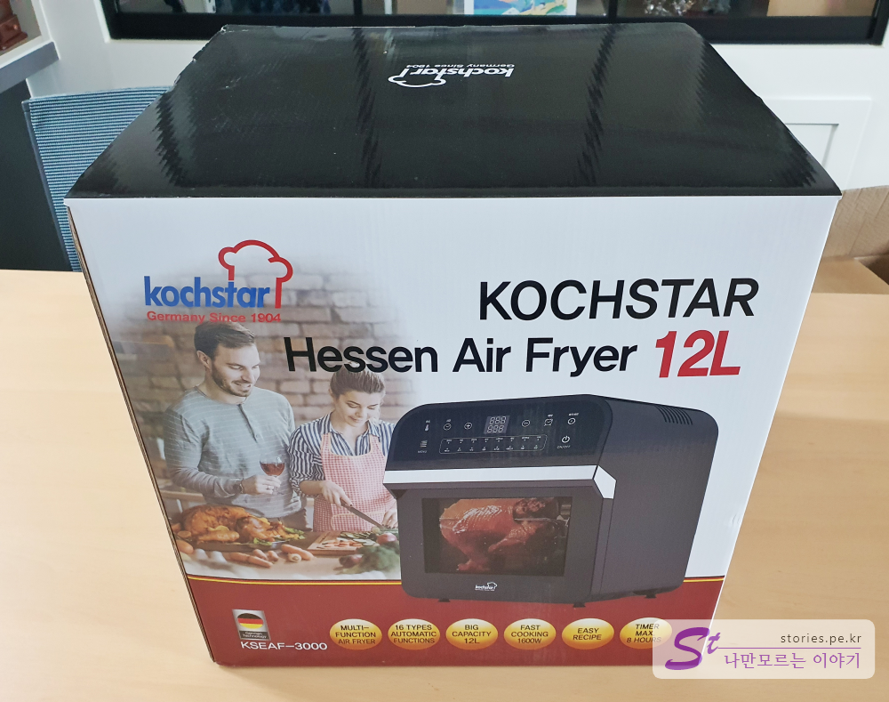  

KOCHSTAR Hessen Air Fryer 12L는 용량이 커서 통닭도 **로티세리**로 한마리 통째로 구울수 있는 정도 입니다. 

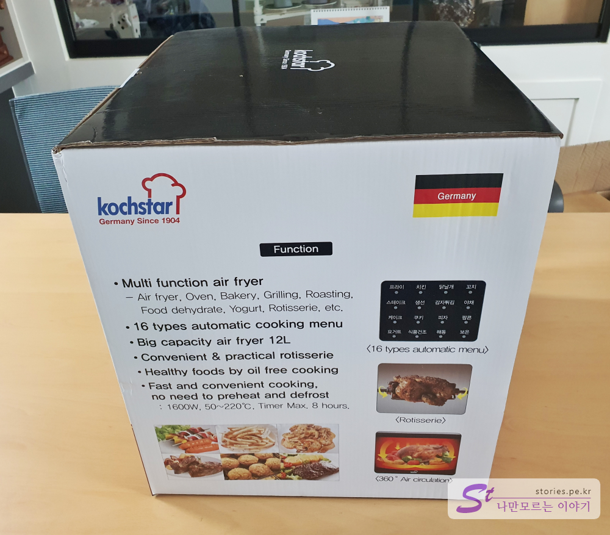  
에어프라이어라고는 하지만 다양한 기능을 지니고 있에서 프라이, 치킨, 닭날개, 꼬치, 스테이크, 생선, 감자튀김, 야채, 케이크, 쿠키, 피자, 팝콘, 요거트, 식품건조, 해동, 보온의 **16가지의 코스**를 버튼으로 바로 설정할 수 있습니다. 자칫 태워먹거나 덜익히는 것을 미연에 방지할 수 있습니다. 

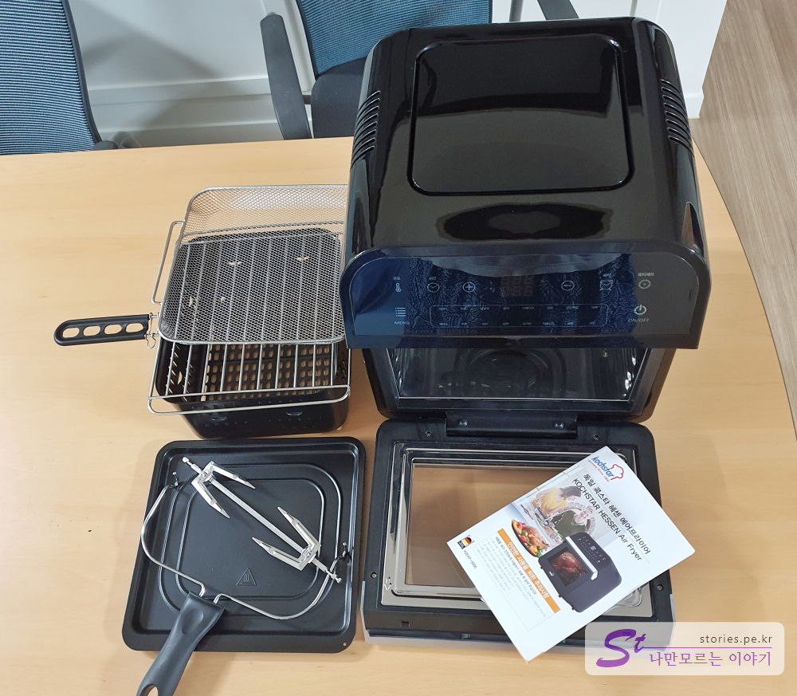  
모델명은 구성품의 종류에 따라 달라지는데 제가 구입한 것은 `KSEAF-3000H`입니다. 기본모델명이 `KSEAF-3000`이고 그 뒤에 붙는 영문의 모델명에 따라 구성품이 달라진다고 보시면 됩니다.  

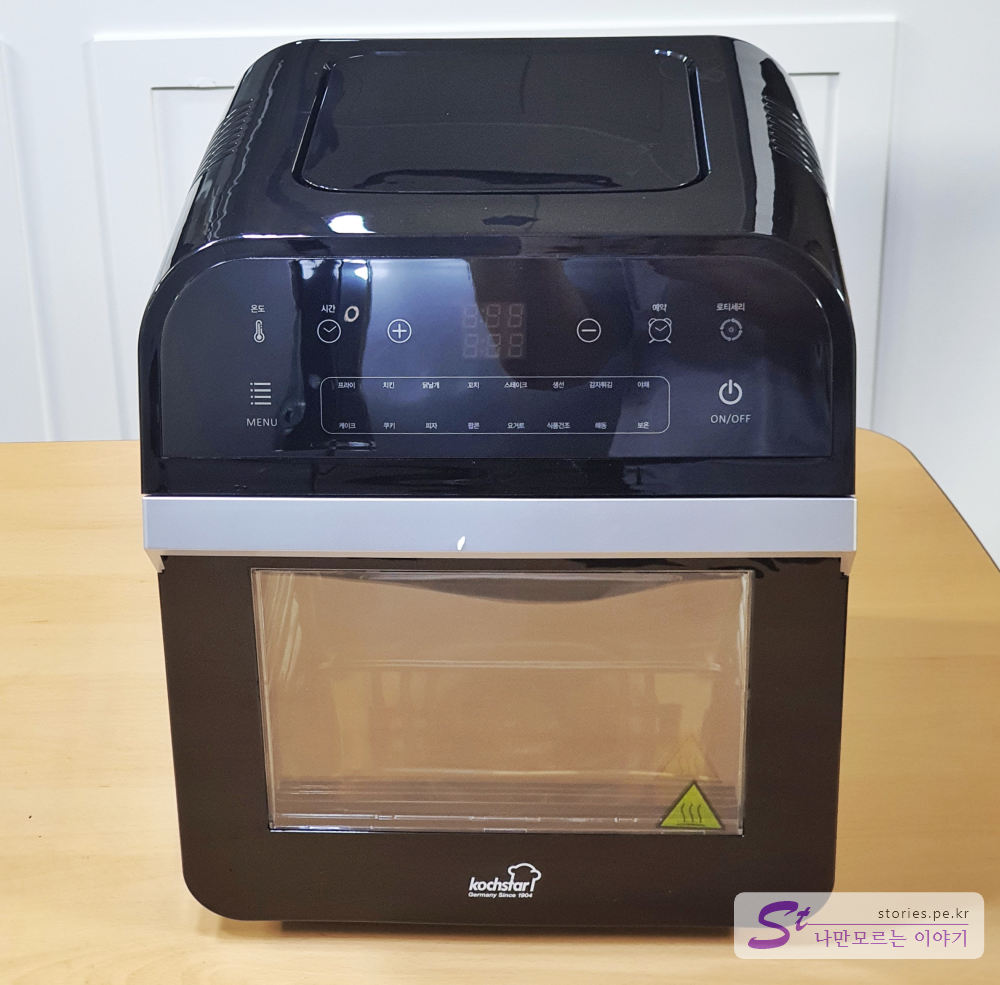  
제품은 마치 소형 전기오븐처럼 생겼습니다. 크기도 12L라 다소 크게 느켜지기는 하지만 무게는 생각보다 무겁지 않아서 여자들도 집안에서 들고 이동하기에 크게 무리가 없습니다. 

작동방법은 좀 특이한데 먼저 전원버튼을 눌러서 켜주고 16개의 코스를 선택할 떄 직접 그 위치의 버튼을 누르른 것이 아니라 **MENU 버튼**을 눌러 메뉴를 이동해서 선택하는 방식입니다. 말하자면 7번째에 있는 감자튀김를 선택하려면 MENU버튼을 7번 눌러줘야 한다는 것입니다. 그리고 나서 다시한번 전원버튼을 눌러주면 작동을 시작하게 되어 있습니다. 독일제품이라 그런지 뭔가 UI가 우리나라사람들에게 불편하긴 합니다. 
에어프라이기에서 가장 중요한 **온도**와 **시간** 조절 장치가 왼쪽에 있고 잘 사용하지 않는 예약과 로티세리는 오른쪽에 위치해 있습니다. 로티세리 버튼을 눌러주면 기기 내부에서 회전봉을 회전 시킬 수 있습니다. 

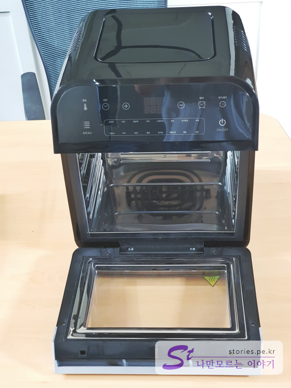  
제품의 문은 오븐처럼 앞으로 열립니다. 장점이라면 제품안에 있는 뜨거운 요리를 꺼낼때 문이 덜 걸리적 거리며 오히려 살짝 문위에 올려놓을 수 있어서 좋습니다. 

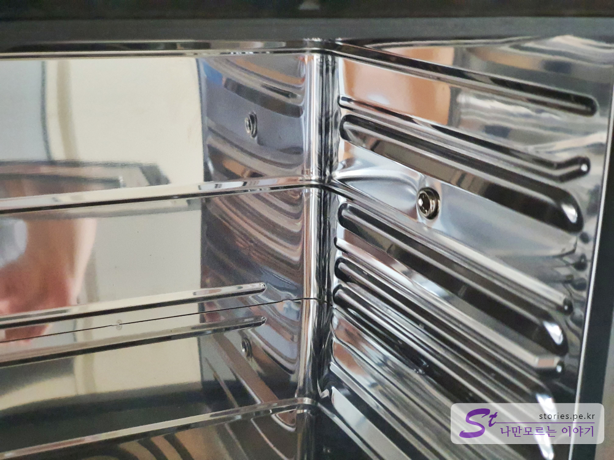  
제품 안쪽은 녹이 슬지 않도록 스테인리스를 사용하고 있으며 중간쯤에 **로티세리**로 통닭같은 음식을 회전 시켜주는 장치 구명이 있습니다.  

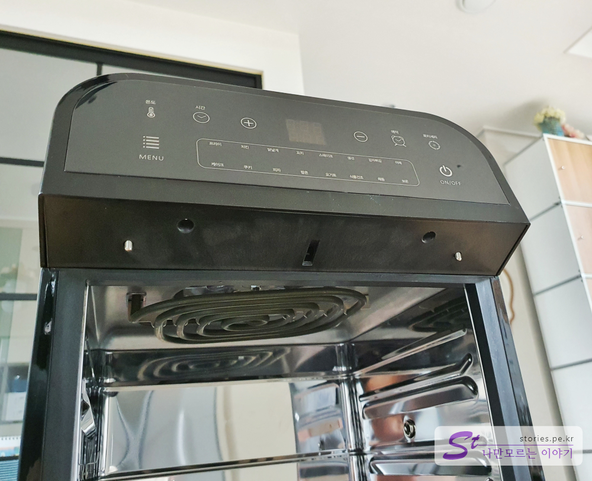  
제품의 열선은 상단부에 있습니다. 상단에서 열을내고 공기를 순환하여 음식물을 익히는데 사용됩니다. 마치 오븐과 같은 역활을 합니다.  

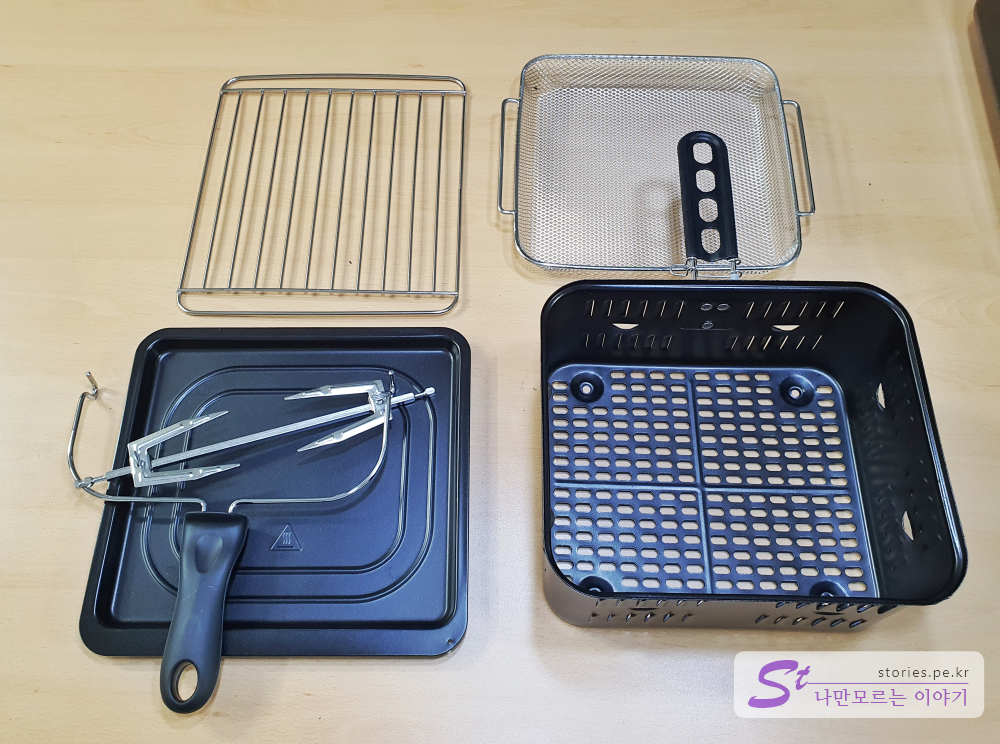  
KSEAF-3000**H**의 구성품은 `와이어 선반`, `망 바스켓`, `로티세리 봉`, `로티세리 집게`, `오븐팬`, `5L 바스켓`으로 구성 되어 있습니다. 기본모델인 KSEAF-3000에서 5L바스켓이 하나 더 추가된 모델입니다. 

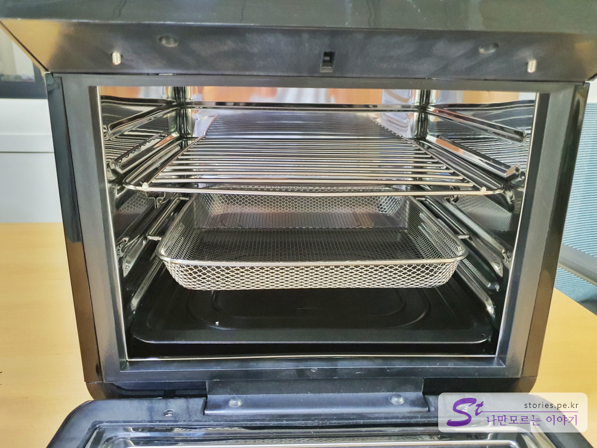  
구성품은 사진과 같이 제품 안에 걸쇠에 걸쳐서 사용하면 됩니다. 

## 내가 생각하는 장점  
대용량이다 보니 요리의 종류도 많아지고 한번에 처리할 수 있다는 장점이 있습니다. 또한 오븐의 기능도 하고 있어서 오븐 대용으로도 사용이 가능합니다. 한번에 세팅할 수 있는 16가지의 프리셋 기능도 나름 유용합니다. 

## 내가 생각하는 단점  
다른 에어프라이기도 마찮가지겠지만.. 요리를 하고 나면 제품내부가 금새 더러워집니다. 잘 닦아줘야 합니다. 
계기판을 조작하는 방법이 영~ 그지같습니다. 몇번 상용해서 익숙해지면 괜찮지만 처음 사용할때는 설명서 없이 사용하기가 좀 어렵게 되어 있습니다.  

## 가격 및 구매처  
가격은 구성품에 따라 많은 차이가 있습니다. 저는 특수한 경로로 저렴하게 구매를 해서 일반적이지 않으니 소개를 해드리 수는 없고 네이버 쇼핑에서 검색을 하게 되면 대략 20만원에서 80만원의 가격대를 형성하고 있습니다. 너무 가격의 폭이 넓은데 사실 본체는 동일하고 구성품의 차이입니다. **기본 제품인 `KSEAF-3000`로 검색해서 신뢰가 가는 업체에서 최저가로 구입하는 것을 추천드립니다.** 그러면 20만원대에 구매를 할 수 있습니다. 위의 구성품 중 대용량 5L바스켓만 빠지면 `KSEAF-3000`입니다. 
`KSEAF-3000H`로 검색을 하면 70만원대가 되버립니다. 바스켓하나 차이인데...

## 설명서  
도움이 될것 같아 설명서를 붙혀봅니다.  

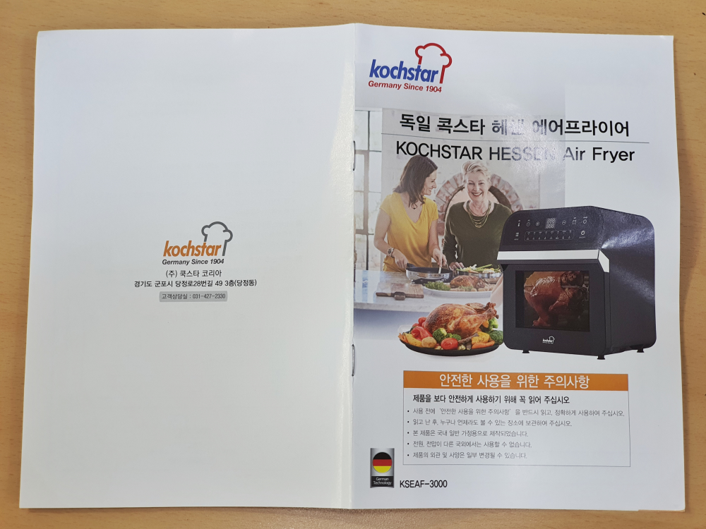  

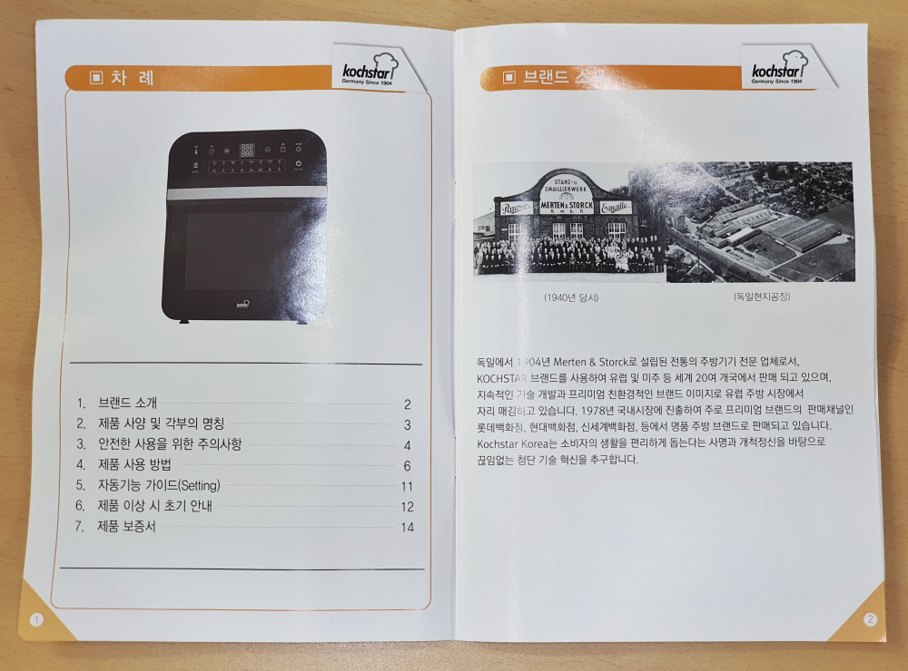  

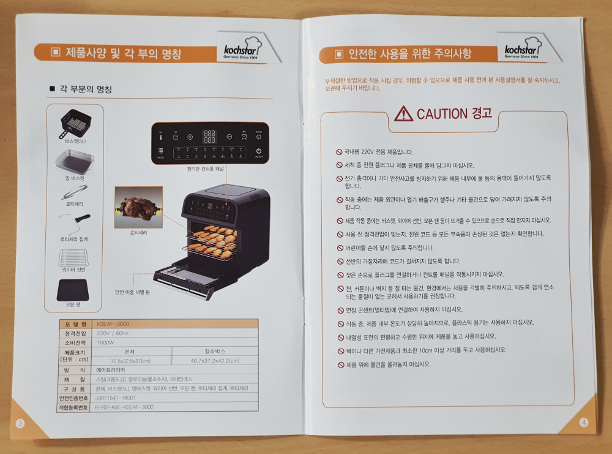  

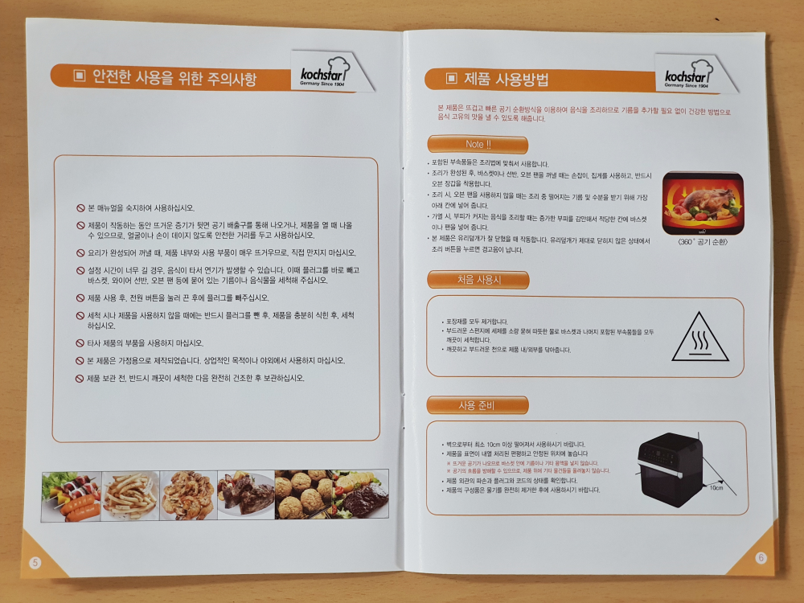  

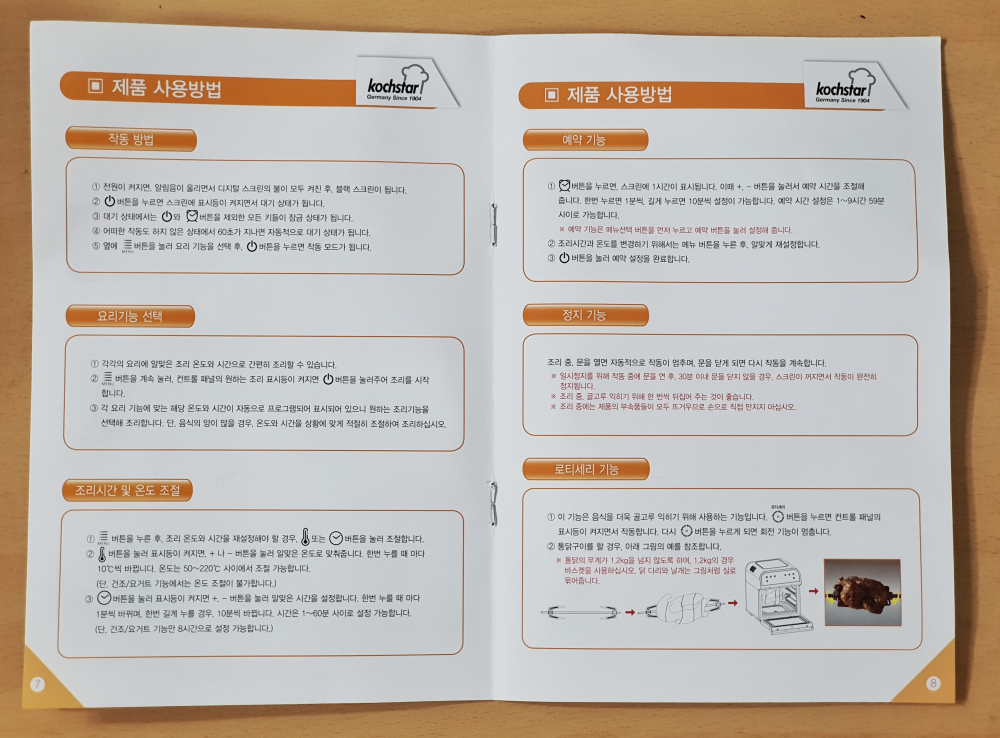  

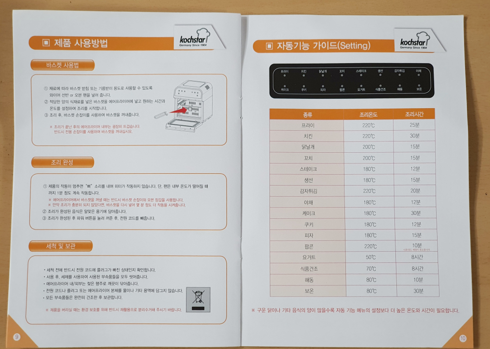  

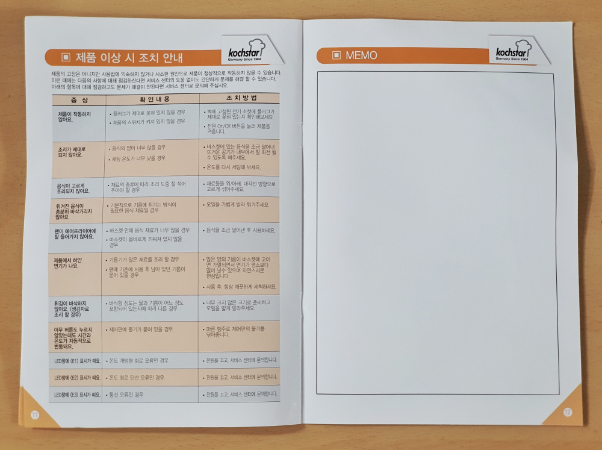  

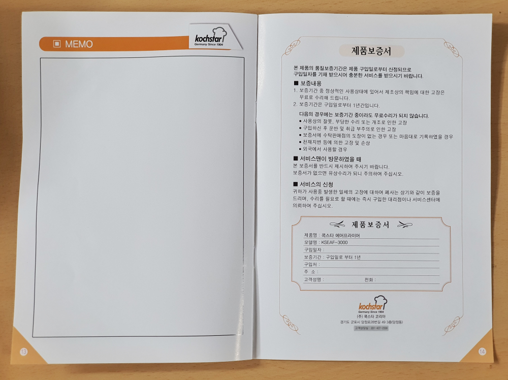  

