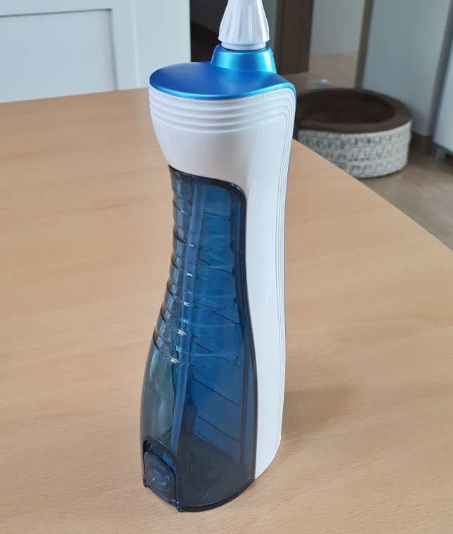

홈쇼핑에서 치약을 사면 무선 구강세정기를 준다길래 치약은 둘째치고 구강세정기가 궁금해서 질러버렸습니다. 치약은 저~기 치워놓고 구강세정기를 언박싱해봤습니다. ^^

## 언박싱

  
동국제약에서 생산한 무선 구강세정기입니다. 동국제약에서 이런것도 만들어?? 라고 생각되지만 생각보다 완성도가 좋습니다.

  
주요특징이라면 `3가지 분사방식`, `360도 노즐 회전`, `편리한 노즐 탈부착`(탈부착 어려워요 ㅠㅠ), `간편한 물보충`, `자동 리튬이온 배터리 충전기`가 있습니다. 다른것은 다 수긍이 되지만 편리한 노즐 탈부착은 동의할 수 없습니다. 끼는것은 쉬운데 빼는 것은 정말 힘이 듭니다.

  
5가지의 주요특징이 적혀있습니다.

  
제품의 각 부분 명칭과 효과가 나타나 있습니다.

  
구성품은 본체, 충전기, 노즐 2개, 설명서로 구성되어 있습니다.

  
노즐을 체결하면 이런 모양이 됩니다. 손에 잡으면 좀 큰 느낌은 나지만 물통을 감안하면 이해가 되는 수준입니다.

  
모드버튼과 전원버튼이 있습니다. 모드는 `Normal`, `Soft`, `Pulse`로 총 3가지 모드가 있는데 저는 **Soft가 적당**한것 같았습니다. Normal과 Pulse는 너무 세더라구요.
모드를 선택하고 전원버튼을 눌러서 켜고 끌 수 있습니다.

  
뒤에는 물통이 붙어 있습니다. 한통채우면 조금 모자라게 사용할 수 있습니다. 2번 물통을 채워서 사용하면 적당한것 같아요.

  
물을 넣을 수 있는 곳입니다. 제품이 방수라 물이 묻어도 상관없습니다.

## 내가 생각하는 장점

사용해 보면 정말 시원하게 찌꺼기가 빠집니다. 나름 쾌감이 있어요.
무선이라 줄에 대한 불편함 없이 사용할 수 있습니다.

## 내가 생각하는 단점

물통 한통으로는 약간 모자란 감이 있습니다. 2번 채워서 사용해야 적당합니다.
노즐을 뺐다가 꼈다가하는것이 많이 힘이듭니다. 끼는 것은 쉬운데 빼는것이 어렵습니다.  
Normal과 Pulse모드는 잘못 쏘면 입이 아프고 피가나요. 세디스트라면 좋아할지도 모릅니다.

## 가격 및 구매처

저희는 홈쇼핑에서 치약을 구매하고 사은품으로 받았는데, 네이버 쇼핑에서 검색해 보면 **42,000원~ 48,000원**정도에 가격대가 형성되어 있습니다.

## 설명서

