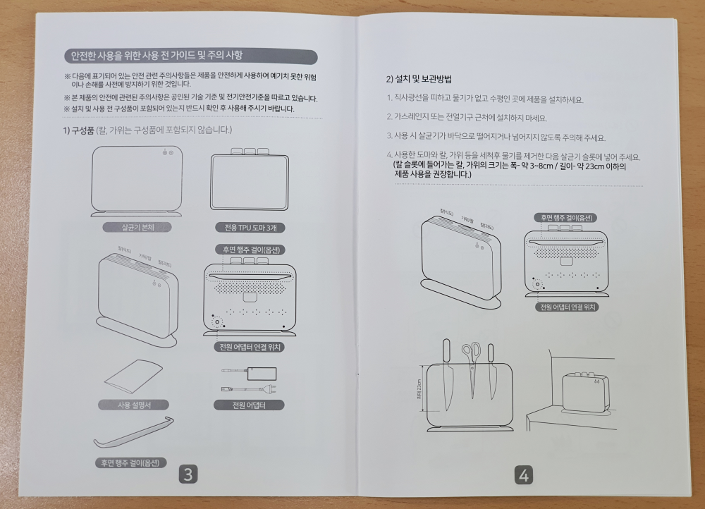

주방에서 가장 세균이 많은 곳이 도마, 칼이라고 합니다. 이 세균을 효과적으로 제거할 수 있는 도마살균기가 있어 소개합니다. **코로나19**가 창궐한 이때 코로나19를 효과적으로 살균할 수 있다고 입증된 **UV LED 램프**와 열풍으로 살균을 합니다.  

## 언박싱  
락엔락에서 이런것도 만드네요 **칼도마살균기** 입니다.  

  
도마는 범용 도마는 아니고 전용 도마를 사용합니다. 육류, 어류, 야채용 3종류의 도마로 이루어져 있고 별도로 도마만 구매를 할 수 있습니다.  

  
다양한 기능설명이 되어 있습니다. 3개의 도마와 UV램프, 고열 에어 건조 기능이 있네요.

  
옆면에는 상품의 제원이 표시되어 있습니다. 모델명이 LHS001KEK 입니다.

  
본체는 제품보호를 위해 공기가 차있는 완충재로 둘러싸여 있습니다. 종류별 3개의 도마가 있고 아답타와 행주걸이가 있습니다.  

  
본체는 플라스틱으로 되어 있어서 고급져 보이지는 않습니다. 너무 가벼워요.  
전원과 열풍 버튼 2개가 보이네요. 

   
본체 뒷면에는 행주걸이가 있고 아래에는 전원연결 짹이 있습니다. 

전원 어뎁터를 연결한 모습입니다. 

  
상단에는 도마를 넣을 수 있는 3개의 홀이 있고 칼도 같이 살균할 수 있습니다.   

  
본체 하단에는 미끄럼방지 고무가 붙어 있습니다. 무게가 가벼워서 묵직한 느낌은 없습니다.  

  
물받이가 있어서 물이 지저분하게 흐르는 것을 막아 줍니다.   

  
물받이는 앞으로 잡아 당겨서 뺼 수 있습니다.  

  
도마는 3개를 나란히 꽂아서 살균을 할 수 있습니다. 도마는 연질이라서 조금 약해 보이기는 하지만 따로 도마만 구입할 수 있는 것은 장점입니다.    

## 내가 생각하는 장점  
코로나19로 민감한 이때 UV램프와 열풍으로 살균할 수 있어서 좋습니다. 도마도 쉽게 정리 할 수 있고 별도로 구매를 할 수 도 있습니다.  

## 내가 생각하는 단점  
도마가 연질이라 조금 약해 보입니다. 본체 재질이 프라스틱이라 고급져 보이지는 않습니다. 열풍 살균을 하면 소음이 조금 있습니다. 

## 가격 및 구매처  
가격은 네이버쇼핑에서 **78,000원 ~ 90,000원대**를 형성하고 있습니다.  

  
 

## 설명서   

  

  

  

  

  

  

 

  

