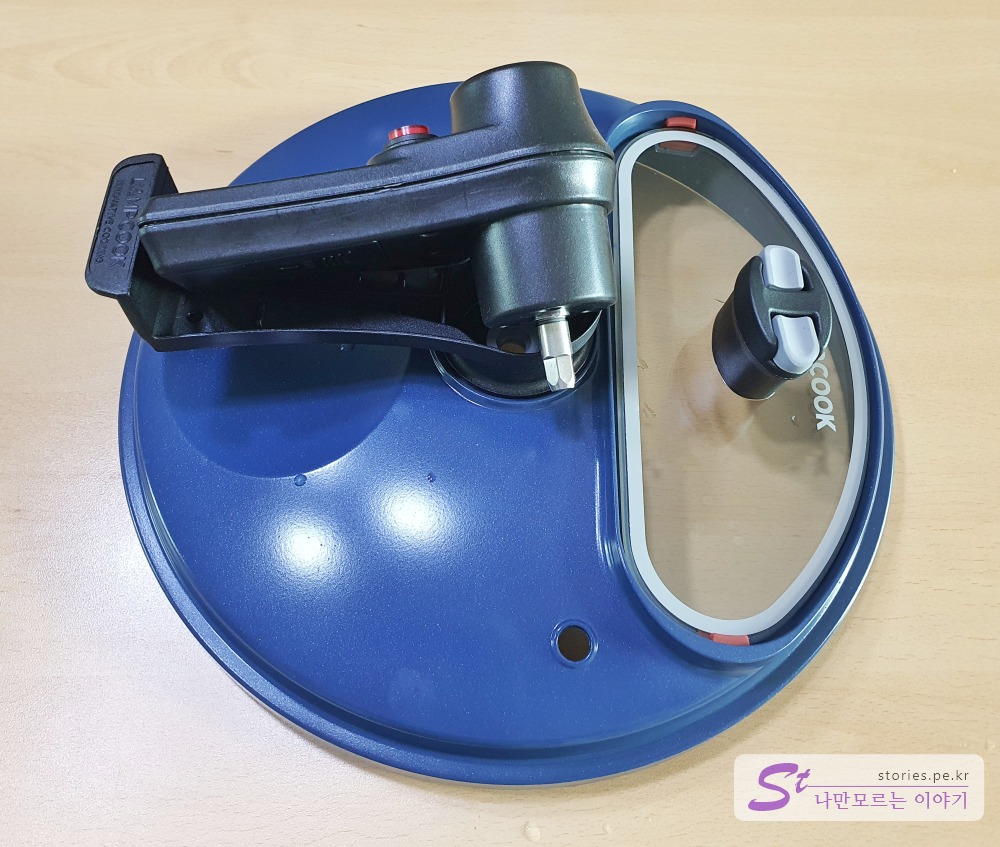
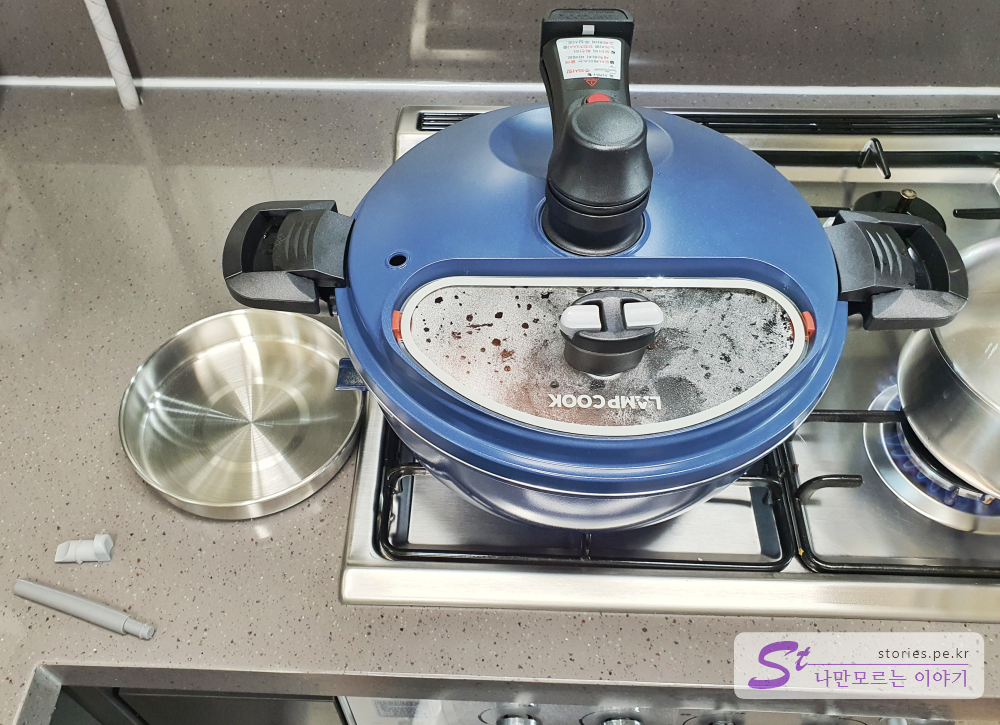

간만에 인생템 하나 득템했습니다. 제품을 받고 오리구이를 한번 해봤는데 정말 마음에 들어서 소개합니다. 

  

에어프라이어기를 주로 사용했었는데 기름이 나오는 음식을 한번 돌리면 기름 때문에 설겆이가 어려워 잘 사용하지 않았었는데.. **램프쿡 자동 회전 냄비**는 그러한 단점을 쉽게 해소해 주었습니다.   

## 언박싱  

  
박스 개봉부터 촬영을 했어야 했는데 급한 마음에 박스는 이미 뜯어 버렸습니다. 제품의 구성은 본체와 기름받이 구동핸들, 메뉴얼 등이 있습니다. 

  
냄비는 전체가 코팅이 되어 있어서 눌러붙음을 방지하고 있습니다. 

  
냄비에 회전장치를 체결한 모습입니다. 회전장치는 기본 쇠봉과 중간쯤에 실리콘봉이 달려 있는데 고기(육류)를 볶을때에는 중간의 실리콘봉을 제거하고 사용해야 합니다. 실리콘봉은 죽이나 쨈을 만들때 사용하라고 하네요.  

   
뚜껑은 손잡이와 손잡이에 체결할 **구동핸들**로 되어 있습니다. 한쪽에는 강화유리로 되어 있는 반뚜껑이 있어서 조리하면서 중간 중간에 추가 요리 재료를 넣을 수 있습니다. 

  
강화유리는 손잡이 부분에 스페어 기름막이가 2개가 더 준비되어 있어서 혹시라도 잃어버릴 경우 사용할 수 있습니다.  

  
구동장치는 손잡이 위에 체결하여 사용합니다. 안에는 모터가 들어있어서 스위치를 누르면 모터가 회전하며 회전장치를 돌려주게 되어 있습니다.  

  
구동핸들은 AA건전지 2개로 회전을 합니다. 건전지를 많이 준배해 놓던가 충전지를 준비하는 것이 좋을 것 같습니다.   

  
구동핸들은 이정도로 회전을 합니다.  

  
기름받이는 불에 타지 않는 스테인리스 제질로 되어 있고 충분히 크기가 커서 사용하기 좋습니다.  

   
기름막이는 냄비의 하부에 달려있습니다. 기름이 많이 나오는 삼겹살, 오리고기 같은 것을 구울 때는 기름막이를 빼고 사용하고 죽이나 쨈 같은 것을 만들 때는 기름막이를 막고 사용하면 됩니다.  

  
이런 모양새로 음식을 굽게 됩니다. 

## 내가 생각하는 장점  
- 고기를 구울때 기름이 사방으로 튀지 않아 깔끔한 요리가 가능합니다. 
- 음식을 뒤집을 필요없습니다. 고기를 올리고 딴짓하다오면 요리가 되어 있는 모습을 볼 수 있습니다. 
- 코팅이 되어 있어 음식이 눌러붙지 않습니다. 
- 인덕션에도 사용이 가능합니다. 

## 내가 생각하는 단점  
- 아무래도 구석구석 설겆이가 어려운점이 있습니다. 
- 가격이 10만원대라 좀 비싼편입니다. 
- AA건전지 2개를 사용하기 때문에 건전지 소모가 큽니다.  
- 인덕션에 사용시 기름받이를 받칠 수 가 없어서 별도의 장치를 사용해야 합니다. 

## 가격 및 구매처  
가격은 10만원 안팎입니다. 저희는 홈쇼핑에서 **10개월 무이자로 99,000원**에 구매를 했습니다. ^^
네이버쇼핑을 찾아보니 여기서도 **99,000원**에 가격이 형성되어 있네요. 

  

## 설명서  

  

  

  

  

  

  

## 요리책   
설명서와 요리책이 포함되어 있습니다.  
  

