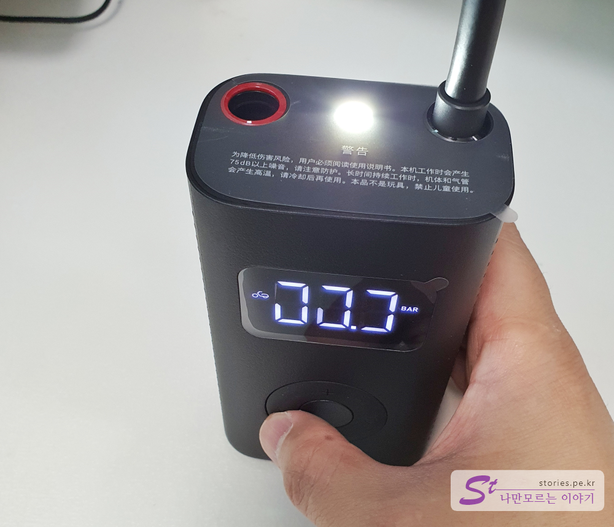

국내에도 이런 기업이 있었으면 좋겠지만 아쉽게도 아직까지는 좀 어려운게 현실인가 봅니다. 스마트폰으로 시작해서 지금은 다양한 제품에 손을 대고 있는 중국의 샤오미입니다. 저렴한 가격에 성능 좋은 제품을 다른 회사와 손을 잡고 출시하고 있습니다. 가끔 실망스러운 제품을 출시하기도 하지만 이번에 제가 구입한 **휴대용 공기충전기**는 상당히 만족스러운 제품이라고 할 수 있습니다. 

  

## 언박싱  

마치 자물쇠처럼 생긴 모양의 공기충전기는 생각보다 가볍고 크기도 작습니다. 자전거 라이딩 시 휴대하기에 좋게 생겼습니다. 물론 자물쇠 고리처럼 생겼다고 해서 그걸로 자전거에 걸 수는 없습니다. ^^ 

  
글로벌 버전이 아니라 패키지는 온통 한자로 되어 있어서 읽을 수 가 없습니다. 다만 그림을 보고 유추할 수 있을 뿐입니다. 자전거, 오토바이, 자동차, 농구공, 축구공에 사용할 수 있다는 표시입니다. 

   
박스 뒷면에는 제품의 제원이 설명되어 있습니다. 5V짜리 2000mAh 충전기가 내장되어 있나봅니다.  

  
구성품을 펼쳐보았습니다. 제품의 크기를 비교하기 위해 마우스랑 같이 찍어봤습니다. 사진을 찍어보니 마우스가 좀 더럽네요.ㅎㅎ
어찌되었든 마우스보다 조금 더 큰 크기이고 제원에 나와 있는 정식 크기는 200 x 78 x 54mm 입니다. 

구성품은 본체, 메뉴얼, 충전케이블, 충전팁 2개, 보관 파우치가 포함되어 있습니다.   

  
자물쇠의 고리처럼 생긴 부분을 잡아당기면 톡하고 빠지며 그곳으로 공기를 주입할 수 있습니다. 전원의 온오프는 이것을 빼면 ON이되고 끼우면 OFF가 됩니다. 

   
4개의 원형으로 되어있는 조절장치이며 가운데 버튼을 포함하여 총 5개의 버튼으로 이루어져 있습니다. 왼쪽에 있는 버튼은 LED라이트를 켜고 끌 수 있는 토글버튼입니다. 상단과 하단의 버튼은 공기 압력의 값을 높이고 내릴 수 있는 버튼입니다. 

  
가장 오른쪽에 있는 버튼은 미리 세팅되어 있는 자전거, 오토바이, 자동차, 공의 4개 모드가 순환이 됩니다.   

   
제품의 하단에 충전단자가 있습니다. 5pin 케이블로 충전할 수 있으며 충전중에는 램프가 숨을 쉬듯 깜빡입니다. 충전이 완료되면 계속 켜져있는 상태로 있습니다.  

   
제품의 옆면에는 공기구멍들이 있습니다. 아무래도 이쪽으로 외부공기를 유입하지 않나 싶습니다.  

  
뒷면에는 미지아 로고가 있네요. 

  
상단의 호수는 빨간색 표시되어 있는 부분을 뽑아서 사용하게 되어 있습니다. 프레스타방식의 아답타를 끼운 상태에서도 동일하게 삽입과 분리가 가능합니다. 

   
기본 팁은 던롭 방식의 충전 팁입니다.  

  
어두운 곳에서 공기를 주입할 수 있도록 램프도 달려 있습니다.  

  
충전은 안드로이드 제품을 충전하는 `5pin 케이블`로 되어 있습니다. 요즘 나오는 C-Type이였으면 더 좋았을 텐데요.
충전팁은 2개가 곂쳐있습니다. 하나는 공을 충전하는 알루미늄의 긴 대롱 모양의 팁이고 또하나는 프레스타(Presta) 방식의 벨브를 사용할 수 있는 팁입니다. 그리고 제품 자체에 붙어 있는 기본은 자전거에 많이 사용하는 던롭(Dunlop) 방식의 벨브를 이용할 수 있는 팁입니다.

  
파우치도 적절히 잘 구성되어 있습니다. 파우치 입구쪽에 조그만 주머니가 달려있어서 충전케이블과 충전팁들을 잃어버리지 않게 보관할 수 있습니다.  

## 기타  
액정의 단위는 PSI와 BAR을 사용하고 있습니다. 공과 자전거는 PSI로 표시되고 오토바이와 자동차는 BAR로 표시해주고 있습니다.  

`1 BAR `는 약 `14.5 PSI`입니다. 

단위 환산은 아래에서 하시면 됩니다. 
https://search.daum.net/nate?w=tot&DA=Z3T&rtmaxcoll=Z3T&q=%EC%95%95%EB%A0%A5%20%EB%8B%A8%EC%9C%84%EB%B3%80%ED%99%98   

   

## 내가 생각하는 장점  
생각지도 못한 크기의 완성도 높은 자동 공기주입기 입니다. 
미리 설정된 압력값까지 자동으로 충전을 해 줍니다. 
LED램프가 달려있어서 깨알같은 편의를 제공합니다. 

## 내가 생각하는 단점  
상황에 따라 충전 호수가 좀 짧게 느껴질 때가 있습니다. 
실내에서 충전할 때 펌프소리가 좀 큽니다.   

## 가격 및 구매처  
대부분 중국에서 수입을 해서 판매하기 때문에 배송시간이 좀 오래 걸립니다. 
가격은 보통 3만5천원에서 4만원대에 형성이 되어 있습니다. 네이버쇼핑에 가격은 1만원대도 적혀있으나 배송비까지 합친 가격을 보면 그정도 가격입니다. 

## 설명서  
중국어로 되어 있는 설명서라 별 필요는 없어보이지만...
   

