사무실에서 일하다 보면 핸드폰을 충전해야 할 필요성이 절실해 집니다. 스마트폰을 오래 사용하다보면 아침까지 충전한 스마트폰이 하루를 못가기 때문입니다. 그래서 이번에 탁상용 스텐드 무선 충전기를 하나 구매했습니다. 여러가지 스텐드 무선충전기를 비교하여 최종 **주파집 15W 초고속 무선충전기 HWC-01**를 선택했습니다. 

## 언박싱  

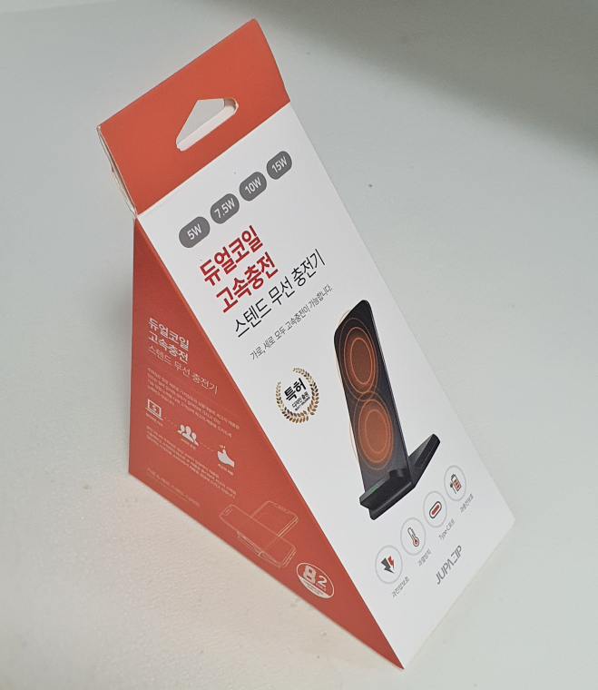  
처음 도착했을 때 포장이 꽤 신선했습니다. 마치 센드위치 같이 생겼더군요. 전면에 제품이름과 특징을 잘 설명해 놨습니다. 아이폰, 삼성, 엘지, 구형모델, 신형모델 등을 지원할 수 있도록 5W, 7.5W, 10W, 15W의 다양한 용량을 지원하고 있습니다. 또한 듀얼코일을 제공하고 있어서 가로와 세로를 모두 지원하고 과전압보호, 과열방지, 과충전보호, C-Type을 지원한다고 합니다.  

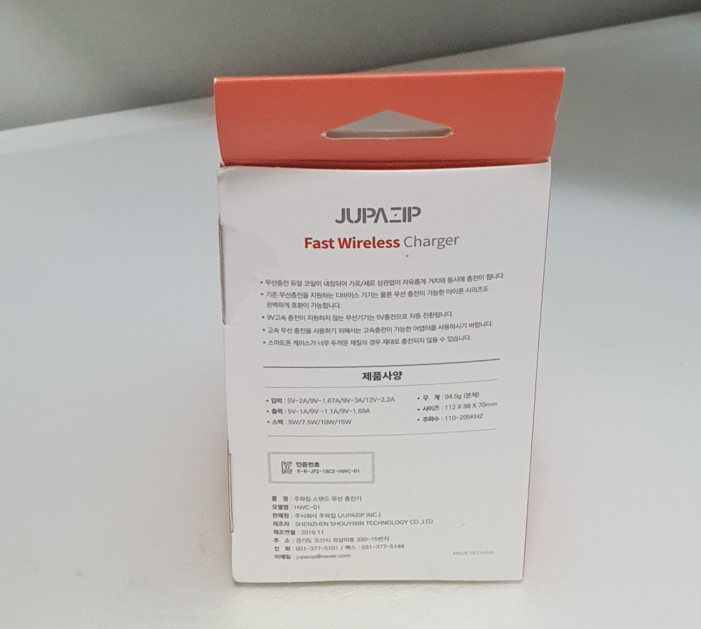  
제품의 뒷면에는 주파집의 브랜드명이 있고 다양한 제품사양이 적혀 있습니다. 

### 구성품   
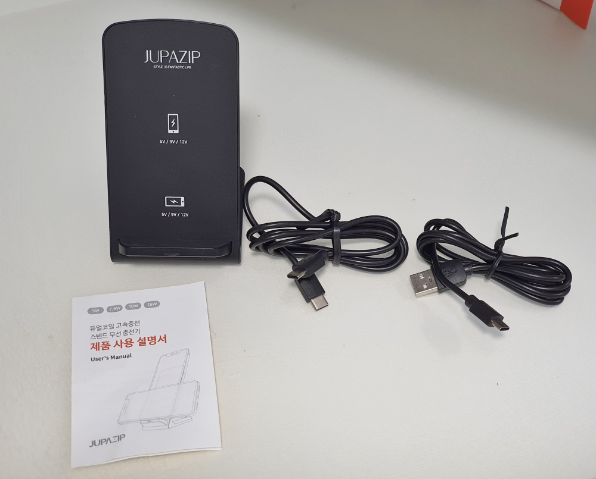  
구성품은 본체, C to C, C to Usb케이블 그리고 설명서가 있습니다. 

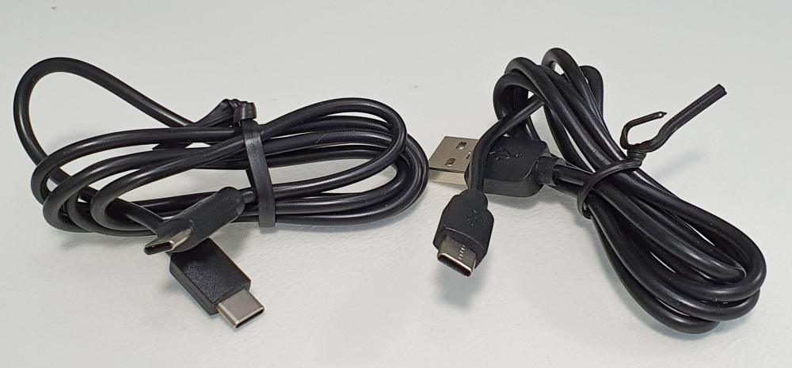   
케이블은 2가지 종류가 들어있는데 PD(Power Delivery)를 지원하고 있어서 고속충전을 가능하게 합니다. 

> PD(Power Delivery)란?  
> USB는 케이블 하나로 데이터 통신과 전력 제공이 가능하다. 하지만 초창기 규격은 컴퓨터 메인보드에 무리가 없는 5V 500mA 였으나, 시대가 흘러 태블릿 컴퓨터를 충전할 수 있는 규격이 필요해지면서 USB Power Delivery(PD)의 버전이 올라가게 되었다. 때문에 최대 100W까지 제공하는 것을 스펙에 명시하고 있다. 프린터, 3.5" 외장 하드디스크, 심지어 노트북이나 저전력 PC의 전원 케이블이 굳이 필요없을 정도로, 책상 주변 전선이 깔끔하게 정돈될 것으로 기대되고 있다.
> - [나무위키 참조](https://namu.wiki/w/USB#s-4.3)

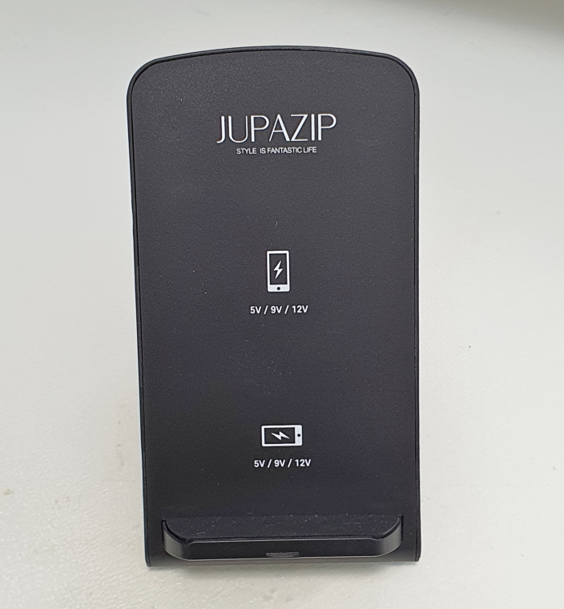  
본체는 스텐드형이고 뒤로 누워져 있는 형태라 스마트폰을 올려놔도 떨어질 일이 없습니다. 올려놓는 스마트폰의 종류에 따라 5V, 9V, 12V를 자동으로 전환해 줍니다. 사용자 입장에서는 상당히 편리한 기능입니다. 제품이 작동이 될때는 충전기의 하단에 LED 불빛이 초록색으로 표시가 됩니다. 

  
측면에서 보면 뒤로 살짝 누워있는 상태입니다. 아쉬운 점이라면 기울기 각도를 조절할 수는 없다는 점입니다. 

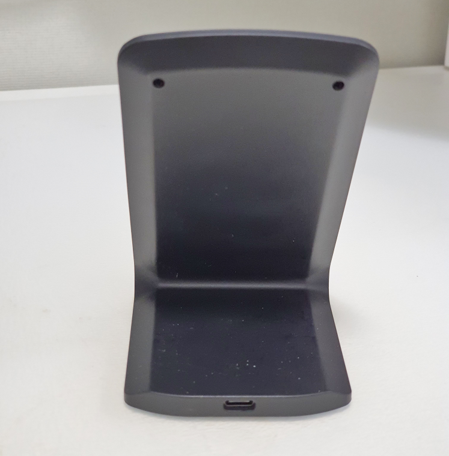  
뒷면도 상당히 심플합니다. Type-C 케이블을 연결하는 단자가 하나 있을 뿐입니다. 

  
바닥에는 체품 사양이 적혀 있고 미끄럼방지 고무가 달려있습니다.  

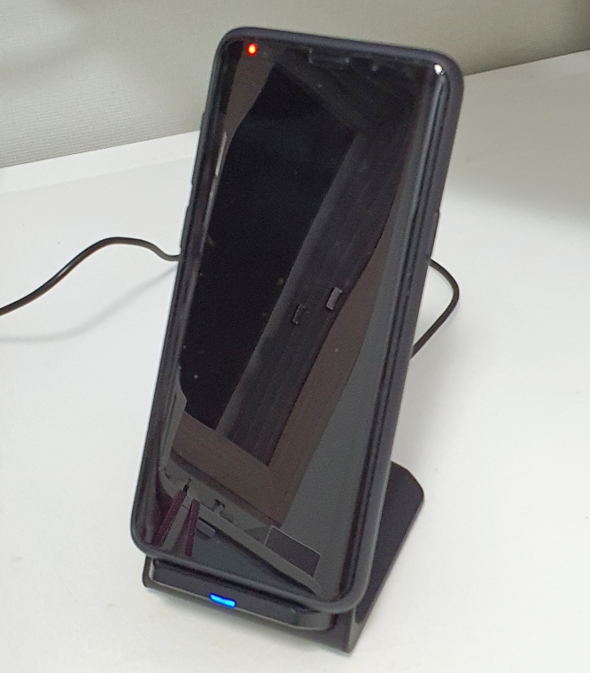  
노트9를 세로로 올려놔 봤습니다 아주 잘 작동합니다. 약간 두꺼운 범퍼 스마트폰 케이스를 씌워놓았는데 안에 아파트카드키가 들어있음에도 충전이 가능합니다. 다만 아파트카드키가 고장이 나지 않을까 살짝 걱정이 되기는 합니다. 충전 중에는 파란색 불이 들어옵니다. 

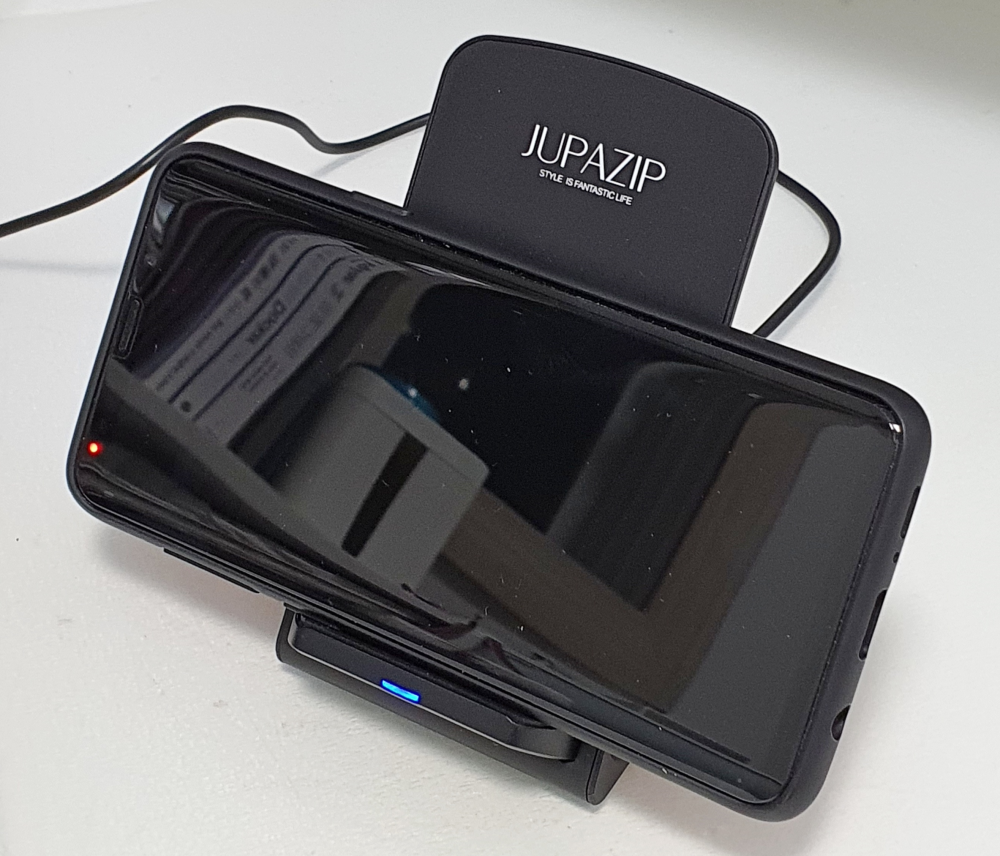  
이번에는 가로로 놔봤습니다. 역시 잘 작동합니다. 가로/세로 모두 정확한 위치에 올려놓아야 과전압, 과충전, 과열, 빠른충전이 된다고 하니 신경써서 가운데에 올려놔야 합니다.  

## 내가 생각하는 장점  
일단 PD(Power Delivery)지원으로 다양한 전력을 지원한다는 것과 그것이 자동으로 전환되어 아이폰, 안드로이드폰, 고속충전을 지원하지 않는 구형폰과 고속충전을 지원하는 신형폰까지 모두 충전이 가능하다는 장점이 있습니다. 
충전중일때는 파란색, 충전완료일때는 초록색 LED표시로 구분이 쉽습니다. 

## 내가 생각하는 단점  
스텐드의 각도를 조절할 수가 없어서 조금 아쉽네요. 좀더 일으켜 세우고 싶은데..
무게가 가볍습니다. 이게 장점일 수도 있겠으나 한번 책상에 올려놓으면 가지고 다닐일이 없으니 흔들리지 않게 무게감이 있는것이 더 좋지 않을까 합니다. 

## 가격 및 구매처  
가격은 현재 네이버쇼핑에서 **15,000원**대에 형성되어 있습니다. 저는 이렇게 저렇게 할인해서 운좋게 11,000원에 구매를 했네요.   

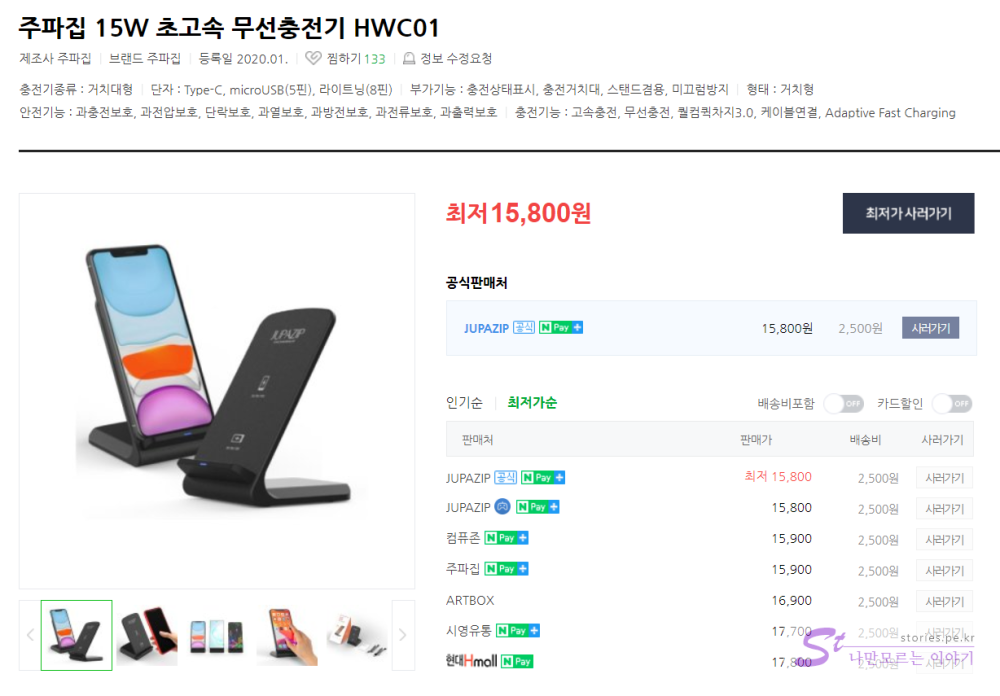  

## 설명서   

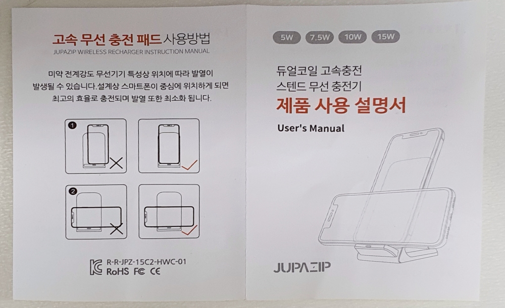  

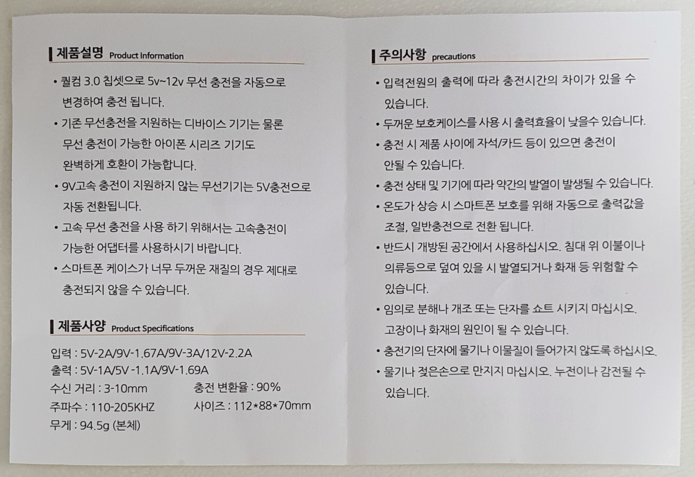  
