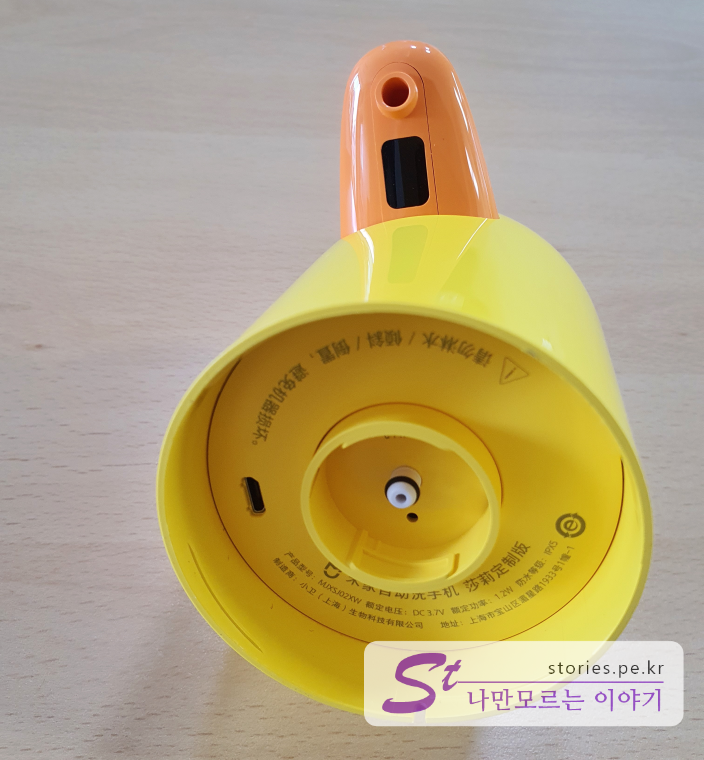

코로나19가 창궐한 이때에 이것 저것 조심해야 할 것이 너무나 많습니다. 그중에 예방을 위한 한가지 아이템이 있어 소개합니다. 사실 이 아이템은 어른도 어른이지만 아이들의 위생에 더 많은 도움이 될 것 같습니다. 

## 샤오미 미지아 3세대 자동 손 세정기 라인프렌즈 샐리 에디션  
자동 손세정기인데 라인프렌즈의 샐리의 모양을 하고 있습니다. 아이들이 좋아하죠. 더욱이 주둥이에 손을 대면 거품을 뿜어대니 아이들이 좋아하지 않을 수 없을것 같습니다.

샤오미는 가성비가 매우 우수한 제품을 선정하여 샤오미란 이름을 달아서 판매를 하고 있는데요. 손세정기는 이번에 4세대까지 나왔고 그중에 **3세대가 라인프렌즈 샐리 에디션**입니다. 
중국에서 판매하는 것이고 네이버의 직구업체를 통해 위탁구매 했습니다. 배달기간이 대략 2~3주정도 걸렸습니다.  

## 언박싱  

  
죄대 중국말이라 글자는 크게 중요하지 않았구요. **Line Friends**라는 글자와 **미지아** 로고를 보고 **아~ 재대로 주문했구나~** 라는 안도를 먼저 했습니다. 

  
옆면에는 제품 특징이 그려져 있습니다. 위에서 부터 아래로..  

- 0.25초 만에 손이 들어온 것을 인지하고 거품을 내 뿜어 준다
- 내구성이 좋은 모터를 사용한다
- 건전지가 필요없는 충전식이다
- 샐리에디션이다

대충 이런뜻입니다. 

  
내용물이 220mL가 들어간다고 써있고.. 나머진 노란 건 배경이요 검정 건 글씨라는 것 밖에는 알수 없네요. 

## 구성품    
  
구성품은 모터가 있는 머리, 거품 액상을 넣는 세정제 통, 그 통을 보호해 주는 반투명 커버로 되어 있습니다. 그리고 설명서와 충전을 위한 케이블이 있습니다.   

  
충전케이블은 **마이크로 5핀** 케이블이네요. 요즘은 대부분 C-Type인데 5핀케이블이면 출시한지는 좀 된 모델이란 뜻이겠죠?

  
세정제통입니다. 전용통이라고 하는데 다 쓴 다음에 일반 리필을 한번 해봐야 겠어요.

  
뚜껑을 열어보면 안에 액체를 막는 또 다른 마게로 보호되어 있습니다. 이 속마게까지 벗겨내고 장착을 해야 합니다.  

  
핵심부품인 머리 입니다. 모터가 들어있고 전원버튼이 있으며 충전을 시킬 수 있습니다. 그런데.. 눈이 없습니다. ㅠ,.ㅠ;

  
머리를 뒤집어 보면 주둥이 쪽에 거품이 나오는 구녕이 있고 사람 손을 인지하는 센서가 달려있습니다. 본체 하단에는 설명서 종이로 막아놔서 보호 및 안내를 담당하고 있습니다.  

   
벗겨봤습니다. 마이크로 5핀 충전단자가 있고 액상을 빨아들이는 흡입구가 달려 있습니다.  

  
먼저 세정제 통을 돌려서 부착 시킵니다.  

  
그리고 나머지 투명통을 돌려서 체결합니다. 샐리의 방향을 잘 맞춰서 채결해야지 잘못하면 얼굴이 딴곳을 처다 볼 수 있습니다. 중국에서 날라오느라 힘든지 거품 물고 있네요.

  
손을 대면 0.25초만에 풍성한 거품을 뿜어 냅니다. 

## 내가 생각하는 장점  
일단 캐릭터가 이뻐요.. 
가성비가 좋습니다. 
USB충전 형태라 좋습니다. 
모든걸 조립한 상태에서 IPX5의 생활방수가 됩니다. 

## 내가 생각하는 단점  
전용세제가 기본입니다. 세정액을 다 쓴 다음에 제가 강제로 다른 액체를 넣어서 사용 해 보겠지만 일단 기본은 전용 세정액을 사용하도록 되어 있습니다. 

## 가격 및 구매처  
네이버에서 구매하는 해외 직구 상품의 경우 가격으로 장난을 치는게 배송비입니다. 국내는 대부분 2500원 ~ 3000원으로 통일되어 있지만 해외 배송인 경우는 천차만별입니다. 네이버 검색으로 가격이 싸다고 보면 배송비가 어마어마하게 비싼 경우가 많습니다. 그래서 배송비까지 다 합친 금액을 보면 대략 **3만원 ~4만원 정도**에 형성되어 있습니다. 

> 구매처 : https://smartstore.naver.com/xiaomiya/products/4715771259  

  

