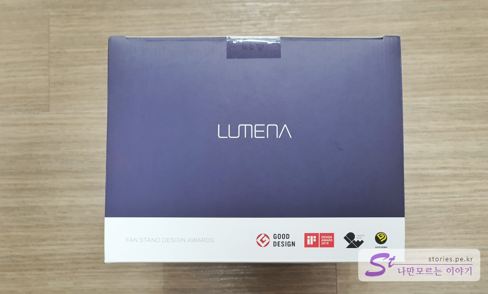

여름이 다 끝나갈 무렵이긴 하지만 책상에서 사용할 선풍기가 하나 필요해서 충동적으로 구매를 해버렸습니다.

구매한 제품은 오난코리아에서 출시한 **루메나 FAN STAND 3**입니다. 언제부턴가 일반 선풍기 모터의 대세가 되버린 **BLDC모터**를 채용하고 있고 제품의 크기가 작아서 책상 위에 올려놓고 사용하기에 딱 좋습니다.

> 브러시리스 모터(Brushless Direct Current motor, BLDC motor)는 직류전동기와 비슷한 출력 특성을 가진 동기전동기의 일종이다.
> dc모터는 도선이 자기장 안에 있을 때 받는 힘인 전자기력에 의해 토크를 얻게 되는데, 브러시(brush)라는 부분이 도선과 닿는 부분이 수시로 바뀌며 돌기 때문에 회전방향이 유지되며 빠른 속도로 돌아갈 수 있다. 이때 가만히 있는 부분을 고정자 (stator), 돌고 있는 부분을 회전자(rotor)라고 부른다. 그러나 이러한 브러시는 맞닿은 채로 돌아가기 때문에 마모되기 쉽고, 어떨 때는 스파크의 원인이 되기도 한다. 또한 모터의 종류에 따라 하드웨어적 성능이 다르기 때문에 정밀하게 속도를 제어하기 매우 어렵다.
> 이러한 문제점을 해결하기 위해 도선이 맞닿아있지 않아도 토크를 만들어내고, 더욱 쉽고 편하게 소프트웨어적인 제어가 가능한 BLDC 모터를 만들어냈다. -Op IP
> BLDC모터의 회전자는 영구자석, 고정자는 코일(전자석)이다. 코일은 마주보고 있는 코일들끼리 함께 전류가 통한다. 마주보고 있는 코일끼리는 전류가 같은 방향으로 흐르면서 N,S극을 만들어낸다. 이때 회전자의 N,S극이 고정자에 의해 끌려오게 되고, 옆에서는 고정자가 반대 방향의 자기장을 만들어주어 회전자를 밀어낸다. 코일 간 서로 연결이 되어있기 때문에 한 코일에만 전류를 흘려주면 전류를 더 효율적으로 흐르게 만들 수 있다. 결국 3상 AC모터와 다른 점이 없어서 3개의 선중 2개만 바꾸어도 회전 방향이 바뀐다. 그렇기 때문에 이런 전류를 제어해줄 전자 변속기(ESC)가 필요하다. 보통 드론용으로 많이 사용되며 그외에도 선풍기, 헤어드라이기 등 다양하게 쓰이고 있다.
> [- 위키피디아 참조 -](https://ko.wikipedia.org/wiki/%EB%B8%8C%EB%9F%AC%EC%8B%9C%EB%A6%AC%EC%8A%A4_%EB%AA%A8%ED%84%B0)

## 언박싱

  
제품의 크기는 그렇게 크지 않습니다. 전면에 제품의 이름인 **LUMENA FAN STAND3+**라고 써있고 4,000mAh, 120도 좌우회전, 3단계 타이머가 가능하다는 대표기능을 적어 놨습니다.

  
양 옆으로도 주요 특징들이 설명되어 있는데 **5엽날개**, **분리세척이 가능한 안전망**, **4,000mAh의 배터리**로 **최대 20시간 무선사용가능**, **120도 좌우회전**이 가능하다는 설명입니다.

  
반대쪽 옆면에는 조그다이얼에 대한 기능이 나열되어 있습니다. 조그다이얼을 **돌려서 4단의 풍속**을 조절할 수 있고 조그다이얼을 **눌러서 3단계의 타이머**를 설정할 수 있으며 **조그다이얼에 들어오는 불빛**으로 충전상태를 확인할 수 있습니다. 또한 조그다이얼을 2초이상 꾹~ 누르고 있으면 좌우 회전이 됩니다.

  
뒷면에는 간단한 제원이 표시되어 있습니다.

  
윗면에는 각종 수상한 디자인상을 표시해 놨습니다. 각종 디자인상을 수상한 만큼 디자인과 완성도는 좋습니다.

## 구성품

  
구성품은 선풍기 본체, C-type USB케이블, 설명서로 단촐합니다.

  
USB케이블은 C-Type입니다.

  
본체는 크기를 가능할 수 있게 마우스와 비교해서 찍어봤습니다. 제가 사용하는 마우스가 조금 큰편이기는 하지만 선풍기도 그리 크지 않습니다.

  
선풍기의 옆면입니다. 좌우는 자동으로 회전을 하나 상하는 수동으로 조절하게 되어 있습니다.

  
치켜든 머리 입니다.

  
목의 힌지는 튼튼하게 되어 있고 내구성이 좋아 보입니다.

  
뒤면에는 LUMENA라는 제품명이 있고 받침대에는 C-Type USB 충전단자가 있습니다.

  
바닥면에는 제원이 설명되어 있습니다.

  
조그셔틀은 다양한 방식으로 제품을 컨트롤 할 수 있습니다. 현재 1h, 2h에 불이들어와 있는데.. 조그셔틀을 **2번 눌러 2시간** 후에 꺼지도록 세팅해 놓은 것입니다.
풍속은 조그셔틀을 우측으로 돌리면 4단계로 단계마다 바람이 세지고 반대방향인 좌측으로 돌리면 단계마다 바람이 약해지다 꺼집니다. 오른쪽으로 화~~ㄱ 돌리면 순식간에 4단계가 되고 반대로 왼쪽으로 확~ 돌리면 순식간에 꺼집니다.
조그셔틀을 2초간 누르고 있으면 좌우회전이 시작하고 다시 2초간 누르면 좌우회전이 멈춥니다.

## 내가 생각하는 장점

- 직류전류를 사용하는 내구성 좋은 BLDC모터로 전기를 덜 잡아 먹어요.
- 무선으로 자유롭게 들고 다니면서 사용할 수 있어요.
- 5엽 날개로 바람이 부드럽네요.
- 디자인이 있어 보여요.
- 완성도가 좋습니다.
- 탁상용임에도 자동으로 좌우회전이 됩니다.
- 수동이긴 하나 상하로 조절할수 있어요.
- 최신 C-Type USB를 사용하고 있어서 노트북의 C-Type단자로도 충전할 수 있어요.
- 3~4만원대의 저렴한 가격

## 내가 생각하는 단점

- 바람이 약해요. 부드러운건지.. 약한건지.. 어째튼 옛날 AC 선풍기를 쓰는 입장에서 시원시원한 바람은 아니네요.

## 가격 및 구매처

역시 네이버쇼핑에서 구매했습니다.

  
여름이 거의 지나가서인지 할인폭이 좀 커졌네요. 대략 배송비 빼고 **32,000원 ~ 33,000원대**에 형성되어 있습니다.

## 설명서

