예전에 ipTIME SG16M-mini 스위칭 허브에 대한 포스팅을 한 적이 있습니다.

> [네트워크를 확장해 주는 스위칭 허브 ipTIME SG16M-mini](https://blog.stories.pe.kr/434) 바로가기

100M로 되어 있던 아파트의 네트워크 장비을 SK브로드밴드 Giga 인터넷 라이트(500M)를 사용하면서 Gigabit로 변경하려고 바꾸었던 것인데 우리 집 네트워크 환경과 잘 맞지 않는지 자주 끊김 현상이 발생하여 이번에 돈을 좀 들여서 이름 있는 **넷기어 GS116E**로 변경을 했습니다. 이놈은 별탈없이 잘 돼야 될 텐데...

## 언박싱

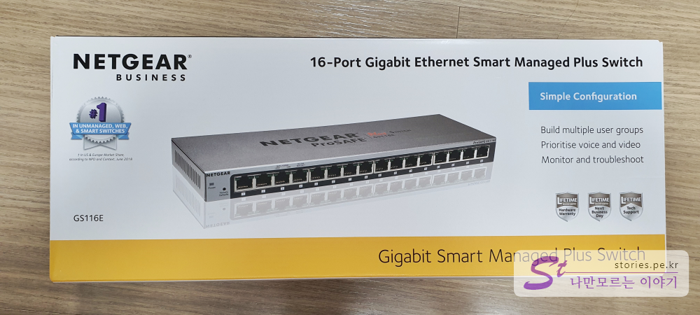

이게 제가 잘못 산 건지 원래 그런 건지는 모르겠지만 죄다~ 영어네요. 한쿡말은 한 글자도 없습니다. 직구 상품을 받은 느낌입니다. 이럴 거면 몇만 원이라도 저렴한 직구를 살 껄~~ 하는 생각도 드네요. 그래도 박싱은 멋집니다. 16 포트짜리 기가인터넷 스마트 매니지드 플러스 스위치라고 쓰여있네요. 그리고 간단한 구성 정도는 가능하다고 설명이 되어 있습니다. 그냥 랜선만 꽂으면 쓸 수 있는 비관리형 스위치이긴 한데 최소한의 모니터링과 관리를 할 수 있는 도구가 제공된다고 쓰여있습니다.

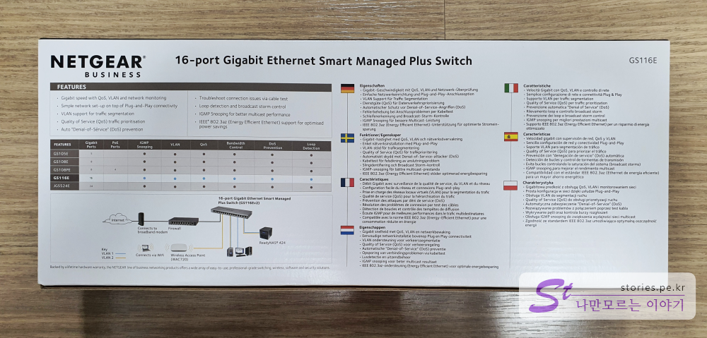  
뒷면에는 제원이 쓰여있고 GS 시리즈 제품에 대한 기능 비교도 있습니다. 그리고 다양한 언어로도 제원이 쓰여있는데.. 한국어만 없어... 우리나라를 무시하나.. IT강국인데..

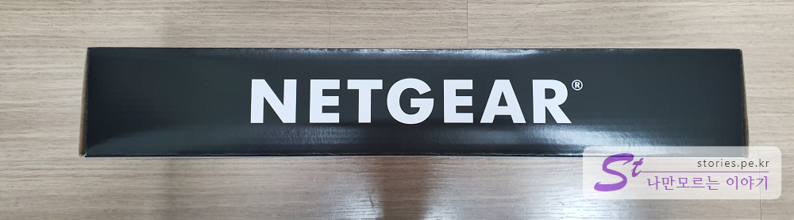  
옆면에는 Netgear이라고 커다랗게 쓰여있습니다.

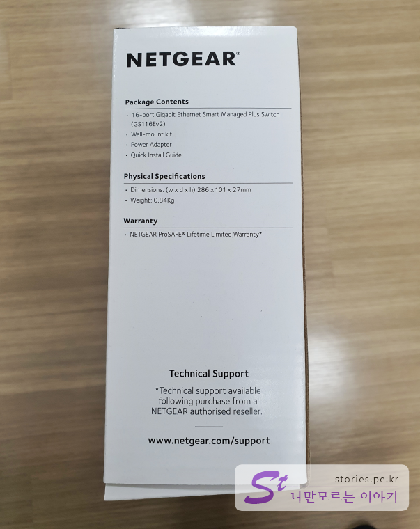  
구성품과 크기에 대한 정보, 워런티에 대한 정보가 있습니다.

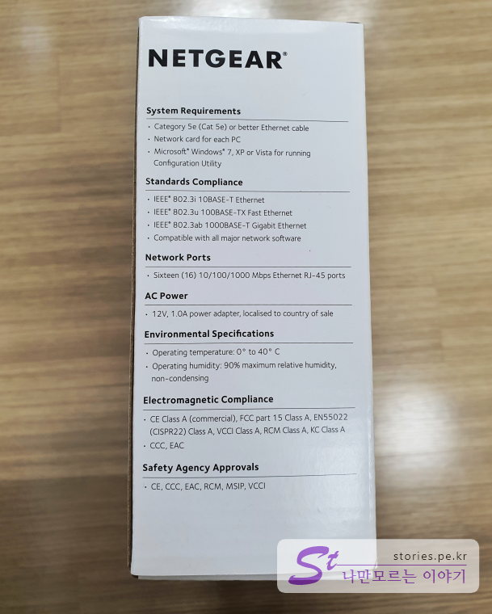  
기타 정보들이 있습니다.

## 구성품

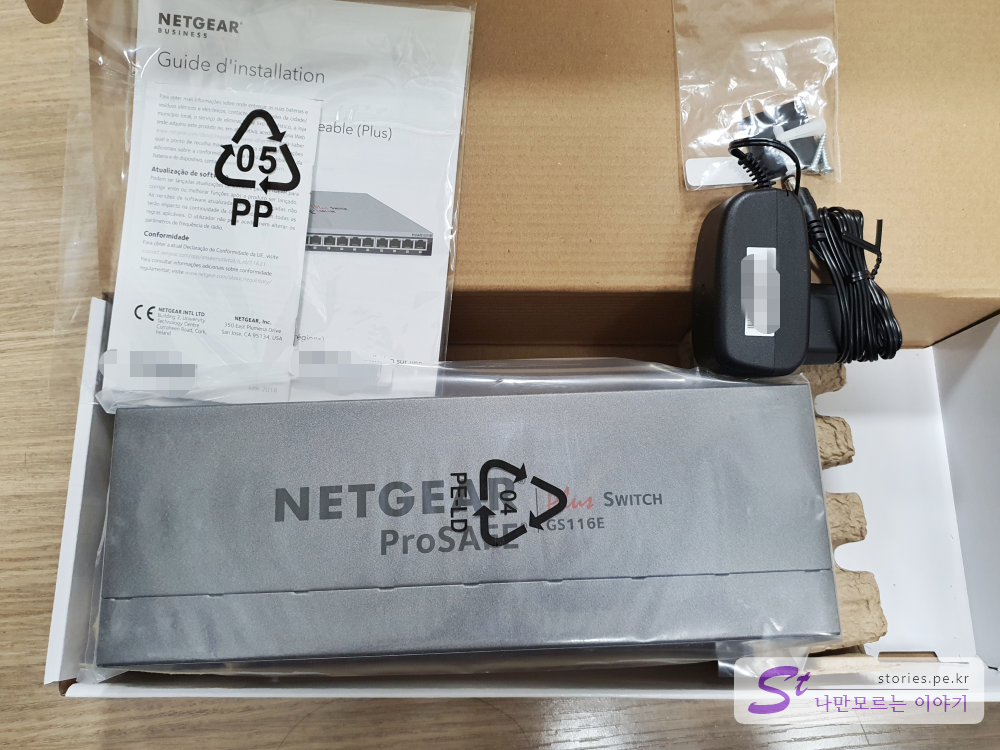  
구성품은 본체, 전원 아답타, 매뉴얼 뭉치가 있습니다. 그리고 제품의 발바닥 역할을 해 줄 4개의 고무와 벽면 부착용 나사가 있습니다.

아답타는 200V 교류 전기를 12V 직류 전기로 변환해 줍니다. 잭의 크기는 설명도 없고 재 보지도 않았지만... 5.5파이 정도 돼 보이는 것 같습니다.

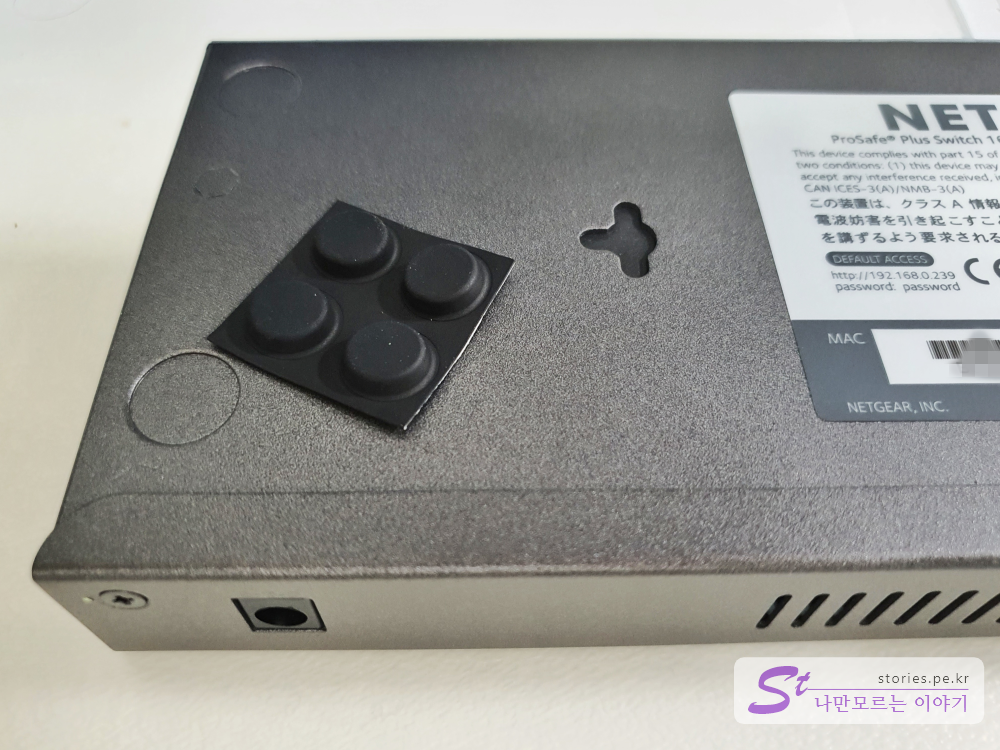  
부속으로 제품 바닥에 붙일 수 있는 고무발 4개가 있습니다.

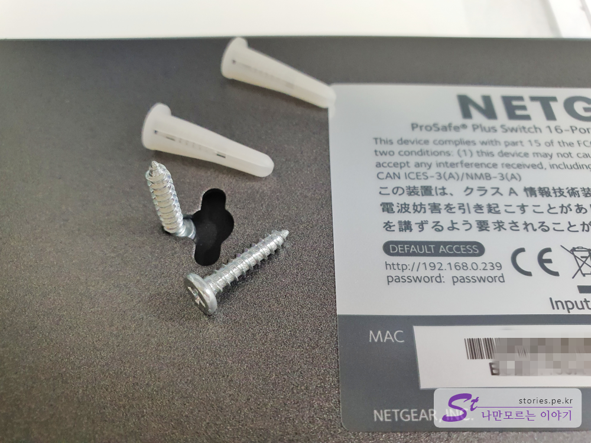  
벽에 붙일 수 있는 나사못도 들어 있습니다.

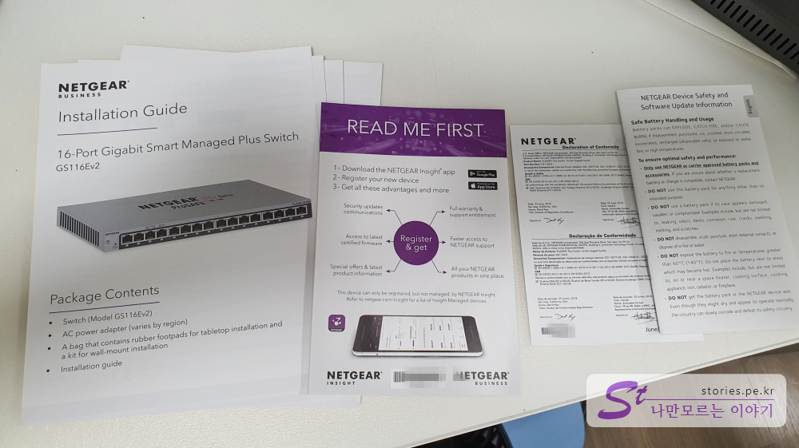  
그리고 의미 없는 매뉴얼들... 한국어가 없어서 기분이 좋지 않았습니다.

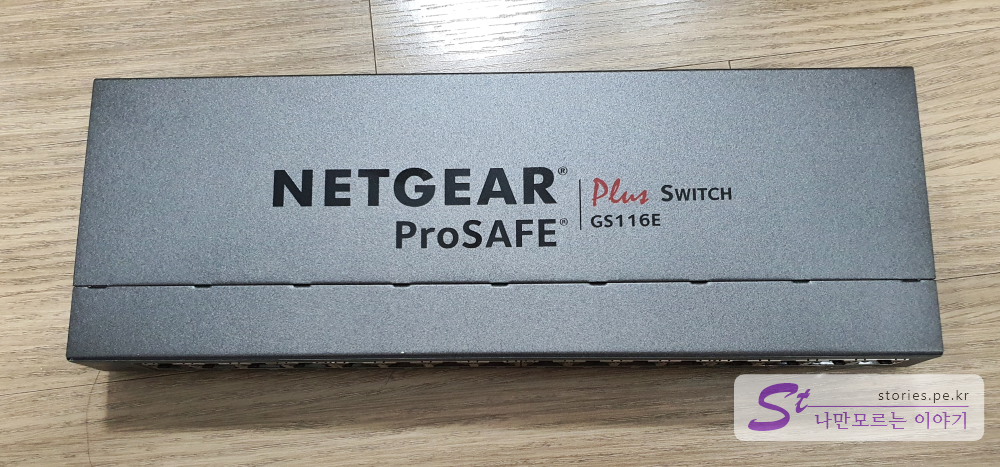  
본체입니다. 상단에 넷기어 프로세이프 플러스 스위치 GS116E라고 쓰여있네요.
제품 자체는 알루미늄처럼 생긴 것으로 되어 있어서 고급져 보입니다.

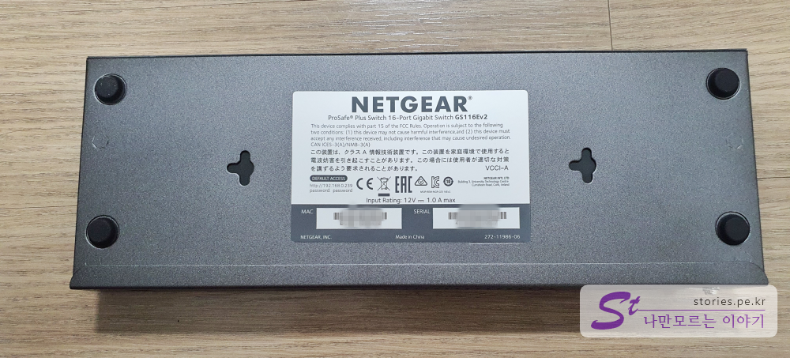  
바닥에는 간략한 정보와 MAC 주소 시리얼 넘버가 적혀있습니다. 그리고 네트워크에 연결했을 때 기본으로 잡히는 IP주소와 스위치에 접근할 때 사용되는 기본 패스워드가 적혀있습니다. IP주소를 만약 DHCP로 자동 할당되게 구성되어 있다면 기본 IP주소는 `192.168.0.239`가 아니라 할당받은 주소로 변경될 것입니다.

- IP주소 : http://192.168.0.239 (DHCP가 꺼져있는 경우)
- 비밀번호 : `password`

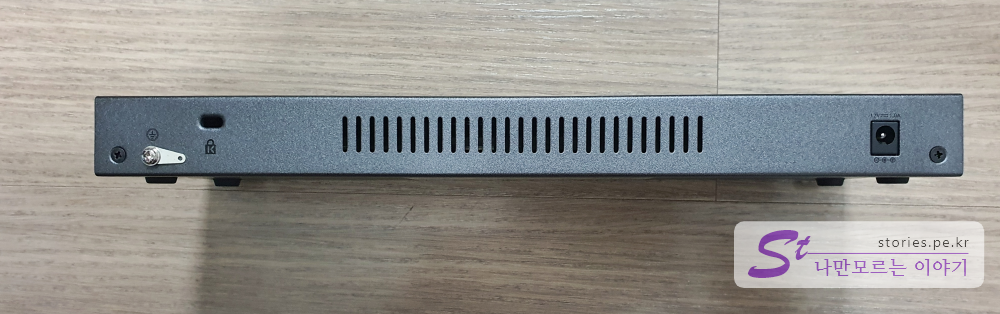  
옆면에는 접지단자와 자물쇠로 잠가놓을 수 있는 켄싱턴 락, 통풍구, 전원 입력단자가 있습니다.

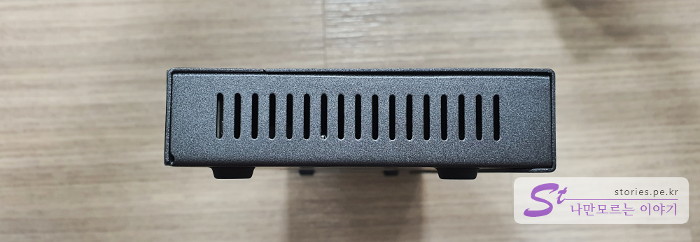  
짧은 쪽 옆면에도 통풍구가 있습니다.

## 관리 도구 접근하는 방법

GS116E는 비관리형 스위치이긴 하지만 간단하게나마 모니터링과 설정을 할 수 있습니다. 설정 화면에 접근하는 방법은 2가지가 있는데, 하나는 제품의 IP주소로 들어가서 웹 UI로 접근하는 방법이 있고 별도의 소프트웨어를 설치하고 그것으로 접근하는 방법도 있습니다.

### 웹UI로 관리 화면 접근하기

보통 비관리형 스위치는 IP가 할당되지 않아서 접근을 할 수가 없습니다. 하지만 이 제품은 IP가 할당이 되고 그 IP로 접속을 하게 되면 모니터링 및 관리를 할 수 있는 화면으로 접근하게 됩니다. 그런데 매뉴얼을 읽어보지 않고는 이 IP가 무엇인지 당췌 감을 잡을 수가 없다는 함정이 있습니다.

#### DHCP를 확인하세요.

> **DHCP란??**
> TCP/IP 통신을 실행하기 위해 필요한 설정 정보를 자동적으로 할당, 관리하기 위한 통신 규약. RFC 1541에 규정되어 있다. TCP/IP 환경의 통신망에서 IP 주소의 일률적 관리 서비스를 제공한다. 초기 적재 통신 규약(BOOTP)과 마찬가지로 사용자 데이터그램 프로토콜(UDP) 상의 프로토콜로서 DHCP 서버는 DHCP 클라이언트의 요구에 따라서 IP 주소를 할당하는 한편, BOOTP는 서버/클라이언트 간에 주고받는 것을 담당한다. BOOTP를 확장한 통신 규약으로서 할당된 IP 주소에 임대 기간을 설정할 수 있다는 점이 BOOTP와 다르다. -[위키백과 참조](https://ko.wikipedia.org/wiki/%EB%8F%99%EC%A0%81_%ED%98%B8%EC%8A%A4%ED%8A%B8_%EA%B5%AC%EC%84%B1_%ED%94%84%EB%A1%9C%ED%86%A0%EC%BD%9C)

위키백과에서는 전문가들만 알아먹도록 설명을 어렵게 작성을 해 놨지만, 간단하게 설명하면...

네트워크에 접속한 기기의 IP주소를 보통 일반 가정집의 경우는 대부분 **IP 유/무선 공유기**에서 할당을 해 줍니다. 그때 DHCP를 활성화해 놨다면 공유기에서 자동으로 임의의 번호를 기기에 부여해 줍니다. DHCP를 비활성화했다면 각각의 기기에 일일이 접속해서 수동으로 IP번호를 설정해 줘야 합니다. 그래서 보통 DHCP는 기본으로 켜놓습니다. (이것도 어려운가 쩝~~~)

이 DHCP를 꺼 놨다면 기본 IP주소는 `192.168.0.239`입니다. 웹브라우저에서 `http://192.168.0.239`로 접근하면 웹 UI화면이 나옵니다.

만약 DHCP를 켜놨다면 스위치에 접근할 수 있는 IP주소가 변경되기 때문에 찾기가 어렵습니다. 이럴 때는 아래에 설명할 소프트웨어를 설치하고 찾아야 합니다.

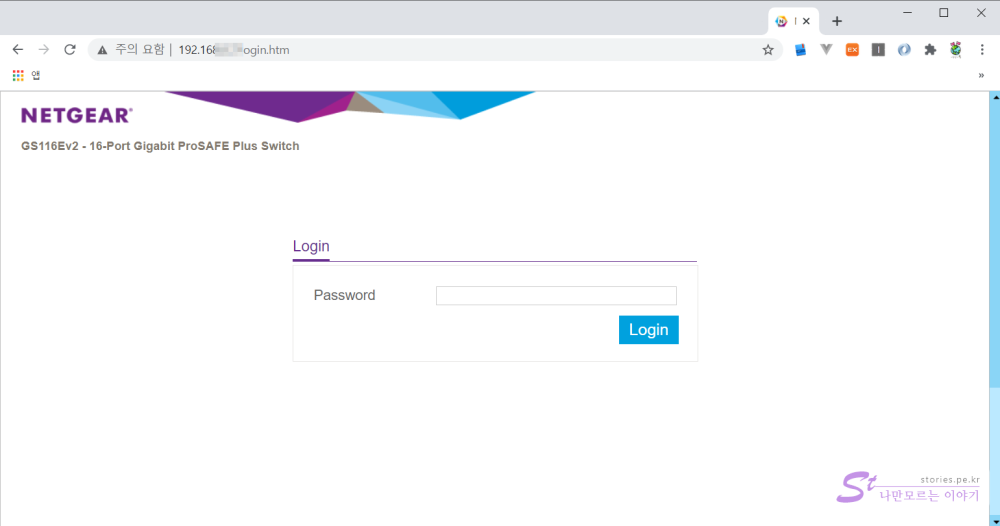  
웹 UI로 접근하면 password를 물어봅니다. 기본 패스워드는 `password`입니다. 이 비밀번호는 꼭 변경해 주셔야 합니다. 안 그럼 해킹당하기 딱 좋습니다.

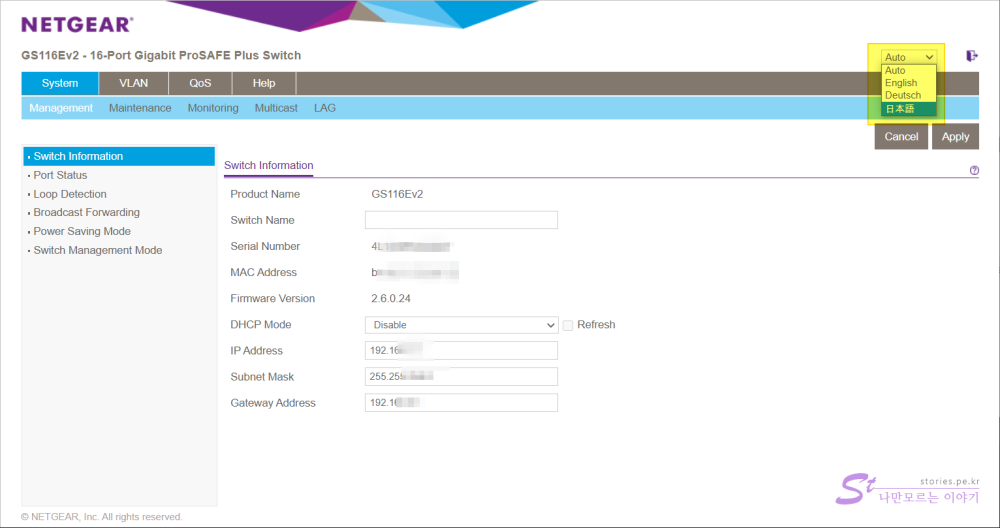  
그럼 이렇게 모니터링과 설정을 할 수 있는 화면이 나옵니다. 각 화면은 직접 보세요. 저도 네트워크의 전문가는 아니라서 대략적인 것 밖에는 몰라요.

여기서도 한쿡어는 없네요.

### 소프트웨어로 관리 화면 접근하기

넷기어 다운로드 센터에 접속합니다. https://www.netgear.com/support/download/
검색어에 제품명인 `GS116E`를 입력하고 검색합니다.

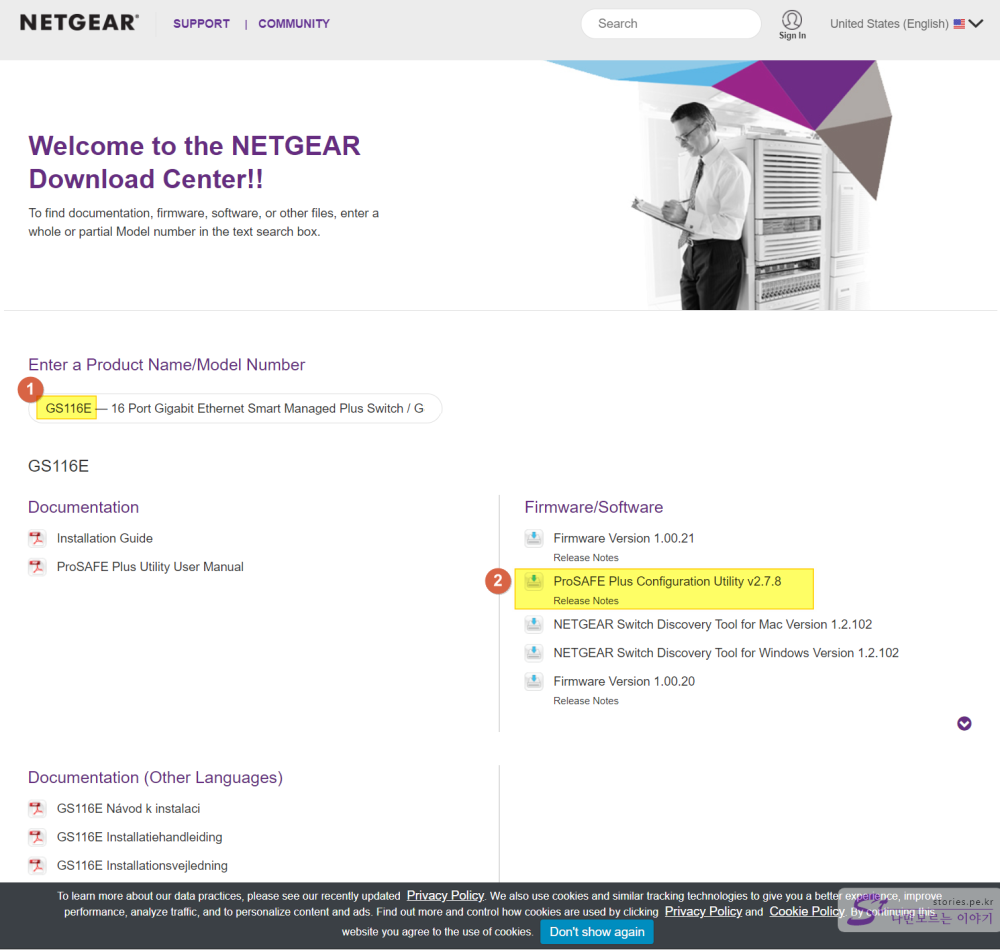

1. 그냥 제품명인 `GS116E`만 입력하면 됩니다.
2. 그중에 **ProSAFE Plus Configuration Utility**를 다운로드합니다.

설치는 어렵지 않습니다. 다만 구시대의 유물인 Adobe Air을 설치해 줘야 합니다. 설치하고 실행하면 아래와 같은 화면이 나타납니다.

1. 바탕화면 아이콘은 후지게 생겼습니다.
2. 언어... 오~~ 한국어가 있네요. 역시 한국어는 편합니다.
3. 제품명이 보이고요
4. 이 스위치의 하나밖에 없는 MAC 주소입니다. 혼자만 알고 있어야 합니다.
5. 이 스위치의 IP주소입니다. **DHCP를 켰다면 여기에서 할당받은 IP주소를 확인**할 수 있습니다.
6. 내 컴퓨터의 IP주소입니다.

> 처음에 이 소프트웨어를 실행했을 때는 내 제품을 찾지 못했습니다. 그때는 소프트웨어가 기본으로 한국어로 설정이 되어 있었고요. 아마 국가가 맞지 않아서 안 나오지 않았나 추측해 봅니다. 언어를 영어로 바꾸니 제품을 찾아냈습니다. 그 이후는 다시 한국어로 바꾸어도 잘 찾네요.

## 내가 생각하는 장점

브랜드값은 하는 것 같습니다. 지금 며칠 지나지는 안았지만 원활히 잘 돌아갑니다. IPTV도 잘 나오고 집에 해비 다운로더가 있으나 그 회선을 통제할 수 도 있을 것 같습니다. 인터넷 속도 측정을 해도 제 속도를 잘 뽑아줍니다.
이런 제품은 특별히 문제가 없는 게 장땡인 것 같습니다.
제품의 디자인도 너무 멋집니다. 있어 보여요. 밖에 나갈 때 들고나가도 꿀릴 것 없게 생겼습니다.

## 내가 생각하는 단점

단점은 가격이겠죠. 물론 훨~~씬 더 비싼 스위치도 있지만 iptime의 스위치 보다는 비쌉니다.

## 가격 및 구매처

구매는 네이버 쇼핑에서 했고 가격은 수입상이 하나인지 모르겠지만 현재 모두 동일하게
**167,000원**부터 시작합니다. 더 아래 가격은 해외직구나 중고밖에는 없네요. 참고로 중고나라에 이 물건은 잘 안나오네요.

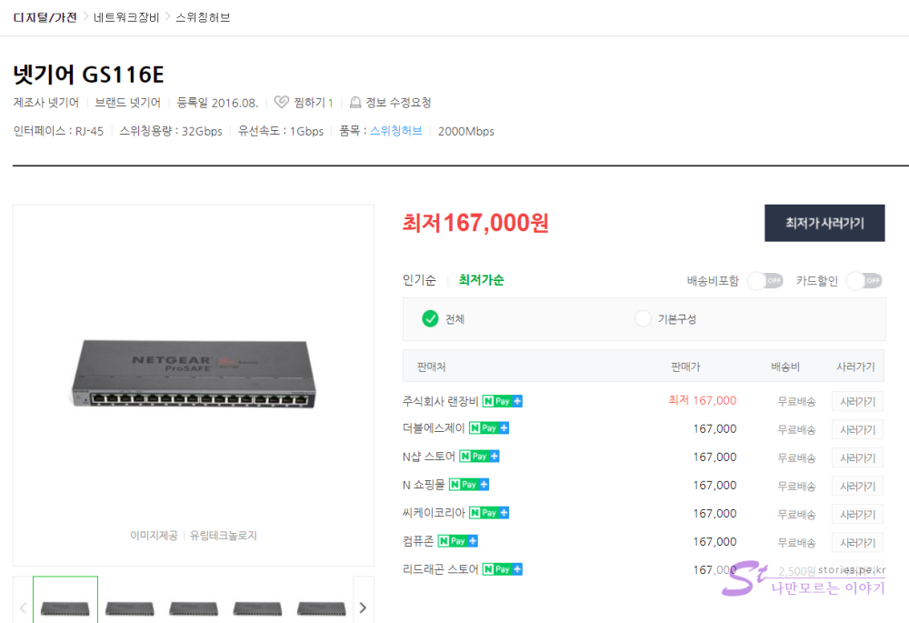

## 설명서

의미 없지만 엉어로되어 있는 매뉴얼만 찍어봤습니다.

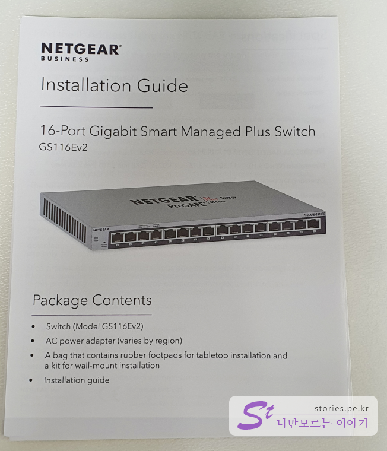  
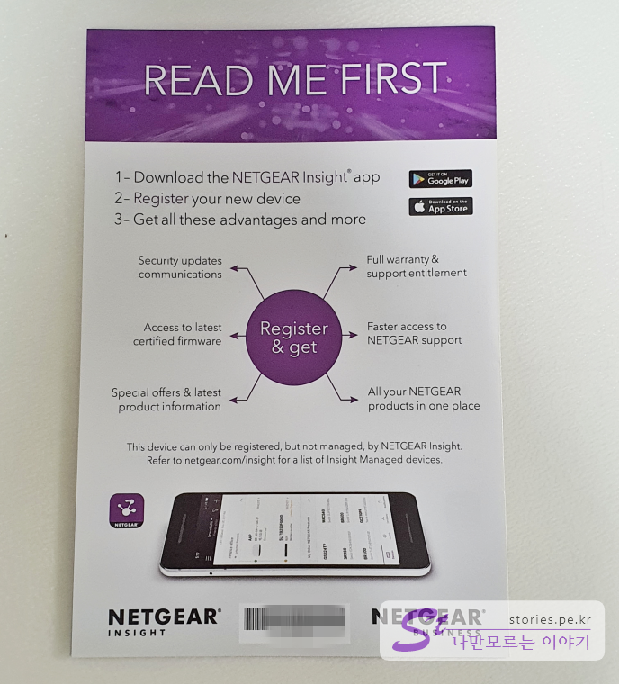
