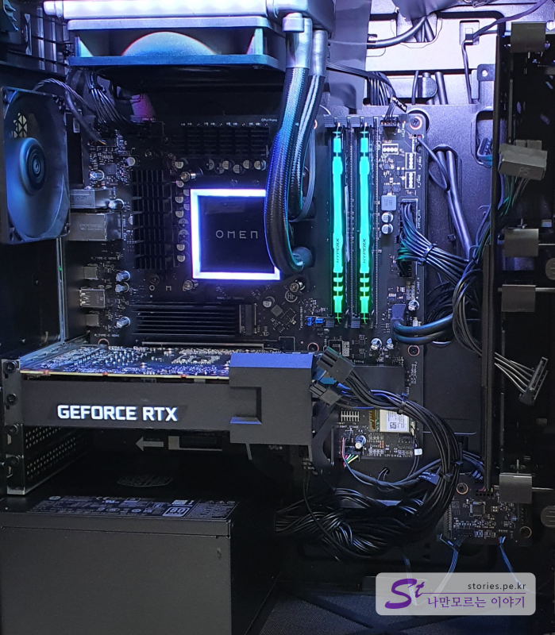

비트코인때문에 죄없는 선량한 게이머들이 고생을 합니다. 그래픽카드 가격이 천정부지로 상승해 버려서 웬만한 게이밍 조립PC를 만들려면 100만원대를 훌쩍 넘어 버리게 되었습니다.  
이제 메이커 PC나 조립PC나 가격차이가 별로 나지 않아서 차라리 메이커PC가 더 저렴한 경우도 있습니다. 저도 예전부터 조립PC를 선호했었는데.. 이번에는 메이커PC를 구매하게 되었습니다. 조립PC를 만들어보신 분들은 아시겠지만 적절한 부품으로 조립한다고해도 궁합이 잘 맞지 않는경우 시스템이 다운되는 등 개고생을 하는 경우가 있었을 겁니다. 하지만 메이커PC같은 경우는 시스템 구성의 안정성, 적절한 배치로 인한 적절한 디자인이 구현되어있어서 일반인에게는 평균이상의 만족도를 얻을 수 있습니다.

# 100만원대 가성비 끝판왕 HP OMEN GT12-1002KR

원래는 HP파빌리온 게이밍 컴퓨터를 알아보다가 점점.. 욕심이 생기면서 OMEN으로 넘어오게 되었습니다. ^^
HP의 게이밍컴퓨터 라인업은 **HP파빌리온** > **OMEN 25L** > **OMEN 30L** > **OMEN 45L** 순으로 구성되어 있으며 각 라인마다 부품의 종류에 따라 다양한 세부모델이 있습니다. 무조건 45L이 좋다기보다는 각각 장단점이 있으니 자신에게 맞는 컴퓨터를 고르시면 됩니다. HP파빌리온의 경우는 게이밍PC 치고는 상당히 작은 크기라서 크기에 민감하신 부분은 좋은 선택이 될것입니다.

  
**HP OMEN GT12-1002KR**는 라이젠 5800X CPU를 기반으로 엔비디아 RTX3060을 달고 있습니다. 또한 쿨러마스터의 수랭쿨러를 달고 있어서 발열도 충분히 잡아주고 있습니다. 배선도 깔끔하게 정리되어 있어서 공기흐름에 방해를 최소화 했고 한쪽면을 투명유리로 처리해서 내부를 볼 수 있게 되어 있습니다. 내부도 화려한 조명으로인해 이 PC가 게이밍PC라는 것을 한껏 뿜어내고 있습니다.

170~200만원대에 게이밍PC를 맞추시려면 이만한 조합은 없을것 같습니다.
