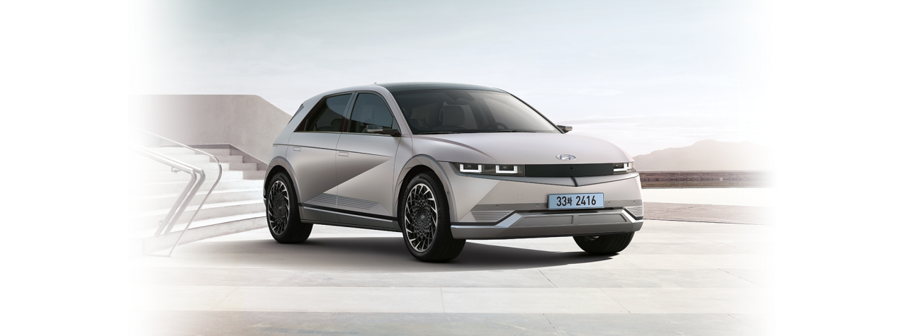
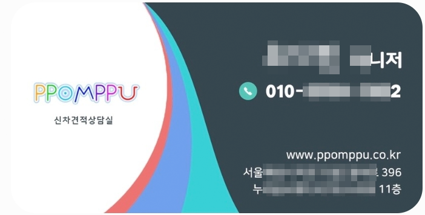

이번에 아이오닉5를 구매하게 되었습니다. 반도체 대란으로 거의 1년이라는 기나긴 기다림의 시간이 지나고 이제야 받았습니다.

자동차 구매를 준비하면서 우여곡절 끝에 알게 된 이런저런 이야기를 풀어볼까 합니다. 새로운 자동차, 특히 전기차 구매 예정이신 분들께는 조금이나마 도움이 되길 바랍니다.

# 사전 준비 사항

## 구입 결정

차량을 구매하기로 했다면 당연한 이야기지만 차량과 옵션을 결정해야 합니다. 이 부분은 대한민국 어디에서 확인을 해도 가격과 구매 정보가 동일하니 온라인, 오프라인을 활용하여 확인하면 됩니다.

먼저 대리점 같은 오프라인 매장 2~3군데를 다니면서 차량과 색상, 옵션 등을 눈으로 직접 확인해 보는 것이 좋습니다. 그리고 여건이 된다면 시승을 해보는 것도 좋고요.

차량의 트림, 색상, 옵션을 확정했다면 이제 견적을 받아야 합니다. 대부분 오프라인보다는 온라인이 저렴하고 아는 지인을 통해서 구매하는 것보다 모르는 사람에게 구매하는 것이 좋습니다. 지인이라고 차량 비용을 싸게 주는 것도 아니고 선물을 더 주는 것도 아니며 아쉬운 점이 있을 때 따지기도 어렵습니다.

## 결제 방법 결정

본인의 경제 사정에 따라 차량 구입 비용을 **전체 현금 일시불**, **현금 + 할부**, **전체 할부**, 할부를 할 경우 몇 개월 할부를 할지 먼저 결정해 놓는 것이 좋습니다. 추후에 해도 문제는 없지만 미리 어느 정도는 생각하고 있는 것이 좋습니다.

뒤에 더 말씀드리겠지만 현금, 할부 등에 따라서 카동이나 오토캐시백을 이용하면 캐시백을 일부 돌려받을 수 있습니다.

- **전체 현금 일시불** : 부자들의 구매 방법
- **일시불** + **할부** : 일반적인 구매 방법
- **할부** : 현재 가진 것은 많지 않지만 매달 꾸준히 수입이 있는 경우

전체 현금 일시불로 결제를 하더라도 카드를 통해 납부를 하면 카드회사로부터 일정 부분의 캐시백을 돌려받을 수 있습니다.

## 견적 요청하기

이제 견적을 받아야 합니다. 앞서 이야기한 것처럼 차량과 옵션의 가격은 대한민국이라면 온 오프라인 모두 동일합니다. 그렇기 때문에 견적 선택의 비교 대상이 아닙니다.

견적 선택의 기준은 **카마스터가 주는 서비스**입니다. 그것이 **용품**일 수도 있고 **현금**일 수도 있습니다.

보통 카마스터들은 용품을 유도합니다. 왜냐하면 카마스터 입장에서는 용품 지급이 조금이라도 이윤을 더 남길 수 있기 때문입니다.

**좀 아는 구매자들은 보통 현금을 요구합니다.** 그래야 여기저기서 받은 다양한 견적에서 카마스터가 주는 서비스를 비교하기가 쉽기 때문입니다. 그리고 원하지 않는 용품 시공보다는 본인이 원하는 서비스에 집중할 수 있기 때문입니다. 그렇게 받은 현금으로 직접 틴팅(선팅)과 블랙박스 설치 등을 하시면 됩니다.

또한 견적을 요청할 때 **결제는 따로 하겠다**라고 하는 것이 좋습니다.

몇천만 원이나 하는 금액을 카드나 대출로 결제할 때도 약간의 캐시백(경우에 따라 다르지만 약 0.5~1% 정도??)이 존재합니다. 이걸 카마에게 알아서 해달라고 할 경우 캐시백은 카마의 이익으로 돌아갑니다. 하지만 본인이 결제할 경우 그 캐시백도 구매자가 가져가게 됩니다.

그럼 나는 어떻게 결제를 알아서 하냐?? 그것은 **카동**이나 **오토캐시백** 등을 활용하면 됩니다.

카동이나 오토캐시백의 정보는 해당 차종의 네이버 카페를 들어가 보면 담당자 정보를 확인할 수 있고 그 담당자분들이 알아서 가이드를 해 줍니다.

견적요청은 오프라인은 알아서 대리점을 찾아가서 하시면 되고,

온라인은 **다나와**, **뽐뿌**, **카동**, **해당 차종의 카페**, **겟차** 등등...에서 신차 견적을 요청하면 이메일이나 쪽지 등으로 받습니다.

정리하면....

**차종과 실내외 색상, 옵션을 가급적 최종 선택 완료한 후 서비스는 현금으로 제시해 주시고, 결제는 따로 하겠습니다.라고 요청 글을 남기면 됩니다.**

> 예시
> **제목 : 서울지역 카마스터님 견적 부탁드립니다.**
>
> 안녕하세요. 아이오닉5 견적 부탁드립니다.
> 사양은 아래와 같습니다.
>
> 서비스는 **현금**으로 제시해 주시면 감사하겠습니다.
> **결제는 따로** 진행할 예정입니다.
>
> 쪽지 부탁드립니다.
>
> ------------ 아 래 -------------------
>
> - 아이오닉5 롱레인지 프레스티지 (2WD)
> - 외장 컬러 (아틀라스 화이트 또는 사이버 그레이 메탈릭)
> - 내장 컬러 (다크 페블 그레이 또는 다크 틸 )
> - 파킹 어시스트
> - 컴포트 플러스 2
> - 비전루프
> - 빌트인캠
> - V2L
>
> 지역은 서울입니다.
> 취소 차도 옵션이 비슷하면 구매할 생각입니다.
>
> 감사합니다.

이러면 여기저기에서 카마들이 견적서를 보내 줍니다 이렇게 받은 견적에서 가장 많은 현금을 제시한 카마 2~3명에게 연락하고 그중에 1명을 선택하면 됩니다.

견적 선택 시 금액 말고 또 하나 중요하게 봐야 할 것은 **진짜 카마를 선택**하는 것입니다.

견적을 제시하는 사람 중에 **진짜 카마**가 있고 **카마 대행**이 있습니다.

진짜 카마는 대리점에 소속되어 있는 사람이고 대행은 카마를 대행해서 온라인에서 접수만 하고 처리하는 사람입니다. 보통 견적의 서비스 금액은 이 대행이 조금이라도 더 많은 금액을 제시하게 됩니다.

다만 대행은 대행만 하다 보니 차에 대해서 거의 모릅니다. 그래서 진행하다 보면 답답하기도 하고 차에 대해서 물어볼 수도 없고 그렇습니다. 소비자가 스스로 알아서 잘 챙겨서 필요한 점을 요구해야 합니다.

그래서 가능하면 서비스 현금을 몇만 원 덜 받더라도 진짜 카마를 선택하는 것이 좋습니다.

대행인지 대충 보면 느낌으로 알 수 있으며 계약 전에 연락해서 대행인지 물어보셔도 됩니다. 보통 명함을 요구하고 받은 명함에 회사명이 다나와, 뽐뿌 등등으로 되어 있으면 대행일 경우가 많습니다.

## 계약하기

최종적으로 견적을 선택했다면 견적서에 있는 내용을 정말 꼼꼼히 잘 봐야 합니다. 차종(트림)은 맞는지 내장, 외장의 색상은 맞는지, 옵션의 선택은 맞는지 금액은 맞는지 등등....

만약 틀려서 변경하거나 변심으로 인해 변경할 경우 대기 줄을 처음부터 다시 타게 됩니다. 대기 기간이 긴 경우는 아주 끔찍한 사태를 맞이하게 됩니다.

처음부터 끝까지 카마와 대면 없이 온라인으로도 진행이 가능하지만 가급적 카마와 대면을 하고 확인하는 것이 좋습니다.

그리고 **지원해 주기로 한 내용(현금 또는 용품 설치, 결제 따로 하겠다는 내용)에 대해 증적을 남김**니다. 문자나 카톡으로 주고받은 내용에 대해서 스크린 캡처를 받아 저장해 놓는 것이 좋습니다. 그래야 나중에 딴소리하면 증적을 내밀 수 있습니다.

그리고 용품 설치로 하실 경우는 어떤 용품을 할지, 그리고 모델명이나 제품명은 무엇인지 확실히 해야 합니다. 선팅을 해준다고 하지만 선팅도 무료 쿠폰 선팅에서부터 몇백만 원까지 종류가 다양합니다. 필요한 경우 추가 금액을 더 지불하고 좋은 모델로 하는 경우도 많습니다.

이렇게 카마와 구체적인 내용까지 선정을 했다면 이제 10만 원의 계약금을 입금하게 됩니다. 입금계좌는 카마의 계좌가 아니라 **자동차 회사(현대 또는 기아 등등) 명의의 가상 계좌**입니다.

계약금 입금이 확인되면 이제 배정 순서에 대해 줄을 서게 된 것입니다.

# 출고 전 준비사항

## 시공 품목 선정 및 시공 업체 후보 리스팅

이제 줄을 섰으니 자동차 회사에서 예시일(출고일자) 확정을 받을 때까지 대기를 해야 합니다. 며칠이 될 수도 있고 몇 년이 될 수도 있습니다. 저 같은 경우는 반도체 대란일 때 전기차(아이오닉5)를 계약한 관계로 1년 정도를 대기했었습니다. 지금은 반도체 수급이 원활해서 2~3달이면 나온다고 하네요.ㅠㅠ

기다리는 동안 시공 품목에 대해 준비하시면 좋습니다. 저 같은 경우는 서비스를 현금으로 받았는데 금액은 대략 80만 원 정도를 받았습니다.(이건 시기와 차량 가격에 따라 천차만별입니다.)

이 금액을 기준으로 틴팅(선팅)은 무엇으로 할지, PPF를 어떤 것으로 할지 신차 검수는 어디에서 할지를 대략적으로 리스팅을 합니다.

해당 차종의 네이버나 다음 카페에 회원 가입을 하고 기존 글을 참고하거나 질문을 통해 구입하실 차종의 정보를 획득합니다.

저는 틴팅(선팅), PPF, 가죽시트 코팅, 블랙박스, 언더코팅 등등... 을 염두에 두었다가 결국은 **틴팅(선팅)과 PPF**만 하기로 마음을 먹었습니다. 빌트인 캠을 옵션으로 설치를 한 상태라 블랙박스는 실제로 이용해 보고 필요하다 생각되면 그때 하기로 마음먹었습니다.

틴팅의 종류도 반사, 비반사, 가성비, 럭셔리, 색상 등등 다양하기 때문에 본인에게 맞는 제품을 선택합니다.

(저는 레인보우 V90 반반사 필름으로 전면 : 30%, 1열 : 12%, 2열 12% 비전루프 : 30% 으로 결정했고 업체 이벤트로 인해 한 단계 상위 모델인 VS200으로 높여서 설치했습니다.)

시공 품목을 선정했다면 이제 설치업체에 대해서 가까운 동네 위주로 평이 좋은 2~3곳을 미리 리스팅 해 놓습니다. 실제 업체와 컨택은 예시일(출고일자)이 나오면 그때 진행하면 됩니다.

## 차량에 대한 정보 확인

기다리는 동안 카페 등을 통해 신차에 대한 다양한 정보를 수집하고 확인합니다.

# 예시일(출고일자) 확정 후 준비사항

지루한 기다림 끝에 카마로부터 예시일(출고일)이 확정되었다는 안내와 날짜를 듣게 됩니다. 보통 출고 1~2주 정도 전에 알려주게 되는데 이렇게 예시 일이 나오면 아래의 사항을 진행하시면 됩니다.

## 잔금 준비

결제 금액을 준비합니다. 저는 카동을 이용해서 현금 + 할부로 진행할 예정입니다.

카동 담당자에게 연락하여 예시일을 받았다고 이야기하면 담당자가 현재 시점에서 가장 많은 캐시백을 받을 수 있는 카드 또는 대출을 찾아 줍니다. (매달 카드사와 대출 업체의 이벤트에 따라 제시하는 카드 종류 및 캐시백 금액이 변경됩니다.)

그리고 출고일 2~3일 전에 최종 금액이 확정되면 다시 연락을 달라고 합니다.

아래의 카동 웹사이트에서도 카드별 캐시백을 확인할 수도 있습니다.

> [카동 프로모션 계산기](https://www.cardong.co.kr/newcar/promotion#layerPopup)

현금이 많아서 현금 일시불로 자동차 회사에 잔금을 지불하게 되면 아무런 캐시백도 없지만 카드를 통해 비용을 지불하게 되면 프로모션에 따라 10 ~ 100만 원 이상의 캐시백을 추가로 받을 수 있습니다.

이렇게 하기 위해서 처음에 견적 요청 당시 **결제는 따로**하겠다고 카마에게 이야기하셔야 합니다.

## 시공 업체 가격 확인 및 결정

미리 리스팅 해둔 시공 업체에게 시공 항목과 모델명을 제시하고 견적을 요청합니다.

견적 중에 업체 위치, 가격, 작업 완성도 등을 고려하여 최종 업체를 선정하고 예약을 합니다.

나중에 잔금을 지불하고 차량의 탁송 지를 해당 시공업체로 지정을 하게 되면 바로 시공업체에서 신차를 받아 신차 검수를 하고 하자 여부를 체크하여 소비자에게 알려주고 확인이 되면 시공에 들어가게 됩니다.

## 기존 차량 정리(중고차 판매)

기존 차량은 경우에 따라 신차가 나오기 전에 미리 중고차로 판매할 수도 있고 신차가 나온 이후에 판매할 수도 있습니다.

저는 잔금을 지불할 때 일시불 + 할부로 처리했고 일시불의 금액을 후불결제카드로 결제했기 때문에 한 달 뒤에 현금을 통장에 입금시키면 되었으므로 중고차를 판매해야 하는 기간이 한 달 정도 여유가 있어서 신차를 받은 다음에 판매를 했습니다. 자세한 내용은 하단의 내용을 참고하세요.

## 전기 차인 경우

만약 전기차라면 몇 가지 미리 신청해 놓으면 좋습니다.

### 전기차 보조금 신청

전기차 보조금을 신청하기 위해서 **주민등록 등본 1통**과 **초본 1통(주소 변동 이력 포함)**을 뽑아서 카마스터에게 전달해 주면 카마스터가 대신 신청해 줍니다.

### 전기차 충전카드 발급

환경부 전기차 충전카드는 미리 발급받아 놓는 것이 좋습니다. 이 카드는 로밍으로 범용적으로 사용할 수 있습니다.

발급 신청할 때 차량번호를 입력하게 되는데 일단 **000호 0000**로 임시 입력하여 발급받은 후 나중에 번호판이 나오면 그때 변경해 주면 바로 사용할 수 있게 됩니다.

## 잔금 지급

차량 출고 2~3일 전에 금액이 확정되며 이 잔금을 지불해야 차량 출고가 가능해집니다.

금액이 확정되면 카동 담당자에게 연락을 하고 카동 담당자의 가이드에 따라 진행을 하면 됩니다.

카동에게 돈을 입금하고 카동이 대신 지불하는 형태가 아니고 카동은 소개만 시켜주고 실질적으로는 카드회사와 자동차 회사(대리점 카마스터) 간 결제를 진행하게 됩니다.

돈이 오가는 와중에 카동이 중간에 껴있지 않으므로 안심할 수 있습니다. (카동은 추천인으로 카드사로부터 소개비를 받는 것으로 알고 있습니다.)

# 출고 후 진행 사항

차량이 출고되면 진행해야 할 절차입니다.

> 카마에게 물품서비스는 선팅 말고 **브랜드 Kit**으로 달라고 요청하세요. 대략 5만 원 상당의 물품을 받을 수 있습니다.

## 출고

잔금을 지불하고 출고가 되면 본인이 직접 가지러 갈 수도 있지만 대부분 탁송을 이용하게 됩니다.

그러면 탁송 지를 지정하게 되는데, 본인의 집이나 회사로 해서 직접 받을 수도 있지만 보통은 틴팅을 시공하는 시공업체로 보내게 됩니다. 이런 시공업체는 보통 신차 검수도 같이 병행을 하기 때문에 시공업체에서는 당연히 그렇게 생각을 하고 있습니다.

탁송 지를 시공업체로 지정하고 시공업체에는 탁송이 시작되었다고 전화를 해서 알려주면 됩니다. 탁송이 완료되면 시공업체에서는 차를 받았다고 알려주게 됩니다.

## 신차 검수 및 시공 요청

시공업체에서 신차 검수를 하고 차량의 긁힘이나 단차 같은 것을 찾아서 문자나 카톡으로 보내줍니다. 미세한 부분은 그냥 넘어가도 되고 큰 하자가 있는 경우는 카마에게 연락하여 인수거부를 하고 다시 차량을 받을 수 있습니다. 인수거부를 한다고 대리점에서 무조건 받아주는 것은 아니고 자체적으로 판단하는 부서가 있는 것 같았습니다.

차량을 시공하기 위해서는 차주가 먼저 **완전 인수**를 결정해야 합니다. 완전 인수를 결정해야 차량등록에 필요한 **자동차 제작증**도 받을 수 있고 **시공을 시작**할 수도 있습니다.

**완전 인수의 의미**는, 인수를 하기 전까지 차량의 소유는 자동차 회사(또는 대리점??)에게 있고 완전 인수를 결정하게 되면 소유권이 구매자에게로 넘어가는 것을 의미하게 됩니다. 다시 말해 결정을 하게 되면 차량을 맘대로 시공하며 손을 댈 수 있다는 의미이고 또한 차량을 반품하기도 어렵게 된다는 의미이기도 합니다. ㅎㅎ

어찌 되었건 크게 문제가 없으면 완전 인수를 하셔야 합니다. 그래야 시공 및 차량 등록을 진행할 수 있게 됩니다.

시공은 대략 2~3일 정도 소요가 됩니다.

## 보험 가입

시공을 하는 동안 신차에 대한 책임보험(자동차보험)을 가입해야 합니다.

차량등록사업소에서 차량을 등록하기 전에 먼저 책임보험에 가입하고 보험 가입 증명서를 가지고 가야 합니다. 이때 차량번호가 없는 상태이기 때문에 먼저 **차대번호로 가입**을 하고 차량등록이 완료되어 차량번호를 발급받은 후 다시 보험사에 연락하여 차량번호를 등록하면 됩니다.

보통은 신차와 함께 임시 번호판의 기간인 **10일 동안** 임시 책임보험에 가입돼서 나오게 되는데 이 기간 안에 정식 보험 가입과 차량 등록을 모두 마쳐야 합니다.

보험은 기존 차량의 보험을 승계하는 방법이 있고 신차를 위해 보험을 새로 가입하는 방법이 있습니다. 만약 기존 보험을 승계하게 된다면 승계와 함께 기존 차량(중고차)를 위해 최장 15일짜리인 임시 책임보험을 가입해야 합니다. 그리고 중고차는 이 기간 안에 판매를 하여 명의 이전을 완료해야 합니다.

> 그냥 신차를 위한 보험을 새로 들고 기존 중고차는 판매가 이루어진 후 기존 책임보험을 해지하는 것이 편한 것 같습니다.

## 차량 등록 및 세금 납부

시공은 보통 2~3일 정도가 소요되며 그 기간 동안 책임보험을 가입하고 차량을 등록하고 번호판을 받아야 합니다.

이때 카마에게 등록 대행을 요청할 수도 있고 직접 등록을 할 수도 있습니다.

카마에게 요청을 하면 카마가 차량등록 사무소에 가서 등록을 하고 번호판을 시공점으로 가지고 와서 번호판까지 달아주게 됩니다. 이 경우 대행 수수료가 발생하기는 하지만 편리하기 때문에 이렇게 많이 합니다.

만약 직접 등록하려면 카마에게 직접 등록하겠다고 말하고 관련 서류를 받아서 신차를 가지고 해당 지자체의 차량등록사업소에 방문하여 직접 등록을 하면 됩니다.

### 차량등록에 필요한 준비물

직접 차량을 등록하기 위해서는 아래의 서류가 필요합니다. 아래의 서류를 가지고 신차를 타고 차량등록사업소에 방문하여 취득세 등 여러 가지 세금과 등록비를 납부하고 차량 번호판을 받아서 달면 됩니다. 번호판도 그곳에 계신 직원분이 달아주기 때문에 걱정할 필요는 없습니다.

- **신차에 있는 준비물**
  - 임시운행 허가증
  - 임시운행 번호판 (앞, 뒤)
- **카마에게 요청해야 하는 서류**
  - 자동차 제작증(영수증 또는 세금계산서)
- **본인 준비물**
  - 운전면허증
  - (신차) 책임보험 가입 증명서

## 기존 차량 정리(중고차 판매)

이제 가지고 있던 중고차를 판매하면 됩니다.

위에서 말한 것처럼 한 달 뒤 카드대금을 정산하기 때문에 한 달의 여유가 있을 거라 생각했으나 보험의 문제로 15일 이내로 판매를 해야 했습니다.

저는 보험을 신규로 가입하지 않고 기존 보험의 승계로 했기 때문에 기존 보험이 신차로 승계되면서 중고차는 보험이 없어지기 때문에 중고차를 위한 임시 책임보험(최장 15일)에 가입을 했습니다. 그래서 이 보험 기간 안에 중고차를 판매해야만 했습니다. 그렇지 못할 경우 과태료가 발생하게 됩니다.

> 그냥 기존 보험을 승계하지 말고 깔끔하게 신차를 위한 책임보험을 신규로 가입하는 것을 추천드립니다.

개인이 중고차를 판매하는 방법이 요즘 너무 다양하고 잘 나와서 편리하고 합리적으로 처분을 할 수 있게 되었습니다. 예전 같으면 거의 카마를 통해서 중고차를 처리했는데요. 요즘은 온라인이나 스마트폰 앱을 통해 쉽게 판매를 할 수가 있습니다.

여러 가지 방법 중에 저는 **헤이 딜러 제로**와 **카머스(AJ 셀카)** 두 곳을 통해 경매로 판매를 하였습니다. 방식은 경매 방식으로 동일한데 헤이 딜러는 UX가 편리한 앱을 활용하여 거의 완전 비대면 자동으로 처리되고, 카머스(AJ 셀카)는 약간의 수동이 동반됩니다. 크게 불편하지 않으니 2군데에 경매를 올려놓고 가장 비싼 가격을 제시한 딜러에게 판매를 하면 됩니다.

2곳 모두 중고차 판매를 위한 간단한 정보를 앱이나 웹에 등록을 하면 지정한 일시에 전문 평가사가 방문하여 차량을 살펴보고 직접 경매에 올려주게 됩니다. 전문평가사가 살펴보고 올리기 때문에 나중에 딜러가 결정되면 금액을 깎는다던가 하는 스트레스는 거의 없습니다.

경매에 올라가고 하루 또는 2일 정도 경매를 진행하면 여러 딜러들이 차량에 대한 금액을 올리기 시작합니다. 기간이 지나 경매가 끝나면 가장 놓은 금액을 제시한 딜러에게 자동 배정이 되고 진짜 판매를 할 건지 내가 OK를 하면 다시 딜러가 최종 구매 결정을 하게 됩니다. 이로써 판매가 이루어지게 됩니다.

차량을 가져가는 일시를 앱이나 웹에 작성을 하면 해당 일정에 탁송 기사가 와서 차를 가져갑니다. 이때 구매를 한 딜러의 정보로 **자동차 거래용 인감증명서(매수자 정보 기재 포함)를 관공서에서 발급을 받고 자동차등록증과 차량 열쇠**를 탁송 기사에게 전달해 주면 됩니다. 그러면 거의 10분 안에 판매대금이 내 통장으로 입금이 됩니다.

### 중고차 판매 방법

| 업체(서비스)       | 판매 방식                                                                             |
| ------------------ | ------------------------------------------------------------------------------------- |
| 카마스터           | 카마스터에게 판매                                                                     |
| 케이카             | 매입 담당자가 차 상태를 보고 가격을 제시함                                            |
| 카머스(AJ셀카)     | 경매 대행(평가사가 사진 찍어서 경매 사이트에 올림 - 다음날 3시간 동안 경매 진행)      |
| **헤이 딜러 제로** | 경매 대행(평가사가 사진 찍어서 경매 사이트에 올림 - 2일(48시간) 경매 진행)            |
| 헤이 딜러          | 경매 대행(내가 사진을 자세히 찍어서 올림) - 낙찰 후 딜러가 가격 조정을 하는 경우 있음 |
| SK엔카             | 일반 내차 팔기                                                                        |
| KB차차차           | 개인 차량 경매                                                                        |

> 만약 중고차 판매 앱을 하나만 추천하라고 한다면 **헤이딜러 제로**를 추천합니다. UX가 너무 잘되어 있어서 편하고 거의 비대면으로 처리가 가능합니다.

## 마지막 정산

자동차를 등록했다면 이제 마지막 정산을 하면 됩니다.

보통 카마스터가 제시했던 비공식 서비스(현금)에 대한 정산과 카동으로 진행한 일시불, 할부에 대한 캐시백을 받으면 됩니다.

### 카마스터와의 비공식 서비스(현금)

자동차를 등록하고 자동차 등록증을 카마스터에게 사진을 찍어서 보내주면 초창기에 약속했던 서비스(현금)을 통장으로 보내줍니다.

### 카동으로 진행한 캐시백

카동으로 진행했을 때, 전체 일시불, 일시불 + 할부, 전체 할부에 따라서 캐시백이 달라집니다.

보통 비용이 지불된 후 7일 안팎으로 캐시백이 들어옵니다. 저처럼 후불결제카드로 진행한 경우는 한 달 뒤 실제 비용이 빠져나가면 그 이후로 7일 안팎으로 캐시백이 들어옵니다.

정상적으로 들어왔는지 확인하면 됩니다.

# 기타

이렇게 차량 구입 시 호갱을 당하지 않기 위한 절차에 대해서 경험을 토대로 정리해 봤습니다.

물론 그냥 비용을 더 지불하는 것을 감안하고 모든 것을 카마스터에게 맡기는 게 편할 수도 있습니다.

그것은 개인의 선택입니다.
