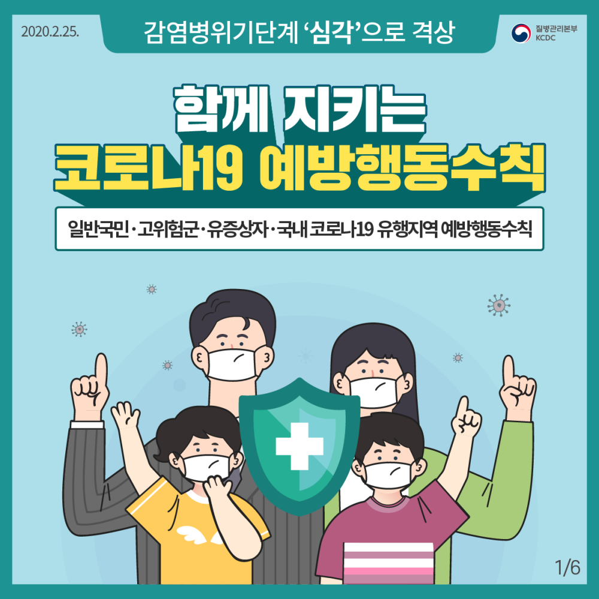
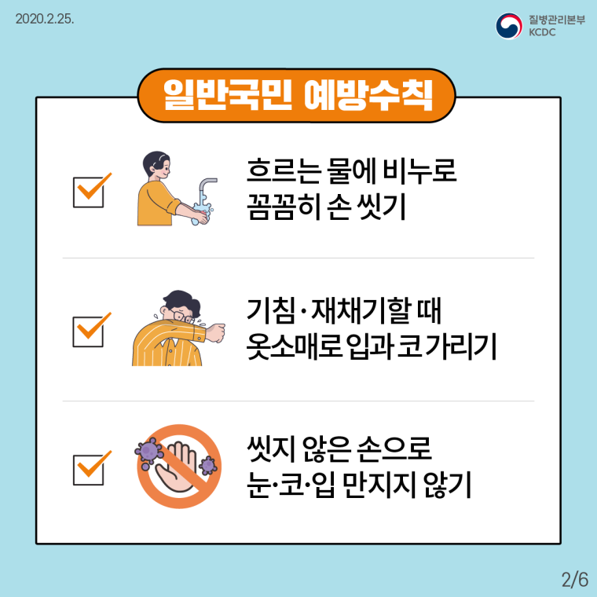
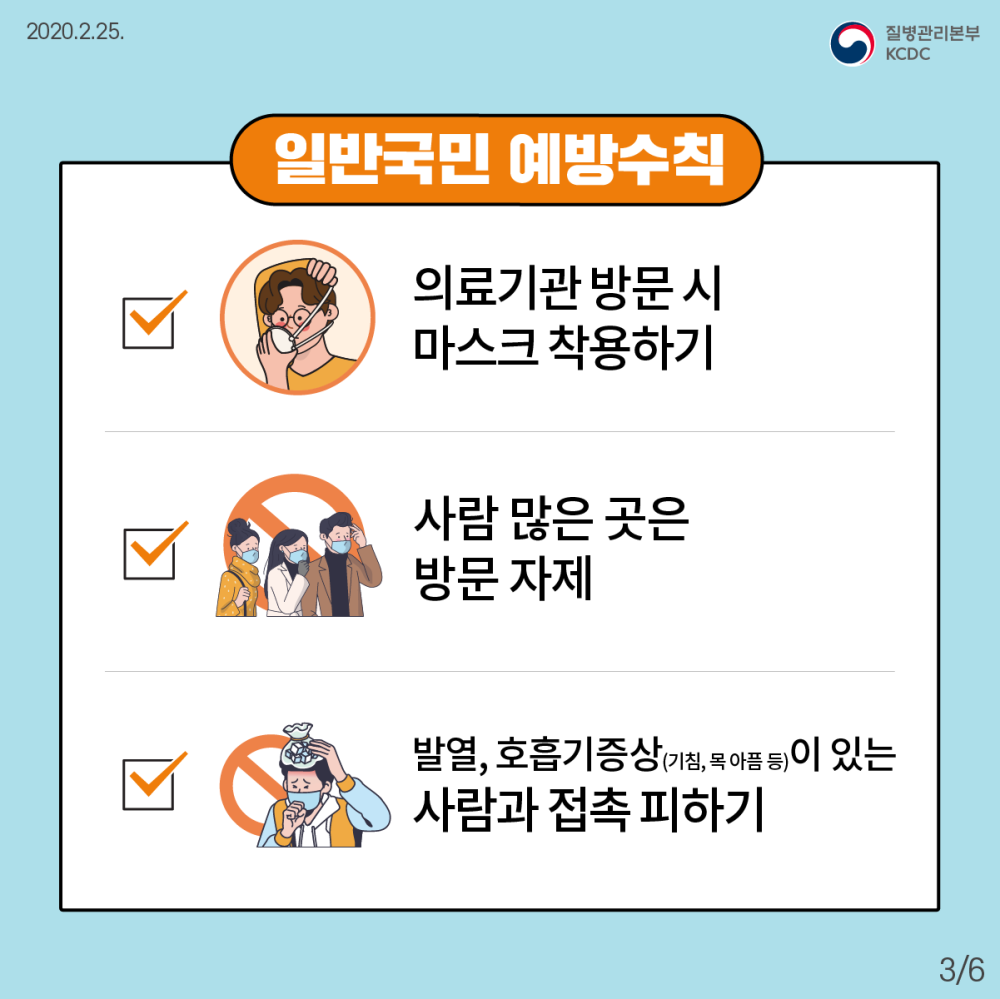
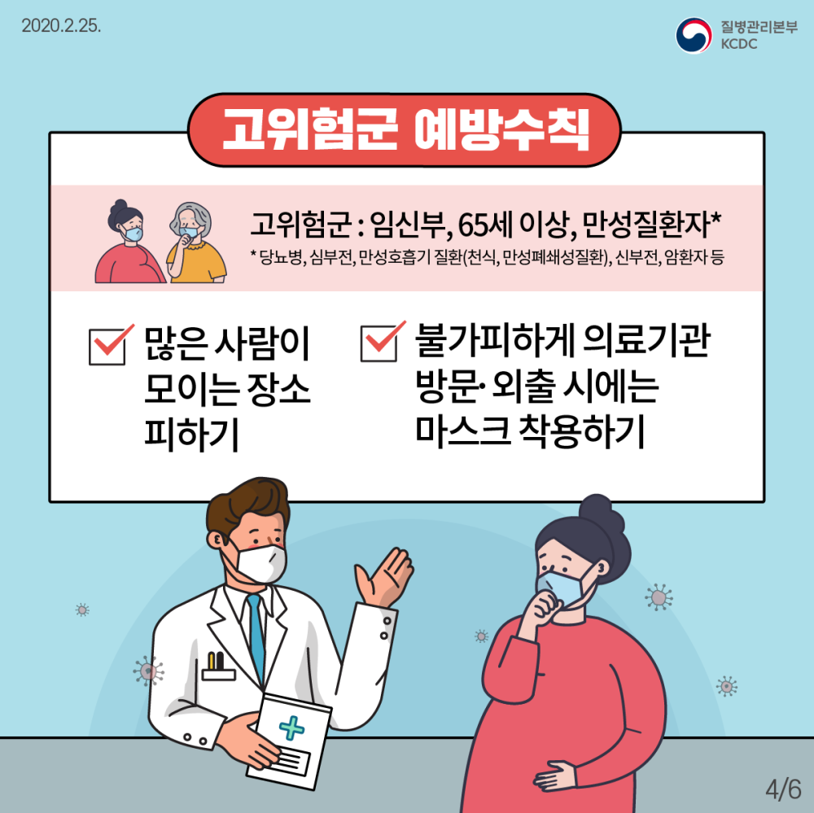
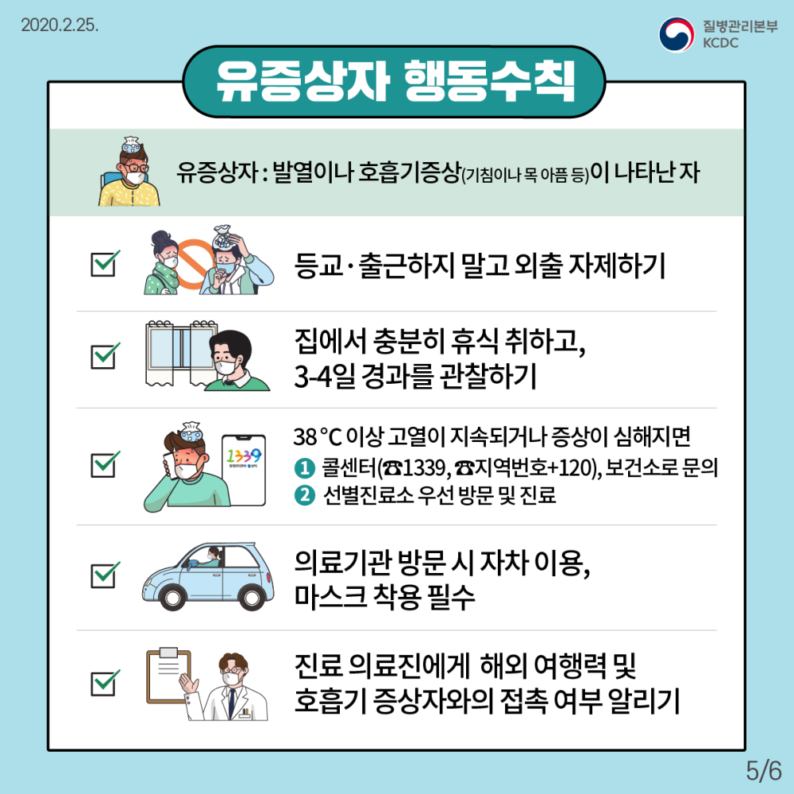
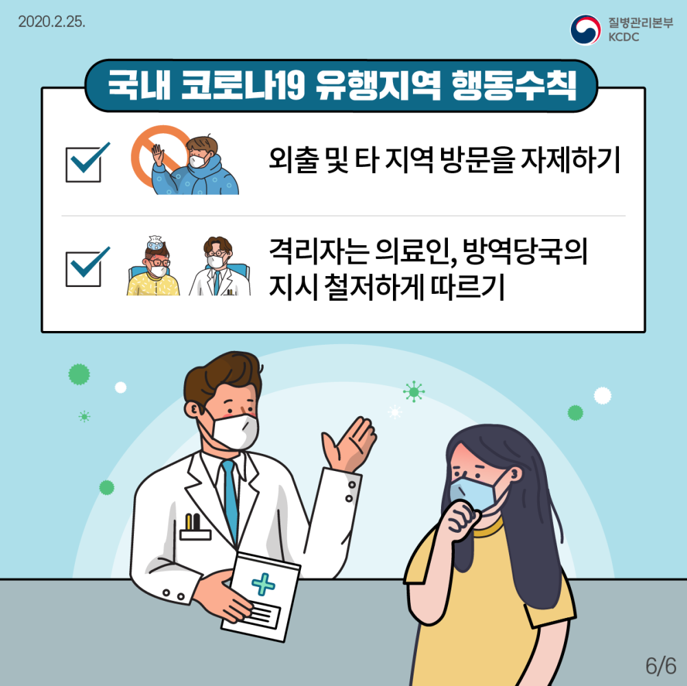

2월 25일에 **질병관리본부**에서 공지한 코로나19 국민예방행동수칙의 안내입니다.  
이런 때 일수록 기본을 잘 지켜나가면 어려운시기를 해쳐나갈 수 있습니다.

  
함께지키는 코로나19 예방행동수칙  

  
일반국민 예방수칙 1  

  
일반국민 예방수칙 2  

  
고위험군 예방수칙  

  
유증상자 행동수칙  

  
국내 코로나19 유행지역 행동수칙  

