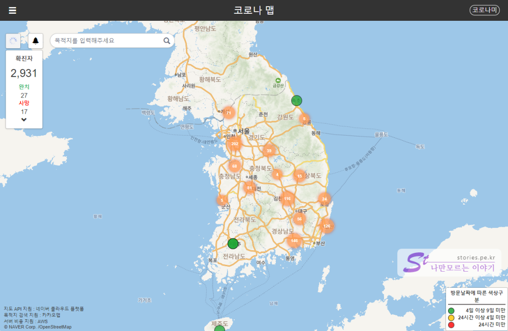
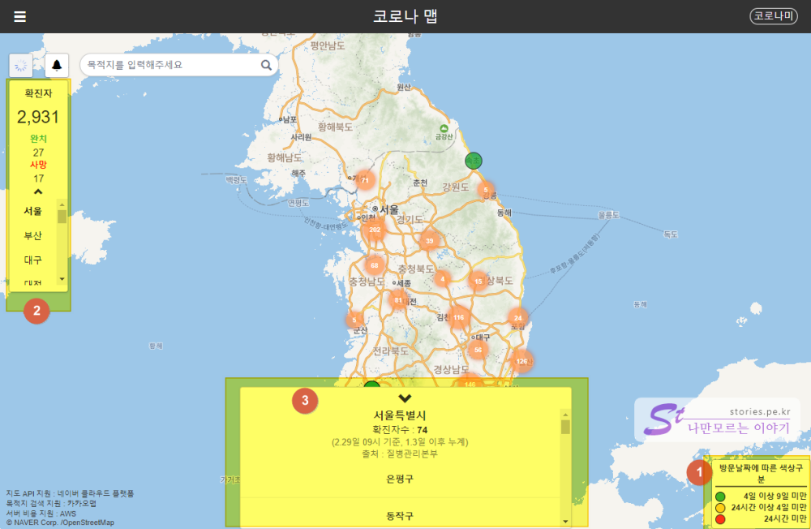
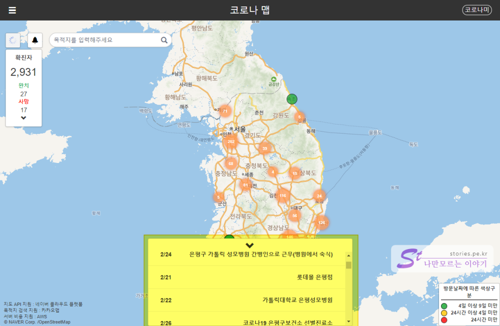
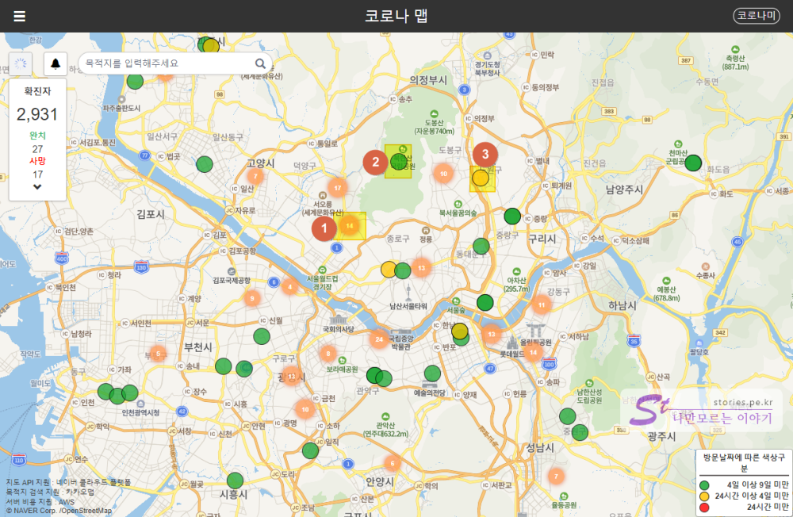
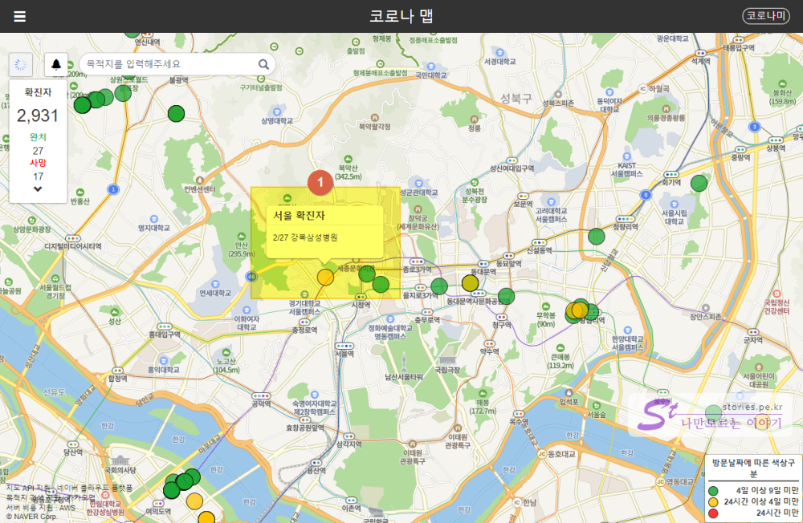
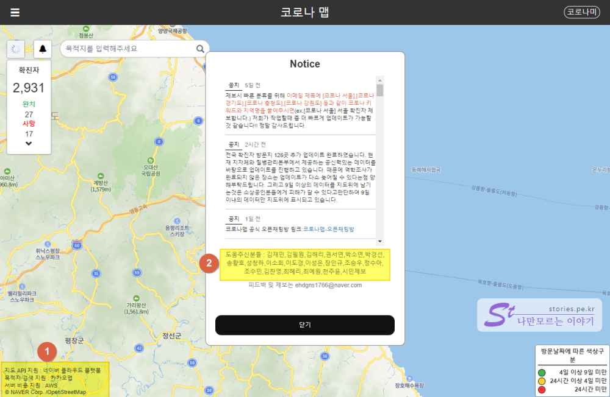

지금 **코로나19** 때문에 전세계가 난리가 아닙니다. 중국 우한에서 시작하여 현재 전세계로 퍼저고 있는 중입니다. 우한에서 시작해서 **우한폐렴**이라고 했으나 이번부터는 질병이름에 지역명을 넣으면 않된다고 해서 공식명칭이 **코로나19**로 정해 졌습니다.   

지피지기(知彼知己)면 백전불태(百戰不殆)이라고 했듯이 코로나19를 알면 어느정도는 피해갈 수 있습니다. 

> 지피지기(知彼知己)면 백전불태(百戰不殆) : 적을 알고 나를 알면 백번 싸워도 위태롭지 않다   

당장 세계 정세보다는 국내의 코로나19가 어떻게 전판되고 있는지 어디에 퍼져있는지 알려주는 웹사이트가 있어서 소개하려고 합니다.  

  
이동훈님이 질병관리본부에서 제공하는 데이터를 가지고 일반 사용자들이 보기쉽게 지도형태로 제작한 웹사이트입니다.  

## 코로나 맵  
코로나 맵을 보는 기본적인 사용법은 아래와 같습니다.   

   

1. 지도에 표시된 원형의 색상에 따른 표기 입니다. 빨간색이 24시간전의 활동이라 가장 조심해야 할 색입니다.   
2. 확진자와 발생위치에 대한 상황을 보여 줍니다. 현재 시간으로 확진자가 3000명에 가까워졌습니다. 
3. 2번에서`도` 위치를 클릭한 경우 좀더 상세한 `시` 이하의 위치 정보를 상세히 보여줍니다.   

   
구를 선택하면 날짜별 상세 동선 정보를 볼 수 있습니다.   

   
코로나 맵의 지도에서 서울의 위치를 확대해 보면...
1. 주황색에 숫자는 그 지역안에서 발생한 건수를 의미합니다. 지도를 좀 더 확대해 보면 그곳에 14건의 정보가 더 있습니다. 
2. 초록색은 범례에도 있듯이 4일이상 9일미만에 발생한 건수 입니다. 
3. 주황색은 24시간 이상 4일 미만에 발생한 건수입니다. 

그나마 다행히 24시간 안에 발생한 빨간색점은 없네요.  

   
해당 점을 클릭하면 상세 정보를 볼 수 있습니다.  

## 만든이 도운이들...

   
지도 API는 네이버맵 API를 사용했고 검색은 카카오맵의 목적지 검색을 사용했다고하네요. 
서버비용은 AWS에서 지원했다고 합니다.(AWS는 아마존 웹서비스의 약자 입니다.) 

앱개발은 이동훈님이 시작한것 같고 여러사람들이 도움을 주신것 같습니다. 

## 코로나맵 바로가기  

> [코로나맵 바로가기](https://coronamap.site/)   

