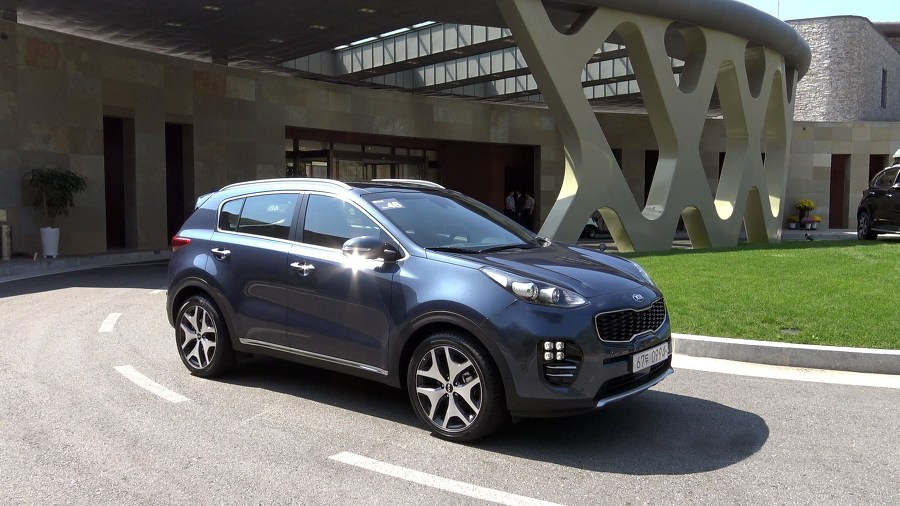
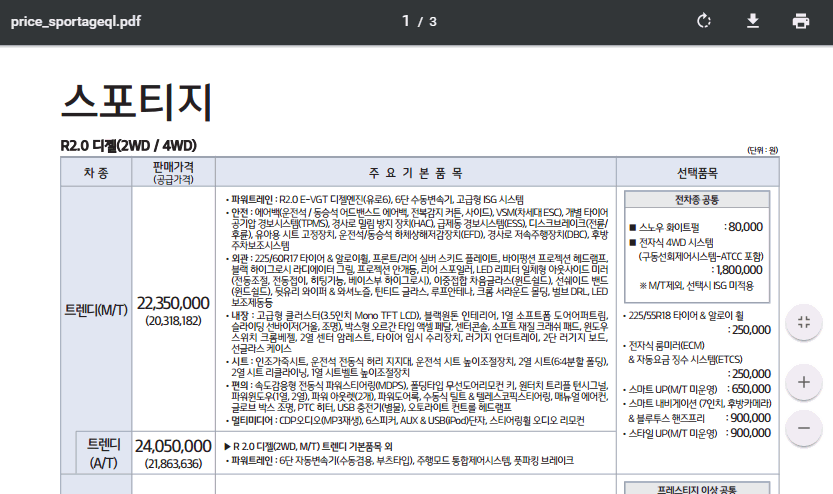

작년에 차량(스포티지)을 구매했습니다.
사람에 따라서 가오를 중요하게 여기는 경우도 있고 이것 저것 신경쓰지 않고 편하게 구매하는 경우도 있고 본인이 조금 힘들더라도 가성비를 따져가며 구매하는 경우도 있습니다.
저는 부유하지 못한관계로 후자에 속하는 경우이며 아래 내용도 그런 관점으로 봐주시면 됩니다.

---

저는 차량의 전문가는 아니지만 신차를 구매하면서 알게된 정보 및 아쉬웠던 점을 토대로 신차 구매시 참고할 수 있는 구매요령을 정리해 보려고 합니다.

이상하기는 하지만 기본적으로 우리나라에서 판매하는 모든 신차의 가격은 어디를 가나 동일합니다. (팜플렛에 있는 금액이며 변하지 않습니다.)
차이가 나는 부분은 자동차 회사에서 **매달 제공하는 판매조건**과 **영업사원의 마진**을 구매자에게 돌려주는 금액 그리고 **할부 구매 시 할부이율**에서 차이가 납니다.
그리고 기존에 가지고 있는 **중고차를 얼마에 파느냐**가 중요한 차이라고 보시면 됩니다.

그래서 가성비 면에서 차량구매 시 고려해야 하는 것은 아래의 4가지 입니다.

> 1. 영업사원이 제공해 주는 서비스 금액
> 2. 할부구매일 경우 할부 이율
> 3. 해당 월의 판매조건
> 4. 가지고 있던 중고차를 판매해 주는 금액

이 4가지 관점으로 영업사원(딜러)과 딜을 하시면 됩니다.  
그리고 가지고 있던 중고차를 판매하는 것도 꼭 딜러를 통해서 판매할 필요는 없습니다. 우리는 인터넷이 있으닌까요!

신차를 구매하면서 호갱이 되지 않기위해서는 아래 5가지 요령으로 진행하시면 됩니다.

## 첫번째 - 구입을 원하는 차량을 선택하세요.

이글을 보기전부터 아마도 대부분은 구입을 원하는 차량이 결정되어 있을 것입니다. ^^
다만 인터넷이나 해당 차량의 동호회 웹사이트나 카페를 방문하면서 이것 저것 정보를 얻는것이 중요합니다.
이것은 나중에 영업사원과 거래를 할때 호갱이 되지 않는 방법 중 하나 입니다.

그리고 해당 차량의 홈페에지에 들어가면 대개 PDF문서로 제품 견적 및 사양, 옵션을 정리해 놓은 팜플릿을 제공합니다.

[스포티지2017팜플렛](http://www.kia.com/content/dam/kwcms/kr/ko/files/RQL/price/price_sportageql.pdf)

해당 팜플렛을 보시고 원하시는 트림 및 옵션을 선택하세요. 일단은 대략적으로 선택해도 됩니다. 나중에 대리점이나 시승처에서 상담을 통해 이야기를 들어보고 옵션을 최종 결정하시면 됩니다.

이 첫번째 단계에 가장 많은 시간과 공을 들이는 것이 중요합니다. 이 시간을 충분히 갖지 못하고 차를 구입 할 경우 많은 후회를 할 수 있을 것이기 떄문입니다.
`"아 ~ 속은 것 같아... 조금 더 알아볼껄~" `
이럴지도 모릅니다.

> **중요 포인트 : 내가 구매하고자 하는 차량에 대한 정보를 획득한다**

## 두번째 - 대리점이나 시승처에서 실제 제품을 보고 상담 및 견적을 받으세요.

어느정도 구매하고자 하는 차량과 모델이 선정이 되었으면 가까운 대리점 3~4군데를 방문하여 상담과 견적을 받으면서 비교를 해보는 것이 중요합니다.
상담을 통해서도 실제로 많은 정보를 알게 됩니다. 이 지식은 추후 온라인 견적을 통해 구매할때 많은 도움이 됩니다.
이 단계에서 가장 중요하게 판단할 것은 ** 차량 트림 선택과 옵션의 선택 ** 입니다.
대리점에게는 미안하지만 대리점에서는 비교적 많은 혜택을 받지 못하는것이 현실입니다.
다만 가성비가 우선이 아니고 편리하고 안전한 구매를 추구하시는 사람들은 대리점에서 구매하는 것도 나쁘지는 않습니다.

> **중요 포인트 : 차량트림과 옵션을 결정한다.**

## 세번째 - 온라인에 견적요청을 하고 구매를 결정하세요.

두번째 단계에서 차량트림과 옵션을 확실히 결정하는 것이 좋습니다. 이것이 결정이 되어야 견적금액의 비교가 쉬워 집니다.
결정된 차량트림과 옵션을 가지고 인터넷 카페나 [다나와자동차](http://auto.danawa.com), [오토카페](http://www.autocafe.co.kr)등에 올려서 견적을 요청하면 수많은 딜러(영업사원)나 딜러사이트에서 견적을 제시합니다. 그중에서 가장 좋은조건으로 제시하는 딜러(영업사원)를 선택하시면 됩니다.
대략 판단기준은 말씀 드린 **딜러가 제공해 주는 서비스 금액**, **할부구매일 경우 할부 이율**, **내 중고차를 얼마까지 팔아줄지..** 에 따라 결정하시면 됩니다.

저 같은 경우는 딜러에게 65만원을 받았으나 알아보니 80~100만원까지 받은 사람들도 있었습니다.
온라인이다보니 항상 사기에 조심을 해야 합니다.  
온라인 딜러라 하더라도 대부분은 전국의 어딘가에 있는 대리점 영업사원이기때문에 명함이나 대리점을 확인하는 것이 좋습니다.

> **중요 포인트 : 온라인에 견적을 요청하고 그 중 최저의 금액을 선택하여 거래를 진행한다.**

## 네번째 - 신차에 설치할 사제 옵션을 결정하세요.

새로 신차를 뽑게되면 기본적으로 설치해야 하는 사제옵션들이 있습니다.
보통은 아래와 같습니다.

> - 틴팅(썬팅)
> - 블랙박스
> - 네비게이션
> - 언더코팅
> - 방음
> - 양방향경보기(또는 단방향 경보기)
> - 유리막코팅
> - 등등..

일반적으로 틴팅과 블랙박스는 필수로 한다고 보시면 됩니다.
틴팅(썬팅)은 보통 영업사원이 공짜로 해주는 경우가 많은데 이 틴팅을 **쿠폰틴팅**이라고 합니다.  
쿠폰틴팅은 틴팅회사에서 영업사원들에게 무료로 뿌리는 쿠폰으로 작업하는 것으로 가장 저렴한 틴팅이라고 보시면 됩니다.
이 틴팅은 자외선은 99% 차단시켜주나 적외선은 차단을 하지 못합니다. 말하자면 여름에는 쪄 죽을 수도 있거나 죽기 싫어서 에어컨을 최대를 틀게되는데 이럴경우 연료비가 더 나갈 수도 있습니다

차에 대한 애정을 가지고 오래 탈 차를 원한다면 업업사원이 무료로 해주는 쿠폰 틴팅은 가급적하지 말고 돈을 좀 들이더라도 개별로 설치하는 것을 추천드립니다. 보통 `루마`나 `레이노`를 많이 합니다.

블랙박스도 일반적으로 네비게이션과 동일한 회사제품을 설치하면 같이 연동해서 볼 수 있습니다. 블랙박스는 **아이나비**나 **파인드라이브**를 많이 설치합니다.

네비게이션은 순정을 달고 나올 수도 있고 에프터마켓에서 달아도 되며 일반적으로 비슷한 기능이라고 봤을때 순정이 가격이 비싼편이고 사제가 싼편입니다.
현대나 기아차인 경우는 계열사인 만도맵을 달고 나옵니다. 아시다시피 만도맵보다는 아이나비나 파인드라이브가 더 인지도가 있기 때문에 주로 사제를 선호하는 편입니다.

언더코팅은 해야된다는 사람도 있고 하지 않아도 된다는 사람들이 있습니다. 그렇기 때문에 알아서 선택해서 하시면 됩니다. 참고로 정비소 아저씨말을 들어보면 하는것이 낮다고는 합니다.
보통 언더코팅을 하면서 방음도 같이 하는 경우가 많은데.. 방음도 선택사항입니다. ^^

나머지 옵션들은 필요에 따라 하시면 됩니다.

## 다섯번째 - 구매 후 차량인도할 방법을 선택하세요

마지막으로 신차를 받을 장소를 선택해야 합니다. 일반적으로 딜러가 신차를 받아서 사제 옵션을 설치해서 고객에게 인도해 주는 것이 보통입니다.
하지만 꼭 그럴필요는 없습니다. 딜러에게 서비스금액을 현금으로 받고 신차를 본인이 받아서 직접 옵션을 설치하는 방법도 있고, 신차탁송을 대행해 주는 업체를 이용하는 방법도 있습니다.

> 1. 차량을 구매한 딜러를 통해 신차를 받고 옵션까지 설치하여 인도받음
> 2. 본인이 신차를 받고 옵션을 설치하러 다님 (딜러에게 서비스 할인비용을 돈으로 받은경우)
> 3. 신차탁송대행업체를 통해서 신차를 받고 옵션을 설치함 (딜러에게 서비스 할인비용을 돈으로 받은경우)

### 딜러를 통해 신차를 받고 옵션을 설치할 경우

`장점`으로는 편하다는 것입니다.
`단점`으로는 각 옵션을 설치한 업체를 알기 어려워서 A/S를 받기 어렵고 각 설치업체에서도 딜러가 의뢰한 경우는 대충 대충해주는 경향이 있습니다.

### 본인이 신차를 받고 옵션을 설치하러다니는 경우

`장점`으로는 평판이 좋고 가성비가 뛰어난 업체에서 시공을 받을 수 있고 A/S도 쉽게 받을 수 있습니다.
`단점`으로는 인터넷이나 동호회를 통해 좋은 설치업체를 찾기위해 시간과 열정을 들여야한다는 점입니다.

### 신차탁송대행업체를 통해서 신차를 받고 옵션을 설치하는 경우

2개의 중간쯤이라고 보면 됩니다. `장점`으로는 신차를 받았을 때 신차검수를 해서 하자가 있는경우 반송을 해주기도 합니다. 또한 신차를 받아서 다양한 옵션들도 같이 설치를 해 줍니다.
`단점`으로는 가격이 꼭 싸지만은 않습니다. 견적을 요청해서 저렴한 옵션만 설치하는 것도 방법입니다.

이상 다섯가지의 순서대로 차량을 구매한다면 최소한 호갱은 되지 않고 가성비 높은 신차를 구매 할 수 있습니다.
