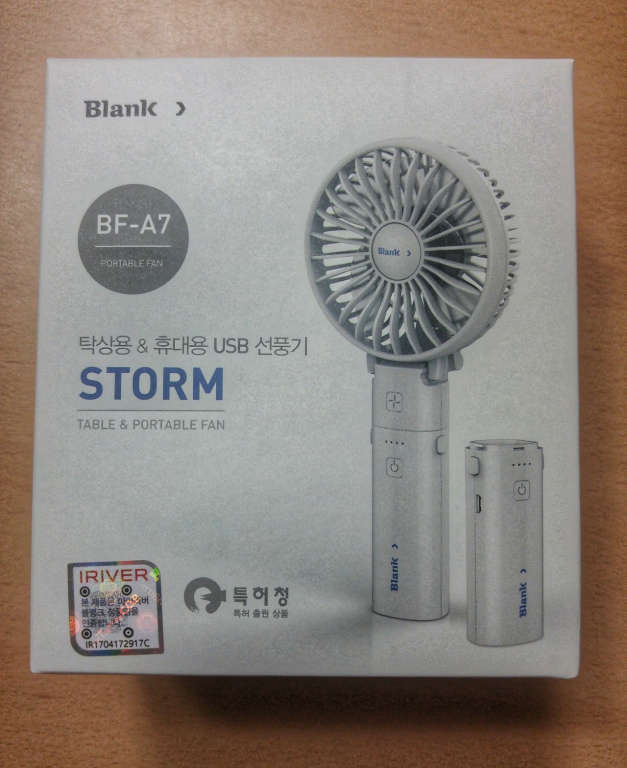
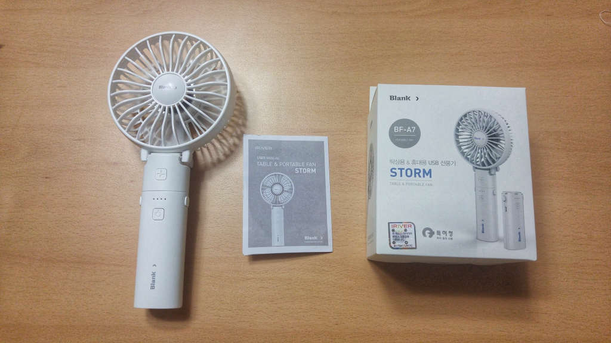
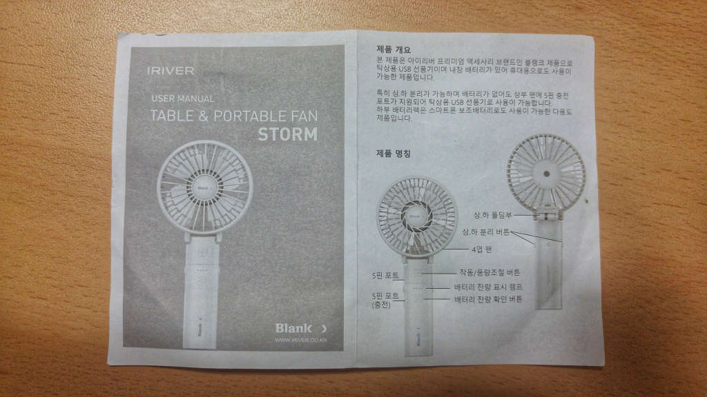
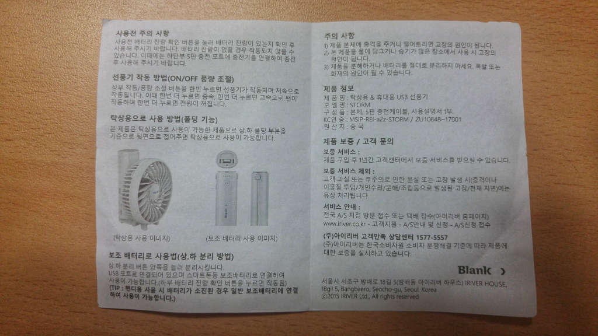
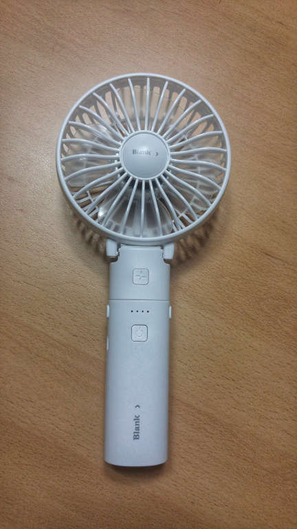
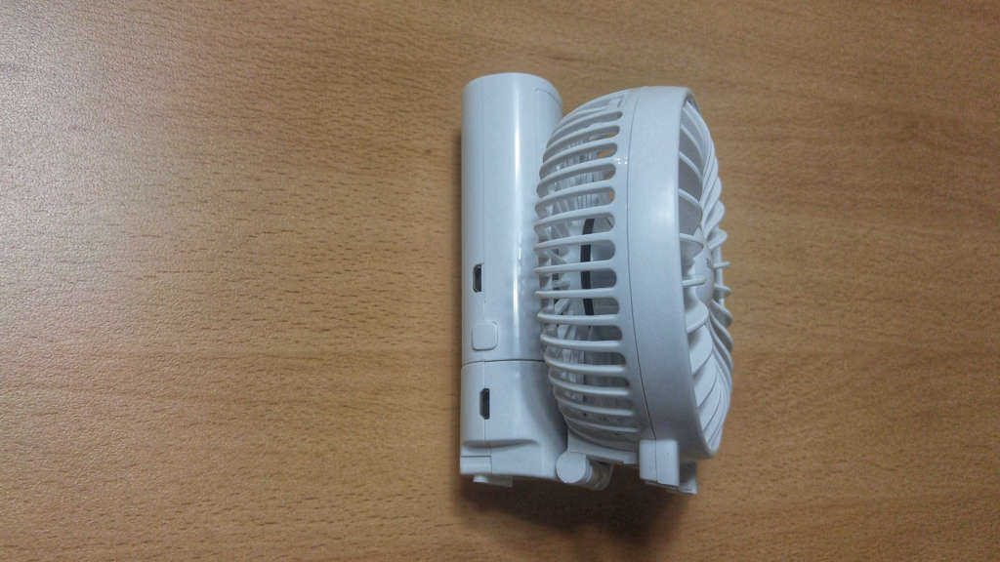
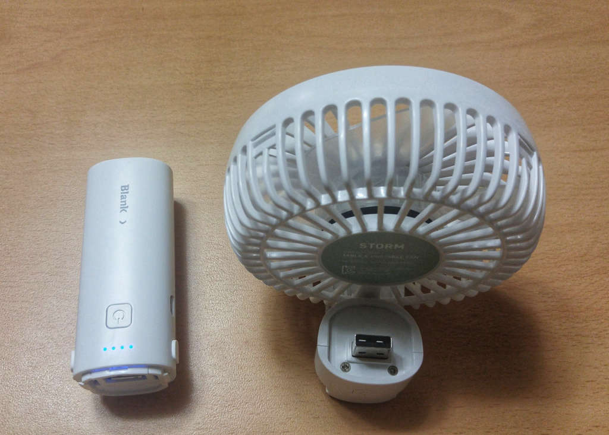

더위를 많이 타는 사람들은 여름이 정말 고역입니다. 저도 더위를 많이 타는 체질이라 고민끝에 손풍기를 하나 구매하였습니다.  
제가 구매한것은 `Blank`에서 출시한 `STORM`이라는 손풍기 입니다.  
Blank는 아이리버에서 출시한 브랜드로 좋은품질의 제품을 저렴한 가격으로 판매를 하는 브랜드입니다.  
그래서 Blank제품이면 어느정도는 완성도가 있다고 보시면 될 것입니다.

▲ 제품박스는 적당한 크기 입니다. 아이리버 블링크 정품이라는 씰이 붙어있네요. ^^  
뭘 특허를 획득했는지 모르겠지만 특허청의 마크도 붙어있네요. 뭔가 있어 보입니다.

▲ 구성품은 단순합니다. 박스빼고 본체하고 설명서, 충전케이블만 있습니다.  
충전케이블은 사진으로 찍지못했네요. 충전케이블은 굉장히 짧습니다.

▲ 설명서는 단순합니다. 제품 부분명칭과 사용방법이 있습니다.

▲ 손풍기 본체입니다. 마감은 생각보다 좋습니다.
일반적으로 이렇게 펴진형태로 손으로 잡고 사용하도록 되어 있습니다.

버튼이 위에하나 아래에 하나 모두 2개가 있는데, 위의 버튼은 선풍기 작동 버튼입니다.  
버튼을 한번 누르면 천천히 돌아가고 두번을 누르면 더 쎄게 돌아갑니다. 총 3단계로 되어 있습니다.

아래의 버튼은 배터리의 잔량을 확인하는 버튼입니다. 버튼을 누르면 배터리의 잔량에 따라 4개의 불빛이 들어옵니다.

▲ `BF-A7` 모델의 장점인 탁상용 모드 입니다.  
이 탁상용 모드가 생각보다 편한경우가 많습니다. 사무실이나 학교의 책상에 앉았을 경우 이렇게 탁상용 모드로 올려놓으면 시원한 바람을 맞으면서 양손을 모두 사용할 수 있습니다.

▲ 또하나의 장점은 **배터리가 분리**가 된다는 점입니다. 분리가 된 배터리는 핸드폰의 **보조배터리**로 사용이 가능합니다.

5핀단자가 손잡이인 배터리 쪽에도 있고 프로펠러가 있는 본체 쪽에도 5핀 단자가 있습니다.
배터리에 있는 5핀단자는 배터리를 충전하는 충전용 단자 입니다.
본체에 있는 5핀단자는 배터리가 없어도 5핀 충전기를 바로 연결하면 선풍기가 돌아가게 되어 있습니다.
배터리에 USB단자가 있는데 이 단자에 케이블을 연결하여 보조배터리로 사용할 수 있습니다.

---

## 총평

단점보다는 장점이 많은 제품입니다. 구매를 추천할 만 합니다.

### 장점

- 완성도가 좋음
- 보조배터리로 사용이 가능
- 탁상용 모드가 있어서 편리
- 배터리가 없어도 선풍기 구동이 가능

### 단점

- 잠금기능이 없어서 원하지 않게 쉽게 버튼이 눌려서 혼자 작동됨

### 별점

 총점 : ★★★★☆

