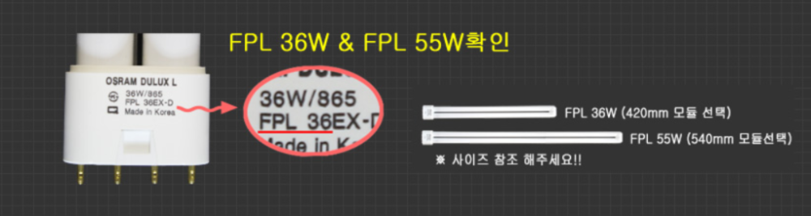
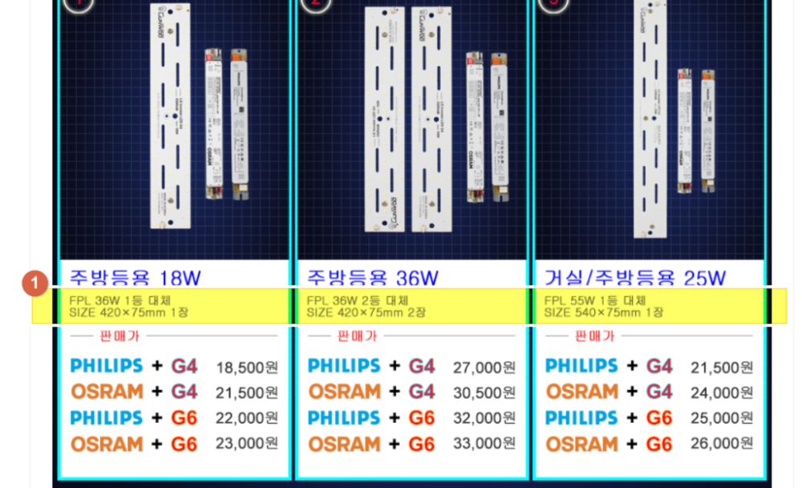
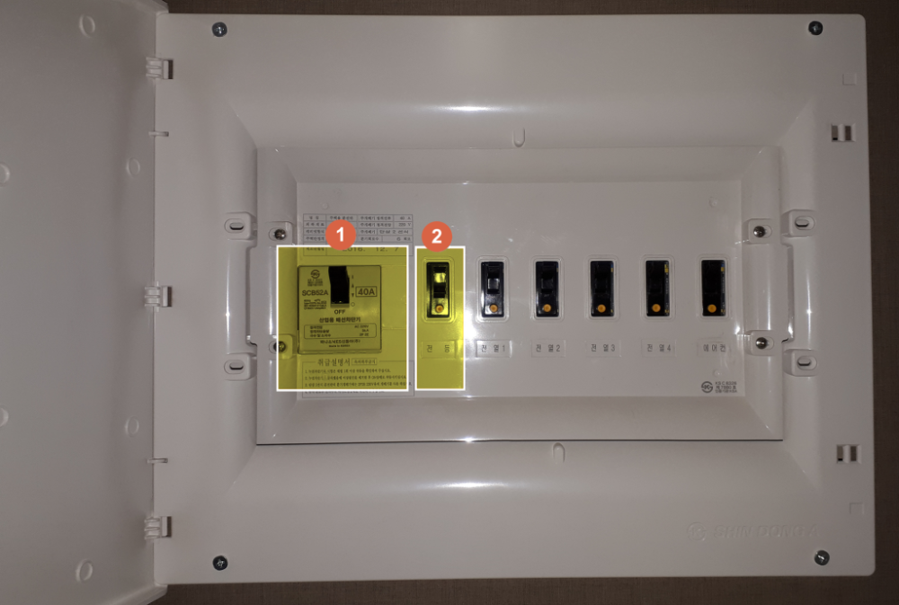
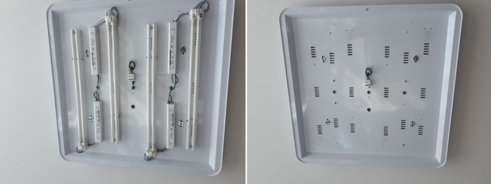
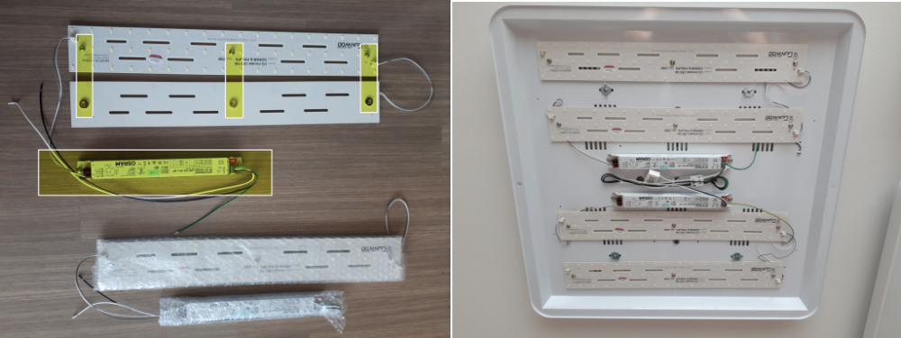
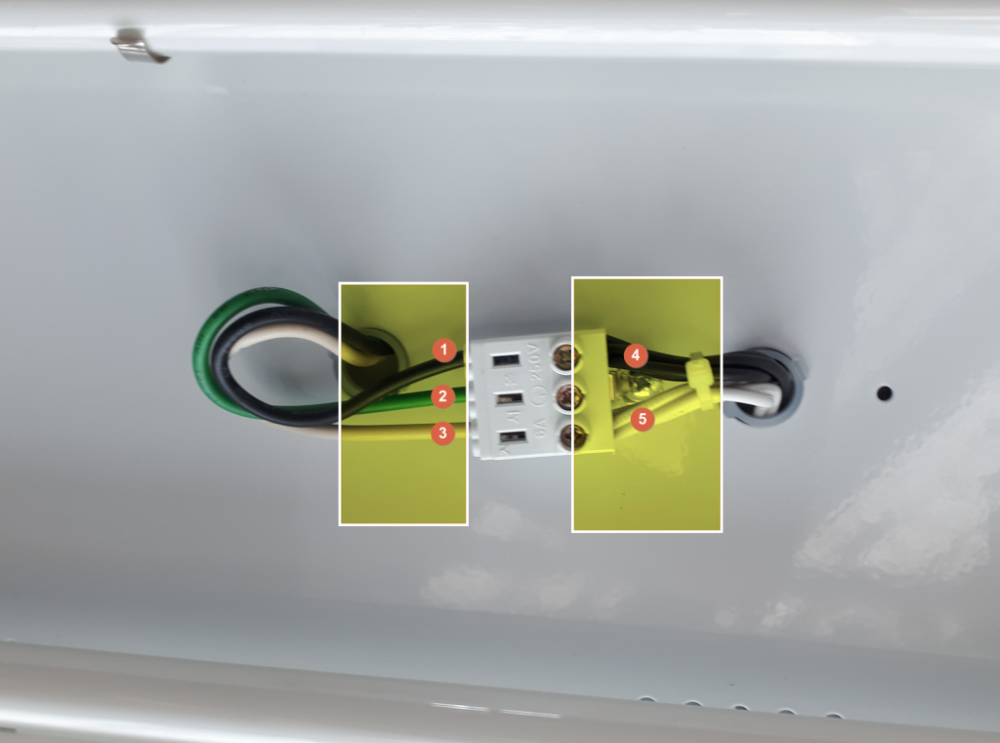
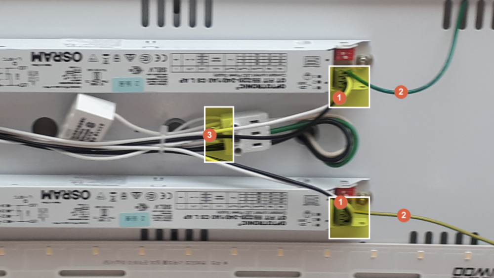
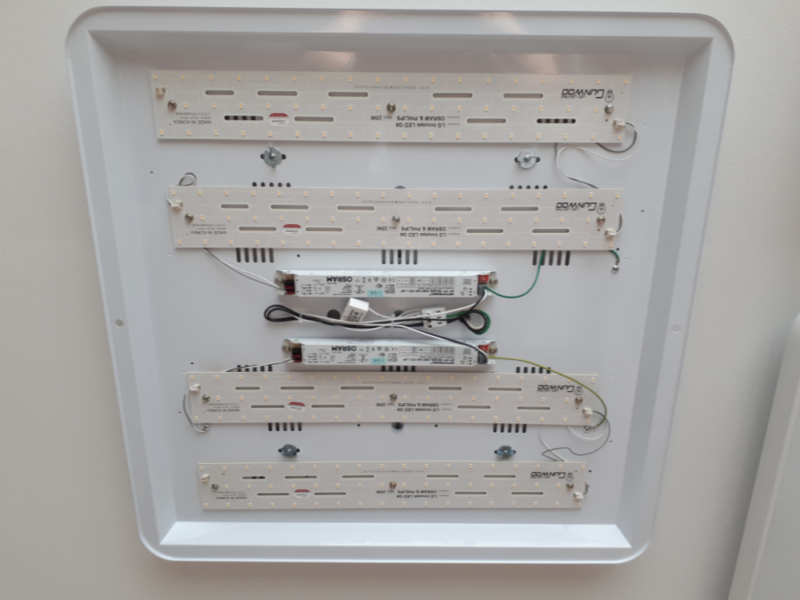

아파트로 이사온지 1년 만에 전등을 모두 LED로 바꾸는 작업을 했습니다. 처음에는 막연한 두려움 때문에 고민을 많이 했었는데 해보니 그렇게 어렵지는 않았습니다.  

# 사전 준비

먼저 네이버에서 `LED모듈`로 검색을 하면  수 많은 판매 샵이 나옵니다. 그중에서 원하시는 사양으로 구매를 하면 됩니다. 

### 먼저 교환하고자 하는 용량 확인하기  
일단은 기존에 교체하고자 하는 전구의 용량을 먼저 확인해서 그 용량과 맞는 LED모듈을 주문하면 됩니다. 
기존의 용량을 활용하는 방법은 전구의 플라스틱 부분을 보면 표시가 되어 있습니다.  

[건우 LED 바로가기 ](https://smartstore.naver.com/gunwooled)  

### 용량에 맞는 LED모듈 주문하기  
  
보통 사진처럼 기존 용량에 대체될 수 있는 LED모듈을 표시해 줍니다. 이것을 확인해서 모듈을 주문하면 됩니다. 

# 설치하기  

거실을 기준으로 설명을 하도록 하겠습니다.   

## 배전반을 OFF로 합니다.  
가장 중요한 것은 안전입니다. 배전반을 찾아서 `OFF`를 시키고 내가 전기 작업을 한다는 것을 집에 있는 모든 사람에게 알려야 합니다. 잘못하면 전기먹어 죽을 수 있습니다.   

  
사진 상으로는 잘 보이지 않지만 `전등` 스위치를 끈 상태 입니다.  

1. 전체 배전반을 꺼도 됩니다. 이때는 냉장고를 비롯해서 모든 전기가 꺼져버립니다.
1. `전등`에 연결되어 있는 전기만 끌 수도 있습니다. 

1번을 끄든지 또는 2번을 끄면 됩니다. 끄신 다음에는 정말 전기가 꺼져버린 것인지 눈으로 다시 한번 확인해야 합니다.   

## 거실 전등의 내용물을 모두 들어내야 합니다.  
교체하고자 하는 전등의 내용물을 모두 제거해야 합니다.  
> 전동드라이버가 있으면 너무나 편합니다.  조그만 것은 3만월~5만원이면 살 수 있으니 이참에 하나 장만하세요.

  
사진과 같이 내용물을 모두 제거 합니다. 

## 구매한 LED모듈을 부착합니다.   
구매한 LED모듈은 대부분 업체에서 최소한의 배선작업 및 안정기 세팅을 해서 보내줍니다. 또한 LED모듈에 **자석**을 설치해서 보내줍니다. 그래서 그냥 철거한 전등에 부착만 하면 됩니다. 나사를 조일 필요도 없습니다.  아주 편리하고 쉽습니다.  

  
부엌등이나 화장실 등은 2개 한 세트를 설치하는게 보통인데 거실은 2개를 하나로 묶은 세트를 2개를 설치합니다. LED판넬로 치면 4개의 판넬이 설치 됩니다.   

## 배선 연결하기  
배선은 설치하기 전에 미리 찍어 둔 사진을 참조해야 합니다.  

   
`1`,`2`,`3`은 천정에서 내려 온 전기선입니다.  
1. 교류전기라서 `+`, `-`는 구분이 없습니다. 
1. 초록색은 안전을 위한 `접지선`입니다. 
1. 교류전기라서 `+`, `-`는 구분이 없습니다. 

`4`, `5`은 지금 설치한 LED모듈의 안정기 쪽에서 나온 배선입니다.  
1. 교류전기라서 `+`, `-`는 구분이 없습니다.
1. 교류전기라서 `+`, `-`는 구분이 없습니다.

1. LED모듈 안정기에서 나온 배선을 `3`에 연결하면 됩니다. 거실 전등이라 안정기가 2개 이므로 각각의 선을 합쳐서 설치를 했습니다. 또한 전자 스위치라 LED전등의 플리커 현상을 없애기 위해서 콘덴서를 달았습니다. 
1. `2` 는 접지선 입니다. 안전을 위해서 전등의 철판에 나사로 붙히시면 됩니다. 

# 설치완료  

  

1. 설치가 완료된 모습니다. 설치가 완료되었다면 배전반에서 전원을 `ON`시켜줍니다.  
1. 그리고 스위치를 켜서 정말로 잘 나오는지 확인을 합니다. 
1. 설치가 잘 되었다면 이제 전등 커버를 닫으면 됩니다. 
