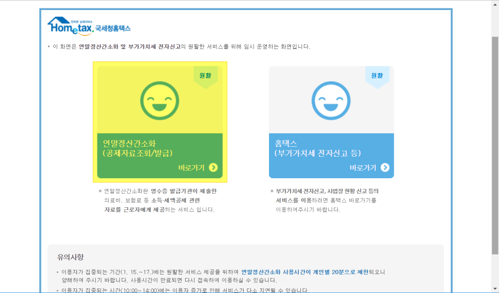
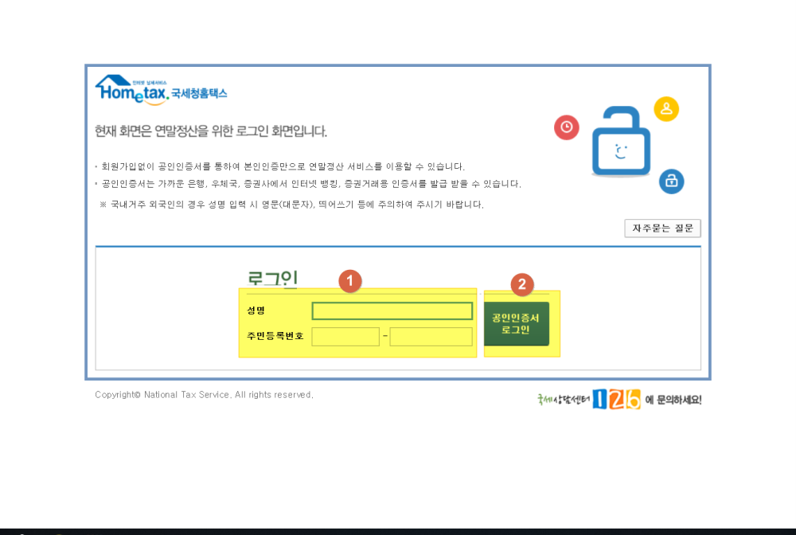
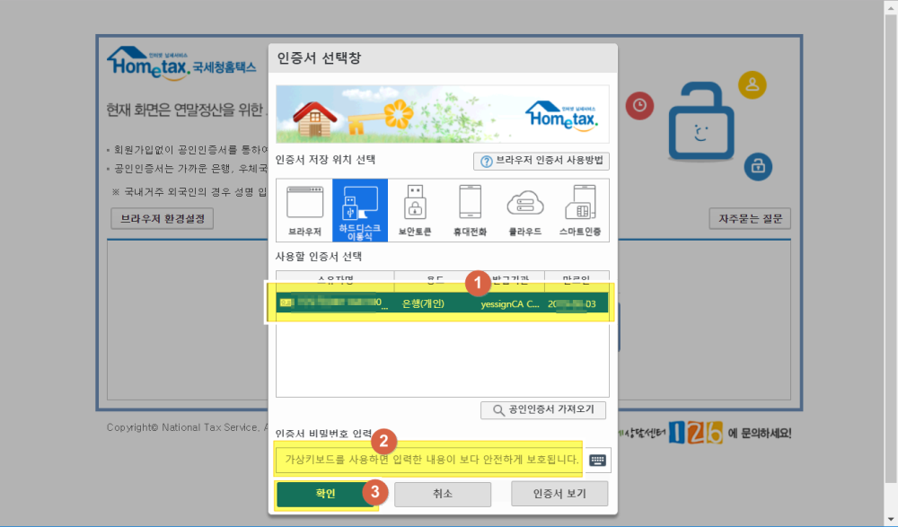
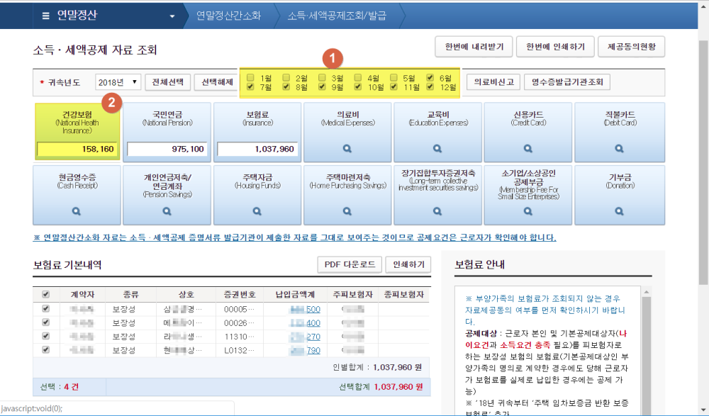
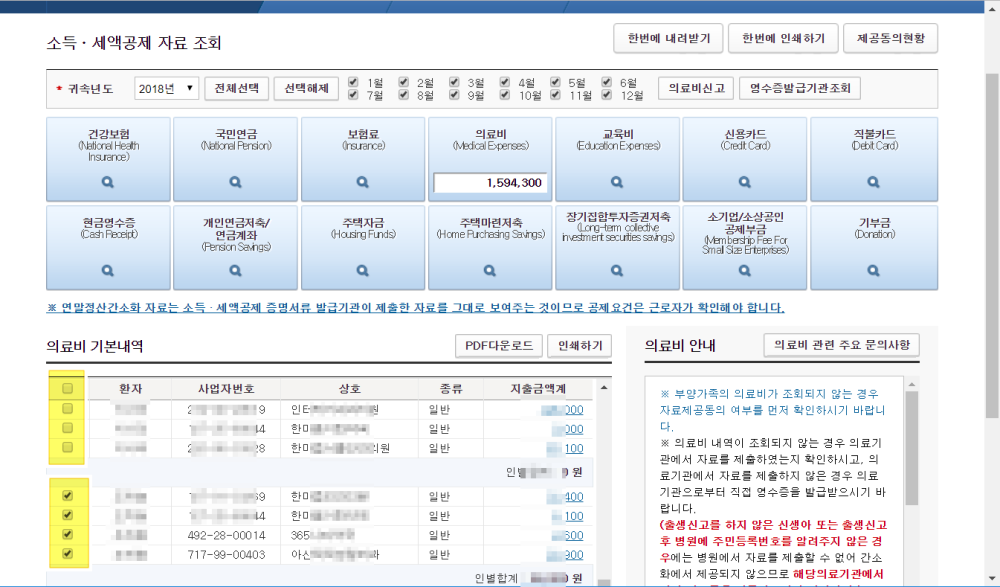
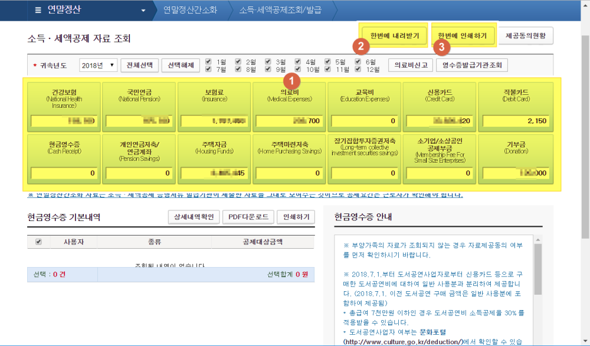
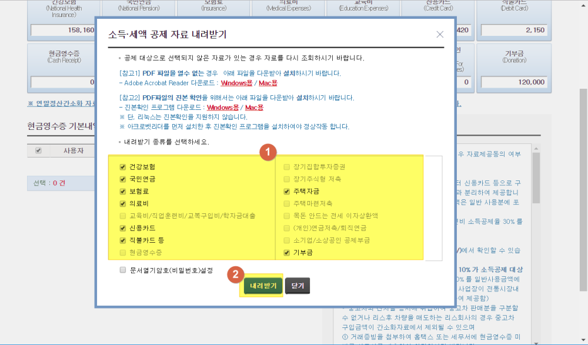

드디에 13월의 월급인 연말정산을 산정하는 기간이 왔습니다.  
예전갔으면 연말정산 서류를 준비하는데 1주일이상 걸리고는 했는데 이제는 연말정산 간소화 서비스를 제공해 주고있어서 서류를 준비하는데 하루 또는 반나절이면 끝나는 편리한 세상이 왔습니다.  
그렇다고 아무렇게나 해버리면 자칫 놓칠 수 있는 환급액이 있을 수 있기  때문에 간단히 하되 자세히 꼼꼼히 보고해야 할 필요가 있습니다.   

이번 포스팅은 `연말정산 간소화 서비스`를 이용하는 방법을 포스팅해 보겠습니다. 

## 사전 준비  
연말정산 간소화 서비스를 이용하기 위해서는 먼저 아래의 2가지를 미리 준비해 놓으셔야 합니다.  

1. 공인인증서
1. 자료제공동의 (선택)

연말정산 간소화 서비스를 이용하려면 본인임을 확인할 수 있는 `공인인증서`를 미리 등록하고 인증서를 가지고 있어야 합니다.  
공인인증서는 시중의 모든 은행에서 발급을 받을 수 있습니다. 먼저 은행을 방문하시여 인터넷뱅킹을 신청해야 합니다. 이미 인터넷뱅킹을 사용하고 있다면 그냥 온라인에서 발급을 받을 수 있습니다.  
대부분의 은행의 웹사이트나 모바일앱에서 찾아보시면 `인증센터`라는 메뉴가 있고 그곳에서 발급을 받을 수 있습니다. 

`자료제공동의`는 본인만 대상이라면 필요없지만 수입이 없는 부양가족인 `미성년 자녀`나 `노부모`가 계시면 그분들께 `미리 자료제공동의`를 받아서 등록을 해 놓으면 그분들이 사용한 비용도 연말정산에 같이 합산하여 신청할 수 있습니다.  

## 연말정산 간소화 시스템 이용하기  
먼저 [연말정산 간소화 시스템 웹사이트](https://www.hometax.go.kr)에 접속을 합니다.   

> [연말정산 간소화 시스템 웹사이트 이동](https://www.hometax.go.kr)  

원래는 보통 일반 홈페이지의 메인화면이 나오지만 연말정산 기간에는 아래와 같은 화면이 나옵니다.  

  
딱 2개의 선택지가 있는데 그중에 `연말정산간소화`를 선택합니다.   

  
회원가입을 해도 되지만 회원가입 없이 비회원으로 `공인인증서`로 로그인을 할 수 있습니다. 

1. 이름과 주민등록번호를 입력합니다. 
1. `공인인증서`로그인 버튼을 클릭합니다. 

  
미리 받아 놓은 인증서를 통해서 로그인을 합니다.   
1. 인증서를 먼저 선택합니다. 
1. 인증서 비밀번호를 입력합니다. 
1. `확인`버튼을 클릭합니다.  

인증서와 비밀번호가 맞다면 로그인이 자동으로 됩니다. 

  
드디어 연말정산간소화 화면이 나옵니다.  

1. 근무 월을 선택합니다. 만약 1년을 근무했다면 1~12월을 모두 선택을 하면되고 `중도입사자`라면 입사한 월부터 마지막 월인 12월까지 선택을 하면 됩니다. 그러면 자동으로 월별 합계금액이 취합됩니다. 
1. 각 14개의 항목을 모두 클릭합니다. 그러면 클릭할 때 마다 합계금액이 자동으로 보여지고 총 합계 목록에 취합이 됩니다.  

  
월별로도 선택을 할 수 있지만 사람별로도 선택이 가능합니다. `부양가족`인데 필요없는 항목인 경우는 체크를 빼면 합계에서도 빠지게 됩니다.  
그럴일은 거의 없지만 만약 맞벌이 부부같은 경우는 이렇게 부분 선택을 해야 하는 경우가 종종 발생합니다. 

14개의 항목을 모두 선택해서 금액이 보이도록 해 주면 됩니다.  
특별히 손댈 항목이 없다면 이게 끝입니다. 아주 간단하죠~~

1. 14개 항목을 모두 클릭하여 숫자가 보이게 합니다. 
1. `한번에 내려받기`를 클릭하면 파일이 `pdf`파일 형태로 다운로드를 받을 수 있습니다. 나중에 이것을 출력해서 사용할 수 있습니다. 
1. `한번에 인쇄하기`를 클릭하면 바로 프린터로 출력이 되어 집니다. 

보통은 `한번에 내려받기`를 클릭해서 다운받아 놓고 필요할 때 마다 출력하는 것을 추천 드립니다. 

  
기본적으로 다운로드받아야할 항목이 자동으로 선택되어서 보여집니다.  특별한 이유가 없으면 그냥 그대로 다운로드를 받으면 됩니다.  

1. 다운로드 받기 원하는 항목을 선택합니다. 자료가 없는 항목은 그냥 비활성처리되서 보여집니다.  
1. `내려받기`를 클릭하면 `PDF파일`로 다운로드 됩니다. 

이제 이 파일을 회사내의 `연말정산 담당자`에게 제출을 하면 됩니다. 
