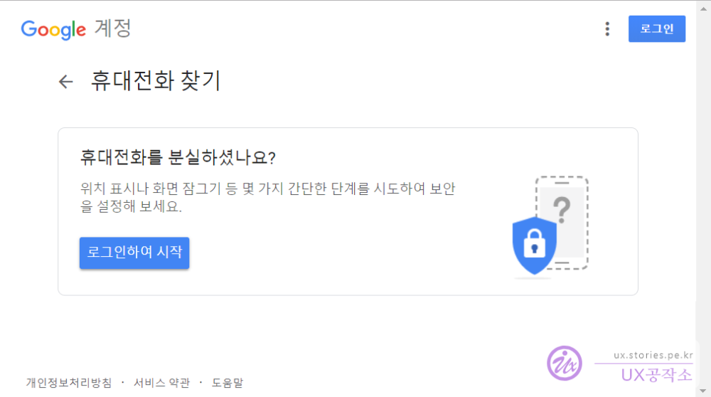
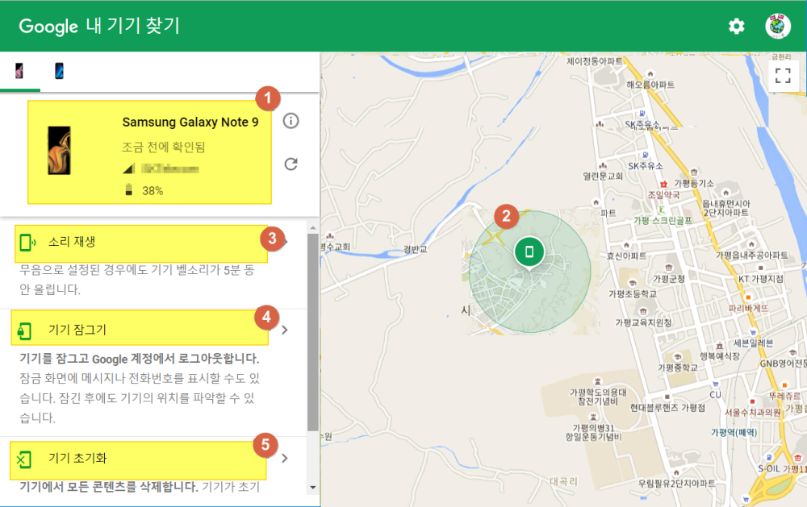
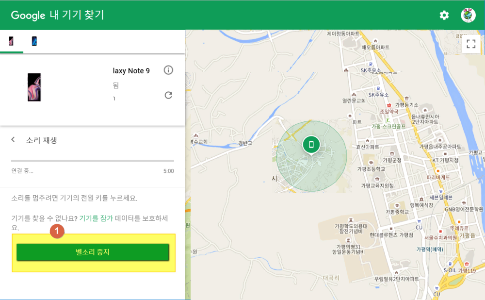
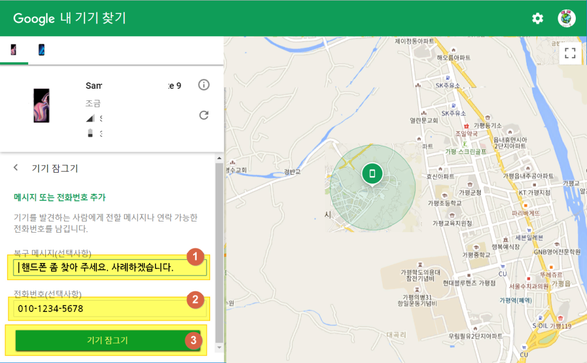
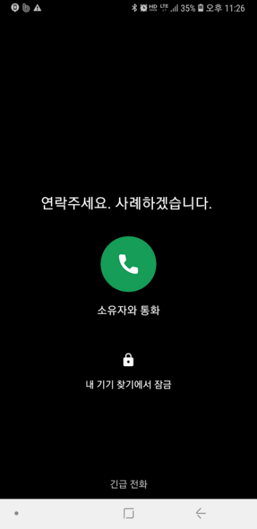
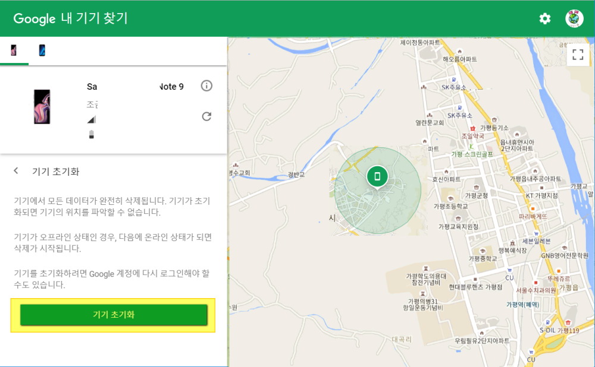

만약 구글 안드로이드 스마트폰을 사용한다면 유요한 기능이 있어 소개를 합니다.  
스마트폰을 잃어버렸거나 누가 훔쳐갔을 경우 구글에서는 쉽게 내 스마트폰의 위치를 찾아주는 서비스가 있습니다.

해당서비스는 웹브라우저를 통해 확인할 수 있습니다.

먼저 스마트폰을 잃어 버렸다고 한다면 웹브라우저로 아래의 URL에 접근을 합니다.

> https://www.google.com/android/find?hl=ko

만약 URL이 기억이 나지 않는다면 **구글 검색창**에 **내휴대폰찾기**를 검색 하면 됩니다.

만약 로그인이 되어 있지 않다면 아래와 같은 화면을 볼 수 있습니다.

  
로그인을 하면 아래와 같은 화면을 볼수 있습니다.

1. 내 스마트폰의 종류와 통신사, 남아 있는 배터리의 정보를 볼 수 있습니다.
1. 내 스마트폰의 현재 위치를 보여 줍니다. 아주 정확한 위치는 아니고 대략적인 위치를 보여 줍니다. 말하자면 혹시나 훔친 놈을 현장검거하겠다고 생각하면 안됩니다. 어르고 달래서 직접 들고 나타나게 해야 합니다. ㅎ

1. **소리재생** : 소리재생 기능을 제공합니다. 스마트폰이 무음인 상태라도 알람같은 소리를 울려 줍니다.
1. **기기 잠그기** : 내 스마트폰을 잠급니다.
1. **기기 초기화** : 이도저도 않될때 보안을 위해 기기를 초기화 시켜버립니다.

### 소리재생

소리재생 기능을 제공합니다. 스마트폰이 무음인 상태라도 알람같은 소리를 울려 줍니다.  
만약 누군가가 그 소리를 끊는다면 내가 보고 있는 화면에서 알람소리가 중지되었다는 공지가 뜹니다. 그래서 내 휴대폰이 누군가의 손에 들려있는지 아니면 어디 아무도 보지못하는 깊은 어둠에 놓여있는지 정도는 확인할 수 있습니다.  
그리고 내가 밸소리를 중지할 수도 있습니다.

### 기기 잠그기

소리재생이 1단계라면 기기 잠그기는 2단계라고 할 수 있습니다.  
기기를 잠그로 연락처로 바로 연락할 수 있게 해줍니다.

1. 내 스마트폰에 표시할 메시지를 적습니다.
1. 내 스마트폰에서 버튼을 누를 경우 연결될 휴대폰번호를 적습니다.
1. 실제로 기기를 잠가 버립니다.

  
실제로 보이는 화면입니다. `1번`의 복구 메시지가 화면에 표시됩니다.  
가운데 파란색 버튼을 누르게 되면 `2번`에 작성한 번호로 전화를 걸어 줍니다.

### 기기 초기화

기기를 초기화 시켜버립니다.  
데이터를 모두 삭제하고 처음 스마트폰을 받았을때 처럼 공장 초기화를 시켜 버립니다.  
실제로 이거는 테스트해 보지는 않았습니다.
블로그 하나 쓰자고 꼭 그럴 필요까지는 없을것 같아요 ㅋ

  
**기기초기화** 버튼을 클릭하면 초기화를 시작합니다.

## 기타 활용 용도

사실 자신의 폰을 찾는데 유용한 기능이지만  
조금만 생각하면 다른용도로도 사용이 가능합니다.

저는 집사람이 올때가 됬는데 연락도 안되고 했을때 혹시나 위험한 일을 당했나 싶어 한번 이용해 봤습니다.
물론 그럴 경우 집사람의 구글 아이디와 비밀번호를 알고 있어야 하겠지요.

또다른 것은 아이들의 위치를 확인할 때도 사용이 가능하지 않을까 합니다.
