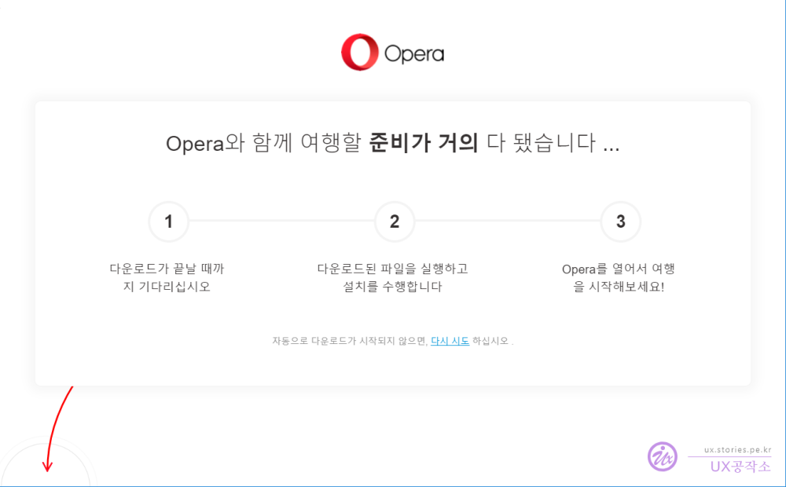

아시는 분은 아시겠지만 정부에서 **Http**로 불법이라 지정 한 웹사이트를 차단한 것에 이어 이번에는 통신 보안이 적용된 **Https**까지 차단을 하였습니다.   

  

물론 불법적이고 해로운 영향을 끼치는 웹사이트는 당연히 막는 것이 옳다고 생각합니다. 하지만 많은 사람들이 걱정하는 것은 겉에 들어나 있는 그 것이 아니라 불법이라고 지정한 웹사이트에 접속한다는 것을 알기 위해 **SNI**(Server Name Indication)을 뒤져 본다는데 있습니다. 물론 SNI에서 목적지의 URL만 본다고 하지만 그 것 마져도 개인정보이기 떄문입니다. 또한 그 불법이라고 정의한 웹사이트는 그럼 누가 정의를 하느냐라는 것입니다. 다분히 정치적인 목적이 들어갈 수 있다고 보는 것입니다. 그렇게 불법적이지 않은 웹사이트도 현재 정권에 부합하지 않는다면 살짝쿵 막아버릴 수도 있다라는 것입니다. 방통위에서는 이 차단 목록을 공개하지 않겠다고 하닌까요.  

### https 차단을 우회하는 안전하고 쉬운 방법  
영화 **인터스텔라**에서는 이런 명대사가 나옵니다.    

**"우린 답을 찾을 것이다. 늘 그랬듯이."**  

창을 들이대면 방패를 찾을 것이고 막는다면 뚫을 것이다.!! 이것이 인간의 기본적인 습성인것 같습니다.   
저도 **VPN**을 활용한 한가지 아주 간단하면서도 안전한 우회 방법을 찾았습니다.  초보자도 쉽게 할 수 있습니다.  

#### 오페라 브라우저를 사용하면 됩니다.  
아시는 분은 아시겠지만 현재 **크롬**, **사파리**, **IE**, **파이어폭스**에 이어 5대 브라우저에 속한 **오페라**브라우저를 사용하면 됩니다. 

  
크롬, 파이어폭스, IE 등 쟁쟁한 브라우저 사이에서 살아남기 위해 오페라 브라우저가 선택한 방법이 **무료 VPN** 제공 입니다. 원래 어느 정도 성능을 발휘하는 VPN은 유료로 제공 됩니다. 일부 무료로 제공하는 VPN은 성능이 떨어지거나 속도가 떨어지거나, 아니면 내 정보를 들여다 보는 해킹같은 무슨 꿍꿍이가 있거나 뭔가 하나 아쉽게 해서 제공을 합니다.    

하지만 어느정도 공신력있는 **오페라브라우저**를 사용하면 기본으로 제공하는 VPN을 사용하면 이런 단점들을 줄일 수 있습니다.   

#### 오페라 브라우저 설치하기   
오페라브라우저는 노르웨이에 본사를 두고있습니다. 그리고 다른 웹브라우저보다 가볍다는 장점도 있습니다.  
먼저 오페라 웹사이트에 접속을 합니다.  

> https://www.opera.com/ko  

   
오페라 브라우저를 다운로드 받고 설치합니다.  

#### VPN활성화하기  
오페라브라우저를 실행시킵니다.  
오페라브라우저에 많은 기능들이 있지만 우리가 필요한 것은 VPN입니다.  
오페라는 VPN을 기본으로 제공을 합니다.  

  

1. 주소창 앞에 VPN을 켤수 있는 파비콘이 보입니다.  이 파비콘을 누르면 팝업이 뜹니다.  
1. VPN을 켰다 끌 수 있는 버튼이 있습니다.  
1. VPN을 **유럽**, **미주**, **아시아**, **최적화 위치**를 선택할 수 있으면 기본적으로 최적화 위치에 놓으면 됩니다.  
1. 현재 접속된 내 아이피 주소입니다. 국내가 아니 전혀 다른 해외 위치의 아이피 번호가 접속정보로 나옵니다. 말하자면 누군가가 내가 어디에서 접속을 했는지 추적하는것이 힘들어 진다는 뜻입니다.   

**다 된것입니다.** 이제 불법이라고 HTTPS로 막아놓은 웹사이트에 접속이 가능합니다. 불법이라고 HTTPS까지 막아 놓은 한국에서 외국의 컴퓨터까지 막을 수는 없기 떄문이죠.  
물론 앞으로 정부에서 VPN까지도 막을 수 있을 것입니다만 그 전까지 이렇게 사용할 수 있습니다.  

#### 좀더 보안을 강화하기   
VPN을 사용하면 정부나 외부의 검열자가 내가 어느 컴퓨터에서 어디에 접속하는지를 감출 수 있습니다. 하지만 엄마가 내 컴퓨터의 인터넷 사용정보를 볼 수 있는 것은 막을 수 없을 것입니다.  
이것까지 막으려면 아래와 같이 **비공개창**을 이용하면 됩니다.  

  

이제 브라우저에 접속정보와 쿠키 등이 저장되지 않게 브라우징을 할 수가 있습니다. 엄마도 이제 내가 어느 웹사이트에 방문했는지를 볼 수 없게 됩니다.  

악용은 하지마시고 이제부터 건전한 인터넷 생활을 하시기만 하면 됩니다.  

### 동영상으로 제작해 봤습니다.  

    <iframe src='https://www.youtube.com/embed/IPHyIkWFUYg' class='embed-responsive-item' allowfullscreen></iframe>

