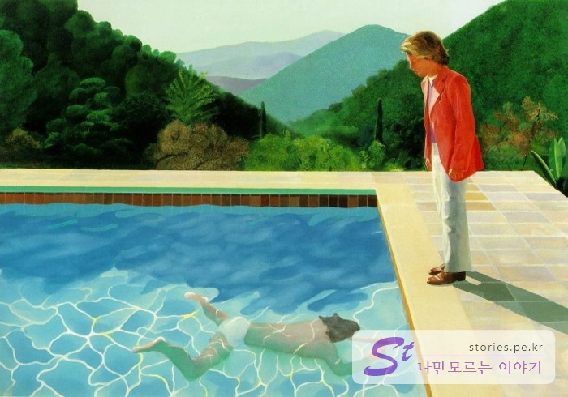
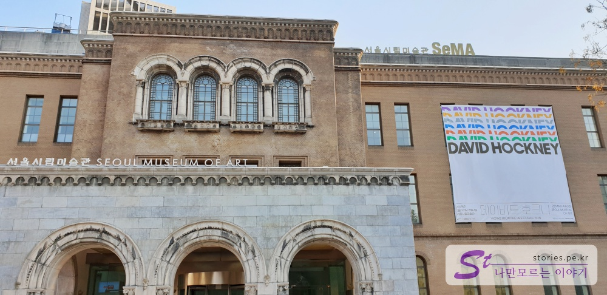
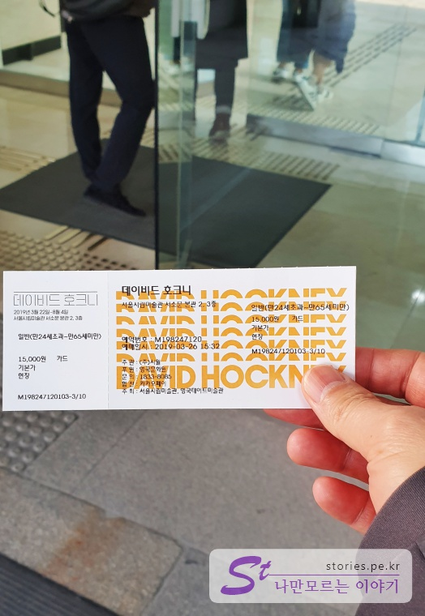
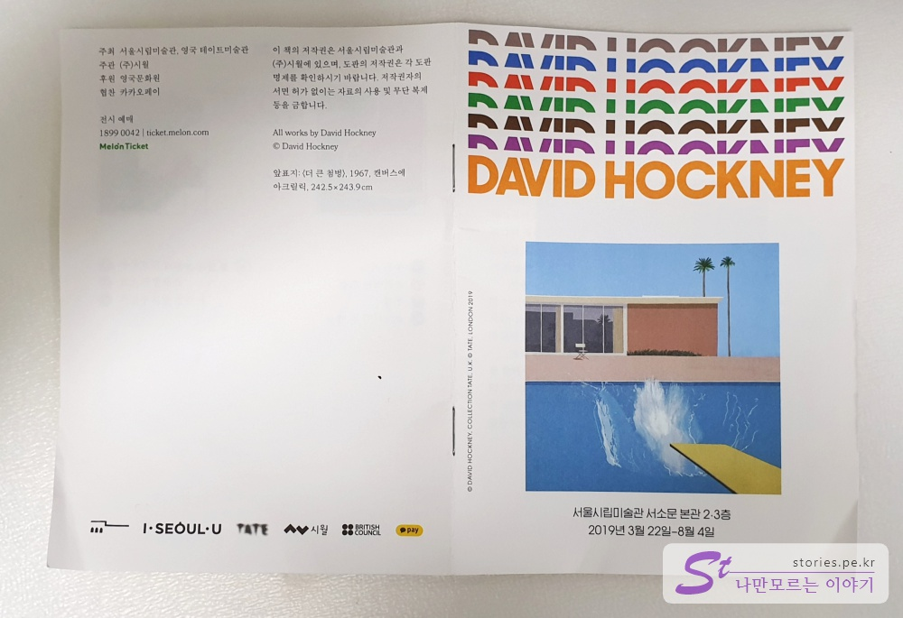

   
'예술가의 초상'(1972)이라고 불려지는 이 작품이 2018년 11월에 뉴욕 경매에서 9,030만 달러(한화 약 1,018억원)에 판매되었다는 것이 알려지면서  더 많은 사람들이 **데이비드 호크니**를 알게 되지 않았을까 합니다.  
생존하는 작가 중 가장 비싼 가격에 작품이 판매 되었다고 하네요.  

저도 이 기사를 접하게 되면서 이름 정도 알게 되었고 이번에  **서울시립미술관**에서 **데이비드 호크니 전**이 열린다고 해서 해서 찾아가 봤습니다.   

    
데이비드 호크니전은 **2019년 3월 22일** 부터 **8월 4일**까지 약 5개월정도 전시를 한다고 합니다.  

   
입장료는 어른 기준으로 **15,000원**에 판매를 하고 있습니다.   
미술 전시회 치고는 가격이 다소 있는 편이네요.  

   
총 3개의 관으로 구성되어 있고 하나의 표를 3번 펀칭하여 확인을 합니다.  
한번 입장을 하면 재 입장이 불가하다고 합니다.  
처음 1 전시관에 들어갈 때 위와 같은 팜플렛을 하나 줍니다.  
대략적으로 작가에 대해서 설명이 되어 있으므로 한번 쯤 읽어보고 시작해도 좋지 않을까 합니다.  

전시관은 촬영이 안된다고 해서 사진을 찍지는 못했습니다.  
당연한 일이겠지만 '예술가의 초상(portrait of an artis)'은 모조품이라도 없네요. 하지만 같은 시리즈물이라 할 수 있는 수영장 그림은 몇점 있습니다. 

가능하면 입구에서 해설기를 하나 대여해서 들어갈 것을 추천합니다.  
대여료는 3000원~~

**첫번째 전시관**에는 주로 동판을 부식시켜 판화를 찍듯이 그리는 에칭기법을 사용한 그림이 많이 전시되어 있고 **두번쨰 전시관**에는 에칭기법과 더불어 석판와 기법으로 그린 작품들이 다수 전시되어 있습니다.  

마지막으로 **세번째 전시관**에는 석판화와 컴퓨터를 활용한 작품들이 다수 전시가 되어 있습니다.  

대략 1시간 정도면 모두 둘러볼 수 있지 않을까 합니다. 

