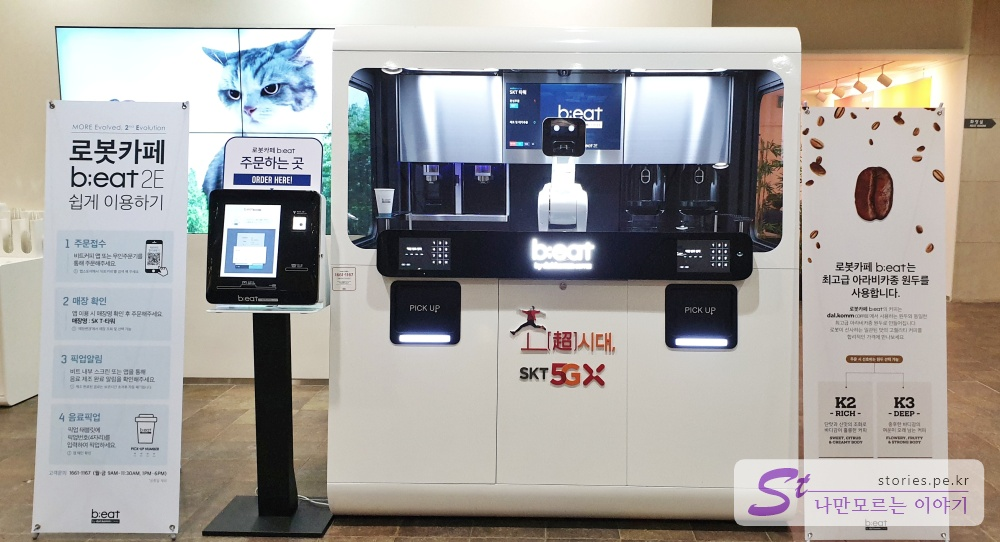
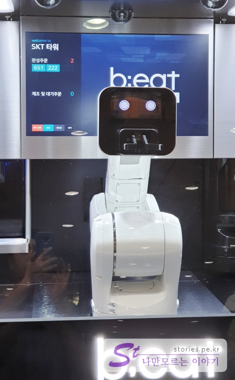
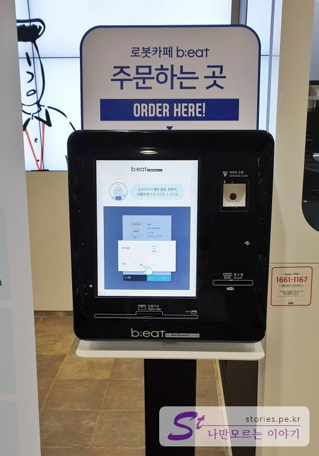
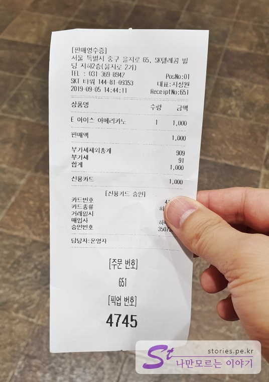
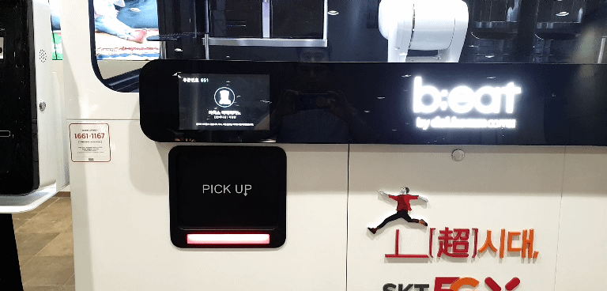
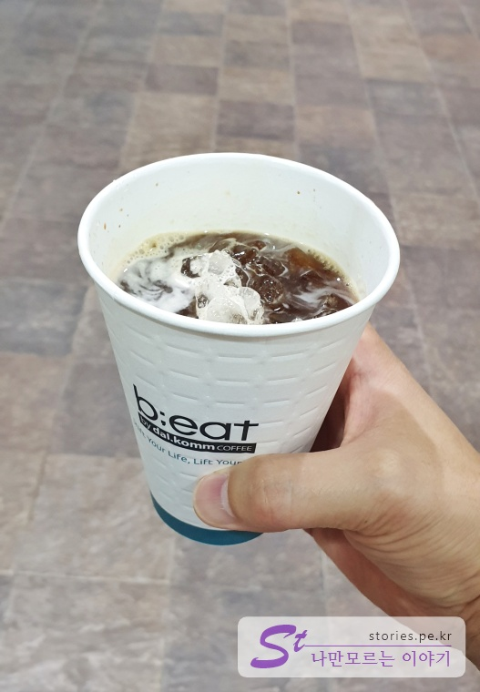
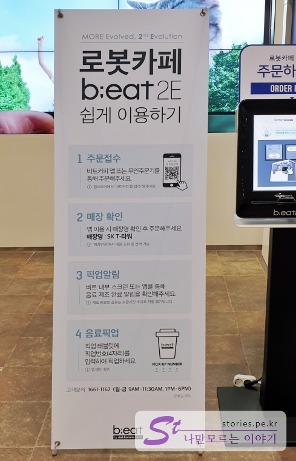

  

오늘 SKT타워에 일이 있어 방문했다가 신문물을 보게 되었습니다.  바로 로봇카페인데요. 

## 로봇카페 B;eat 2E 사용기  

  
매스컴을 통해서는 여러번 들어봤지만 실제로 보게된 것은 저도 오늘이 처음입니다. 신기하기도 하고 가격도 비싸지 않아서 한번 시도해 봤습니다.  

  
컨테이너 중간에 있는 로봇팔이 바리스터 입니다. 팔에 화면이 달려있고 눈모양으로 어느정도 감정을 표시합니다.  

  
주문은 키오스크로 합니다. 여기만 가격이 저렴한 건진 모르겠지만 **아이스아메리카노**가 **1,000원**입니다.  
앱으로 주문도 가능한것 같긴 한데 저는 스마트폰에 있는 삼성페이로 신용카드 결제를 했습니다. 

  
결제가 정상적으로 완료되면 주문표가 발행이 됩니다. 주문표에는 **주문번호**와 **픽업번호**가 있습니다. 

주문과 동시에 로봇 바리스타가 아래 동영상처럼 커피를 만들기 시작합니다.  

<iframe width="560" height="315" src="https://www.youtube.com/embed/MIdrBBx1HX0" frameborder="0" allow="accelerometer; autoplay; encrypted-media; gyroscope; picture-in-picture" allowfullscreen></iframe>  

주문번호는 로봇 바리스터 뒷쪽에 있는 LCD창에 나오고 커피가 주문되었는지, 조제가 완료되었는지의 진행사항을 보여줍니다.  

커피가 다 만들어졌다고 그냥 나오지는 않습니다.  
좌우측에 있는 LCD창에 주문할때 발행된 영수증에 적혀있는 **픽업번호**를 입력해야 로봇 바리스타가 출구로 내보내 줍니다.  

주문번호와 픽업번호를 동일하게 처리하면 좋았을 것을.. 처음 이용하는 사람은 조금 햇갈립니다.  

  
로봇이 만들어 줘서 재미있기는 하지만 결과물은 그냥 딱 1000원짜리 커피정도 입니다. 가격이 저렴하니 용서할 수 있습니다.   

## 쉽게 이용하는 방법  
   
옆에 쉽게 이용하는 방법이 적혀 있습니다. 사실 잘 된  UX라면 굳이 설명이 없어도 이용에 불편함이 없어야 하는데..  

## 달콤커피의 로봇카페 더많은 정보는 요기있어요.. 

[달콤커피 로봇카페 B;eat 2E](https://beat.dalkomm.com/) 홈페이지를 참조하세요 
