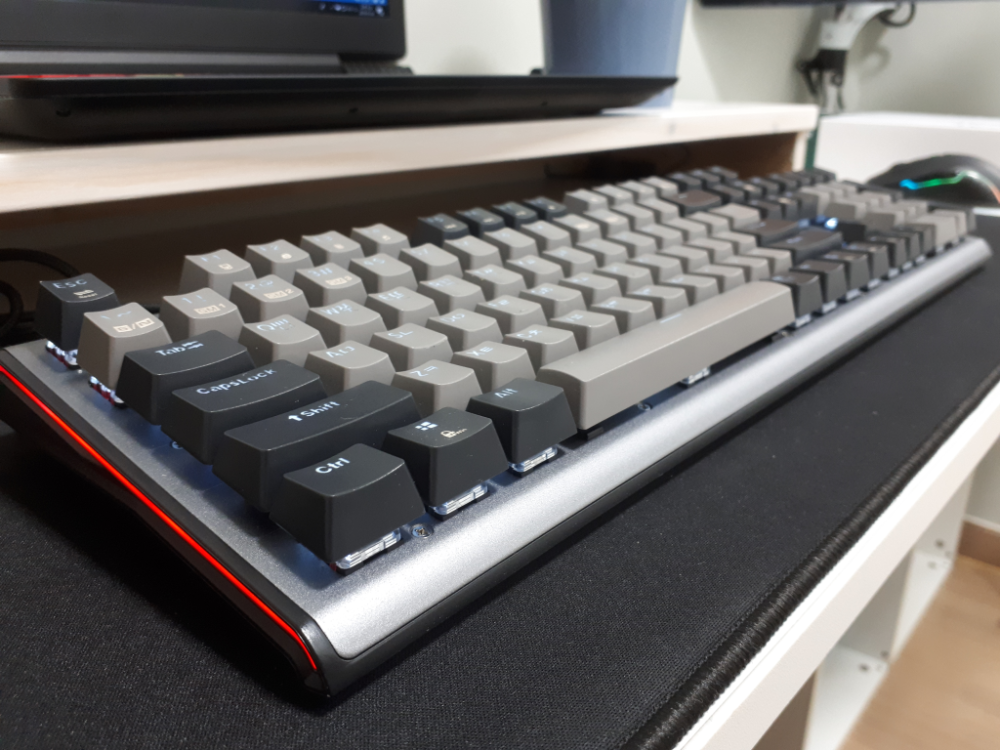
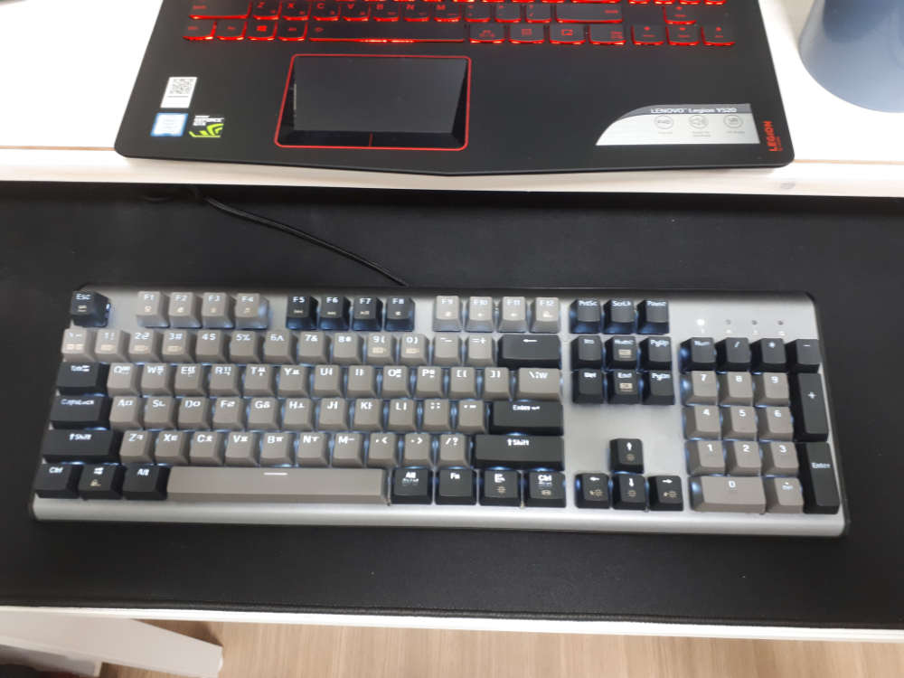
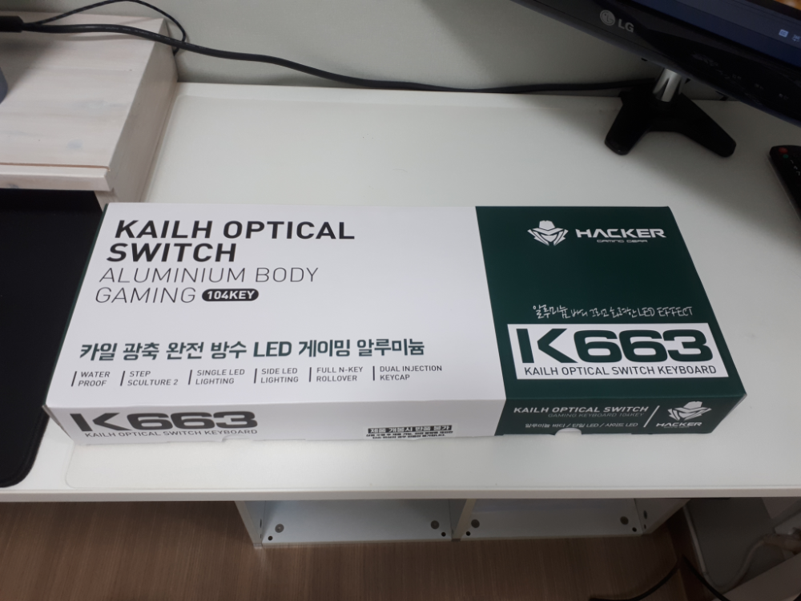
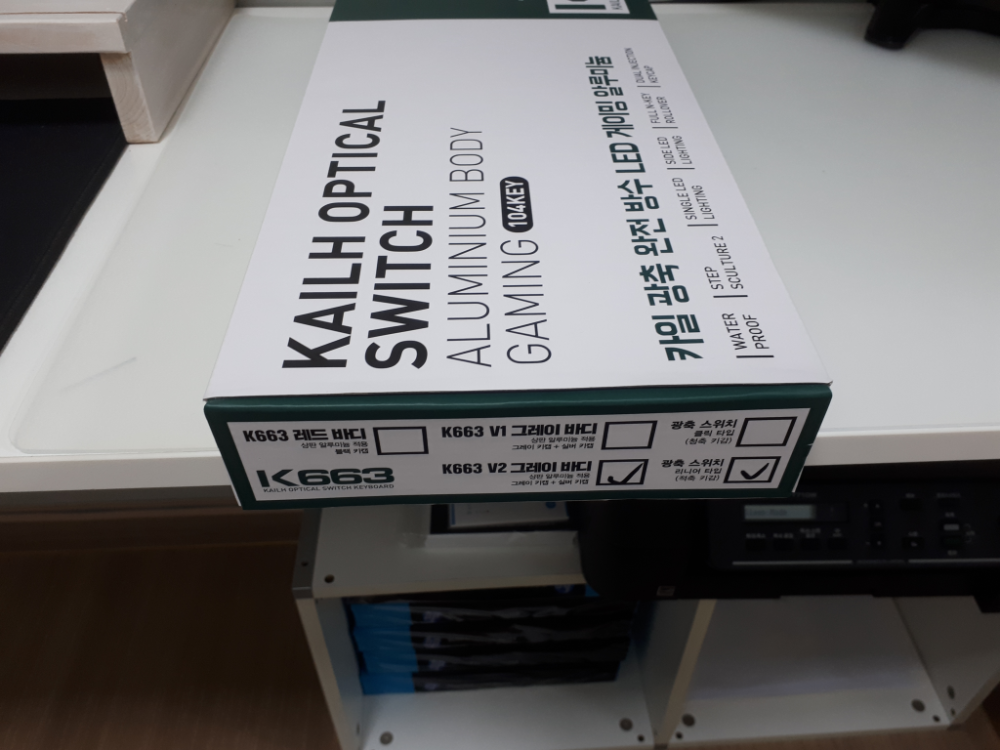

노트북에 연결할 키보드를 고르다가 요즘 대세인 광축 게이밍 키보드를 살펴보았습니다. 근래 판매량이 높은 `COX`에서 출시한 `CK700`과 `ABKO`에서 출시한 `K740`, `K663`를 살펴 봤습니다. 

### 최근의 가성비 갑인 광축  
수십만원에서 수백만원 대에 이르는 고가 키보드의 대명사인 기계식키보드에서 이제는 기계식키보드의 키감을 유지하고 가격을 낮춘, 그러면서 내구성까지 갖추게 된 광축키보드가 대세입니다.  이제는 총알이 별로 없어도 기계식키보드 비스무리한 키감을 누릴 수 있게 되었습니다. 

### 광축이란?  
기계식키보드 스위치는 `청축`, `갈축`, `적축`, `흑축` 등으로 나누어져 있습니다. 그리고 이 축의 종류에 따라 키감과 소리가 달라서 사람마다 선호하는 키보드가 달라지게 됩니다.  
기계식키보드는 각각의 키를 누를 때 마다 떨어져 있던 스위치가 붙으면서 전기가 연결되어 전기신호를 입력신호를 받습니다.   
반면 광축은 무접전으로 발광 소자가 적외선 빛을 쏘고 수광소자가 빛을 받고 있는 상태에서 키를 누름으로 적외선이 잠깐 끊길 때를 신호로 받아서 입력 처리를 합니다. 보통 광축은 클릭부와 감응부를 별도로 처리합니다. 그래서 클릭부를 좀더 기계식 느낌이 나게 디테일처리를 할 수 있습니다. 

## ABKO HACKER K663 V2 광축 키보드  
사실은 알루미늄 바디가 투박하고 무겁게 있고 그 위에 비키 스타일의 키들이 있기를 바랬던 키보드인데 생각했던 것 하고는 좀 느낌이 달랐습니다. 설명서에는 알루미늄 바디라고 써있기는 한데 아주 약간의 잘 가공된 알루미늄이 생각보다 무겁지 않게 있어서 정 붙히는데 시간이 좀 걸린것 같습니다. 그래도 정이 드니 나름 느낌은 괜찮은것 같습니다. 

> 비키스타일 : 키가 키보드에 뭍혀있는 것이 아니라 키보드판 위에 키가 나열되어 있는 듯이 구성되어 있는 스타일 

  
키보드의 옆면입니다. 

  
텐키가 있는 전형적인 스타일입니다. 키는 카일사의 광축을 사용하고 있습니다. 나름 안정성이 검증된 키캡입니다. 각각의 키를 커스텀 할 수도 있고 방수처리도 되어 있습니다.  카일광축은 `리니어타입`과 `클릭타입` 2가지로 나오는데 `리니어타입`은 약간 `적축`의 키감을 가지고 있어서 키감이 경쾌하지는 않지만 소리가 크지 않아서 사무실에서 사용하기에 적당합니다. 반면 `클릭타입`은 `청축`의 키감을 가지고 있어서 키감이 경쾌하고 소리가 다소 큰 것이 특징입니다.  
저는 저녁에 많이 사용할 거라 다소 조용한 `리니어타입`으로 구매를 했으나.....  그냥 `클릭타입`으로 구매할껄~~ 이란 후회를 했습니다.  

  
  
V1과 V2의 차이는 단지 키보드의 키색상이 반대로 되어 있는 차이입니다. 

가격은 `58,900원`으로 기계식 키보드의 느낌에 완전방수와 내구성을 얻었으니 나쁘지 않은 선택인것 같습니다.

