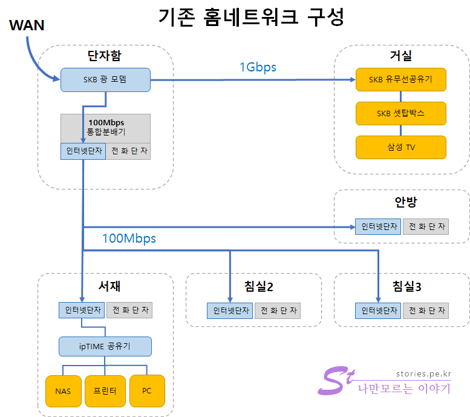
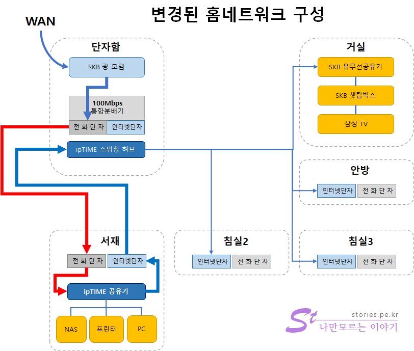
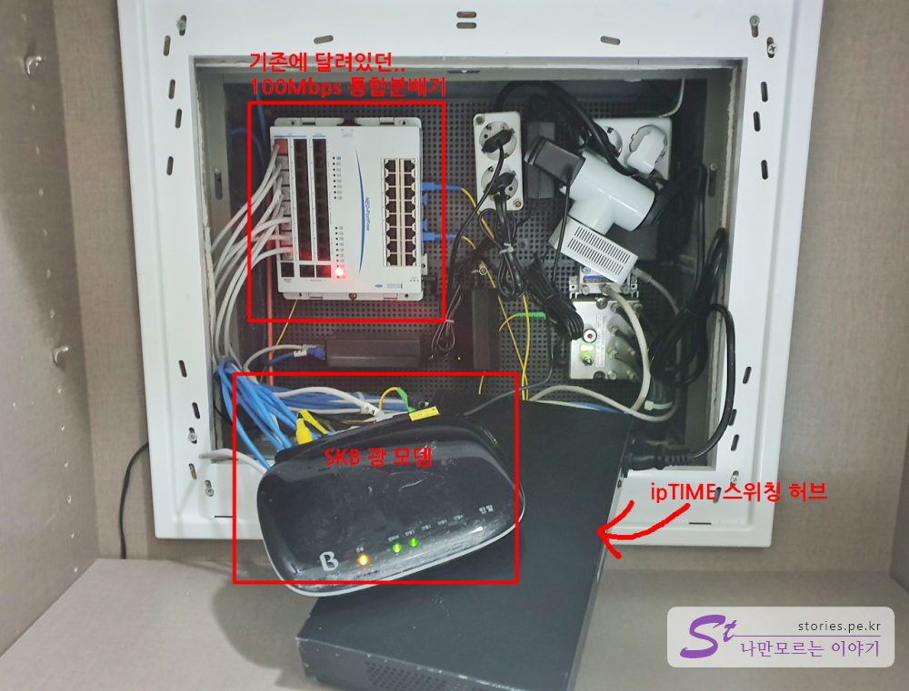
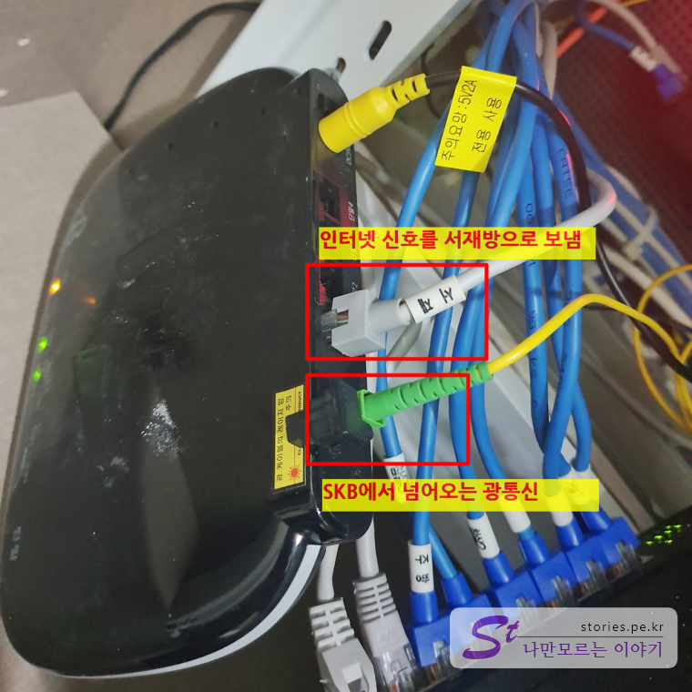
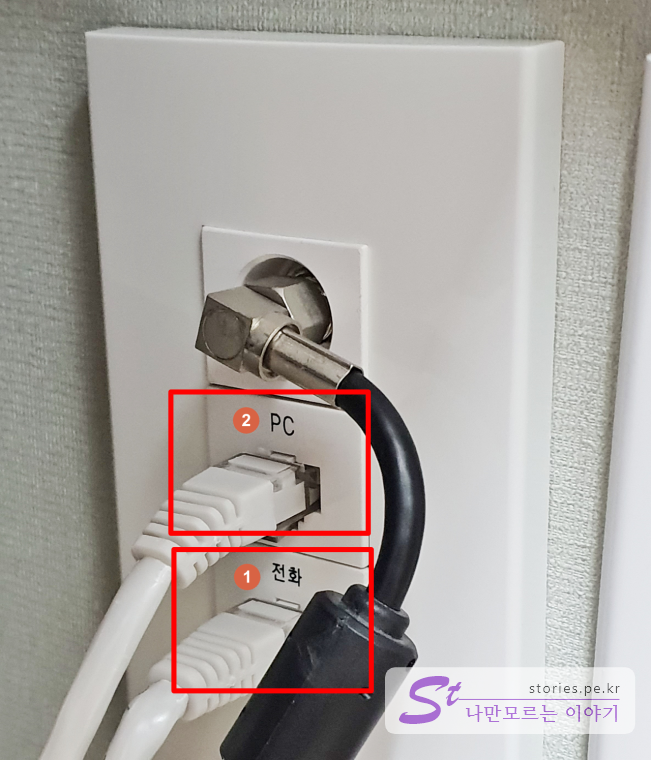
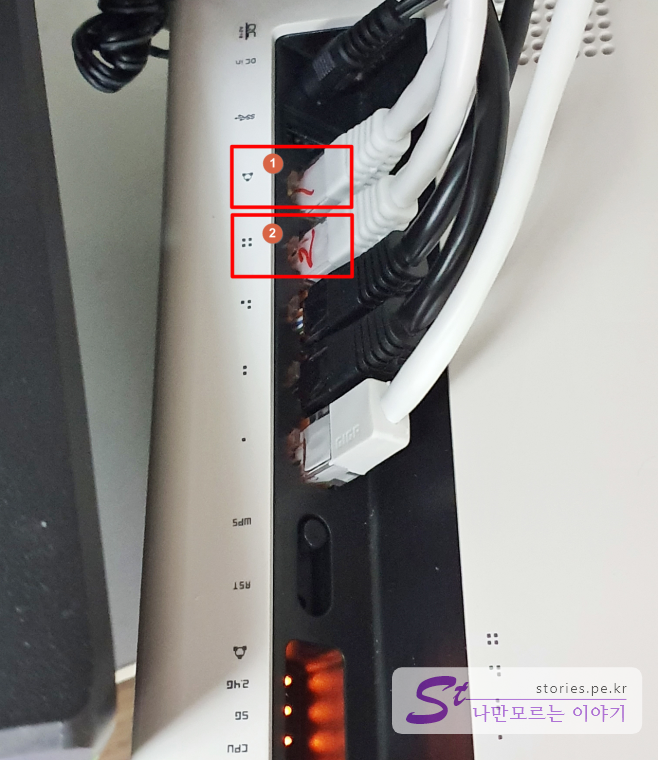
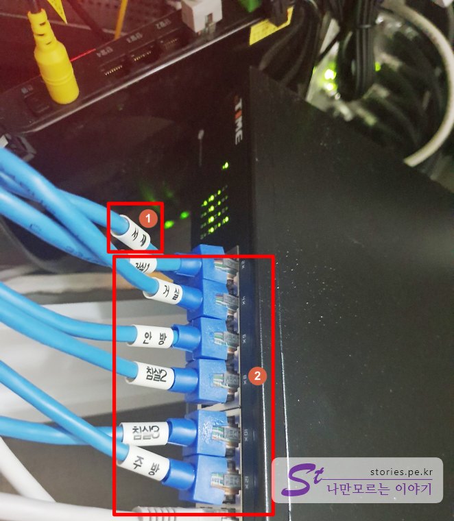
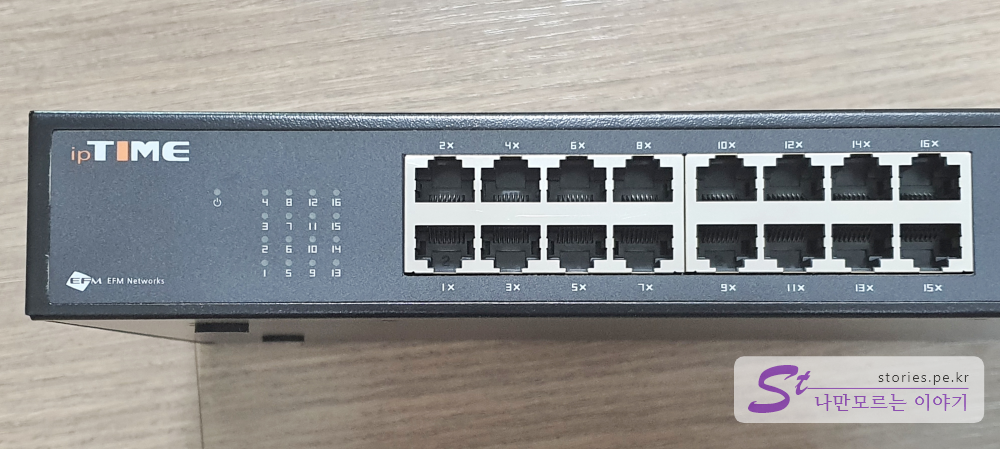

저희집은 아파트입니다. 각 방은 `Cat5E`케이블로 깔려있어서 기가인터넷이 지원되지만 인터넷 통합 단자는 **Neo-PortFree NIS-HM1624FS**로 **100Mbps**용 입니다. 그래서 SKB나 KT인터넷 같은 ISP업체에서 기가인터넷을 신청한다 하더라도 내부 네트워크는 100Mbps로 속도가 떨어진다는 것입니다.  

그래서 이번에 기가인터넷을 지원하는 스위칭 허브를 구매하여 전체적으로 내부 내트워크를 재구성하게 되어 포스팅 합니다. 

## 기존의 구성  
기존의 구성은 아래와 같습니다. 

  
근래에 지어진 아파트라면 대략 구성이 비슷하지 않을까 합니다. 일단 SKB에서 인터넷을 신청을 하면 아래의 그림처럼 설치를 해주고 갑니다.  
SKB 광 모뎀으로 광통신 신호를 받아서 1개는 인터넷 단자를 통해서 SKB에서 대여해 주는 SKB 유무선공유기로 보내주고 또 하나는 단자함에 있는 분배기(허브)를 통해서 각 방으로 보내주게 되어 있습니다. 
저희는 분배기(허브)가 **100Mbps**만 지원해 주는 제품이라 죽었다 깨어나도 **100Mbps**이상의 속도는 낼 수 없습니다. 차라리 **WIFI**가 더 빠를 수 있게됩니다. 거실로는 분배기를 거치지 않기 때문에 **1Gbps**의 속도를 뽑아주기 떄문입니다.  

그래서 저는 스위칭허브를 하나 구매해서 모든 유선 인터넷도 기가인터넷이 되도록 변경하였습니다. 

> 인터넷 제공업체(ISP)에 인터넷을 신청하면 기본적으로 1~2대의 PC만 사용할 수 있는 IP를 제공해 줍니다. 추가 PC를 사용하려면 보통 월 1대당 5,000원정도의 추가비용을 지불해야 합니다.  

## 1Gbps 홈네트워크 구성도   
변경은 아래와 같이 적용 했습니다. 각자 환경마다, 선호하는 방식마다 다르겠지만 저는 주로 서재에서 컴퓨터를 많이 사용하고 NAS나 프린터 등 인터넷 장비도 많이 있어서 **서재가 매인 거점**입니다. 거실은 SKB에서 준 유무선공유기로 무선WIFI를 사용하고, 구석에 있는 서재에서는 **ipTIME유무선공유기**로 WIFI를 사용하기로 했습니다. 그러면서도 같은 하나의 네트워크로 묶기 위해 아래와 같은 방법을 사용했습니다. 

구성에 전화단자도 사용되기 때문에 **전화단자**의 케이블도` Cat5E`인지 확인하셔야 합니다. 보통 케이블 줄에 인쇄되어 있습니다. 

    

광통신으로 들어온 **SKB광 모뎀**에 **서재의 전화선** 을 연결합니다. 
서재의 전화선 단자에서 나온 케이블을 **ipTIME공유기**의 **WAN 단자**에 연결시킴으로 내부망의 게이트웨이가 됩니다.  
4개의 인터넷 단자 중 3개는 NAS나 프린터, PC에 연결하고 나머지 하나를 벽에 있는 **인터넷 단자**에 연결시킵니다.  
다시 단자함으로 와서 **서재 인터넷선**을 **ipTIME 스위칭 허브**의 아무 단자에 연결합니다.  
이제 모든 각방의 인터넷 선을 이 허브에 모두 연결을 시킵니다. 순서는 상관없습니다.  

이로써 우리집의 모든 방이 기가 인터넷으로 바뀌게 됩니다.   

## 실제 적용완료  
이제 실제 적용된 사진을 보면서 설명을 드리겠습니다. 기존의 모습은 미처 사진을 찍지 못했고 변경된 상태의 사진만 찍었으니 감안해서 봐주세요.  

  
단자함에서 중요한 부분은 **SKB광 모뎀**과 **100Mbps통합분배기**, **ipTIME 스위칭 허브** 입니다. 

  
광통신으로 들어온 신호를 모뎀을 통해 서재쪽 **전화선**을 통해서 보냅니다. 

  
1. 전화선으로 들어온 선을 ipTIME유무선공유기의 WAN에 연결을 시킵니다.  

   
1. 전화선을 **WAN단자**에 연결합니다. 
1. 단자에 선을 하나 뽑아서 벽면의 인터넷 단자에 다시 연결을 시킵니다. 

   
다시 단자함으로 와서...
1. **1번** **서재**에서 나온 인터넷 선을 스위칭 허브의 아무 단자에나 연결 시킵니다.  
2. 그리고 나머지 인터넷 선들도 모두 스위칭허브로 옮겨서 연결합니다. 

이제 모든 것이 완료되었습니다. 이로써 우리집의 모든 유선과 무선이 기가인터넷을 이용하게 되었습니다. 확인해 본 결과 잘 됩니다. ^^

> 제가 사용한 스위칭 허브는 ipTIME의 **SG16M-mini**입니다. 자세한 정보는 아래의 포스팅을 참고해 주세요.
>     

> [네트워크를 확장해 주는 스위칭 허브 ipTIME SG16M-mini 바로가기](https://blog.stories.pe.kr/434)    

