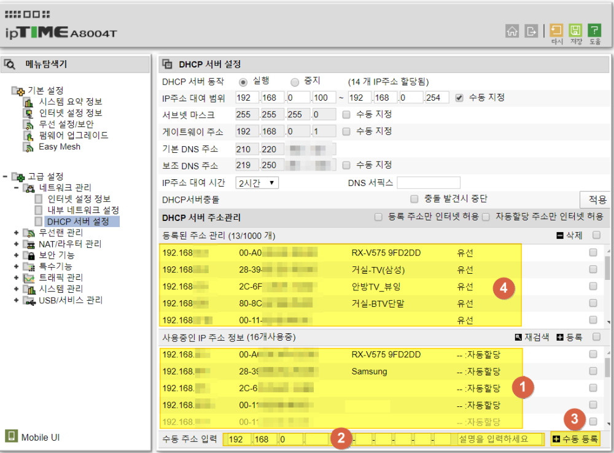
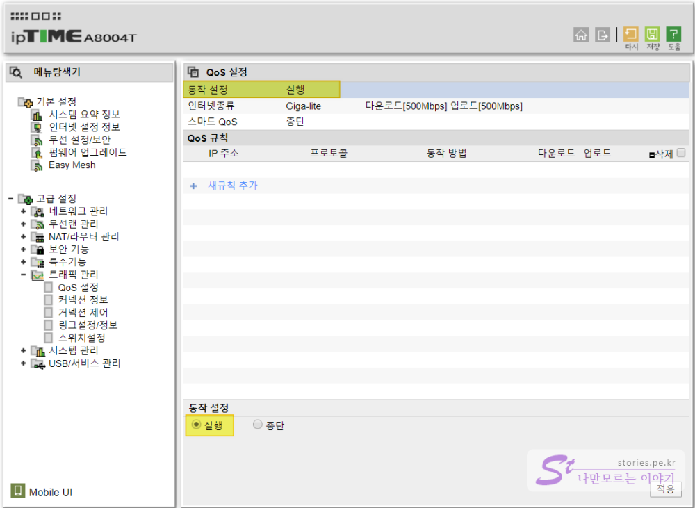
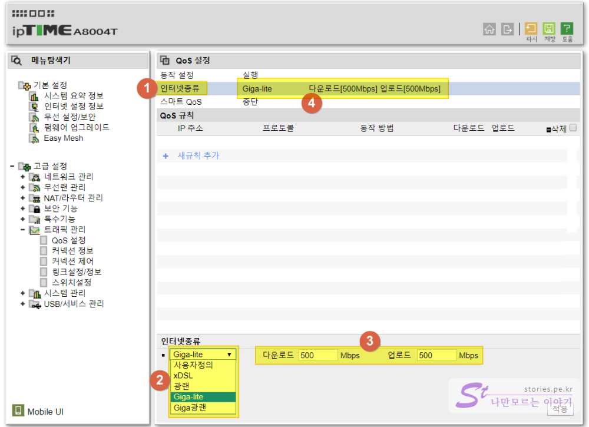
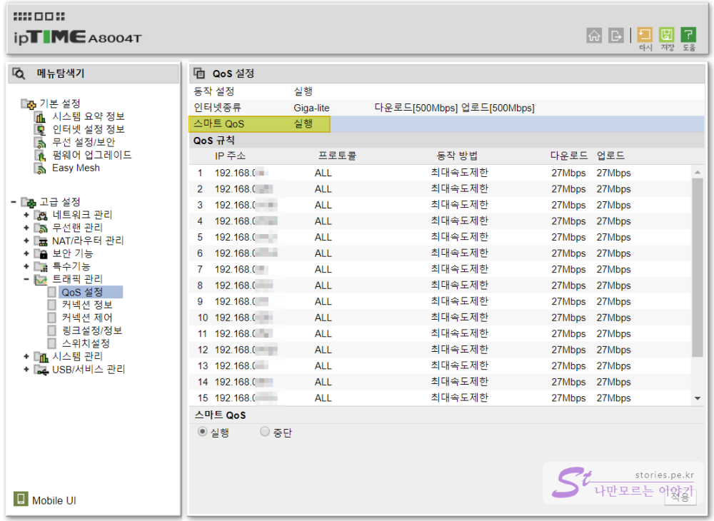
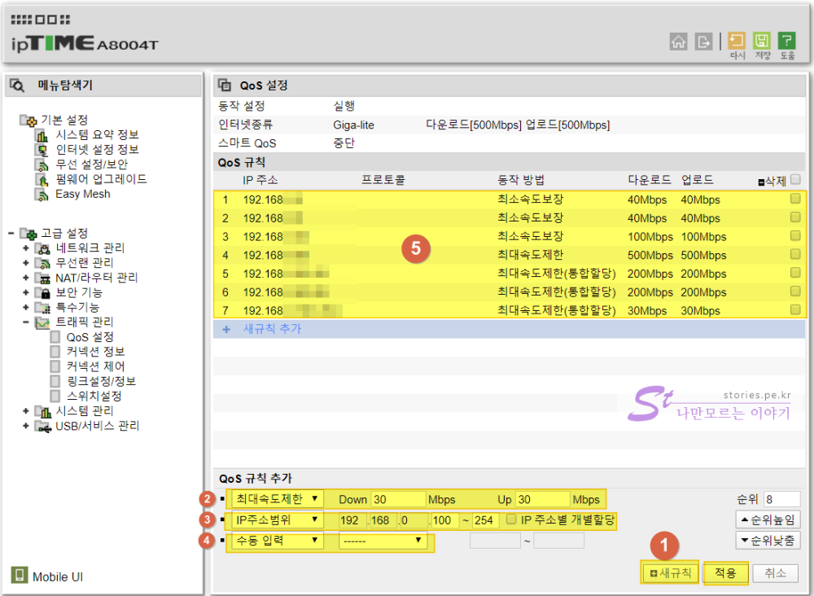

집이나 상점, 학교 등에서 공유기를 운영하다 보면 어떤 한사람이 네트워크를 독점하다시피 사용하는 경우가 있습니다. 보통 토렌트를 다운로드 받는다던지 게임을 다운로드 받을 때 많이 발생하는 현상입니다. 본인만 사용하는 경우는 문제가 없겠지만 여러 사람들이 같이 사용하는 경우는 한사람 때문에 다른 사람들이 짜증이 머리 끝까지 올라올 때가 있습니다. 또한 집에서 IPTV를 같이 사용하는 경우 IPTV가 정상적으로 나오지 않습니다. 만약 보스가 TV를 보고 있을때 다운로드를 받는다면 욕먹기 딱~ 좋습니다. 이런경우를 필요한 방법이 **QoS**입니다. 

## QoS란 무엇인가?  
QoS(Quality of Service)란 한정된 네트웍크 속도를 잘 운영하기 위해 라우터(공유기)에 연결된 제품에 대해 각 아이피 별, 포트별, 어플리케이션별로 업로드, 다운로드에 대한 우선순위를 할당해 주어서 지정된 이상의 속도를 넘지 못하게 제한하거나 최소한 지정된 속도 이상은 나올 수 있게 보장해 주는 것입니다. 

> **QoS(Quality of Service) 란?**
> 네트워크 상에 흐르는 데이터의 중요도를 분류하여, 이를 기반으로 우선순위를 부여한다. 우선순위가 높을 수록 빠르고 안전하게 전송이 보장된다. 
> *-나무위키 참조-*

## QoS적용방법  
제가 가지고 있는 제품이 ipTIME이니 ipTIME를 기준으로 설명하도록 하겠습니다.  

### 사전작업  
IP를 기준으로 QoS를 설정하려면 먼저 각 제품(PC, NAS, IPTV등등..)의 MAC ADDRESS로 고정 IP가 할당되게 해 주어야 합니다. 

  
먼저 DHCP서버 설정화면으로 이동합니다. 여기서는 MAC ADDRESS를 기준으로 지정된 IP를 할당해 줍니다.  

1. 임의로 할당된 **사용중인 IP주소 정보**에서 내가 원하는 리스트를 선택합니다. 
2. 선택된 리스트의 기본정보가 자동으로 불러와 집니다. 그곳에 원하는 IP주소와 설명을 입력합니다. 
3. `수동등록` 버튼을 클릭합니다. 
4. **등록된 주소관리**에 수동등록된 리스트가 할당이 됩니다.  

등록했다고 해당 제품에 IP가 바로 바뀌는 것은 아닙니다. DHCP를 통해 새롭게 IP를 할당 받아야 하는데, 보통 제품을 재부팅해서 할당을 받습니다.  

### QoS 설정하기  

   
기본은 **QoS** 가 중단되어 있습니다. 동작을 **실행**으로 적용해야 합니다. 

  
1. 인터넷 종류를 선택합니다.   
2. 본인의 인터넷 상품을 선택합니다. 저는 Giga Lite입니다. 
3. 그러면 해당 상품의 최대 다운로드와 업로드의 속도가 자동 기록됩니다. 본인이 수정도 가능합니다. 
4. 적용을 시키면 나의 인터넷 상품의 속도가 등록됩니다.  

### 스마트 QoS 설정하기   
ipTIME의 QoS설정은 **스마트QoS** 설정과 **사용자정의 QoS** 설정이 있습니다.  스마트QoS는 10분마다 접속된 장치(PC,IPTV등등..)의 갯수를 분석해서 동일한 평균속도를 지정해 줍니다. 스마트QoS를 사용할 경우 사용자정의 QoS는 사용할 수 없습니다. 
- **장점** : 활성화만 시키면 되기 때문에 초보자라도 쉽게 설정이 가능합니다. 
- **단점** : 속도가 모두 하향 평준화 됩니다.

이것을 사용하는 이유는 모두 다 최대 속도를 제한받기 때문에 누군가 한사람이 속도를 독점할 수 없으므로 평등되게 사용할 수 있게됩니다. **무엇보다 웬만해선 IPTV가 끊김없이 잘 나옵니다**.  

   

### 사용자정의 QoS 설정하기   
**사용자정의 QoS**를 사용하기 위해서는 **스마트 QoS를 중단** 시켜야 합니다.   

   
사용자정의 QoS는 여러건의 규칙을 설정할 수 있습니다. 
1. 새규칙을 클릭합니다. 
2. `최대속도제한`, `최소속도보장`을 선택하여 속도를 지정합니다. 
   - `최대속도제한` : 지정한 Down, Up의 속도를 넘지 못합니다.
   - `최소속도보장` : 최소한 지정한 Down, Up의 속도를 보장해 줍니다.(IPTV같은 경우 최소속도보장을 해주는것이 좋습니다)
3. `개별IP주소`, `IP주소범위`, `Twin IP`, `모든IP주소`별로 지정을 할 수 있습니다. 
   - `개별IP주소` : 하나의 특정 IP에 대해서 지정합니다. 
   - `IP주소범위` : IP범위를 지정할 수 있습니다.
   - `Twin IP` : 뭘까요? 
   - `모든IP주소` : 모든 제품에 동일한 속도를 지정합니다. 
4. TCP와 UDP에 대해 Port별로 지정할 수 있습니다. 
   - `수동입력` : Port번호를 수동으로 지정하여 선택합니다.
   - `WWW` : WWW 포트인 80 Port가 자동 지정됩니다. 
   - `MS stream` : MS stream 포트인 1775 Port가 자동 지정됩니다. 
5. 적용을 하면 리스트가 등록이 됩니다. 

#### 사용자정의 QoS 설정의 힌트    
지금 작성하는 것은 꼭 정해진 것은 아니고 아이디어 차원에서 말씀드립니다. 
저같은 경우는 DHCP에서 IP할당을 `192.168.0.1 ~ 10`까지는 중요한 장비에 할당을 하고  `192.168.0.11 ~ 50`는 PC나 스마트폰에 할당을 합니다.  `192.168.100 ~ 254`까지는 DHCP로 임의의 장치나 손님의 모바일 등에 자동 할당하게 해 놨습니다. 그래서 `192.168.0 ~ 10`는 `최소속도보장`위주로 설정하고 `192.168.11 ~ 50`는 `최소속도보장`과 `최대속도제한`으로 설정하고 `192.168.100 ~ 254`는 `최대속도제한` 위주로 설정을 합니다. 

## QoS적용시 알고 있어야 할 점  
QoS가 무조건 좋은 것은 아닙니다. 왜냐하면 QoS를 가동하기만 해도 최고속도에 영향을 주기 떄문입니다. 저같은 경우는 Giga-Lite상품으로 **QoS를 중단** 했을 때는 `400~500Mbps`정도가 나오나 **QoS를 가동**시키면 아무 설정이 없더라도 `300~400Mbps`로 떨어지게 됩니다. 그래서 만약 공유기를 본인만 사용한다고 하면 QoS를 사용하지 않는 것이 최대의 트래픽 속도를 뽑아낼 수 있는 방법입니다.   

> [안전하게 무료로 인터넷 속도와 품질을 확인하는 방법 바로가기](https://blog.stories.pe.kr/432)

만약 집에 여러사람이 있는데 토렌트 등으로 트래픽을 많이 발생시키는 사람이 있거나 IPTV 보는 것을 무지 사랑하는 성질 고약한 보스가 있는 경유에는 QoS를 지정해 주는 것이 바람직 할 수 있습니다. 사실 트래픽 속도가 조금 떨어진다고 해서 인터넷이나 토렌트를 다운 받는데 문제될 것은 하나도 없기 때문입니다.  

