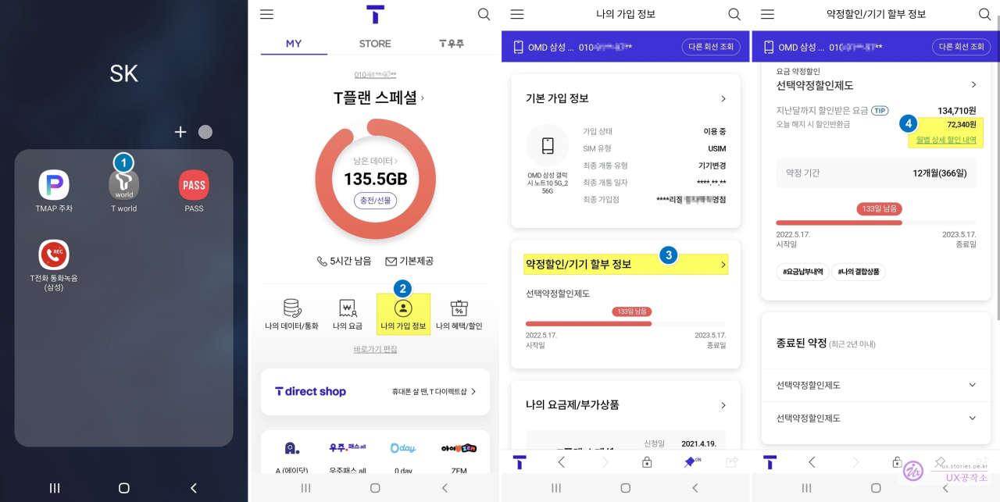

제 폰이 갤럭시노트 10이라 요즘 스마트폰을 교체하고 싶은 욕구가 강하게 들고 있습니다. 네이버 카페나, 성지, 밴드 등을 통해 현금 완납으로 많이들 구매를 하는 것 같은데요. 여기서 가장 중요한 것이 핸드폰을 교환할 때 위약금은 없는지 확인해 볼 필요가 있습니다. 생각보다 확인하는 것이 어렵지 않습니다.

저는 SKT를 이용하고 있고 SKT에 대해 할부금이나 위약금이 있는지 확인하는 방법입니다.

# 단말기 할부금

단말기를 구매할 때 일시불로 납부가 어려워서 매달 요금에 기기값을 포함해서 일정 기간( 1~3년) 나누어서 지불하는 것입니다.

# 위약금

기기를 구매할 때 특정한 기간 동안 통신사를 이용할 것을 약속하며 통신사에서 비용을 할인해 주는 제도가 있는데, 그 특정 기간을 지키지 못했을 때 지불해야 할 위약금을 말합니다. 보통 기간 약정과 요금제 약정으로 할인을 받습니다.

# SKT(Tword)에서 확인하는 방법

SKT에서 확인하는 방법은 Tword에서 가능합니다.

1. Tword 앱을 실행합니다.
2. **나의 가입 정보**를 선택합니다.
3. **약정 할인/기기 할부 정보** 타이틀을 선택합니다.
4. 현재 할부금과 위약금을 확인할 수 있습니다. 여기는 할부금은 없고 위약금만 있네요.
